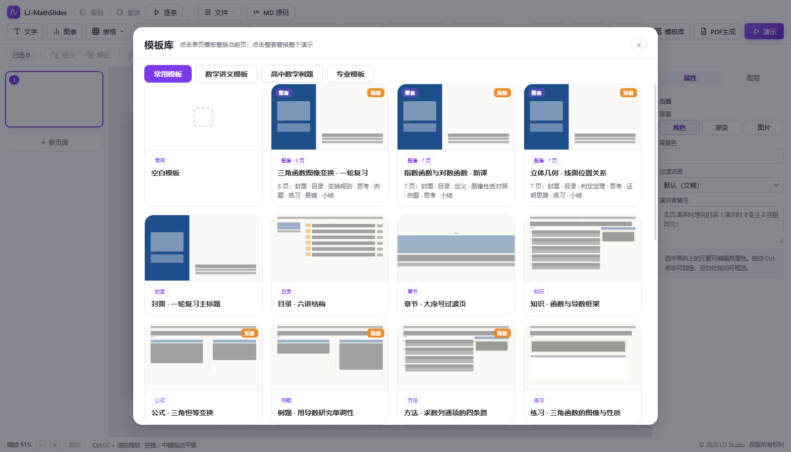

# LJ-MathSlides 使用手册

> 一个面向**高中数学**的幻灯片编辑器：公式、图形、表格都是"活的"——能编辑、能联动、
> 能一键导出成网页演示或 PDF 讲义。
> 本手册按"**做什么 → 怎么做**"组织，每节配一张界面截图（图在 `docs/images/`）。

---

## 0. 界面总览

| 区域 | 位置 | 作用 |
|---|---|---|
| **工具栏** | 顶部 | 插入元素、模板库、PDF 生成、导出、放映 |
| **幻灯片列表** | 左侧 | 增删页、右键菜单（复制/版式/隐藏…） |
| **画布** | 中间 | 编辑区，所有元素都在这里拖拽改动 |
| **属性面板** | 右侧 | 选中什么就显示什么（文字/图形/表格/动画…） |
| **状态栏** | 底部 | 缩放比例、当前选中数 |

*（图为「模板库」：一键套用整套讲义模板；也是认识工具栏最好的入口）*

**最左边那三个按钮是**：`撤销` `重做` `逐条`——它们是整条工具栏最常用的，所以放在 logo 之后第一位。

---

## 1. 第一张幻灯片：文字

1. 点工具栏 **文字** → 画布上出现一个文本框
2. **双击**文字 → 直接输入；点空白处结束编辑
3. 右侧 **属性 → 文字** 可改：字体、字号、颜色、加粗、对齐、行高、字距、阴影、渐变、描边
4. **拖动八个手柄**改尺寸；拖左上角旋转柄转角度

**段落与项目符号**（属性 → 段落）：
- **项目符号**：无 / ● / ○ / ▪ / – / 1. / a) / i.
- **符号缩进**：符号挂在左边，正文右移（PPT 里叫"悬挂缩进"）
- **左缩进**、**段前 / 段后**：元素是**按行**排的，所以每一行就是一个"段"

---

## 2. 公式：写 $x^2$ 就是公式

### 2.1 直接写

在任何文本框、混排元素、**表格单元格**里，用下面任一种写法都是公式：

    \(x^2+y^2\)      或者      $x^2+y^2$          →  x²+y²
    \(\frac{1}{x}\)             $\frac{1}{x}$             →  1/x
    $0<a<1$                                            →  0<a<1

> ⚠ **必须带定界符**：只写 `x^2` 会被当普通文字——这是故意的，
> 否则任何带 `^` 的正文都会被误判成公式。

### 2.2 从公式库选（不用记语法）

- 工具栏 **公式 ▾ → 混排公式**：左上输入 LaTeX，右侧预览
- 右侧「**预制公式库**」按章节分类（三角、数列、解析几何…）：**单击填入输入框**，**双击直接插到当前页**

### 2.3 混排元素

「混排公式」元素 = **正文 + 行内公式**混着写（比如"设 $f(x)=x^2$，则顶点为 $(-1,-1)$"），
正文与公式**共用同一套字体与颜色**，排版由 MathJax 完成。

---

## 3. 数学图形（74 种 + 可编辑）

### 3.1 从图形库插入

工具栏 **数学图形** → 按分类挑：

| 分类 | 内容 |
|---|---|
| 平面图形 | 三角形、圆、多边形、星形… |
| 立体几何 | 正方体、**正方体（斜二测画法）**、棱锥、圆柱、圆锥… |
| **复刻图形** | 教材常见立体图（含三棱锥的正方体、四棱锥 P-ABCD…）|
| **函数图像** | 一次/二次/三次、绝对值、根式、反比例、双钩、正切、正弦型、**分段函数**、**自定义分段函数**、**自定义函数** |
| **圆锥曲线** | 椭圆、双曲线、抛物线（含焦点、准线）|
| 辅助标注 | 数轴、韦恩图、坐标系… |

**插入后**：顶点能拖、线能改虚实粗细、字母能改位置。

### 3.2 斜二测画法（正方体 / 长方体 / 四棱锥 / 三棱柱，顶点可拖）
图形库 → 立体几何 → 这四张：
**正方体（斜二测画法）／长方体（斜二测画法）／四棱锥（斜二测画法）／三棱柱（斜二测画法）**。

- 严格按**斜二测画法**画（人教版直观图规则）：
  **正面（或水平面里平行于 x 轴的边）长度不变**；**进深方向一律 45° 朝右上、长度取一半**；
  **竖直方向的棱保持竖直且长度真实**。被遮挡的棱自动画虚线。
- **所有顶点都能拖**（选中后每个顶点一个小手柄），拖完仍按"面 + 棱"渲染；
  面板的「深度 (3D)」默认 0.4 就是标准斜二测（真实进深 = 正面高度），调大/调小会按比例变长变短。
- **8 个顶点都能拖**（选中后每个顶点一个小手柄），拖完仍按"面 + 棱"渲染；
  面板的「深度 (3D)」默认 0.4 就是标准斜二测，调大/调小会让深度按比例变长变短。
- 想标字母？和别的立体一样用顶点字母功能。

### 3.3 显示 / 隐藏顶点圆点

属性 → 数学图形 → **显示顶点圆点**（默认关）。三维立体图弹窗里也有同一个开关。

### 3.4 自定义函数：多条曲线

属性 → 数学图形 → 每行 = **表达式 + 颜色 + 虚实 + 线宽**，
点「＋ 加一条函数」可叠加多条曲线对比（例如 $x^2$ 与 $2x$ 一起画）。

### 3.5 平面图形：可拖控制点（平行四边形 / 圆弧 / 圆）

- **平行四边形（可拖边长/夹角）**：A 点固定，**两个蓝色控制点 B、D 就是两条邻边** ——
  拖 B 改边长、拖 D 改夹角（第四个顶点自动算）。面板里 `边长 AB / 边长 AD / 夹角` 三个数也能直接输入。
- **圆弧（圆心 + 圆心角）**：圆心 / 起点 / 终点三个控制点；面板可输入 `半径 / 起始角 / 圆心角`，
  圆心角**带符号、可超过 180°**（输入 270 就是四分之三圆）。
- **圆弧（过三点）**：三个控制点就是要经过的三点，程序求外心与半径 —— **中间那个点一定落在弧上**；
  三点共线时会画一条虚线并提示。
- **椭圆弧（a、b、起始角 + 圆心角）**：5 个控制点（中心 / a 端点 / b 端点 / 起点 / 终点）；
  面板可输入 `半长轴 a / 半短轴 b / 起始角 θ₀ / 圆心角 Δθ`，**Δθ = 360° 就是整条椭圆**。
  θ 是参数角 P = C + (a·cosθ, b·sinθ)。
- **椭圆（a、b 可拖）**：整条椭圆，三个控制点（中心 + a 端点 + b 端点），面板可输入 a、b。
- **圆（圆心 + 指定半径）**：两个控制点（圆心、圆上一点），面板里**直接输入半径**即可。

这六种图形的面板里都有 **「线型」** 一行（实线/虚线/点线/长虚线/点划线 + 线宽）。
细节见 `docs/使用说明-平面图形控制点.md`。圆与弧**永远画成正圆**（半径按像素算），元素框拉扁也不会变椭圆。

### 3.6 自定义分段函数（每段自己写）

图形库 → 函数图像 → **自定义分段函数（每段自己写）**。插入的默认内容就是教科书里最经典的
两段：$x^2\ (x<0)$ 与 $x+1\ (x\ge 0)$。

面板里**每一段一个框**，框里两行：

| 行 | 内容 |
|---|---|
| 第一行 | **表达式**（同自定义函数：`x^2+1`、`1/x`、`2sin(x)`…）+ 这一段的**颜色** + **虚实** + 删除 |
| 第二行 | **区间** `[` 左端 `,` 右端 `]` —— 端点写 `[` 表示**取到**（画**实心点**），写 `(` 表示**取不到**（画**空心点**）|

- **每段可以是完全不同的函数**：第一段 `sin(x)`、第二段 `x^2`、第三段 `2`（常数）都行，接缝处两段各自对齐。
- 点「＋ 加一段」会接着最后一段的右端续一段（省得每次手调端点）。
- 区间端点写很大（如 ±50）就等于 **±∞**；默认就是 ±50，所以图形自然画到取景框边、
  **只在断点画圆点**（不在两端凭空多出点）。贴着取景框边的端点不画圆点。
- 默认取景框 x∈[−4.4,4.4]、y∈[−2,4]，与插入的图形框同比例、不会变形。
- 下面的开关：**网格 / 坐标轴 / 断点圆点**，以及**定义域、值域**（就是显示窗口的 x、y 范围）。
  「断点圆点」默认**只在两段相接的断点处**画（教科书就这么画）；
  想让人为给的区间端点也标点，勾上「区间端点也画点」。
- 表达式写错时**那段不画**，面板上给一行红字提示，其它段照画。

---

## 4. 表格（教材表格也能拼）

### 4.1 用模板一键插入

工具栏 **表格 ▾**：

| 模板 | 说明 |
|---|---|
| **三线表（教材常用）** | 只画顶线 / 表头下线 / 底线 |
| 双栏对比表 | 甲 / 乙 两栏 |
| **函数图像与性质（表 4-1 式）** | 左列跨行 + 格内图形 + 公式 + 表标题 |
| 统计表 | 分组 / 频数 / 频率 |
| 空白表格 3×3 | 自由发挥 |

### 4.2 编辑内容

- **双击表格** → 单元格变可编辑，直接打字；点别处结束
- 也可以在右侧「**属性 → 表格**」的格子网格里改

### 4.3 合并单元格 / 表标题

1. 在面板的格子里**点一下**（会高亮）= 选中"当前格"
2. 点 **向右合并 / 向下合并** —— 每点一次扩一格；**取消合并** 还原
3. **表标题** 输入框里填 `表 4-1`（在表格上方居中；留空则不显示）

### 4.4 单元格里插图形

1. 点面板里某个格子（高亮）
2. 点「**插入图形到当前格…**」→ 图形库打开 → **点哪张就插哪张**
3. **图形高度 (px)** 控制大小（留空用默认：整格单图约 128px）

也可以手写：`{{fig:cube}}`、`{{fig:exponential:140}}`（: 后面是像素高）

---

## 5. 图片与图片特效

插入图片后，属性面板有一整套**类 PPT** 的处理：

| 分组 | 能改什么 |
|---|---|
| **裁剪** | 形状蒙版（圆/圆角矩形/三角/星形…）、四边非破坏性裁剪 |
| **图片特效** | 阴影（预设+颜色+距离+角度）、发光、**倒影**、柔化边缘、**3D 旋转** |
| **图片调整** | 亮度、对比度、饱和度、色相、重新着色、模糊、水平/垂直翻转、圆角 |

**非破坏性**：所有改动都能随时改回来，原图不变。

---

## 6. 动画

属性 → 动画（选中任意元素）：

| 组 | 效果 |
|---|---|
| **入场**（10 种） | 淡入 / 从左·右·上·下飞入 / 放大进入 / 由小变大 / 由大变小 / 旋转进入 |
| **强调**（7 种） | 脉冲 / 弹跳 / 抖动 / 旋转一圈 / 放大 / 缩小 / 闪烁（入场后自动接一次）|
| **退场**（8 种） | 淡出 / 向四个方向飞出 / 放大消失 / 缩小消失 |
| 时长 / 延迟 | 毫秒级可调 |
| 触发 | 勾「渐显动画」= **点击后**出现；不勾 = 随页出现 |

- **▶ 预览动画**：就地播一遍（入场 → 强调 → 退场）
- **退场时机**由"退场顺序编号"决定（与渐显同一套编号，越小越先）
- 工具栏的「**逐条**」= 本页所有元素都改成逐条出现

---

## 7. 版式、主题、背景

- **左侧幻灯片右键**：新建 / 复制 / 删除 / **版式…**（9 种 PPT 式版式，鼠标悬停即弹版式库）/ 重设 / 隐藏 / 上移下移 / 设为子页
- **主题**：整套配色（工具栏 主题）
- **页面背景**：属性面板（纯色 / 渐变 / 图片）

---

## 8. PDF 生成（试卷 / 讲义）

工具栏 **PDF生成** → A4 文档编辑：

- 正文里可写公式、插图（`[图N]` 标记）
- 「**图形库…**」直接从文稿里的图形插图
- 「**插入数学图形**」从图形库 74 种里挑
- 导出为 PDF（矢量文字）

---

## 9. 导出与保存

工具栏 **文件 ▾**：

| 项 | 说明 |
|---|---|
| 保存 / 另存为 JSON | 工程文件，可再次导入 |
| **导出独立 HTML** | 单文件演示（自带 Reveal，能离线放映）|
| 导出 PDF | 走浏览器打印，**矢量文字** |
| 导出 PNG | 当前页 2 倍分辨率截图 |
| **MD 源码** | Markdown 双向：导出/导入（`---` 横、`--` 竖、`Note:` 备注）|
| 导入 | Word(`.docx`) / PDF / 演示 JSON |

---

## 10. 放映

工具栏 **演示** → 全屏放映（底层是 Reveal.js）：

- `←` `→` `空格` 翻页；勾了「渐显」的元素**点一下出现一个**
- 底部控制条：上一页 / 下一页 / **激光笔** / **批注画笔** / 演讲者视图（备注）
- 激光笔与画笔是**盖在幻灯片之上的画布**，不影响内容

---

## 11. 快捷键

| 键 | 作用 |
|---|---|
| `Ctrl + Z` / `Ctrl + Y` | 撤销 / 重做 |
| `Delete` | 删除选中元素 |
| `Ctrl + D` | 原位复制 |
| `Ctrl + 拖动` | 拖出副本 |
| `方向键` | 微移（按住 Shift 步长更大）|
| `Ctrl + 滚轮` | 画布缩放 |
| 双击元素 | 进入就地编辑（文字/公式/表格）|

---

## 12. 常见问题

**Q：公式里的 `<` 显示不对？**
A：v2026.09.1252 起已修（自动转义）。若仍异常，请更新到最新版。

**Q：图形在缩略图 / 放映里看不见？**
A：v2026.09.1229 起已修——导出侧改为**直接用真组件渲染**，与画布逐像素一致。

**Q：格子里偶尔显示 `{{fig:xxx}}` 原文？**
A：v2026.09.1250 起已修（内容交给 Vue 渲染，只留一个"主"）。

**Q：想改某个模板的默认样式？**
A：表格模板在 `src/templates/tableTemplates.ts`，版式在 `src/templates/slideLayouts.ts`，
都是**纯数据**，加一条就是新模板。
