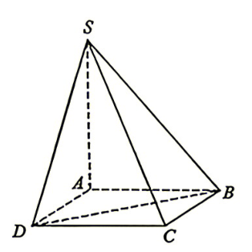
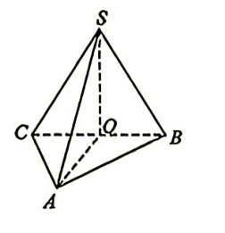

## 题目

样本数据 $5,2,7,6,1,4$ 的第 40 百分位数为

## 选项

A．$2$
B．$4$
C．$5$
D．$7$

## 答案

B

---
qid: 2
source: 1号卷A10联盟2027届高三8月底学情调研数学试题
number: '2'
type: choice
year: 2027
updatedAt: '1789914442'
knowledge: []
---

## 题目

已知平面向量 $\vec{p}=(1,\ -5)$，$\vec{a}=(-1,\ 2)$，$\vec{b}=(1,\ -3)$，若 $\vec{p}=x\vec{a}+y\vec{b}$，则 $x+y=$

## 选项

A．$-5$
B．$-1$
C．$1$
D．$5$

## 答案

D

---
qid: 3
source: 1号卷A10联盟2027届高三8月底学情调研数学试题
number: '3'
type: choice
year: 2027
updatedAt: '1789914442'
knowledge: []
---

## 题目

已知集合 $A=\left\{x\ \middle|\ \cos x \leqslant \dfrac{1}{2},\ -\pi \leqslant x \leqslant \pi\right\}$，$B=\{-1.5,\ -1,\ -0.5,\ 0,\ 0.5,\ 1,\ 1.5\}$，则 $A \cap B$ 的元素个数为

## 选项

A．$4$
B．$3$
C．$2$
D．$1$

## 答案

C

---
qid: 4
source: 1号卷A10联盟2027届高三8月底学情调研数学试题
number: '4'
type: choice
year: 2027
updatedAt: '1789914442'
knowledge: []
---

## 题目

双曲线 $C:4y^2-5x^2=1$ 的渐近线方程为

## 选项

A．$y=\pm\dfrac{\sqrt{5}}{2}x$
B．$y=\pm\dfrac{2\sqrt{5}}{5}x$
C．$y=\pm\dfrac{5}{4}x$
D．$y=\pm\dfrac{4}{5}x$

## 答案

A

---
qid: 5
source: 1号卷A10联盟2027届高三8月底学情调研数学试题
number: '5'
type: choice
year: 2027
updatedAt: '1789914442'
knowledge: []
---

## 题目

《九章算术·商功》记载："斜解立方，得两堑堵；斜解堑堵，其一为阳马，其一为鳖臑．"其中，"阳马"特指底面为矩形，且一条侧棱垂直于底面的四棱锥（即直四棱锥）．今有一阳马如图所示，其中 $SA \perp$ 平面 $ABCD$，$AB=AD$，若 $SC$ 与 $AB$ 所成角的余弦值为 $\dfrac{3}{5}$，则 $\dfrac{SA}{AD}=$

## 选项

A．$\dfrac{\sqrt{2}}{3}$
B．$\dfrac{\sqrt{7}}{3}$
C．$\dfrac{\sqrt{13}}{4}$
D．$\dfrac{\sqrt{3}}{4}$

## 答案

B

---
qid: 6
source: 1号卷A10联盟2027届高三8月底学情调研数学试题
number: '6'
type: choice
year: 2027
updatedAt: '1789914442'
knowledge: []
---

## 题目

若函数 $f(x)=(x+1)\ln(x+1)-ax\ (a \in \mathbf{Z})$ 在 $(1,\ 3)$ 上存在最小值 $m$，则 $m=$

## 选项

A．$\mathrm{e}-1$
B．$\mathrm{e}-2$
C．$1-\mathrm{e}$
D．$2-\mathrm{e}$

## 答案

D

---
qid: 7
source: 1号卷A10联盟2027届高三8月底学情调研数学试题
number: '7'
type: choice
year: 2027
updatedAt: '1789914442'
knowledge: []
---

## 题目

已知各项均不相同的数列 $\{a_n\}$ 满足 $\dfrac{2}{a_{n+1}}=\dfrac{1}{a_n}+\dfrac{1}{a_{n+2}}$，则 $\sum\limits_{n=1}^{2027}\dfrac{a_na_{n+1}}{a_1a_{2028}}=$

## 选项

A．$2027$
B．$2028$
C．$2$
D．$1$

## 答案

A

---
qid: 8
source: 1号卷A10联盟2027届高三8月底学情调研数学试题
number: '8'
type: choice
year: 2027
updatedAt: '1789914442'
knowledge: []
---

## 题目

在一节研究性学习的课程上，为了体现数学与生活的联系，唐老师准备了一个抽奖箱，里面有 8 张卡片，其中三张卡片上用绿色签字笔标有数字 $2$、$4$、$6$，五张卡片上用黑色签字笔标有数字 $2$、$4$、$6$、$8$、$10$，现邀请一名同学参与抽卡游戏，要求该同学从箱中任取三张卡片，则该生抽到的卡片都是绿色数字或都是黑色数字或卡片上的数字之和是 $6$ 的倍数的概率为

## 选项

A．$\dfrac{3}{7}$
B．$\dfrac{13}{28}$
C．$\dfrac{15}{28}$
D．$\dfrac{4}{7}$

## 答案

B

---
qid: 9
source: 1号卷A10联盟2027届高三8月底学情调研数学试题
number: '9'
type: multi
year: 2027
updatedAt: '1789914442'
knowledge: []
---

## 题目

设 $z=2-5\mathrm{i}$，则下列说法正确的是

## 选项

A．$\overline{z}=2+5\mathrm{i}$
B．$|z|=\sqrt{29}$
C．$z\cdot(1-2\mathrm{i})$ 的虚部为 $9$
D．$\dfrac{z+3\mathrm{i}}{2+2\mathrm{i}}$ 为纯虚数

## 答案

ABD

---
qid: 10
source: 1号卷A10联盟2027届高三8月底学情调研数学试题
number: '10'
type: multi
year: 2027
updatedAt: '1789914442'
knowledge: []
---

## 题目

对严格减函数有如下定义：设函数 $f(x)$ 的定义域为 $I$，若 $\forall x_1,\ x_2 \in I$，当 $x_1<x_2$ 时，$f(x_1)>f(x_2)$，则称 $f(x)$ 为区间 $I$ 上的严格减函数．已知函数 $f(x)$，$g(x)$ 的定义域为 $\mathbf{R}$，若 $h(x)=\min\{f(x),\ g(x)\}$，则下列说法正确的是

## 选项

A．当 $f(x)$，$g(x)$ 的图象均关于原点对称时，$h(x)$ 的图象也关于原点对称
B．若 $f(x) \geqslant M$，$g(x) \geqslant N$，且 $M \geqslant N$，则 $h(x) \geqslant N$
C．若 $f(x)$，$g(x)$ 在 $\mathbf{R}$ 上均为严格减函数且连续，则 $h(x)$ 没有极值点
D．若 $f(x)$，$g(x)$ 均存在最大值，则 $h(x)$ 也一定存在最大值

## 答案

BC

---
qid: 11
source: 1号卷A10联盟2027届高三8月底学情调研数学试题
number: '11'
type: multi
year: 2027
updatedAt: '1789914442'
knowledge: []
---

## 题目

已知三棱锥 $S-ABC$ 的体积为 $V$，外接球的球心为 $O$，且点 $O$ 在线段 $AB$ 上，向量 $\overrightarrow{OA}$，$\overrightarrow{OC}$ 的夹角与向量 $\overrightarrow{OC}$，$\overrightarrow{OS}$ 的夹角分别为定值，若球 $O$ 的体积为定值，则添加下列条件后，若 $V$ 的值能够存在，则使得 $V$ 的值唯一确定的是

## 选项

A．$SA$ 的长
B．$\angle BCS$ 的度数
C．$SC$ 与平面 $ABC$ 所成角的正弦值
D．二面角 $S-AB-C$ 的度数

## 答案

ABC

---
qid: 12
source: 1号卷A10联盟2027届高三8月底学情调研数学试题
number: '12'
type: blank
year: 2027
updatedAt: '1789914442'
knowledge: []
---

## 题目

曲线 $y=2x^3-2\ln x+3$ 在点 $(1,\ 5)$ 处的切线与直线 $x+my-3=0$ 垂直，则 $m$ 的值为 $\underline{\qquad}$．

## 答案

$4$

---
qid: 13
source: 1号卷A10联盟2027届高三8月底学情调研数学试题
number: '13'
type: blank
year: 2027
updatedAt: '1789914442'
knowledge: []
---

## 题目

半径相同的圆 $C_1$，$C_2$ 交于 $A(2,\ 3)$，$B(3,\ 2)$ 两点，若 $C_1(1,\ 1)$，则圆 $C_2$ 的标准方程为 $\underline{\qquad}$．

## 答案

$(x-4)^2+(y-4)^2=5$

---
qid: 14
source: 1号卷A10联盟2027届高三8月底学情调研数学试题
number: '14'
type: blank
year: 2027
updatedAt: '1789914442'
knowledge: []
---

## 题目

已知 $\alpha \in (0,\ 2\pi)$，函数 $f(x)=\dfrac{\sin \omega x}{\pi}\ (\omega>0)$ 的图象关于直线 $x=\dfrac{1}{2}$ 对称，且 $f(x)$ 在 $\left(0,\ \dfrac{1}{2}\right)$ 上单调递增，则 $\omega=$ $\underline{\qquad}$；函数 $g(x)=|x-\cos \alpha|+\sin \alpha$，若关于 $x$ 的方程 $f(x)=g(x)$ 在 $x \in [0,\ 2]$ 有且仅有 1 个根，则实数 $\alpha$ 的取值范围为 $\underline{\qquad}$．

## 答案

$\pi$，$\left[\dfrac{5\pi}{4},\ \dfrac{7\pi}{4}\right)$

---
qid: 15
source: 1号卷A10联盟2027届高三8月底学情调研数学试题
number: '15'
type: answer
year: 2027
updatedAt: '1789914442'
knowledge: []
---

## 题目

（本小题满分 13 分）

已知三棱锥 $S-ABC$ 如图所示，其中 $\triangle SBC$ 是面积为 $\sqrt{3}$ 的等边三角形，$SA \perp BC$，$\overrightarrow{BO}=\overrightarrow{OC}$．

（1）求证：$AO \perp BC$；

（2）若 $AO=\sqrt{3}$，三棱锥 $S-ABC$ 的体积为 $1$，求直线 $AC$ 与平面 $SAB$ 所成角的正弦值．

## 答案

（1）证明见解析；（2）$\dfrac{\sqrt{15}}{5}$

---
qid: 16
source: 1号卷A10联盟2027届高三8月底学情调研数学试题
number: '16'
type: answer
year: 2027
updatedAt: '1789914442'
knowledge: []
---

## 题目

（本小题满分 15 分）

某奢侈品专柜在开业 100 天的纪念日举办一项有奖回馈至尊 VIP 的活动，规定当天在专柜消费最多的 VIP 顾客（下面简称 VIP 顾客）可以通过抽奖获得最高金额为 $m$ 万元的现金返利（其中 $m$ 未知），具体抽奖活动规则如下：在一个封闭的抽奖箱里装有 5 张奖券，每张奖券上标注着不同的奖励金额，VIP 顾客从抽奖箱中随机摸取 1 张奖券，查看数字后，若他认为符合自己的心理预期，则直接兑奖，若他认为不符合自己的心理预期，则可以丢掉奖券，再从剩下的奖券中随机抽取一张，重复该过程，直到奖券抽完，若奖券抽完，则按最后一张奖券的金额进行返现．

（1）若该 VIP 顾客进行了 2 次抽奖后兑奖，其获得的返现金额为 $a$，求 $P(a=m)$；

（2）经过思考，该 VIP 顾客决定采取如下抽奖策略，他决定先抽取 2 次，记录下这两次抽奖的最高金额 $x$，然后丢掉奖券继续抽取，若后续抽奖抽到奖券的金额小于 $x$，则继续抽，若金额大于 $x$，则直接兑奖，若抽到第 5 次，奖券的金额仍然小于最大金额 $x$，则保留第 5 次的结果进行兑奖，求按照这种策略，该 VIP 顾客能够获得最高金额为 $m$ 万元的现金返利的概率．

## 答案

（1）$\dfrac{1}{5}$；（2）$\dfrac{13}{30}$

---
qid: 17
source: 1号卷A10联盟2027届高三8月底学情调研数学试题
number: '17'
type: answer
year: 2027
updatedAt: '1789914442'
knowledge: []
---

## 题目

（本小题满分 15 分）

在 $\triangle ABC$ 中，角 $A$，$B$，$C$ 所对的边分别为 $a$，$b$，$c$，且 $\cos 2A+\cos 2B+2=4\cos^2 C$．

（1）求 $\dfrac{c^2}{a^2+b^2}$ 的值；

（2）若 $c\sin A=2b\sin 1500^\circ$，且 $a=6$，求 $\triangle ABC$ 的外接圆面积．

## 答案

（1）$\dfrac{1}{2}$；（2）$12\pi$

---
qid: 18
source: 1号卷A10联盟2027届高三8月底学情调研数学试题
number: '18'
type: answer
year: 2027
updatedAt: '1789914442'
knowledge: []
---

## 题目

（本小题满分 17 分）

已知抛物线 $C:y^2=2px\ (p>0)$ 的焦点为 $F$，过点 $F$ 且倾斜角为 $45^\circ$ 的直线 $l$ 与抛物线 $C$ 形成的弦长为 $8$．

（1）求抛物线 $C$ 的方程；

（2）已知直线 $MN:x=my+2$ 与抛物线交于 $M(x_1,\ y_1)$，$N(x_2,\ y_2)$ 两点，其中 $x_1>0$，$y_1>0$．

（ⅰ）已知点 $T$ 在抛物线 $C$ 上，且 $\overrightarrow{NF}=\lambda\overrightarrow{NT}\ (0<\lambda<1)$，若 $|\overrightarrow{MT}|=\sqrt{13}$，求 $m$ 的值；

（ⅱ）探究：是否存在定点 $Q$，使得 $k_{QM}+k_{QN}=0$（其中 $k_{QM}$，$k_{QN}$ 分别为直线 $QM$，$QN$ 的斜率），若存在，求出点 $Q$ 的坐标，若不存在，请说明理由．

## 答案

（1）$y^2=4x$；（2）（ⅰ）$m=\dfrac{1}{2}$；（ⅱ）存在，$Q(-2,\ 0)$

---
qid: 19
source: 1号卷A10联盟2027届高三8月底学情调研数学试题
number: '19'
type: answer
year: 2027
updatedAt: '1789914442'
knowledge: []
---

## 题目

（本小题满分 17 分）

已知函数 $f(x)=\ln x-\dfrac{a}{2}x^2+1\ (a \in \mathbf{R})$．

（1）若 $a=2$，求函数 $f(x)$ 在 $\left[\dfrac{1}{2},\ 2\right]$ 上的最值；

（2）已知函数 $f(x)$ 有两个不同的零点 $x_1$，$x_2$．

（ⅰ）求 $a$ 的取值范围；

（ⅱ）若 $|2\ln x_1-2\ln x_2| \geqslant \ln 2$，求 $a$ 的取值范围．

## 答案

（1）最大值 $\dfrac{1-\ln 2}{2}$，最小值 $\ln 2-3$；（2）（ⅰ）$0<a<\mathrm{e}$；（ⅱ）$\left(0,\ \dfrac{\mathrm{e}^2\ln 2}{2}\right]$
