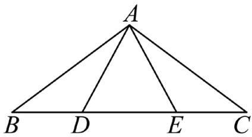
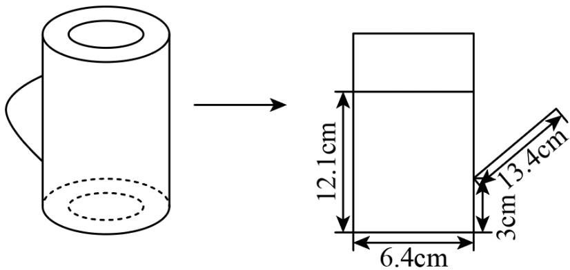
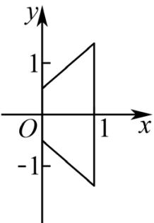
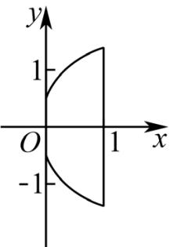
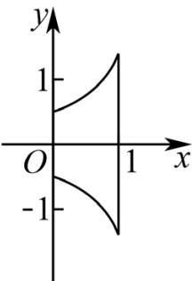
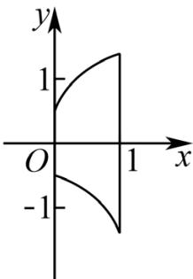
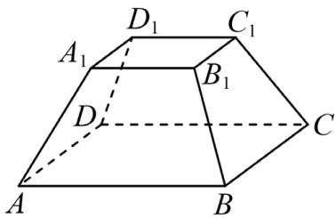

## 题目

已知集合 � = {2, 4}， $B = \{ 2 , 3 , m \}$ ，若 $A \subseteq B$ ，则 � =

---
qid: 2
source: 2026 年上海卷（春）
number: '2'
type: blank
year: 2026
updatedAt: '1789946799'
knowledge: []
---

## 题目

关于 � 的不等式 ${ \frac { x + 2 } { x - 3 } } < 0$ 的解集为

---
qid: 3
source: 2026 年上海卷（春）
number: '3'
type: blank
year: 2026
updatedAt: '1789946799'
knowledge: []
---

## 题目

已知 � = (�, 3)， $\ b = \ ( 4 , 6 )$ ，若 � ∥ �，则 � =

---
qid: 4
source: 2026 年上海卷（春）
number: '4'
type: blank
year: 2026
updatedAt: '1789946799'
knowledge: []
---

## 题目

在平面直角坐标系中，点 (1,2) 到直线 $4 x - 3 y + 5 = 0$ 的距离为

---
qid: 5
source: 2026 年上海卷（春）
number: '5'
type: blank
year: 2026
updatedAt: '1789946799'
knowledge: []
---

## 题目

在二项式 $\left( { \frac { 1 } { x } } + 3 x ^ { 2 } \right) ^ { 6 }$ 的展开式中， $x ^ { - 3 }$ 的系数为

---
qid: 6
source: 2026 年上海卷（春）
number: '6'
type: blank
year: 2026
updatedAt: '1789946799'
knowledge: []
---

## 题目

若 $a > 0 , b > 0$ ，且 $a + 2 b = 4$ ，则 �� 的最大值为

---
qid: 7
source: 2026 年上海卷（春）
number: '7'
type: blank
year: 2026
updatedAt: '1789946799'
knowledge: []
---

## 题目

从 5人 中选 3人 去演讲，若甲一定去，则共有 种 选法.

---
qid: 8
source: 2026 年上海卷（春）
number: '8'
type: blank
year: 2026
updatedAt: '1789946799'
knowledge: []
---

## 题目

已知点 � 在抛物线 $y ^ { 2 } \ = \ 4 x$ 上，且点 � 到焦点的距离是到 � 轴距离的两倍，则点 � 的横坐标为

---
qid: 9
source: 2026 年上海卷（春）
number: '9'
type: blank
year: 2026
updatedAt: '1789946799'
knowledge: []
---

## 题目

已知 $m \ > \ 1$ ，对于所有满足 |�| = 2 的复数 �，|� − i| 的最小值与 $| z \rrangle - m |$ 的最小值相同， 则 � =

---
qid: 10
source: 2026 年上海卷（春）
number: '10'
type: blank
year: 2026
updatedAt: '1789946799'
knowledge: []
---

## 题目

在 $\triangle A B C$ 中，�，� 在边 �� 上，且 $B D \ = \ D E \ = \ E C$ $A D \ = \ 1$ $\angle D A E ~ = ~ \frac { \pi } { 3 }$ ，则${ \overrightarrow { A B } } \cdot { \overrightarrow { A C } }$ 的最大值为

第 10 题图

---
qid: 11
source: 2026 年上海卷（春）
number: '11'
type: blank
year: 2026
updatedAt: '1789946799'
knowledge: []
---

## 题目

已知椭圆 $\Gamma _ { 1 } : \frac { x ^ { 2 } } { a ^ { 2 } } + y ^ { 2 } = 1 ( a > 1 )$ 与椭圆 $\Gamma _ { 2 } : \frac { x ^ { 2 } } { b ^ { 2 } + 2 } + \frac { y ^ { 2 } } { b ^ { 2 } } = 1$ 相交于�，�，�，� 四点，且 $\Gamma _ { 1 }$ 和 $\Gamma _ { 2 }$ 的四个焦点在同一个圆上，则 $b ^ { 2 } \ =$

---
qid: 12
source: 2026 年上海卷（春）
number: '12'
type: blank
year: 2026
updatedAt: '1789946799'
knowledge: []
---

## 题目

有一个油壶，壶身视为圆柱，壶嘴视为直线且不计容积，壶底直径 6.4厘米，壶身高 16厘米，壶内油液面高 12.1 厘米，壶嘴长 13.4厘米，与壶身夹角 30∘，壶嘴最低点距壶底 3厘米. 将壶身向壶嘴方向至少转 度 可使油倒出（精确到 0.01∘）.

---
qid: 13
source: 2026 年上海卷（春）
number: '13'
type: blank
year: 2026
updatedAt: '1789946799'
knowledge: []
---

## 题目

下列数列中是等差数列也是等比数列的是（ ）.A. 1，−1，1，−1，1 B. 1，2，3，4，5C. 5，5，5，5，5 D. 1，2，3，5，7

---
qid: 14
source: 2026 年上海卷（春）
number: '14'
type: choice
year: 2026
updatedAt: '1789946799'
knowledge: []
---

## 题目

已知 $x > y > 1$ ，则下列不等式恒成立的是（ ）.

第 12 题图

## 选项

A．$x > y ^ { 2 }$
B．$x y > x + y$
C．$x ^ { 2 } > y$
D．$x + y > x y$

---
qid: 15
source: 2026 年上海卷（春）
number: '15'
type: blank
year: 2026
updatedAt: '1789946799'
knowledge: []
---

## 题目

平移对称法在几何学中具有重要的应用. 设平面直角坐标系 $x O y$ 中有一图形 Ω，过 Ω 内任意一点 � 作垂直于� 轴的直线 $l _ { P } .$ ，满足 $l _ { P } \cap \Omega$ 为一线段. 现沿 $l _ { P }$ 方向平移这些线段，使得它们的中点均在� 轴上，这样叫做平移对称法. 对于由 $- x ^ { 2 } + x + 1 , - x ^ { 2 } - x$ ，直线� = 0和直线 � = 1 围成的封闭图形 Ω，对它进行一次平移对称，得到的图像大致为（ ）.

A.

B.

C.

D.

---
qid: 16
source: 2026 年上海卷（春）
number: '16'
type: choice
year: 2026
updatedAt: '1789946799'
knowledge: []
---

## 题目

对于函数 $y \ = f ( x ) , \ x \in D$ ，设 $A _ { f } ~ = ~ \{ ( x , y ) ~ \mid ~ y ~ \geq ~ f ( x ) , x ~ \in ~ D \}$ . 对于点集 �，若存在$( x _ { 0 } , y _ { 0 } ) \ \in \ M$ ，使得任取 $( x , y ) \in M$ ，总有 $y ~ \geq ~ y _ { 0 }$ ，则称 $( x _ { 0 } , y _ { 0 } )$ 为“最低点”. 对于函数$y \ = \ f ( x )$ 和 $y ~ = ~ g ( x )$ ，以下说法中正确的是（ ）.

## 选项

A．若 $y = f ( x )$ 和 $y = g ( x )$ 都有最小值，则 $A _ { f } \cap A _ { g }$ 有最低点
B．若 $A _ { f } \cap A _ { g }$ 有最低点，则 $y = f ( x )$ 和 $y = g ( x )$ 都有最小值
C．若 $y = f ( x )$ 或 $y = g ( x )$ 有最小值，则 $A _ { f } \cup A _ { g }$ 有最低点
D．若 $A _ { f } \cup A _ { g }$ 有最低点，则 $y = f ( x )$ 或 $y = g ( x )$ 有最小值

---
qid: 17
source: 2026 年上海卷（春）
number: '17'
type: answer
year: 2026
updatedAt: '1789946799'
knowledge: []
---

## 题目

某兴趣班共 150 人，年龄分布及兴趣爱好统计如下：

年龄

剪纸

摄影

画画

人数

[25,35)

8

45

[35,45)

10

55

[45,55)

6

50

（1）现采用分层抽样抽取30 人，其中抽到年龄在[25,35) 岁的有多少人？

（2）该兴趣班150 人的平均年龄是多少？

（3）现从 150 人 中任意抽选 1人，记抽到的学员年龄在 [35,45) 为事件�，记抽到学员爱好摄影为事件�. 事件�与� 是否独立？请说明理由.

---
qid: 18
source: 2026 年上海卷（春）
number: '18'
type: answer
year: 2026
updatedAt: '1789946799'
knowledge: []
---

## 题目

如图所示正四棱台 $A B C D - A _ { 1 } B _ { 1 } C _ { 1 } D _ { 1 }$ ，其中 $A B = 4 , A _ { 1 } B _ { 1 } = 2$

（1）当 $A A _ { 1 } = 2$ 时，求 $A A _ { 1 }$ 和平面 $A _ { 1 } B _ { 1 } C _ { 1 } D _ { 1 }$ 所成角；

（2）证明： $: A A _ { 1 } \parallel$ 平面 $B C _ { 1 } D ;$ ；若棱台高为3，求三棱锥 $A _ { 1 } - B C _ { 1 } D$ 的体积.

第 18 题图

---
qid: 19
source: 2026 年上海卷（春）
number: '19'
type: answer
year: 2026
updatedAt: '1789946799'
knowledge: []
---

## 题目

已知 $f ( x ) ~ = ~ \sin ( \omega x + \varphi ) ~ ( \omega > 0 , ~ 0 ~ < ~ \varphi < \pi )$

（1）当 $\omega = 2 , f { \left( \frac { \pi } { 1 2 } \right) } = 0$ ，求函数�(�)在� = 0 处的切线方程；

（2）若函数 � (�) 的最小正周期为 3π，且 $f ( x ) = { \frac { \sqrt { 2 } } { 2 } }$ 在区间 [0, 2026π) 上恰好有 1351 个解，求 � 的取值范围.

---
qid: 20
source: 2026 年上海卷（春）
number: '20'
type: answer
year: 2026
updatedAt: '1789946799'
knowledge: []
---

## 题目

已知双曲线Γ ${ \frac { x ^ { 2 } } { 2 } } - { \frac { y ^ { 2 } } { 2 } } = 1$ ，过点 $M ( m , 0 )$ 作不垂直于 � 轴的直线 � 交双曲线 Γ 于 �，� 两点.

（1）求双曲线Γ的离心率；

（2）若点 $A ( { \sqrt { 3 } } , 1 )$ ，点� 在双曲线的右支上，且� 是�� 的中点，求直线� 的斜率；

（3）若 $m > 0 , F _ { 1 } , F _ { 2 }$ 分别是双曲线 Γ 的左右焦点，�′ 是 A 关于� 轴的对称点，若存在直线 � 使得 ${ \overrightarrow { F _ { 1 } A ^ { \prime } } } \cdot { \overrightarrow { F _ { 2 } B } } = 0$ ，求� 的取值范围.

---
qid: 21
source: 2026 年上海卷（春）
number: '21'
type: answer
year: 2026
updatedAt: '1789946799'
knowledge: []
---

## 题目

设�(�) 是定义在 � 上的函数. 定义性质 �：若对任意 $x _ { 1 } , \ x _ { 2 } \ \in \ \mathbf { R }$ ，当 $| x _ { 1 } | ~ < ~ | x _ { 2 } |$ 时，$f ( x _ { 1 } ) \ < \ f ( x _ { 2 } )$ ，则称函数�(�) 具有“性质 $P ^ { \prime \prime }$

（1）判断函数 $f ( x ) = e ^ { x }$ 是否具有“性质 $P ^ { \prime \prime } { } _ { ; }$ ；

（2）若分段函数 $f ( x ) = { \left\{ \begin{array} { l l } { a x , } & { x \leq 0 , } \\ { x + b , \ x > 0 } \end{array} \right. }$ 具有“性质 $P ^ { \prime \prime }$ ，求所有满足条件的实数 $a , b ;$

（3）已知 � (�) 的值域为 [0, 1)，且在 $[ 0 , + \infty )$ 上是严格增函数，证明：�(�) 是偶函数的充要条件是�(�) 具有“性质 $P ^ { \prime \prime }$
