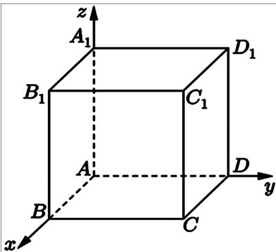
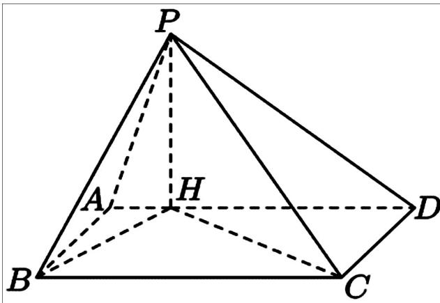

## 题目

已知集合 $A \ = \ \{ 2 , 1 + a \}$ ，且 $- 1 \in A$ ，则 � =

---
qid: 2
source: 2026 年上海卷（秋）
number: '2'
type: blank
year: 2026
updatedAt: '1789946799'
knowledge: []
---

## 题目

已知数列 $\left\{ a _ { n } \right\}$ 是等比数列，且 $a _ { 1 } = 2 , a _ { 2 } = 6$ ，则 $a _ { 4 }$ =

---
qid: 3
source: 2026 年上海卷（秋）
number: '3'
type: blank
year: 2026
updatedAt: '1789946799'
knowledge: []
---

## 题目

已知 $\sin \alpha \ = \ { \frac { 1 } { 5 } }$ ，则 $\cos 2 \alpha \ =$

---
qid: 4
source: 2026 年上海卷（秋）
number: '4'
type: blank
year: 2026
updatedAt: '1789946799'
knowledge: []
---

## 题目

已知事件�，� 互斥， $P \left( A \right) = 0 . 2 , P \left( B \right) = 0 . 5$ ，则 � (� ∪ �) =

---
qid: 5
source: 2026 年上海卷（秋）
number: '5'
type: blank
year: 2026
updatedAt: '1789946799'
knowledge: []
---

## 题目

函数 � (�) 是偶函数. 当 $x \ge 0$ 时， $f ( x ) = { \sqrt { x } } - a .$ . 若 � (−4) = 3，则 � =

---
qid: 6
source: 2026 年上海卷（秋）
number: '6'
type: blank
year: 2026
updatedAt: '1789946799'
knowledge: []
---

## 题目

在 $\left( x ^ { 2 } + x \right) ^ { 5 }$ 的二项展开式中， $x ^ { 7 }$ 项的系数为

---
qid: 7
source: 2026 年上海卷（秋）
number: '7'
type: blank
year: 2026
updatedAt: '1789946799'
knowledge: []
---

## 题目

已知 $a ^ { 2 } + 4 b ^ { 2 } \ = \ 1$ ，则 �� 的最大值为

---
qid: 8
source: 2026 年上海卷（秋）
number: '8'
type: blank
year: 2026
updatedAt: '1789946799'
knowledge: []
---

## 题目

已知随机变量 � 的分布为 $\left( \begin{array} { c c c } { { - 1 } } & { { 0 } } & { { 1 } } \\ { { a } } & { { 0 . 3 } } & { { b } } \end{array} \right)$ ，� (�) = 0.5，则 � =

---
qid: 9
source: 2026 年上海卷（秋）
number: '9'
type: blank
year: 2026
updatedAt: '1789946799'
knowledge: []
---

## 题目

已知等差数列 $\left\{ a _ { n } \right\}$ 中， $a _ { 1 } \ = \ 0 , \ d$ 为公差， $S _ { n }$ 为前 � 项和. 至少有两项 $S _ { n }$ 介于 (0, 1)，则 � 的取值范围为

---
qid: 10
source: 2026 年上海卷（秋）
number: '10'
type: blank
year: 2026
updatedAt: '1789946799'
knowledge: []
---

## 题目

已知 $k \in \textbf { R }$ ，向量 �，�，� 是两两不平行的向量，且 $\mathbf { 0 } + 3 \mathbf { b } \parallel b + c , 2 \mathbf { a } + k c \parallel b + c$ 则 � =

---
qid: 11
source: 2026 年上海卷（秋）
number: '11'
type: blank
year: 2026
updatedAt: '1789946799'
knowledge: []
---

## 题目

已知三角函数 $f ( t ) ~ = ~ A \sin { ( \omega t + \varphi ) } + B ~ ( A ~ > ~ 0 , ~ B ~ \in ~ { \bf R } , ~ \omega ~ > ~ 0 , ~ 0 ~ \leq ~ \varphi ~ < ~ 2 \pi )$ ），若$\nu = f ( t )$ ，当 � = 0 或 � = 4 时其导数为 0，初始速度为 0，且速度第一次达到 4 时用时为 0.1 秒，则 �(�) =

---
qid: 12
source: 2026 年上海卷（秋）
number: '12'
type: blank
year: 2026
updatedAt: '1789946799'
knowledge: []
---

## 题目

在 $\triangle A B C$ 中， $A B = 3 , A C = 5 , B C = { \sqrt { 1 4 } } .$ 已知点 �，�，� 分别为椭圆 4 个顶点和 2个焦点中的三点，则该椭圆的离心率为

---
qid: 13
source: 2026 年上海卷（秋）
number: '13'
type: choice
year: 2026
updatedAt: '1789946799'
knowledge: []
---

## 题目

已知 $a \in \textbf { R }$ ，且 $a \ \ne \ 1$ ，则 $a \cdot { \sqrt [ { 3 } ] { a } } = ( ) $

## 选项

A．$\frac { 3 } { a ^ { 2 } }$
B．$\frac { 4 } { a ^ { 3 } }$
C．$\frac { 5 } { a ^ { 2 } }$
D．$\frac { 5 } { a ^ { 3 } }$

---
qid: 14
source: 2026 年上海卷（秋）
number: '14'
type: choice
year: 2026
updatedAt: '1789946799'
knowledge: []
---

## 题目

事件� 和事件 � 相互独立， $^ { 6 6 } A$ 和 � 至少一个发生”的对立事件是（ ）

## 选项

A．� ∩ �
B．� ∪ �
C．${ \overline { { A } } } \cap { \overline { { B } } }$
D．${ \overline { { A } } } \cup { \overline { { B } } }$

---
qid: 15
source: 2026 年上海卷（秋）
number: '15'
type: choice
year: 2026
updatedAt: '1789946799'
knowledge: []
---

## 题目

对于任意两个复数 �，�，如果满足 � − � 为实数，或 $z - { \overline { { w } } }$ 为实数，那么就称 � 与 � 伴随.如果 � 与 � 伴随，则 $w - \mathrm { i }$ 与 $z + \mathrm { i }$ 伴随的充要条件是（ ）

## 选项

A．$\operatorname { R e z } + \operatorname { R e w } = 0$
B．$\operatorname { R e z } - \operatorname { R e w } = 0$
C．$\mathrm { I m } z + \mathrm { I m } w = 0$
D．$\mathrm { I m } z - \mathrm { I m } w = 0$

---
qid: 16
source: 2026 年上海卷（秋）
number: '16'
type: choice
year: 2026
updatedAt: '1789946799'
knowledge: []
---

## 题目

已知空间直角坐标系中有一正方体，其三组棱分别与 � 轴，� 轴，� 轴重合，顶点� 与坐标原点重合，点 � 是正方体底面中与� 相对的对角顶点，点 $C _ { 1 }$ 在点 � 的正上方. 将正方体绕直线 $A C _ { 1 }$ 旋转一周，点 � 的运动轨迹会经过（ ）个空间卦限.

第 16题图

## 选项

A．1
B．3
C．4
D．7

---
qid: 17
source: 2026 年上海卷（秋）
number: '17'
type: answer
year: 2026
updatedAt: '1789946799'
knowledge: []
---

## 题目

工厂为了保护和改善环境，记录了颗粒物密度和二氧化硫密度. 下表是2023年前九年数据：

颗粒物密度

101.02

87.02

57.46

21.85

11.76

8.86

5.03

4.63

3.86

二氧化硫密度

119.47

81.94

53.20

9.16

6.60

4.40

3.31

3.35

3.86

（1）从九年中任意抽取一年，该年份颗粒物密度比二氧化硫密度高的概率是多少？

（2）想要研究颗粒物密度和二氧化硫密度的线性关系，你准备选择扇形图，茎叶图还是散点图？研究颗粒物密度和二氧化硫密度的相关系数，你认为在区间 (−1,0)，(0,1) 还是(1,2) 内？直接写出答案；

（3）九年中的平均年份是 2018 年. 设 � 为年份，颗粒物密度为 �，现在有两个选择： $y _ { 1 } =$ $1 0 6 . 5 5 \mathrm { e } ^ { - 0 . 4 6 1 ( x - 2 0 1 4 ) } , y _ { 2 } = a \left( x - 2 0 1 4 \right) + 8 3 . 7 4 3 \left( a \in \mathbf { R } \right)$ ），其中 $y _ { 1 }$ 是回归方程， $y _ { 2 }$ 是线性回归方程. 通过预测值与实际值之差的绝对值来比较精确度，已知在 2023 年实际颗粒物密度为3.88，预测值与实际值之差的绝对值哪个更小（精确到0.01）？

---
qid: 18
source: 2026 年上海卷（秋）
number: '18'
type: answer
year: 2026
updatedAt: '1789946799'
knowledge: []
---

## 题目

四棱锥 � −���� 的底面 ���� 是矩形，点 � 在线段 �� 上， $P H \perp$ 平面����，�� = 2，�� = 1， �� = 4.

（1）证明： $H C \perp P B$ ；

（2）若四棱锥体积 $V _ { P - A B C D } = { \frac { 1 0 { \sqrt { 5 } } } { 3 } }$ ，求二面角�−��−� 的大小.

---
qid: 19
source: 2026 年上海卷（秋）
number: '19'
type: answer
year: 2026
updatedAt: '1789946799'
knowledge: []
---

## 题目

已知 $a \in \textbf { R }$ ，函数 $f ( x ) \ = \ x ^ { 2 } + a x + 3 , \ g ( x ) \ = \ 4 x + { \frac { 1 } { x ^ { 2 } } } .$

（1）解不等式 $f ( x ) + { \frac { 1 } { x ^ { 2 } } } > g ( x )$

（2） $a \neq 0 , l _ { 1 }$ 是�(�) 在点 (0, 3) 处的切线， $l _ { 2 }$ 是过点 (0,3) 且垂直于 $l _ { 1 }$ 的直线. $g ( x )$ 与 $l _ { 1 }$ ，$l _ { 2 }$ 在第一象限内均无公共点，求� 的取值范围.

---
qid: 20
source: 2026 年上海卷（秋）
number: '20'
type: answer
year: 2026
updatedAt: '1789946799'
knowledge: []
---

## 题目

已知双曲线 $\Gamma : x ^ { 2 } - y ^ { 2 } = 1$ ，点 � 在 Γ 上， $F _ { 1 } , F _ { 2 }$ 分别为双曲线的左，右焦点.

（1）求点(2,0) 到Γ渐近线的距离；

（2）若 $\overrightarrow { P F _ { 1 } } \cdot \overrightarrow { P F _ { 2 } } = 1$ ，求 $\triangle P F _ { 1 } F _ { 2 }$ 的面积；

第 18 题图

（3）记Ω为双曲线 $x ^ { 2 } - y ^ { 2 } = 1$ 中满足 $( x > 0 , y \geq - 1 )$ 或 $( x < 0 , y \leq - 1 )$ 的部分. 过点 $F _ { 2 }$ 的直线 � 交 Ω 于 $P , Q$ 两点（分别位于第一，第四象限），过点 $F _ { 2 }$ 的直线 � 交 Ω 于�，� 两点（分别位于第三，第四象限）. 是否存在常数 �，使得对任意直线 �，都存在唯一对应的直线� 满足 $\lambda | P Q | = | M N | ?$ 若存在，求出�的值；若不存在，请说明理由.

---
qid: 21
source: 2026 年上海卷（秋）
number: '21'
type: answer
year: 2026
updatedAt: '1789946799'
knowledge: []
---

## 题目

(�,�, �) 是 1，2，3 的一个排列. 对函数 $f _ { 1 } ( x ) , f _ { 2 } ( x ) , f _ { 3 } ( x )$ ，对于任意 $x \in I$ ，都有 $f _ { 1 } ( x ) \leq f _ { i } ( x )$ 且 $f _ { 1 } ( x ) + f _ { 2 } ( x ) \leq f _ { i } ( x ) + f _ { j } ( x )$ ，则称 $( i , j , k )$ 是关于 $f _ { 1 } ( x ) , f _ { 2 } ( x ) , f _ { 3 } ( x )$ 的一个 � 排列. 关于 $f _ { 1 } ( x ) , f _ { 2 } ( x ) , f _ { 3 } ( x )$ 的 � 排列总数记为 $n _ { I }$

（1）对 $I = [ 3 , + \infty ) , f _ { 1 } ( x ) = x , f _ { 2 } ( x ) = 0 , f _ { 3 } ( x ) = x ^ { 2 } + 1$ ，判断(3,1,2) 是否为� 排列；

（2）对 $I = ( 0 , + \infty ) , f _ { 1 } ( x ) = x - 1 , f _ { 2 } ( x ) = x + m , f _ { 3 } ( x ) = x ^ { 2 }$ 满足条件的 ${ n } _ { I } = 6$ ，求� 的取值范围；

（3）对任意 $x \in [ 0 , + \infty )$ ，都有 $0 < F ^ { \prime } ( x ) < 1$ . 令 ${ \cal I } = [ a , + \infty ) , f _ { 1 } ( x ) = F ^ { \prime } ( x ) , f _ { 2 } ( x ) =$ ${ \frac { 1 } { 2 } } \left( F ^ { \prime } \left( x + a \right) + F ^ { \prime } \left( x - a \right) \right) , f _ { 3 } ( x ) = 1 - \mathrm { e } ^ { - x }$ . 证明：若 $F ^ { \prime } ( x )$ 严格减，则存在 $a > 0$ ，使$n _ { I } \geq 4 ;$ ；若 $F ^ { \prime } ( x ) { \overline { { \operatorname { \prime } } } } ^ { \mathrm { { I } } \overline { { \operatorname { \prime } } } }$ 格增，则存在 $a \in ( 0 , 1 ) , n _ { I }$ ≠ 2.
