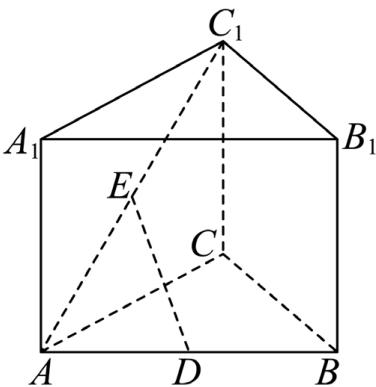

## 题目

样本数据 6，8，4，5，12 的中位数为（ ）

## 选项

A．5
B．6
C．8
D．9

## 答案

B

## 解析

将这组数据按从小到大的顺序排列，得 4，5，6，8，12. 共 5 个数，中间那个数是 6，所以中位数为 6. 故选：B.

---
qid: 2
source: 2026 年全国 I 卷
number: '2'
type: choice
year: 2026
updatedAt: '1789915071'
knowledge: []
---

## 题目

已知平面向量 �，� 不共线，且 $2 a + y b = x a - 3 b$ ，则（ ）

## 选项

A．$x = 2 , y = - 3$
B．$x = - 2 , y = 3$
C．� = 2，� = 3
D．$x = - 2 , y = - 3$

## 答案

A

## 解析

因为�，� 不共线，所以它们可以作为平面向量的一组基底，表示是唯一的. 比较$2 a + y b = x a - 3 b$ 两边 �，� 的系数，得 $x = 2 , y = - 3$ . 故选：A.

---
qid: 3
source: 2026 年全国 I 卷
number: '3'
type: choice
year: 2026
updatedAt: '1789915071'
knowledge: []
---

## 题目

已知集合 $A = \left\{ \sin { \frac { 7 \pi } { 6 } } , \cos { \frac { 5 \pi } { 3 } } \right.$ $\tan { \frac { 5 \pi } { 4 } } \Bigg \}$ $B = \left\{ - \frac { \sqrt { 3 } } { 2 } , - \frac { 1 } { 2 } , 1 \right\}$ ，则 $A \cap B = { \left( \begin{array} { l l } { \quad } & { } \end{array} \right) }$

## 选项

A．$\left\{ - { \frac { \sqrt { 3 } } { 2 } } , - { \frac { 1 } { 2 } } \right\}$
B．$\left\{ - { \frac { \sqrt { 3 } } { 2 } } , 1 \right\}$
C．$\left\{ - { \frac { 1 } { 2 } } , 1 \right\}$
D．$\left\{ - { \frac { \sqrt { 3 } } { 2 } } , - { \frac { 1 } { 2 } } , 1 \right\}$

## 答案

C

## 解析

因为 $\sin { \frac { 7 \pi } { 6 } } ~ = ~ - { \frac { 1 } { 2 } } , ~ \cos { \frac { 5 \pi } { 3 } } ~ = ~ { \frac { 1 } { 2 } } , ~ \tan { \frac { 5 \pi } { 4 } } ~ = ~ 1$ ，所以 $A \ = \ \left\{ - \frac 1 2 , \frac 1 2 , 1 \right\}$ 于是$A \cap B \ = \ \left\{ - { \frac { 1 } { 2 } } , 1 \right\}$ . 故选：C.

---
qid: 4
source: 2026 年全国 I 卷
number: '4'
type: choice
year: 2026
updatedAt: '1789915071'
knowledge: []
---

## 题目

曲线 $y \ = \ 5 x + 8 \ln x$ 在点 (1,5) 处的切线方程为（ ）

## 选项

A．$y = 3 x + 2$
B．$y = 5 x$
C．$y = 8 x - 3$
D．$y = 1 3 x - 8$

## 答案

D

## 解析

函数 $y = 5 x + 8 \ln x$ 的导数为 $y ^ { \prime } = 5 + { \frac { 8 } { x } } .$ 当 $x = 1$ 时，切线斜率为 $y ^ { \prime } ( 1 ) = 5 { + } 8 = 1 3$ 所以过点 (1,5) 的切线方程为 $y - 5 = 1 3 ( x - 1 )$ ，即 $y = 1 3 x - 8 .$ . 故选：D.

---
qid: 5
source: 2026 年全国 I 卷
number: '5'
type: choice
year: 2026
updatedAt: '1789915071'
knowledge: []
---

## 题目

已知抛物线 $C _ { 1 } : y ^ { 2 } = 2 p _ { 1 } x ( p _ { 1 } > 0 )$ 和 $C _ { 2 } : x ^ { 2 } = 2 p _ { 2 } y ( p _ { 2 } > 0 )$ 均经过点 (4, 8)，则$C _ { 1 }$ 的焦点与 $C _ { 2 }$ 的焦点之间的距离为（ ）

## 选项

A．12
B．$4 { \sqrt { 5 } }$
C．6
D．$\frac { \sqrt { 6 5 } } { 2 }$

## 答案

D

## 解析

点 (4,8) 在 $C _ { 1 }$ 上，所以 $8 ^ { 2 } = 2 p _ { 1 } \cdot 4$ ，解得 $\qquad p _ { 1 } \ = \ 8 .$ . 故 $C _ { 1 }$ 的焦点为 (4, 0). 点
(4, 8) 在 $C _ { 2 }$ 上，所以 $4 ^ { 2 } = 2 p _ { 2 } \cdot 8$ ，解得 $p _ { 2 } ~ = ~ 1$ . 故 $C _ { 2 }$ 的焦点为 $\left( 0 , { \frac { 1 } { 2 } } \right)$ 于是两焦点间距
离为 ${ \sqrt { \left( 4 - 0 \right) ^ { 2 } + \left( 0 - { \frac { 1 } { 2 } } \right) ^ { 2 } } } = { \sqrt { 1 6 + { \frac { 1 } { 4 } } } } = { \frac { \sqrt { 6 5 } } { 2 } }$ 故选：D.

---
qid: 6
source: 2026 年全国 I 卷
number: '6'
type: choice
year: 2026
updatedAt: '1789915071'
knowledge: []
---

## 题目

已知函数 $f ( x ) \ = \ { \frac { x + 2 } { \mathrm { e } ^ { x } + a } }$ 的最大值为 1，则 � =（ ）

## 选项

A．$\frac 1 2$
B．1
C．$\frac 3 2$
D．2

## 答案

B

## 解析

因为�(�)的最大值为1，所以对任意 $x \in \mathbf { R }$ ，都有 $\frac { x + 2 } { \mathbf { e } ^ { x } + a } \leq 1$ . 于是 $x + 2 \leq \mathbf { e } ^ { x } + a ;$ 即 $a \geq x + 2 - \mathbf { e } ^ { x }$ . 设 $g ( x ) = x + 2 - \mathbf { e } ^ { x }$ ，则 $g ^ { \prime } ( x ) = 1 - \mathbf { e } ^ { x } .$ . 当 $x < 0$ 时， $g ^ { \prime } ( x ) > 0 ;$ ；当 $x > 0$ 时，$g ^ { \prime } ( x ) < 0 .$ . 所以 �(�) 在 $x = 0$ 处取得最大值，且 $g ( 0 ) = 0 + 2 - 1 = 1$ . 故 $a \geq 1$ . 若 $a > 1$ ，则对任意�，都有 $x + 2 < \mathbf { e } ^ { x } + a$ ，从而 $f ( x ) < 1$ ，这与最大值为 1 矛盾. 因此只能有 $a = 1$ . 故选：B.

---
qid: 7
source: 2026 年全国 I 卷
number: '7'
type: choice
year: 2026
updatedAt: '1789915071'
knowledge: []
---

## 题目

一百零八塔位于宁夏回族自治区青铜峡市，以其独特的建筑格局和深邃的历史文化闻名遐迩. 该塔群共有 108 座塔，依山势自上而下排成 12 行，将第 � 行中塔的座数记为 $a _ { i } \left( i = 1 \right.$ 2，⋯，12），其中 $a _ { 1 } = 1 , a _ { 2 } = a _ { 3 } = 3 , a _ { 4 } = a _ { 5 } = 5$ ，且 $a _ { 6 } , a _ { 7 } , \dotsc , a _ { 1 2 }$ 是一个首项为 7，公差为 2 的等差数列. 将 $a _ { 1 } , a _ { 2 } , \cdots , a _ { 1 2 }$ 分为 6 组，每组 2 个数，使得每组的 2 个数之和可构成一个项数为 6 且公差为 $d \ ( \ d \ > \ 0 )$ 的等差数列，则 � =（ ）

## 选项

A．2
B．4
C．6
D．8

## 答案

B

## 解析

由题意可得 $a _ { 1 } , a _ { 2 } , \cdots , a _ { 1 2 } = 1 , 3 , 3 , 5 , 5 , 7 , 9 , 1 1 , 1 3 , 1 5 , 1 7 , 1 9 .$ 把这 12 个数
分成 6 组后，六个组和的总和仍为 $1 + 3 + 3 + 5 + 5 + 7 + 9 + 1 1 + 1 3 + 1 5 + 1 7 + 1 9 = 1 0 8$
因此这 6 个组和所成等差数列的平均数为 ${ \frac { 1 0 8 } { 6 } } = 1 8$ . 又因为每个 $a _ { i }$ 都是奇数，所以每组
两个数之和都是偶数. 设这 6 个组和从小到大为 $x , x + d , x + 2 d , x + 3 d , x + 4 d , x + 5 d$
由平均数为 18，得 $x + { \frac { 5 d } { 2 } } = 1 8$ . 依次代入选项检验：当 $d \ = \ 2$ 时， $x ~ = ~ 1 3$ ，是奇数，不可能；当 � = 6 时， $x \ = \ 3$ ，是奇数，不可能；当 � = 8 时， $x \ = \ - 2$ ，不可能作为两数组和；所以只能有 � = 4.再给出一种实际分组：(1, 7)，(3, 9)，(3, 13)，(5, 15)，(5, 19)，(11, 17). 对应组和为 8，12，
16，20，24，28，它们确实构成公差为 4 的等差数列. 故选：B.

---
qid: 8
source: 2026 年全国 I 卷
number: '8'
type: choice
year: 2026
updatedAt: '1789915071'
knowledge: []
---

## 题目

设 $U ~ = ~ \{ ( x _ { 1 } , x _ { 2 } , x _ { 3 } ) ~ | ~ x _ { i } ~ \in ~ \{ - 2 , - 1 , 1 , 2 \} , i ~ = ~ 1 , 2 , 3 \}$ 为空间中 64 个点构成的集合. 点$P ( 1 , 1 , 1 )$ ，记样本空间 $\Omega = \complement _ { U } \{ P \}$ . 从 Ω 中随机取一个点，定义随机变量 � 如下：对 Ω中的每个点 $A ( x _ { 1 } , x _ { 2 } , x _ { 3 } )$ ，令 $X ( A ) = x _ { 1 } + x _ { 2 } + x _ { 3 }$ ，则 � 的数学期望为（ ）

## 选项

A．$\displaystyle { - \frac { 1 } { 2 1 } }$
B．$- { \frac { 1 } { 6 3 } }$
C．0
D．$\frac { 1 } { 7 }$

## 答案

A

## 解析

在集合 � 中， $x _ { 1 } , x _ { 2 } , x _ { 3 }$ 都从 {−2, −1, 1, 2} 中取值. 由于这四个数的和为 −2 +$( - 1 ) + 1 + 2 = 0$ ，所以在全部64个点中 $, x _ { 1 } + x _ { 2 } + x _ { 3 }$ 的总和为 0. 现在从 � 中删去点 �(1,1,1).该点对应的函数值为 $X ( P ) = 1 + 1 + 1 = 3$ . 因此在样本空间 Ω 的 63 个点上，随机变量 �的总和为 $0 - 3 = - 3$ . 于是数学期望为 $E ( X ) = { \frac { - 3 } { 6 3 } } = - { \frac { 1 } { 2 1 } }$ . 故选：A.

---
qid: 9
source: 2026 年全国 I 卷
number: '9'
type: choice
year: 2026
updatedAt: '1789915071'
knowledge: []
---

## 题目

设 $z ~ = ~ 3 + 2 \mathrm { i }$ ， 则 （ ）

## 选项

A．$\overline { z } = 3 - 2 \mathrm i$
B．$| z | = 5$
C．$z ^ { 2 } = 5 + 1 2 \mathrm { i }$
D．$\frac { z + 3 } { z - \mathrm { i } } \in \mathbf { R }$

## 答案

ACD

## 解析

对于 $\mathrm { A } , \ \overline { { z } } \ = \ 3 - 2 \mathrm { i }$ ，所以 A 正确.对于 B， $| z | = { \sqrt { 3 ^ { 2 } + 2 ^ { 2 } } } = { \sqrt { 1 3 } } \neq 5$ ，所以 B 错误.对于 ${ \bf C } , z ^ { 2 } = { \bf ( 3 + 2 i ) } ^ { 2 } = 9 + 1 2 { \bf i } + 4 { \bf i } ^ { 2 } = 5 + 1 2 { \bf i }$ ，所以 C 正确.对于 D，${ \frac { z + 3 } { z - { \dot { 1 } } } } = { \frac { 6 + 2 { \dot { 1 } } } { 3 + { \dot { 1 } } } } = { \frac { ( 6 + 2 { \dot { 1 } } ) ( 3 - { \dot { 1 } } ) } { ( 3 + { \dot { 1 } } ) ( 3 - { \dot { 1 } } ) } } = { \frac { 2 0 } { 1 0 } } = 2 \in \mathbf { R }$ 所以 D 正确. 故选：ACD.

---
qid: 10
source: 2026 年全国 I 卷
number: '10'
type: choice
year: 2026
updatedAt: '1789915071'
knowledge: []
---

## 题目

在空间中，�，� 为两个定点，动点 � 到直线 �� 的距离为 2，动点 � 到直线 �� 的距离为 1，若二面角 $C \mathrm { ~ - ~ } A B \mathrm { ~ - ~ } D$ 为 60∘，则（ ）

## 选项

A．$\angle C A D \ge 6 0 ^ { \circ }$
B．$C D \geq \sqrt { 3 }$
C．当 $A B \perp C D$ 时， $C D \perp$ 平面���
D．当 $A B \perp$ 平面��� 时， $A C \bot A D$

## 答案

BC

## 解析

取直线�� 为 � 轴，设 $A ( 0 , 0 , 0 ) , C ( 2 , 0 , m ) , D \left( { \frac { 1 } { 2 } } , { \frac { \sqrt { 3 } } { 2 } } , n \right)$ 这样点 � 到直线��的距离为 2，点 � 到直线 �� 的距离为 1，且二面角 $C - A B - D$ 为 60∘.对于 B， $\overrightarrow { C D } = \left( - \frac { 3 } { 2 } , \frac { \sqrt { 3 } } { 2 } , n - m \right)$ ，所以 $C D ^ { 2 } = \left( - { \frac { 3 } { 2 } } \right) ^ { 2 } + \left( { \frac { \sqrt { 3 } } { 2 } } \right) ^ { 2 } + \left( n - m \right) ^ { 2 } = 3 + \left( n - m \right) ^ { 2 } \geq 3$ 故 $C D \ \geq \ { \sqrt { 3 } }$ ，所以 B 正确.对于 C，若 $A B \perp C D$ ，则 $\overrightarrow { C D }$ 的 � 分量为 0，即 $n ~ = ~ m$ . 此时 $\overrightarrow { C D } = \left( - \frac { 3 } { 2 } , \frac { \sqrt { 3 } } { 2 } , 0 \right)$ $\overrightarrow { A D } = \left( \frac { 1 } { 2 } , \frac { \sqrt { 3 } } { 2 } , m \right)$ . 于是 $\overrightarrow { C D } \cdot \overrightarrow { A D } = - \frac { 3 } { 4 } + \frac { 3 } { 4 } + 0 = 0$ ，所以 $C D \perp A D$ . 又已知 $C D \perp A B$ ，而�� 与 �� 相交于点 �，故 $C D \perp$ 平面���. 所以 C 正确.

对于 A，取 $m = n = 1$ ，则 $\overrightarrow { A C } = \left( 2 , 0 , 1 \right) , \overrightarrow { A D } = \left( \frac { 1 } { 2 } , \frac { \sqrt { 3 } } { 2 } , 1 \right)$ 于是$\cos \angle C A D = { \frac { \overrightarrow { A C } \cdot \overrightarrow { A D } } { | A C | | A D | } } = { \frac { 2 } { \sqrt { 5 } { \sqrt { 2 } } } } = { \frac { 2 } { \sqrt { 1 0 } } } > { \frac { 1 } { 2 } }$ 故 $\angle C A D ~ < ~ 6 0 ^ { \circ }$ . 所以 A 错误.对于 D，若 �� ⟂ 平面���，则 $m = n = 0$ . 此时 $\overrightarrow { A C } = \left( 2 , 0 , 0 \right) , \overrightarrow { A D } = \left( \frac { 1 } { 2 } , \frac { \sqrt { 3 } } { 2 } , 0 \right)$ ，从而 ${ \overrightarrow { A C } } \cdot { \overrightarrow { A D } } = 1 \neq 0 .$ 所以 $A C \perp A D$ 不成立，D 错误. 故选：BC.

---
qid: 11
source: 2026 年全国 I 卷
number: '11'
type: multi
year: 2026
updatedAt: '1789915071'
knowledge: []
---

## 题目

已知圆 $C _ { 1 } : ( x + 1 ) ^ { 2 } + y ^ { 2 } = 1$ ，圆 $C _ { 2 } : ( x - 1 ) ^ { 2 } + y ^ { 2 } = 1$ ，圆 $C _ { 3 } : x ^ { 2 } + \left( y - { \sqrt { 3 } } \right) ^ { 2 } = 1$ ，直线$l : y = k x + b$ 与 $C _ { 1 } , C _ { 2 } , C _ { 3 }$ 均有两个交点，记�被 $C _ { 1 } , C _ { 2 } , C _ { 3 }$ 截得弦长分别为 $s _ { 1 } , s _ { 2 } , s _ { 3 }$ ，则（ ）

## 选项

A．� 可以取任意实数
B．满足 $s _ { 1 } = s _ { 2 } = s _ { 3 }$ 的直线� 共有3条
C．满足 $s _ { 1 } + s _ { 2 } + s _ { 3 } = 3$ 的直线� 多于3条
D．当 � = 0 时， $, s _ { 1 } + s _ { 2 } + s _ { 3 }$ 的最大值为 $\frac { 2 { \sqrt { 2 1 } } } { 3 }$

## 答案

BCD

## 解析

设三个圆的圆心分别为 $A ( - 1 , 0 ) , B ( 1 , 0 ) , C ( 0 , \sqrt { 3 } )$ . 三圆半径都为 1. 直线
$l : y = k x + b$ 到三个圆心的距离分别为 $d _ { 1 } = { \frac { | b - k | } { \sqrt { k ^ { 2 } + 1 } } } , d _ { 2 } = { \frac { | b + k | } { \sqrt { k ^ { 2 } + 1 } } } , d _ { 3 } = { \frac { \left| b - { \sqrt { 3 } } \right| } { \sqrt { k ^ { 2 } + 1 } } }$ 于
是 $s _ { i } ~ = ~ 2 \sqrt { 1 - d _ { i } ^ { 2 } } ~ ( { i } ~ = ~ 1 , ~ 2 , ~ 3 )$ 先看 A. 取 $k = \frac { 1 } { \sqrt { 3 } } .$ 若直线与三个圆都有两个交点，则必须同时满足 $d _ { 1 } < 1 , d _ { 2 } < 1$
$d _ { 3 } \ < \ 1$ . 这等价于 $\vert b - \frac { 1 } { \sqrt { 3 } } \vert < \frac { 2 } { \sqrt { 3 } } , \vert b + \frac { 1 } { \sqrt { 3 } } \vert < \frac { 2 } { \sqrt { 3 } } , \vert b - \sqrt { 3 } \vert < \frac { 2 } { \sqrt { 3 } } .$ 化为区间分别是
$\left( - { \frac { 1 } { \sqrt { 3 } } } , { \sqrt { 3 } } \right) , \ \left( - { \sqrt { 3 } } , { \frac { 1 } { \sqrt { 3 } } } \right) , \ \left( { \frac { 1 } { \sqrt { 3 } } } , { \frac { 5 } { \sqrt { 3 } } } \right)$ . 三者没有公共部分，所以当 $k ~ = ~ { \frac { 1 } { \sqrt { 3 } } }$ 时不存在符合
条件的直线. 因此 A 错误.再看 B. 条件 $s _ { 1 } ~ = ~ s _ { 2 } ~ = ~ s _ { 3 }$ 等价于 $d _ { 1 } \ = \ d _ { 2 } \ = \ d _ { 3 }$ 由 $d _ { 1 } \ = \ d _ { 2 }$ 可知，直线 � 或过原点，或平行于 � 轴.若 � 平行于 � 轴，则 $l : y = b .$ . 由 $| b | = \left| b - { \sqrt { 3 } } \right|$ 得 $b = { \frac { \sqrt { 3 } } { 2 } }$ ，得到直线 $y = \frac { \sqrt { 3 } } { 2 }$ 若 � 过原点，则 $b = 0 .$ . 此时 $d _ { 1 } \ = \ d _ { 3 }$ 化为 ${ \frac { | k | } { \sqrt { k ^ { 2 } + 1 } } } = { \frac { \sqrt { 3 } } { \sqrt { k ^ { 2 } + 1 } } }$ ，故 $| k | = { \sqrt { 3 } }$ ，得到两条
直线 $y ~ = ~ { \sqrt { 3 } } x , ~ y ~ = ~ - { \sqrt { 3 } } x$ . 所以共有 3 条，B 正确.再看 C. 取 $b \ = \ 0 .$ . 此时为了与 $C _ { 3 }$ 有两个交点，需 $k ^ { 2 } > 2$ . 并且 $s _ { 1 } = s _ { 2 } = { \frac { 2 } { \sqrt { k ^ { 2 } + 1 } } }$
$s _ { 3 } = { \frac { 2 \sqrt { k ^ { 2 } - 2 } } { \sqrt { k ^ { 2 } + 1 } } }$ . 若 $s _ { 1 } + s _ { 2 } + s _ { 3 } = 3$ ，则 $\frac { 2 \left( 2 + { \sqrt { k ^ { 2 } - 2 } } \right) } { \sqrt { k ^ { 2 } + 1 } } = 3$ . 设 $t = \sqrt { k ^ { 2 } - 2 }$ ，则 $t \geq 0$ ，且

$\sqrt { k ^ { 2 } + 1 } = \sqrt { t ^ { 2 } + 3 } .$ . 上式化为 $2 \left( 2 + t \right) = 3 \sqrt { t ^ { 2 } + 3 }$ . 两边平方得 $5 t ^ { 2 } - 1 6 t + 1 1 = 0$ ，所以 $t = 1$ 或 $t = { \frac { 1 1 } { 5 } }$ . 于是 $k = \pm \sqrt { 3 }$ 或 $k = \pm { \frac { 3 { \sqrt { 1 9 } } } { 5 } }$ . 至少有 4 条直线满足条件，因此 C 正确.

最后看 D. 当 $b = 0$ 时， $S = s _ { 1 } + s _ { 2 } + s _ { 3 } = { \frac { 2 \left( 2 + \sqrt { k ^ { 2 } - 2 } \right) } { \sqrt { k ^ { 2 } + 1 } } } \left( k ^ { 2 } > 2 \right)$ . 设 $t = \sqrt { k ^ { 2 } - 2 }$ ，则$S = { \frac { 2 \left( 2 + t \right) } { \sqrt { t ^ { 2 } + 3 } } }$ ，于是 $S ^ { \prime } = \frac { 2 \left( 3 - 2 t \right) } { \left( t ^ { 2 } + 3 \right) ^ { 3 / 2 } }$ . 所以当 $t = \frac { 3 } { 2 }$ 时，� 取得最大值. 此时

$$
S _ { \mathrm { m a x } } = { \frac { 2 \left( 2 + { \frac { 3 } { 2 } } \right) } { \sqrt { \left( { \frac { 3 } { 2 } } \right) ^ { 2 } + 3 } } } = { \frac { 7 } { \sqrt { \frac { 2 1 } { 4 } } } } = { \frac { 2 { \sqrt { 2 1 } } } { 3 } }
$$

故 D 正确. 故选：BCD.

---
qid: 12
source: 2026 年全国 I 卷
number: '12'
type: blank
year: 2026
updatedAt: '1789915071'
knowledge: []
---

## 题目

双曲线 $5 x ^ { 2 } - 6 y ^ { 2 } = 1 $ 的离心率为

## 答案

$\sqrt { \frac { 1 1 } { 6 } }$

## 解析

将双曲线化为标准方程，得 $\frac { x ^ { 2 } } { 1 } - \frac { y ^ { 2 } } { 1 } = 1$ . 所以 $a ^ { 2 } ~ = ~ \frac { 1 } { 5 } , ~ b ^ { 2 } ~ = ~ \frac { 1 } { 6 } .$ 双曲线的离心率满足 $e ~ = ~ { \frac { c } { a } } , ~ c ^ { 2 } ~ = ~ a ^ { 2 } + b ^ { 2 }$ . 因此

$$
e = { \sqrt { 1 + { \frac { b ^ { 2 } } { a ^ { 2 } } } } } = { \sqrt { 1 + { \frac { \frac { 1 } { 6 } } { 1 } } } } = { \sqrt { 1 + { \frac { 5 } { 6 } } } } = { \sqrt { \frac { 1 1 } { 6 } } }
$$

故填： ${ \sqrt { \frac { 1 1 } { 6 } } } .$

---
qid: 13
source: 2026 年全国 I 卷
number: '13'
type: blank
year: 2026
updatedAt: '1789915071'
knowledge: []
---

## 题目

已知 $f ( x ) ~ = ~ 2 \sin ( a x + \theta ) ~ ( { a ~ \in ~ { \bf Z } } , ~ 0 ~ \le ~ \theta ~ < ~ 2 \pi )$ 是偶函数，�(�) 在区间 $\left( 0 , { \frac { \pi } { 2 } } \right)$ 单调递增，则 � = $f \left( { \frac { 2 \pi } { 3 } } \right) \ =$

## 答案

${ \frac { 3 \pi } { 2 } } , \quad 1$

## 解析

因为�(�) 是偶函数，所以 $f ( - x ) = f ( x )$ ，即 $2 \sin ( - a x + \theta ) = 2 \sin ( a x + \theta )$ . 将
$f ( x )$ 展开为 $f ( x ) = 2 \sin \left( a x \right) \cos \theta + 2 \cos \left( a x \right) \sin \theta .$ 因为偶函数中奇函数部分系数应为 0，所
以 $\cos \theta \ : = \ : 0$ . 结合 $0 \leq \theta < 2 \pi$ ，得 $\theta = \frac { \pi } { 2 }$ 或 $\theta = \frac { 3 \pi } { 2 }$ 若 $\theta = \frac { \pi } { 2 }$ ，则 $f ( x ) = 2 \cos \left( a x \right)$ . 若 $a = 0$ ，则 $f ( x )$ 为常数函数，不符合在区间 $\left( 0 , { \frac { \pi } { 2 } } \right)$ 单调递
增. 若 $a \neq 0$ ，其导数为 ${ f ^ { \prime } ( x ) = - 2 a \sin { ( a x ) } }$ . 当 $0 < | a | \leq 2$ 时， $\ : f ^ { \prime } ( x ) < 0 ( 0 < x < \frac { \pi } { 2 } ) ; \ :$ ；当 $| a | \ge 3$
时， $\sin \left( a x \right)$ 在区间 $\left( 0 , { \frac { \pi } { 2 } } \right)$ 内变号，函数不可能在该区间单调递增. 所以这种情况不合题意.

故只能有  $\theta = \frac { 3 \pi } { 2 }$  此时  $f ( x ) = - 2 \cos ( a x )$  .若  $a = 0$  意.若 ，则 .当 或  $a \neq 0$   $f ^ { \prime } ( x ) = 2 a \sin \left( a x \right)$   $| a | = 1$   $| a | = 2$  在区间  $\left( 0 , { \frac { \pi } { 2 } } \right)$  单调递增；当 时， 在区间  $\left( 0 , { \frac { \pi } { 2 } } \right)$   $| a | \ge 3$   $\sin \left( a x \right)$  单调递增.因此满足题意的整数a为  $a = \pm 1$  或  $a = \pm 2$  这些情况下都有  $f \left( { \frac { 2 \pi } { 3 } } \right) = - 2 \cos { \frac { 2 \pi } { 3 } } = 1$  当  $a = 1$  时， ；当 时，  $a = 2$

$f \left( { \frac { 2 \pi } { 3 } } \right) = - 2 \cos { \frac { 4 \pi } { 3 } } = 1$  ；当  $a = - 1$   $f \left( { \frac { 2 \pi } { 3 } } \right) = - 2 \cos \left( - { \frac { 2 \pi } { 3 } } \right) = 1$   $f \left( { \frac { 2 \pi } { 3 } } \right) = - 2 \cos \left( - { \frac { 4 \pi } { 3 } } \right) = 1$  .故填：  ${ \frac { 3 \pi } { 2 } } , 1$  ;当  $a = - 2$  时，

---
qid: 14
source: 2026 年全国 I 卷
number: '14'
type: blank
year: 2026
updatedAt: '1789915071'
knowledge: []
---

## 题目

设实数 q 满足：存在数列 ，使得对于任意  $n \in \mathbb { N } ^ { * }$  ，均有  $a _ { 1 } + a _ { 2 } + \cdots + a _ { 3 n } = n ^ { 2 } + n$   $\{ a _ { n } \}$   $\{ a _ { n } \}$  中有某连续9项  $a _ { k } , a _ { k + 1 } , \cdots , a _ { k + 8 }$  是公比为q的等比数列，则q的最大值为

## 答案

$\sqrt [ 3 ] { \frac { 3 } { 2 } }$

## 解析

设  $S _ { n } = a _ { 1 } + a _ { 2 } + \cdots + a _ { n }$  由题意，  $S _ { 3 n } \ = \ n ^ { 2 } \ + \ n .$  于是对任意  $n \in \mathbb { N } ^ { * }$  ，有  $a _ { 3 n - 2 } + a _ { 3 n - 1 } + a _ { 3 n } = S _ { 3 n } - S _ { 3 n - 3 } = n ^ { 2 } + n - ( n - 1 ) n = 2 n$  .也就是说，每连续3项  ${ a } _ { 3 n - 2 } , { a } _ { 3 n - 1 } ,$  ，则

的和等于 2n. 设某连续 9 项 是公比为q的等比数列，记  $a _ { t } \ = \ b$   $a _ { 3 n }$   $a _ { t } , \ a _ { t + 1 } , \ \cdots , \ a _ { t + 8 }$

这9项依次为  $b , b q , b q ^ { 2 } , . . . , b q ^ { 8 }$  分三种情况讨论 t 对 3 的余数.

第一种，  $t = 3 m - 2$  这9项恰好分成三个完整的三项组，所以  $b \left( 1 + q + q ^ { 2 } \right) \ = \ 2 m$  .但这要

于是  $q ^ { 3 } = { \frac { m + 1 } { m } } , q ^ { 6 } = { \frac { m + 2 } { m } }$   $b q ^ { 3 } \left( 1 + q + q ^ { 2 } \right) = 2 m + 2 , b q ^ { 6 } \left( 1 + q + q ^ { 2 } \right) = 2 m + 4 .$

$\left( { \frac { m + 1 } { m } } \right) ^ { 2 } = { \frac { m + 2 } { m } }$  .化简得  $1 \ : = \ : 0$  ，矛盾．所以这种情况不可能.

第二种  $, t = 3 m - 1$  这时其中完整的两个三项组分别是 和  $a _ { 3 m + 1 } , a _ { 3 m + 2 } , a _ { 3 m + 3 }$   $a _ { 3 m + 4 } , a _ { 3 m + 5 } ,$

因此 两式相除得  $q ^ { 3 } = \frac { m + 2 } { m + 1 }$   $b q ^ { 2 } \left( 1 + q + q ^ { 2 } \right) = 2 m + 2 , b q ^ { 5 } \left( 1 + q + q ^ { 2 } \right) = 2 m + 4$   $a _ { 3 m + 6 } .$

第三种， 这时其中完整的两个三项组分别是 和  $t = 3 m$   $a _ { 3 m + 1 } , a _ { 3 m + 2 } , a _ { 3 m + 3 }$   $a _ { 3 m + 4 } , a _ { 3 m + 5 } ,$

对应到等比数列中的项为  $b q , \ b q ^ { 2 } , \ b q ^ { 3 }$  和  $b q ^ { 4 } , \ b q ^ { 5 } , \ b q ^ { 6 }$  因此这两个三项组满足

$a _ { 3 m + 6 } .$   $q ^ { 3 } = \frac { m + 2 } { m + 1 }$   $b q \left( 1 + q + q ^ { 2 } \right) = 2 m + 2 , b q ^ { 4 } \left( 1 + q + q ^ { 2 } \right) = 2 m + 4$  .所以仍有

$q ^ { 3 } = { \frac { m + 2 } { m + 1 } } = 1 + { \frac { 1 } { m + 1 } }$   $q \leq { \sqrt [ 3 ] { \frac { 3 } { 2 } } } .$  由第二，三种情况可知 ，故 q随 m的增大而减小，所以

$q = \sqrt [ 3 ] { \frac { 3 } { 2 } } .$  下面说明上界可以取得．取  $m = 1$  ，则 令  $a _ { 2 } , \ : a _ { 3 } , \ : \cdots , \ : a _ { 1 0 }$  成公比为q的等比

数列，并令 ，其中 b 取满足  $b q ^ { 2 } \left( 1 + q + q ^ { 2 } \right) = 4$  这样便有

$a _ { 2 } = b , a _ { 3 } = b q , \cdots , a _ { 1 0 } = b q ^ { 8 }$  ，其余各

再取  $a _ { 4 } + a _ { 5 } + a _ { 6 } = 4 , a _ { 7 } + a _ { 8 } + a _ { 9 } = 6$   $a _ { 1 } = 2 - a _ { 2 } - a _ { 3 } , a _ { 1 1 } = 0 , a _ { 1 2 } = 8 - a _ { 1 0 }$

组按“三项和等于  $2 n ^ { \prime \prime }$  任意补足即可，便能构造出符合题意的数列  ${ \sqrt [ 3 ] { \frac { 3 } { 2 } } } .$   ${ \sqrt [ 3 ] { \frac { 3 } { 2 } } } .$

---
qid: 15
source: 2026 年全国 I 卷
number: '15'
type: answer
year: 2026
updatedAt: '1789915071'
knowledge: []
---

## 题目

如图，在直三棱柱 $A B C - A _ { 1 } B _ { 1 } C _ { 1 }$ 中， $\angle A C B = 9 0 ^ { \circ } , A C = B C , D , E$ 分别为 $A B , A C _ { 1 }$ 的中点.（1）证明： $D E / /$ 平面 $B C C _ { 1 } B _ { 1 }$

（2）设 $C C _ { 1 } = 2$ ，直线�� 与平面 $A C C _ { 1 } A$ 所成的角为 45∘，求直线�� 到平面 $B C C _ { 1 } B _ { 1 }$ 的距离

第 15 题图

## 解析

（1）设 $A C = B C = a$ . 建立空间直角坐标系，使 $C ( 0 , 0 , 0 ) , A ( a , 0 , 0 ) , B ( 0 , a , 0 )$ $C _ { 1 } ( 0 , 0 , 2 )$ . 因为是直三棱柱，所以 $A _ { 1 } ( a , 0 , 2 ) , B _ { 1 } ( 0 , a , 2 )$ . 又因为 � 为�� 的中点，� 为 $A C _ { 1 }$ 的中点，所以 $D \left( { \frac { a } { 2 } } , { \frac { a } { 2 } } , 0 \right) , E \left( { \frac { a } { 2 } } , 0 , 1 \right)$ . 平面 $B C C _ { 1 } B _ { 1 }$ 由四点 $B ( 0 , a , 0 ) , C ( 0 , 0 , 0 ) , C _ { 1 } ( 0 , 0 , 2 )$ $B _ { 1 } ( 0 , a , 2 )$ 确定，其方程为 � = 0. 而 $\overrightarrow { D E } = \left( 0 , - \frac { a } { 2 } , 1 \right)$ . 向量 ⃗⃗⃗⃗⃗⃗⃗⃗⃗ �� 的 � 分量为 0，所以直线�� 的方向向量与平面 $x \ = \ 0$ 平行，从而 ��//平面 $B C C _ { 1 } B _ { 1 }$ （2）平面 $A C C _ { 1 } A _ { 1 }$ 由 $A ( a , 0 , 0 ) , C ( 0 , 0 , 0 ) , C _ { 1 } ( 0 , 0 , 2 ) , A _ { 1 } ( a , 0 , 2 )$ 确定，其方程为 $y = 0$ 平面 $y = 0$ 的一个法向量为 $\pmb { n } = ( 0 , 1 , 0 )$ . 设直线 �� 与平面 $A C C _ { 1 } A _ { 1 }$ 所成的角为 �. 由题意$\theta = 4 5 ^ { \circ }$ . 根据线面角公式， $\sin \theta = \frac { \left| \overrightarrow { D E } \cdot \pmb { n } \right| } { \left| \overrightarrow { D E } \right| } = \frac { \displaystyle \frac { a } { 2 } } { \displaystyle \sqrt { \frac { a ^ { 2 } } { 4 } + 1 } }$ . 代入 $\theta = 4 5 ^ { \circ }$ ，得 $\frac { \sqrt { 2 } } { 2 } = \frac { \frac { a } { 2 } } { \sqrt { \frac { a ^ { 2 } } { 4 } + 1 } }$ . 两边平方，得 $\frac { 1 } { 2 } = \frac { \frac { a ^ { 2 } } { 4 } } { \frac { a ^ { 2 } } { 4 } + 1 }$ . 解得� = 2. 由上可知 $D E / / $ 平面 $B C C _ { 1 } B _ { 1 }$ ，所以直线�� 到平面 $B C C _ { 1 } B _ { 1 }$ 的距离等于点 � 到平面 � = 0 的距离，即 $\frac { a } { 2 } = 1$ . 所以所求距离为 1.

---
qid: 16
source: 2026 年全国 I 卷
number: '16'
type: answer
year: 2026
updatedAt: '1789915071'
knowledge: []
---

## 题目

已知在 $\triangle A B C$ 中， $A B = 3 , B C = 2 { \sqrt { 3 } } , \cos B = { \frac { \sqrt { 3 } } { 3 } } .$

（1）求 cos �；

（2）设�，� 两点满足：� 在�� 的延长线上， $D E / / B C , A E \perp A C$ . 若 $D E = { \sqrt { 6 } }$ ，求 ��

## 解析

（1）由余弦定理， $A C ^ { 2 } \ = \ A B ^ { 2 } \ + \ B C ^ { 2 } \ - \ 2 A B \cdot B C \cdot \cos B .$ 代入已知， 得$A C ^ { 2 } = 3 ^ { 2 } + \left( 2 { \sqrt { 3 } } \right) ^ { 2 } - 2 \cdot 3 \cdot 2 { \sqrt { 3 } } \cdot { \frac { \sqrt { 3 } } { 3 } } = 9 + 1 2 - 1 2 = 9$ ，所以 $A C \ = \ 3$ . 再由余弦定理，$\cos A \ = \ { \frac { A B ^ { 2 } + A C ^ { 2 } - B C ^ { 2 } } { 2 A B \cdot A C } } \ = \ { \frac { 9 + 9 - 1 2 } { 2 \cdot 3 \cdot 3 } } \ = \ { \frac { 1 } { 3 } } .$ （2）取 $A ( 0 , 0 ) , C ( 3 , 0 )$ . 设 $B ( x , y )$ . 由 $A B = 3 , B C = 2 { \sqrt { 3 } }$ ，得 $x ^ { 2 } + y ^ { 2 } = 9 , \left( x - 3 \right) ^ { 2 } + y ^ { 2 } = 1 2$ 两式相减，得 $- 6 x + 9 = 3$ ，所以 $x = 1$ . 再代回 $y ^ { 2 } = 9 - 1 = 8$ 取 $B \left( 1 , 2 { \sqrt { 2 } } \right)$ . 因为 � 在�� 的延长线上，所以可设 $D = \lambda \left( - 1 , - 2 { \sqrt { 2 } } \right) ( \lambda > 0 )$ . 又因为 $A E \bot A C$ ，而 �� 在 � 轴上，所以 � 在过� 的 � 轴上，设 $E ( 0 , t )$ . 由 $D E / / B C$ ，得 $\overrightarrow { D E } / / \overrightarrow { B C }$ . 其中 ${ \overrightarrow { B C } } = \left( 2 , - 2 { \sqrt { 2 } } \right)$ $\overrightarrow { D E } = \left( \lambda , t + 2 \sqrt { 2 } \lambda \right)$ . 故存在实数 �，使 $\left( \lambda , t + 2 { \sqrt { 2 } } \lambda \right) = \mu \left( 2 , - 2 { \sqrt { 2 } } \right)$ . 比较� 坐标，得 $\lambda = 2 \mu$ 再比较 � 坐标，得 $t + 2 \sqrt { 2 } \lambda = - 2 \sqrt { 2 } \mu$ ，所以 $t = - 3 \sqrt { 2 } \lambda$ . 因为 $| B C | = 2 { \sqrt { 3 } }$ ，且 $\mu = \frac { \lambda } { 2 }$ ，所以$D E = { \frac { \lambda } { 2 } } \cdot 2 { \sqrt { 3 } } = \lambda { \sqrt { 3 } } .$ . 由 $D E = { \sqrt { 6 } }$ ，得 $\lambda { \sqrt { 3 } } \ = \ { \sqrt { 6 } }$ ，所以 $\lambda = { \sqrt { 2 } } .$ 于是 $t = - 6$ ，即 $E ( 0 , - 6 )$ $C E \ = \ \sqrt { \left( 3 - 0 \right) ^ { 2 } + \left( 0 + 6 \right) ^ { 2 } } \ = \ \sqrt { 4 5 } \ = \ 3 \sqrt { 5 }$ 所以 $C E = 3 { \sqrt { 5 } } .$

---
qid: 17
source: 2026 年全国 I 卷
number: '17'
type: answer
year: 2026
updatedAt: '1789915071'
knowledge: []
---

## 题目

设整数 � ≥ 2. 某同学用一个球进行投篮练习，至多投篮 � 次，当且仅当投中 1 次时或� 次均未投中时，停止练习. 设该同学每次投中的概率为 $p \ ( 0 < p < 1 )$ ），各次投中与否相互独立. 记 � 为停止练习时该同学的投篮次数.

（1）当 $N = 4 , p = { \frac { 1 } { 3 } }$ 时，求� 的分布列；

（2）设 �，� 均为自然数.

（i） 当 $k \leq N - 1$ 时，求 $P ( X > k )$ ；

（ii）当 $k + m \le N - 1$ 时，证明： $P ( X > k + m \mid X > k ) = P ( X > m )$

## 解析

（1） 当 $N ~ = ~ 4 , ~ p ~ = ~ { \frac { 1 } { 3 } }$ 时， $P \left( X = 1 \right) = \frac { 1 } { 3 } , P \left( X = 2 \right) = \frac { 2 } { 3 } \cdot \frac { 1 } { 3 } = \frac { 2 } { 9 } ,$ $P \left( X = 3 \right) = \left( { \frac { 2 } { 3 } } \right) ^ { 2 } \cdot { \frac { 1 } { 3 } } = { \frac { 4 } { 2 7 } }$

当 $X = 4$ 时，有两种情况：前三次都未中且第四次投中，或四次都未中. 所以

$$
P \left( X = 4 \right) = \left( { \frac { 2 } { 3 } } \right) ^ { 3 } \cdot { \frac { 1 } { 3 } } + \left( { \frac { 2 } { 3 } } \right) ^ { 4 } = { \frac { 8 } { 8 1 } } + { \frac { 1 6 } { 8 1 } } = { \frac { 8 } { 2 7 } }
$$

故� 的分布列为 $\frac { X } { P } ~ { \left| \begin{array} { l l l l } { 1 } & { 2 } & { 3 } & { 4 } \\ { { \frac { 1 } { 3 } } } & { { \frac { 2 } { 9 } } } & { { \frac { 4 } { 2 7 } } } & { { \frac { 8 } { 2 7 } } } \end{array} \right. }$

（2）（i）事件 $X ~ > ~ k$ 表示前 � 次都没有投中. 因为各次投篮相互独立，且每次未中的概率为 $1 - p$ ，所以 $P \left( X > k \right) \ = \ \left( 1 - p \right) ^ { k }$

（ii）由条件概率公式， $P \left( X > k + m \mid X > k \right) = { \frac { P \left( X > k + m , X > k \right) } { P \left( X > k \right) } }$ . 因为事件 $X > k + m$ 蕴含 $X > k$ ，所以 $P \left( X > k + m , X > k \right) = P \left( X > k + m \right)$ . 再由前一问可得 $P \left( X > k + m \right) =$ $\left( 1 - p \right) ^ { k + m } , P \left( X > k \right) = \left( 1 - p \right) ^ { k }$ . 故 $P \left( X > k + m \mid X > k \right) = \frac { \left( 1 - p \right) ^ { k + m } } { \left( 1 - p \right) ^ { k } } = \left( 1 - p \right) ^ { m }$ . 而由前一问又有 $P \left( X > m \right) = \left( 1 - p \right) ^ { m }$ . 所以 $P \left( X > k + m \mid X > k \right) = P \left( X > m \right)$

---
qid: 18
source: 2026 年全国 I 卷
number: '18'
type: answer
year: 2026
updatedAt: '1789915071'
knowledge: []
---

## 题目

已知椭圆 $C : \frac { x ^ { 2 } } { a ^ { 2 } } + \frac { y ^ { 2 } } { b ^ { 2 } } = 1 ( a > b > 0 )$ ）的左焦点为 �(−1,0)，离心率为 ${ \frac { 1 } { 2 } } .$

（1）求� 的方程；

（2）设 � 为坐标原点，过 � 且斜率大于 0 的动直线 � 与 � 交于 �，� 两点，其中 � 在第三象限，直线 �� 与 � 的另一个交点为 �.

（i） 若 $\triangle P Q R$ 的面积是 $\triangle P F O$ 的面积的3倍，求� 的方程；

（ii）求 $\tan \angle P Q R$ 的最小值

## 解析

（1）由左焦点为 $F ( - 1 , 0 )$ ，得 $c = 1$ . 又因为离心率 $e = { \frac { c } { a } } = { \frac { 1 } { 2 } }$ ，所以 $a = 2 .$ . 于是 $b ^ { 2 } = a ^ { 2 } - c ^ { 2 } = 4 - 1 = 3$ . 故椭圆 � 的方程为 ${ \frac { x ^ { 2 } } { 4 } } + { \frac { y ^ { 2 } } { 3 } } = 1$

（2）设直线 � 的方程为 $y = k \left( x + 1 \right) \left( k > 0 \right)$ ）. 设 $P ( x _ { 1 } , y _ { 1 } ) , Q ( x _ { 2 } , y _ { 2 } )$ ，其中 $x _ { 1 } > x _ { 2 }$ . 将直线方程代入椭圆方程，得 $\frac { x ^ { 2 } } { 4 } + \frac { k ^ { 2 } \left( x + 1 \right) ^ { 2 } } { 3 } = 1$ . 化简为 $\left( 3 + 4 k ^ { 2 } \right) x ^ { 2 } + 8 k ^ { 2 } x + 4 k ^ { 2 } - 1 2 = 0 .$ . 所以 $x _ { 1 } + x _ { 2 } = - \frac { 8 k ^ { 2 } } { 3 + 4 k ^ { 2 } } , x _ { 1 } - x _ { 2 } = \frac { 1 2 \sqrt { k ^ { 2 } + 1 } } { 3 + 4 k ^ { 2 } }$ . 因为 � 是椭圆中心，且直线 �� 经过原点，所以它与椭圆的另一个交点是 � 关于原点的对称点，即 $R ( - x _ { 1 } , - y _ { 1 } )$

$$
y _ { 1 } = k \left( x _ { 1 } + 1 \right) , \ y _ { 2 } = k \left( x _ { 2 } + 1 \right)
$$

$$
S _ { \triangle P Q R } \ = \ \frac { 1 } { 2 } \left| \mathrm { d e t } \left( \overrightarrow { Q P } , \overrightarrow { Q R } \right) \right| \ = \ k \left( x _ { 1 } - x _ { 2 } \right)
$$

$$
F ( - 1 , 0 ) , O ( 0 , 0 )
$$

$$
S _ { \triangle P F O } = \frac { 1 } { 2 } \left| y _ { 1 } \right| = \frac { 1 } { 2 } k \left( x _ { 1 } + 1 \right)
$$

$$
S _ { \triangle P Q R } = 3 S _ { \triangle P F O } ,
$$

$$
k \left( x _ { 1 } - x _ { 2 } \right) = \frac { 3 } { 2 } k \left( x _ { 1 } + 1 \right)
$$

$$
2 \left( x _ { 1 } - x _ { 2 } \right) = 3 \left( x _ { 1 } + 1 \right)
$$

$$
x _ { 1 } = \frac { - 4 k ^ { 2 } + 6 \sqrt { k ^ { 2 } + 1 } } { 3 + 4 k ^ { 2 } }
$$

$$
x _ { 1 } - x _ { 2 } = \frac { 1 2 \sqrt { k ^ { 2 } + 1 } } { 3 + 4 k ^ { 2 } }
$$

$$
{ \frac { 2 4 { \sqrt { k ^ { 2 } + 1 } } } { 3 + 4 k ^ { 2 } } } = { \frac { 9 + 1 8 { \sqrt { k ^ { 2 } + 1 } } } { 3 + 4 k ^ { 2 } } }
$$

$$
6 { \sqrt { k ^ { 2 } + 1 } } = 9
$$

$$
{ \sqrt { k ^ { 2 } + 1 } } = { \frac { 3 } { 2 } }
$$

$$
k ^ { 2 } = { \frac { 5 } { 4 } } , k = { \frac { \sqrt { 5 } } { 2 } }
$$

$$
y = { \frac { \sqrt { 5 } } { 2 } } \left( x + 1 \right)
$$

（ii）设 ${ \overrightarrow { Q P } } = P - Q , { \overrightarrow { Q R } } = R - Q .$ 因为 �，� 都在直线 � 上，所以 $\overrightarrow { Q P }$ 可取方向向量(1, �). 又因为 $R ~ = ~ - P$ ，所以 ${ \overrightarrow { Q R } } \ = \ R - \ Q \ = \ - ( P + Q )$ . 而 $P + Q = ( x _ { 1 } + x _ { 2 } , y _ { 1 } + y _ { 2 } ) =$ $\left( x _ { 1 } + x _ { 2 } , k \left( x _ { 1 } + x _ { 2 } + 2 \right) \right)$ . 于是 $\tan \angle P Q R = \frac { \left| \operatorname* { d e t } \left( \left( 1 , k \right) , \overrightarrow { Q R } \right) \right| } { \left( 1 , k \right) \cdot \overrightarrow { Q R } }$ . 计算得 $\left| \operatorname* { d e t } \left( \left( 1 , k \right) , \overrightarrow { Q R } \right) \right| = 2 k$ 并且 $( 1 , k ) \cdot { \overrightarrow { Q R } } \ = \ { \frac { 2 k ^ { 2 } } { 3 + 4 k ^ { 2 } } }$ 因此

$$
\tan \angle P Q R = { \frac { 2 k } { \frac { 2 k ^ { 2 } } { 3 + 4 k ^ { 2 } } } } = { \frac { 3 + 4 k ^ { 2 } } { k } } = 4 k + { \frac { 3 } { k } }
$$

由基本不等式，4� $+ \ \frac { 3 } { k } \ \geq \ 2 \sqrt { 1 2 } \ = \ 4 \sqrt { 3 }$ ，当且仅当 $4 k \ = \ \frac { 3 } { k }$ ，即 $k ~ = ~ { \frac { \sqrt { 3 } } { 2 } }$ 时取等号. 所以$\tan \angle P Q R$ 的最小值为 $4 { \sqrt { 3 } } .$

---
qid: 19
source: 2026 年全国 I 卷
number: '19'
type: answer
year: 2026
updatedAt: '1789915071'
knowledge: []
---

## 题目

已知函数�(�) 的定义域为 �，且当 $x \ < \ 0$ 时， $f ( x ) ~ = ~ 2 ^ { x }$ . 对任意 $x _ { 0 } ~ \in { \textbf { R } }$ ，定义集合$D ( x _ { 0 } ) \ = \ \{ d \ \in \textbf { R } \ | \ f ( x _ { 0 } + d ) \ > \ f ( x _ { 0 } ) \}$

（1）若当 $x \ge 0$ 时， $, f ( x ) = 1 - x$ ，求 �(−1)；

（2）若 � (�) 是奇函数， $, f ( x _ { 1 } ) \leq f ( x _ { 2 } )$ ，且 $x _ { 1 } x _ { 2 } \neq 0$ ，证明： $D ( x _ { 2 } ) \subseteq D ( x _ { 1 } )$

(3）设f(x)满足：①若  $f ( x _ { 1 } ) \leq f ( x _ { 2 } )$  ，则  $D ( x _ { 2 } ) \subseteq D ( x _ { 1 } ) ; \mathcal { \textcircled { 2 } }$  当  $0 < x < 1$  时  $, f ( x ) < f ( 0 )$  (i) 证明  $: f ( 0 ) \geq 1$  ● （ii）证明:f(x)在区间(0,+∞）单调递增.  $f ( - 1 ) = 2 ^ { - 1 } = { \frac { 1 } { 2 } } .$   $D ( - 1 ) = \left\{ d \in \mathbf { R } \left| f ( d - 1 ) > { \frac { 1 } { 2 } } \right. \right\}$

## 解析

(1)因为  $- 1 < 0 ;$  所以 由定义，  $2 ^ { d - 1 } > \frac { 1 } { 2 } = 2 ^ { - 1 }$  当 d &lt; 1 时，  $d - 1 < 0$  ,所以  $f ( d - 1 ) = 2 ^ { d - 1 }$  .由 得  $d > 0 .$  故此时  $0 < d < 1$  得

$2 - d > \frac { 1 } { 2 }$  当  $d \ \geq \ 1$  时，  $d \mathrm { ~ - ~ } 1 \ \geq \ 0 ;$  所以  $f ( d - 1 ) \ = \ 1 - \ ( d - 1 ) \ = \ 2 - d .$  由  $d \ < \ \frac { 3 } { 2 } .$   $1 \ \leq \ d \ < \ \frac { 3 } { 2 } .$  故此时  $D ( - 1 ) \ = \ \left( 0 , { \frac { 3 } { 2 } } \right)$  综上， (2)因为f(x)是奇函数，且当  $x < 0$  时  $f ( x ) = 2 ^ { x }$  ，所以当  $x > 0$  时  $f ( x ) = - f ( - x ) = - 2 ^ { - x }$   $\begin{array} { r l r } { f ( x ) } & { = } & { \left\{ \begin{array} { l l } { 2 ^ { x } , } & { x < 0 , } \\ { 0 , } & { x = 0 , } \\ { - 2 ^ { - x } , \ x > 0 . } \end{array} \right. } \end{array}$  于是

（3）（i）反证法. 若  $f ( 0 ) < 1$  ，则可取 取任意  $d \in ( 0 , - x _ { 0 } )$  ．因为  $x _ { 0 } + d \ \in \ ( x _ { 0 } , 0 ) \ \subset \ ( - 1 , 0 )$  以  $f ( x _ { 0 } + d ) \ > \ f ( x _ { 0 } )$  ，即  $d \ \in \ D ( x _ { 0 } )$  又因为  $f ( 0 ) < f ( x _ { 0 } )$  ，由条件①得  $0 \textless d \textless 1$  ，由条件②应有  $f ( d ) ~ < ~ f ( 0 )$  所以  $f ( 0 ) \ \geq \ 1$  （ii）先证当  $0 ~ < ~ x ~ < ~ 1$  时，  $f ( x ) \ \leq \ 0 .$  若存在 使  $x _ { 0 } \in ( 0 , 1 )$   $f ( x _ { 0 } ) > 0$  可取足够小的负数  $x _ { 1 } ~ < ~ 0$  ，使  $f ( x _ { 1 } ) \ = \ 2 ^ { x _ { 1 } } \ < \ f ( x _ { 0 } )$   $- x _ { 0 } \in D ( x _ { 1 } )$  ，即  $f ( x _ { 1 } - x _ { 0 } ) > f ( x _ { 1 } )$  故  $f ( x _ { 1 } - x _ { 0 } ) \ = \ 2 ^ { x _ { 1 } - x _ { 0 } } \ < \ 2 ^ { x _ { 1 } } \ = \ f ( x _ { 1 } )$  所以当  $0 ~ < ~ x ~ < ~ 1$  时，必有  $f ( x ) \ \leq \ 0 .$  再证当  $x ~ \geq ~ 1$  时，也有  $f ( x ) \ \leq \ 0 .$  若存在  $x _ { 0 } ~ \geq ~ 1$  使  $f ( x _ { 0 } ) ~ > ~ 0$  ，取  $x _ { 1 } + d \ = \ x _ { 0 }$  ，所以  $d \ \in \ D ( x _ { 1 } )$  再令  $x _ { 2 } = x _ { 1 } - \left( x _ { 0 } - \frac { 1 } { 2 } \right)$  .则  $x _ { 2 } < x _ { 1 } < 0$  得  $D ( x _ { 1 } ) \subseteq D ( x _ { 2 } )$  .故  $d \in D ( x _ { 2 } )$  .于是  $f \left( { \frac { 1 } { 2 } } \right) > f ( x _ { 2 } ) > 0$  所以 这与前面已证的
