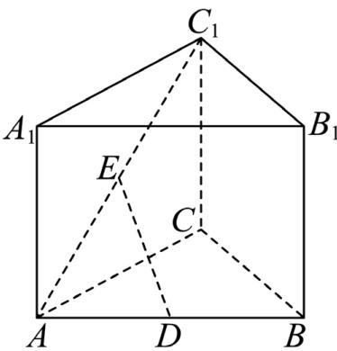

## 题目

样本数据 6，8，4，5，12 的中位数为（ ）

## 选项

A．5
B．6
C．8
D．9

---
qid: 2
source: 2026 年全国 I 卷
number: '2'
type: choice
year: 2026
updatedAt: '1789946799'
knowledge: []
---

## 题目

已知平面向量 �，� 不共线，且 $2 a + y b = x a - 3 b$ ，则（ ）

## 选项

A．$x = 2 , y = - 3$
B．$x = - 2 , y = 3$
C．$x = 2 , y = 3$
D．$x = - 2 , y = - 3$

---
qid: 3
source: 2026 年全国 I 卷
number: '3'
type: choice
year: 2026
updatedAt: '1789946799'
knowledge: []
---

## 题目

已知集合 $A = \left\{ \sin { \frac { 7 \pi } { 6 } } , \cos { \frac { 5 \pi } { 3 } } \right.$ $\tan { \frac { 5 \pi } { 4 } } \Bigg \}$ $B = \left\{ - \frac { \sqrt { 3 } } { 2 } , - \frac { 1 } { 2 } , 1 \right\}$ ，则 $A \cap B = { \left( \begin{array} { l l } { \quad } & { } \end{array} \right) }$

## 选项

A．$\left\{ - { \frac { \sqrt { 3 } } { 2 } } , - { \frac { 1 } { 2 } } \right\}$
B．$\left\{ - { \frac { \sqrt { 3 } } { 2 } } , 1 \right\}$
C．$\left\{ - { \frac { 1 } { 2 } } , 1 \right\}$
D．$\left\{ - { \frac { \sqrt { 3 } } { 2 } } , - { \frac { 1 } { 2 } } , 1 \right\}$

---
qid: 4
source: 2026 年全国 I 卷
number: '4'
type: choice
year: 2026
updatedAt: '1789946799'
knowledge: []
---

## 题目

曲线 $y \ = \ 5 x + 8 \ln x$ 在点 (1, 5) 处的切线方程为（ ）

## 选项

A．$y = 3 x + 2$
B．� = 5�
C．� = 8� − 3
D．$y = 1 3 x - 8$

---
qid: 5
source: 2026 年全国 I 卷
number: '5'
type: choice
year: 2026
updatedAt: '1789946799'
knowledge: []
---

## 题目

已知抛物线 $C _ { 1 } : y ^ { 2 } = 2 p _ { 1 } x ( p _ { 1 } > 0 )$ 和 $C _ { 2 } : x ^ { 2 } = 2 p _ { 2 } y ( p _ { 2 } > 0 )$ 均经过点 (4,8)，则$C _ { 1 }$ 的焦点与 $C _ { 2 }$ 的焦点之间的距离为（ ）

## 选项

A．12
B．$4 { \sqrt { 5 } }$
C．6
D．$\frac { \sqrt { 6 5 } } { 2 }$

---
qid: 6
source: 2026 年全国 I 卷
number: '6'
type: choice
year: 2026
updatedAt: '1789946799'
knowledge: []
---

## 题目

已知函数 $f ( x ) \ = \ { \frac { x + 2 } { \mathrm { e } ^ { x } + a } }$ 的最大值为 1，则 � =（ ）

## 选项

A．$\frac 1 2$
B．1
C．$\frac 3 2$
D．2

---
qid: 7
source: 2026 年全国 I 卷
number: '7'
type: choice
year: 2026
updatedAt: '1789946799'
knowledge: []
---

## 题目

一百零八塔位于宁夏回族自治区青铜峡市，以其独特的建筑格局和深邃的历史文化闻名遐迩. 该塔群共有 108 座塔，依山势自上而下排成 12 行，将第 � 行中塔的座数记为 $a _ { i } \left( i = 1 \right.$ 2，⋯，12），其中 $a _ { 1 } = 1 , a _ { 2 } = a _ { 3 } = 3 , a _ { 4 } = a _ { 5 } = 5$ ，且 $a _ { 6 } , a _ { 7 } , \dotsc , a _ { 1 2 }$ 是一个首项为 7，公差为 2 的等差数列. 将 $a _ { 1 } , a _ { 2 } , \cdots , a _ { 1 2 }$ 分为 6 组，每组 2 个数，使得每组的 2 个数之和可构成一个项数为 6 且公差为 $d \ ( \ d \ > \ 0 )$ 的等差数列，则 � =（ ）

## 选项

A．2
B．4
C．6
D．8

---
qid: 8
source: 2026 年全国 I 卷
number: '8'
type: choice
year: 2026
updatedAt: '1789946799'
knowledge: []
---

## 题目

设 $U ~ = ~ \{ ( x _ { 1 } , x _ { 2 } , x _ { 3 } ) ~ | ~ x _ { i } ~ \in ~ \{ - 2 , - 1 , 1 , 2 \} , i ~ = ~ 1 , 2 , 3 \}$ 为空间中 64 个点构成的集合. 点$P ( 1 , 1 , 1 )$ ，记样本空间 $\Omega = \complement _ { U } \{ P \}$ . 从 Ω 中随机取一个点，定义随机变量 � 如下：对 Ω中的每个点 $A ( x _ { 1 } , x _ { 2 } , x _ { 3 } )$ ，令 $X ( A ) = x _ { 1 } + x _ { 2 } + x _ { 3 }$ ，则 � 的数学期望为（ ）

## 选项

A．$- { \frac { 1 } { 2 1 } }$
B．$- { \frac { 1 } { 6 3 } }$
C．0
D．$\frac { 1 } { 7 }$

---
qid: 9
source: 2026 年全国 I 卷
number: '9'
type: choice
year: 2026
updatedAt: '1789946799'
knowledge: []
---

## 题目

设 $z ~ = ~ 3 + 2 \mathrm { i }$ ， 则 （ ）

## 选项

A．$\overline { { z } } = 3 - 2 \mathrm { i }$
B．|�| = 5
C．$z ^ { 2 } = 5 + 1 2 \mathrm { i }$
D．$\frac { z + 3 } { z - \mathrm { i } } \in \mathbf { R }$

---
qid: 10
source: 2026 年全国 I 卷
number: '10'
type: choice
year: 2026
updatedAt: '1789946799'
knowledge: []
---

## 题目

在空间中，�，� 为两个定点，动点 � 到直线 �� 的距离为 2，动点 � 到直线 �� 的距离为 1，若二面角 $C \mathrm { ~ - ~ } A B \mathrm { ~ - ~ } D$ 为 $6 0 ^ { \circ }$ ，则（ ）

## 选项

A．$\angle C A D \ge 6 0 ^ { \circ }$
B．$C D \geq \sqrt { 3 }$
C．当 $A B \perp C D$ 时， $C D \perp$ 平面���
D．当 $A B \perp$ 平面��� 时， $A C \bot A D$

---
qid: 11
source: 2026 年全国 I 卷
number: '11'
type: choice
year: 2026
updatedAt: '1789946799'
knowledge: []
---

## 题目

已知圆 $C _ { 1 } : ( x + 1 ) ^ { 2 } + y ^ { 2 } = 1$ ，圆 $C _ { 2 } : ( x - 1 ) ^ { 2 } + y ^ { 2 } = 1$ ，圆 $C _ { 3 } : x ^ { 2 } + \left( y - { \sqrt { 3 } } \right) ^ { 2 } = 1$ ，直线$l : y = k x + b$ 与 $C _ { 1 } , C _ { 2 } , C _ { 3 }$ 均有两个交点，记�被 $C _ { 1 } , C _ { 2 } , C _ { 3 }$ 截得弦长分别为 $s _ { 1 } , s _ { 2 } , s _ { 3 }$ ，则（ ）

## 选项

A．� 可以取任意实数
B．满足 $s _ { 1 } = s _ { 2 } = s _ { 3 }$ 的直线� 共有3条
C．满足 $s _ { 1 } + s _ { 2 } + s _ { 3 } = 3$ 的直线� 多于3条
D．当 � = 0 时， $s _ { 1 } + s _ { 2 } + s _ { 3 }$ 的最大值为 $\frac { 2 { \sqrt { 2 1 } } } { 3 }$

---
qid: 12
source: 2026 年全国 I 卷
number: '12'
type: blank
year: 2026
updatedAt: '1789946799'
knowledge: []
---

## 题目

双曲线 $5 x ^ { 2 } - 6 y ^ { 2 } \ = \ 1$ 的离心率为

---
qid: 13
source: 2026 年全国 I 卷
number: '13'
type: blank
year: 2026
updatedAt: '1789946799'
knowledge: []
---

## 题目

已知 $f ( x ) ~ = ~ 2 \sin ( a x + \theta ) ~ ( { a ~ \in ~ { \bf Z } } , ~ 0 ~ \le ~ \theta ~ < ~ 2 \pi )$ 是偶函数，�(�) 在区间 $\left( 0 , { \frac { \pi } { 2 } } \right)$ 单调递增，则 � = $f \left( { \frac { 2 \pi } { 3 } } \right) \ =$

---
qid: 14
source: 2026 年全国 I 卷
number: '14'
type: blank
year: 2026
updatedAt: '1789946799'
knowledge: []
---

## 题目

设实数 � 满足：存在数列 $\{ a _ { n } \}$ ，使得对于任意 $n \in \mathbb { N } ^ { * }$ ，均有 $a _ { 1 } + a _ { 2 } + \cdots + a _ { 3 n } = n ^ { 2 } + n$ ，且$\{ a _ { n } \}$ 中有某连续9项 $a _ { k } , a _ { k + 1 } , \cdots , a _ { k + 8 }$ 是公比为�的等比数列，则�的最大值为

---
qid: 15
source: 2026 年全国 I 卷
number: '15'
type: answer
year: 2026
updatedAt: '1789946799'
knowledge: []
---

## 题目

如图，在直三棱柱 $A B C - A _ { 1 } B _ { 1 } C _ { 1 }$ 中， $\angle A C B = 9 0 ^ { \circ } , A C = B C , D , E$ 分别为 $A B , A C _ { 1 }$ 的中点.（1）证明： $D E / /$ 平面 $B C C _ { 1 } B _ { 1 }$ ;

（2）设 $C C _ { 1 } = 2$ ，直线�� 与平面 $A C C _ { 1 } A _ { 1 }$ 所成的角为 $4 5 ^ { \circ }$ ，求直线�� 到平面 $B C C _ { 1 } B _ { 1 }$ 的距离

第 15 题图

---
qid: 16
source: 2026 年全国 I 卷
number: '16'
type: answer
year: 2026
updatedAt: '1789946799'
knowledge: []
---

## 题目

已知在 $\triangle A B C$ 中，�� = 3， $B C = 2 \sqrt { 3 }$ $\cos B = { \frac { \sqrt { 3 } } { 3 } }$ （1）求 cos �；

（2）设�，� 两点满足：� 在�� 的延长线上， $D E / / B C , A E \perp A C$ . 若 $D E = { \sqrt { 6 } }$ ，求 ��

---
qid: 17
source: 2026 年全国 I 卷
number: '17'
type: answer
year: 2026
updatedAt: '1789946799'
knowledge: []
---

## 题目

设整数 $N \geq 2 .$ . 某同学用一个球进行投篮练习，至多投篮 � 次，当且仅当投中 1 次时或� 次均未投中时，停止练习. 设该同学每次投中的概率为 $p \ ( 0 < p < 1 )$ ），各次投中与否相互独立. 记 � 为停止练习时该同学的投篮次数.

（1）当 $N = 4 , p = { \frac { 1 } { 3 } }$ 时，求 � 的分布列；

（2）设 �，� 均为自然数.

（i） 当 $k \leq N - 1$ 时，求 $P ( X > k )$

（ii）当 $k + m \le N - 1$ 时，证明： $P ( X > k + m \mid X > k ) = P ( X > m )$

---
qid: 18
source: 2026 年全国 I 卷
number: '18'
type: answer
year: 2026
updatedAt: '1789946799'
knowledge: []
---

## 题目

已知椭圆 $C : \frac { x ^ { 2 } } { a ^ { 2 } } + \frac { y ^ { 2 } } { b ^ { 2 } } = 1 ( a > b > 0 )$ ）的左焦点为 $F ( - 1 , 0 )$ ，离心率为 ${ \frac { 1 } { 2 } } .$ .

（1）求� 的方程；

（2）设 � 为坐标原点，过 � 且斜率大于 0 的动直线 � 与 � 交于 �，� 两点，其中 � 在第三象限，直线 �� 与 � 的另一个交点为 �.

（i） 若 $\triangle P Q R$ 的面积是 $\triangle P F O$ 的面积的3倍，求� 的方程；

（ii）求 $\tan \angle P Q R$ 的最小值

---
qid: 19
source: 2026 年全国 I 卷
number: '19'
type: answer
year: 2026
updatedAt: '1789946799'
knowledge: []
---

## 题目

已知函数�(�) 的定义域为 �，且当 $x \ < \ 0$ 时， $f ( x ) ~ = ~ 2 ^ { x }$ . 对任意 $x _ { 0 } ~ \in { \textbf { R } }$ ，定义集合$D ( x _ { 0 } ) \ = \ \{ d \ \in \textbf { R } \ | \ f ( x _ { 0 } + d ) \ > \ f ( x _ { 0 } ) \}$

（1）若当 $x \ge 0$ 时， $, f ( x ) = 1 - x$ ，求 $D ( - 1 )$

（2）若�(�) 是奇函数， $\ b { f } ( \ b { x } _ { 1 } ) \leq \ b { f } ( \ b { x } _ { 2 } )$ ，且 $x _ { 1 } x _ { 2 } \neq 0$ ，证明： $D ( x _ { 2 } ) \subseteq D ( x _ { 1 } )$ ；

（3）设 � (�) 满足：1 若 $f ( x _ { 1 } ) \leq f ( x _ { 2 } )$ ，则 $D ( x _ { 2 } ) \subseteq D ( x _ { 1 } ) ; \mathcal { \textcircled { 2 } }$ 当 $0 < x < 1$ 时， $f ( x ) < f ( 0 )$

（i） 证明： $: f ( 0 ) \geq 1$ ；

（ii）证明： $: f ( x )$ 在区间 $( 0 , + \infty )$ 单调递增
