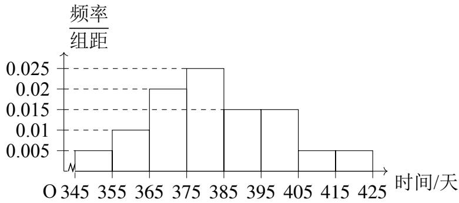
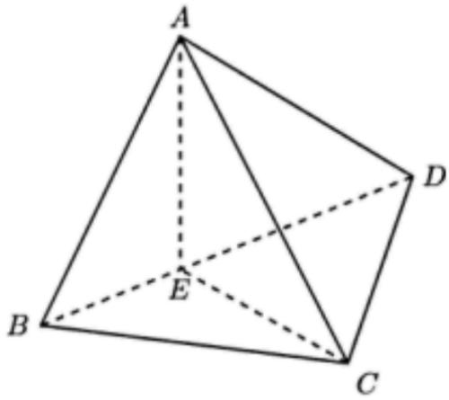

## 题目

$( 1 - 3 \mathrm { i } ) ^ { 2 } = ( \begin{array} { l l l } {  } &  ) \end{array}$

## 选项

A．$- 8 + 6 \mathrm { i }$
B．−8 − 6i
C．8 + 6i
D．8 − 6i

---
qid: 2
source: 2026 年全国 II 卷
number: '2'
type: choice
year: 2026
updatedAt: '1789915071'
knowledge: []
---

## 题目

已知集合 � = {0, 1, 3, 6, 9}， $B \ = \ \{ x \ | \ \sqrt { x } \ = \ x \}$ ，则 $A \cap B = { \left( \begin{array} { l l l } { } & { } & { } \end{array} \right) }$

## 选项

A．{0, 1}
B．{3, 6}
C．{0, 1, 9}
D．{0, 3, 9}

---
qid: 3
source: 2026 年全国 II 卷
number: '3'
type: choice
year: 2026
updatedAt: '1789915071'
knowledge: []
---

## 题目

已知向量 �，� 满足 $| { \pmb a } + { \pmb b } | = 1 , | { \pmb a } - { \pmb b } | = \sqrt { 3 }$ ，则 $\pmb { a } \cdot \pmb { b } = ( \begin{array} { l } { \pmb { \operatorname { \partial } } } \end{array} )$

## 选项

A．$\frac 1 2$
B．$\frac 1 3$
C．$- { \frac { 1 } { 3 } }$
D．$- \frac 1 2$

---
qid: 4
source: 2026 年全国 II 卷
number: '4'
type: choice
year: 2026
updatedAt: '1789915071'
knowledge: []
---

## 题目

设双曲线 $C ~ : ~ \frac { x ^ { 2 } } { a ^ { 2 } } ~ - ~ \frac { y ^ { 2 } } { b ^ { 2 } } ~ = ~ 1 ~ ( a ~ > ~ 0 , ~ b ~ > ~ 0 )$ ）经过点 (1,0) 和点 $\left( { \frac { \sqrt { 7 } } { 2 } } , 3 \right)$ ，则 � 的渐近线方程为 （ ）

## 选项

A．$y = \pm 3 \sqrt { 2 } x$
B．$y = \pm 2 \sqrt { 3 } x$
C．$y = \pm \frac { \sqrt { 3 } } { 6 } x$
D．$y = \pm { \frac { \sqrt { 2 } } { 6 } } x$

---
qid: 5
source: 2026 年全国 II 卷
number: '5'
type: choice
year: 2026
updatedAt: '1789915071'
knowledge: []
---

## 题目

已知棱台的上，下底面均是有一个内角为 $6 0 ^ { \circ }$ 的菱形，上，下底面的边长分别为 2，3，该棱台的高为 $\sqrt { 3 }$ ，则其体积为（ ）

## 选项

A．$\frac { 1 9 } { 1 2 }$
B．$\frac { 1 9 } { 6 }$
C．$\frac { 1 9 } { 4 }$
D．$\frac { 1 9 } { 2 }$

---
qid: 6
source: 2026 年全国 II 卷
number: '6'
type: choice
year: 2026
updatedAt: '1789915071'
knowledge: []
---

## 题目

把甲，乙，丙，丁等 8 位员工分为 �，� 两个技术攻关组，要求每组 4 人，其中甲，乙同组，丙，丁不同组，则分组方案共有（ ）

## 选项

A．10 种
B．12 种
C．16 种
D．24 种

---
qid: 7
source: 2026 年全国 II 卷
number: '7'
type: choice
year: 2026
updatedAt: '1789915071'
knowledge: []
---

## 题目

已知 � 为第二象限角， $3 \sin 2 \alpha \cos \alpha = 8 \sin \alpha \cos 2 \alpha$ ，则 $\frac { 1 + \sin \alpha } { 2 - \cos \alpha } = ($ ）

## 选项

A．$\frac 3 4$
B．$\frac { 3 } { 5 }$
C．$\frac { 1 } { 2 }$
D．$\frac { 5 } { 1 2 }$

---
qid: 8
source: 2026 年全国 II 卷
number: '8'
type: choice
year: 2026
updatedAt: '1789915071'
knowledge: []
---

## 题目

已知�(�) 是定义域为 � 的偶函数， $f \left( x \right) + f \left( x - 2 \right) = 0$ ，且当 $x \in \left[ { \frac { 3 } { 2 } } , 3 \right]$ 时， $f \left( x \right) \ =$ $x ^ { 2 } + a x + b$ ， 则

## 选项

A．$a = - 2 , b = - 3$
B．$a = - 2 , b = 3$
C．$a = - 4 , b = - 3$
D．$a = - 4 , b = 3$

---
qid: 9
source: 2026 年全国 II 卷
number: '9'
type: choice
year: 2026
updatedAt: '1789915071'
knowledge: []
---

## 题目

已知 $\odot O : x ^ { 2 } + y ^ { 2 } = 1 , \odot A : x ^ { 2 } + y ^ { 2 } - 6 x - 8 y + k = 0$ ，则（ ）

## 选项

A．点 � 的坐标为 (−3, −4)
B．当 � = 9 时，⊙� 与 � 轴相切
C．当 � = −11 时，⊙� 与 ⊙� 相切
D．当 $\odot O$ 与 ⊙� 相交时，两个交点所在直线的方程为 $6 x + 8 y - k - 2 = 0$

---
qid: 10
source: 2026 年全国 II 卷
number: '10'
type: choice
year: 2026
updatedAt: '1789915071'
knowledge: []
---

## 题目

设等比数列 $\{ a _ { n } \}$ 的公比 $q \neq 1 , a _ { 1 } > 0 , 2 a _ { 3 } = a _ { 1 } + a _ { 2 }$ ，记其前 � 项和为 $S _ { n }$ ，则（ ）

## 选项

A．$q = - \frac 1 2$
B．$S _ { n } > \frac { 2 a _ { 1 } } { 3 }$
C．$2 S _ { n + 2 } = S _ { n + 1 } + S _ { n }$
D．$\sum _ { k = 1 } ^ { n } S _ { k } > \frac { 2 n a _ { 1 } } { 3 }$

---
qid: 11
source: 2026 年全国 II 卷
number: '11'
type: blank
year: 2026
updatedAt: '1789915071'
knowledge: []
---

## 题目

已知抛物线 $E : y ^ { 2 } = 8 x$ ，斜率为 $k \left( k > 0 \right)$ 的直线 � 经过点 (−1,0)，等边三角形 ��� 的顶点 � 在 � 上，顶点 �，� 均在 � 上. 下列结论正确的有（ ）A. � 的准线方程为 � = −2B.若� 与� 没有公共点，则 $k > \sqrt { 2 }$ C. 若� 与� 的唯一公共点为�，则� 的焦点在直线�� 上D. 若 � = 2，则 $\triangle A B C$ 面积的最小值为 $\frac { \sqrt { 3 } } { 1 5 }$

---
qid: 12
source: 2026 年全国 II 卷
number: '12'
type: blank
year: 2026
updatedAt: '1789915071'
knowledge: []
---

## 题目

记 $S _ { n }$ 为等差数列 $\{ a _ { n } \}$ 的前 � 项和. 若 $a _ { 1 } = - 1 , a _ { 3 } = 5$ ，则 $S _ { 6 } =$

---
qid: 13
source: 2026 年全国 II 卷
number: '13'
type: blank
year: 2026
updatedAt: '1789915071'
knowledge: []
---

## 题目

若函数 $f \left( x \right) = 2 ^ { x } + 2 ^ { 2 - x } - m$ 有两个零点，则 � 的取值范围是

---
qid: 14
source: 2026 年全国 II 卷
number: '14'
type: blank
year: 2026
updatedAt: '1789915071'
knowledge: []
---

## 题目

已知球 � 的体积为 $4 \sqrt { 3 } \pi$ ，�，�，�，� 四点均在球 � 的球面上， $\triangle A B C$ 为等边三角形，$D A = D B = D C = { \sqrt { 2 } }$ ，则 $\triangle A B C$ 的面积为

---
qid: 15
source: 2026 年全国 II 卷
number: '15'
type: answer
year: 2026
updatedAt: '1789915071'
knowledge: []
---

## 题目

从某厂生产的某种电子产品中随机抽取了若干件进行试验，测试它们首次出现故障的时间（单位：天），由试验结果得到如下频率分布直方图：

（1）估计这种电子产品首次出现故障的时间的第一四分位数及中位数（假设数据在组内均匀分布）；

（2）记 $\hat { p }$ 为 1 件这种电子产品首次出现故障的时间小于 365 天的概率的估计值.

（i） 求 ${ \hat { p } } ;$

（ii）该厂向某用户销售 100 件这种电子产品，记� 为这 100 件电子产品中首次出现故障的时间小于365天的件数，假设 $X \sim B \left( 1 0 0 , \hat { p } \right)$ ，求 $E \left( \boldsymbol { X } \right) , D \left( \boldsymbol { X } \right)$

第 15 题图

---
qid: 16
source: 2026 年全国 II 卷
number: '16'
type: answer
year: 2026
updatedAt: '1789915071'
knowledge: []
---

## 题目

如图，三棱锥 �-��� 中，点 � 在 �� 上， $A E \perp C E , A E \perp D E , C D \perp A D$

（1）证明： $C D \perp A B$ ；

（2）若 $D E = 2 , B E = 1 , A E = \sqrt { 2 } , C D = 2 \sqrt { 3 }$ ，求直线�� 与平面��� 所成角的正弦值.

第 16 题图

---
qid: 17
source: 2026 年全国 II 卷
number: '17'
type: answer
year: 2026
updatedAt: '1789915071'
knowledge: []
---

## 题目

在 $\triangle A B C$ 中，已知 $\cos B = { \frac { 3 } { 4 } } , \cos ^ { 2 } \left( A + C \right) + \sin A \sin C = 1$

（1）证明： $\triangle A B C$ 为钝角三角形；

（2）若 $\triangle A B C$ 的面积为 $\frac { \sqrt { 7 } } { 4 }$ ，求 $\triangle A B C$ 的周长.

---
qid: 18
source: 2026 年全国 II 卷
number: '18'
type: answer
year: 2026
updatedAt: '1789915071'
knowledge: []
---

## 题目

已知椭圆 $E \ : \ \frac { x ^ { 2 } } { a ^ { 2 } } + y ^ { 2 } \ = \ 1 ( a > 1 )$ ，过 � 的右焦点且与 � 轴垂直的直线被 � 截得的线段长为 $\sqrt { 2 }$

（1）求� 的离心率；

（2）设�为坐标原点，给定点 $G \left( t , 0 \right) \left( t \neq 0 \right) . A \left( x _ { 0 } , y _ { 0 } \right) \left( y _ { 0 } \neq 0 \right)$ ）为�上的点，过�作�轴的垂线，垂足为�，直线��与直线��的交点为�，当�在�上运动时，点�的轨迹为�.

（i） 求� 的方程；

（ii）当 � 为何值时，� 有对称中心？当 � 有对称中心时，将 � 平移后得到曲线 �′，使得� 为�′ 的对称中心，说明�′ 是什么曲线.

---
qid: 19
source: 2026 年全国 II 卷
number: '19'
type: answer
year: 2026
updatedAt: '1789915071'
knowledge: []
---

## 题目

已知函数 $f \left( x \right) = x \mathbf { e } ^ { x } + a x + b$ ，曲线 $y = f \left( x \right)$ 在点 (0, � (0)) 处的切线方程为 $y = - 2 x + 1$

（1）求 �，�；

（2）当 $x > 0$ 时， $. f \left( x + m \right) - f \left( x \right) > m$ ，求� 的取值范围；

（3）当 $x > 0$ 时， $, f \left( k + x \right) + f \left( k - x \right) > 2 f \left( k \right)$ ，求� 的最小值.
