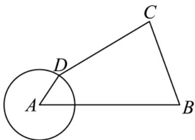
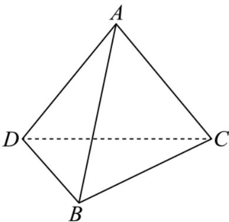
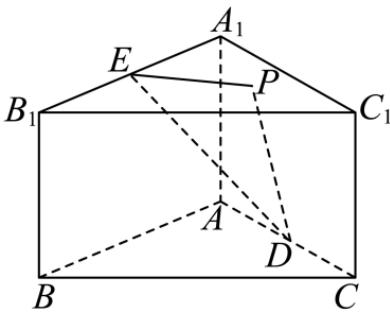

## 题目

已知集合 $M = \{ x \mid - 1 < x < 3 \}$ $N = \{ x \mid x \geq 2 \}$ ，则 $M \cup N = ( \quad )$

## 选项

A．(2, 3)
B．$( - 1 , + \infty )$
C．[2, 3)
D．(−1, 2]

---
qid: 2
source: 2026 年北京卷
number: '2'
type: choice
year: 2026
updatedAt: '1789946799'
knowledge: []
---

## 题目

已知 $z _ { 1 } = 3 - 2 \mathrm { i } , \ z _ { 2 } = - 1 + 4 \mathrm { i }$ ，则 $\left| z _ { 1 } + z _ { 2 } \right| = ( \begin{array} { c c } { { } } & { { } } \end{array} )$

## 选项

A．$2 \sqrt { 2 }$
B．i
C．2
D．8

---
qid: 3
source: 2026 年北京卷
number: '3'
type: choice
year: 2026
updatedAt: '1789946799'
knowledge: []
---

## 题目

已知双曲线 $C : \frac { x ^ { 2 } } { a ^ { 2 } } - \frac { y ^ { 2 } } { 4 } = 1 ( a > 0 )$ ）的渐近线方程为 $y = \pm { \frac { 2 } { 3 } } x$ ，则 � 的值为（ ）

## 选项

A．2
B．3
C．4
D．9

---
qid: 4
source: 2026 年北京卷
number: '4'
type: choice
year: 2026
updatedAt: '1789946799'
knowledge: []
---

## 题目

已知 $\left( a - { \sqrt { x } } \right) ^ { 7 }$ 的展开式中的 $x ^ { 2 }$ 的系数是 280，则 � =（ ）

## 选项

A．2
B．−2
C．1
D．−1

---
qid: 5
source: 2026 年北京卷
number: '5'
type: choice
year: 2026
updatedAt: '1789946799'
knowledge: []
---

## 题目

下列函数�(�) 是奇函数且在定义域上单调递增的是（ ）

## 选项

A．$f ( x ) = { \frac { 1 } { x ^ { 2 } + 1 } }$
B．$f ( x ) = \sin { x }$
C．$f ( x ) = 2 ^ { - x } - 2 ^ { x }$
D．$f ( x ) = \ln { \frac { 5 + x } { 5 - x } }$

---
qid: 6
source: 2026 年北京卷
number: '6'
type: choice
year: 2026
updatedAt: '1789946799'
knowledge: []
---

## 题目

已知向量 �，� 满足 $| \pmb { a } - \pmb { b } | = 2 , \pmb { a } = ( 2 , 0 )$ ，则 $| b |$ 的最大值为（ ）

## 选项

A．1
B．2
C．3
D．4

---
qid: 7
source: 2026 年北京卷
number: '7'
type: choice
year: 2026
updatedAt: '1789946799'
knowledge: []
---

## 题目

$\left\{ a _ { n } \right\} , \quad \left\{ b _ { n } \right\}$ 是无穷数列，则“存在常数 �，使 $a _ { n } ~ \leq ~ M ~ \leq ~ b _ { n } ~ ( n ~ = ~ 1 , ~ 2 , ~ 3 , ~ \ldots ) ^ { \cdots }$ 是$^ { ^ { \scriptscriptstyle 4 } } a _ { n } \ \le \ b _ { n } \ ( n \ = \ 1 , \ 2 , \ 3 , \ \ldots ) ^ { , }$ 的（ ）

## 选项

A．充分不必要条件
B．必要不充分条件
C．充要条件
D．既不充分也不必要条件

---
qid: 8
source: 2026 年北京卷
number: '8'
type: choice
year: 2026
updatedAt: '1789946799'
knowledge: []
---

## 题目

$f ( x ) = \sin { ( x + \varphi ) } ( 0 < \varphi < 2 \pi )$ ），将 $f ( x )$ 向 � 轴正方向平移 3� 个单位，得到的函数图像与�(�) 图像关于 � 轴对称，则 � 的取值个数为（ ）

## 选项

A．1
B．2
C．3
D．4

---
qid: 9
source: 2026 年北京卷
number: '9'
type: choice
year: 2026
updatedAt: '1789946799'
knowledge: []
---

## 题目

学校组织高一，高二学生参观甲，乙两地博物馆，每位学生可自主选择一处前往. 已知高一学生总人数多于高二学生总人数，前往甲地的全体学生总数多于前往乙地的全体学生总数， 则 （ ）

## 选项

A．去甲地的高一学生人数多于去乙地的高一学生人数
B．去甲地的高一学生人数多于去乙地的高二学生人数
C．去甲地的高一学生人数不多于去乙地的高二学生人数
D．去乙地的高二学生人数不少于去甲地的高二学生人数

---
qid: 10
source: 2026 年北京卷
number: '10'
type: choice
year: 2026
updatedAt: '1789946799'
knowledge: []
---

## 题目

摇杆机械装置，如图，�，� 为定点，�，� 是动点， $A D = 1 , C D = 3 , B C = { \frac { 5 } { 2 } } , A B = 4$ 则 $\cos \angle A B C$ 的取值范围（ ）

第 10 题图

## 选项

A．$\left[ \frac { 5 } { 1 6 } , \frac { 7 3 } { 8 0 } \right]$
B．$\left[ - \frac { 5 } { 1 6 } , \frac { 7 3 } { 8 0 } \right]$
C．$\left[ \frac { 5 } { 1 6 } , 1 \right]$
D．$\left[ { \frac { 5 } { 1 6 } } , { \frac { 7 3 } { 8 0 } } \right)$

---
qid: 11
source: 2026 年北京卷
number: '11'
type: blank
year: 2026
updatedAt: '1789946799'
knowledge: []
---

## 题目

已知直线 $a x + y = 0$ 与圆 $\ ( x - 2 ) ^ { 2 } + \left( y - 2 \right) ^ { 2 } = 4$ 相切，则 � =

---
qid: 12
source: 2026 年北京卷
number: '12'
type: blank
year: 2026
updatedAt: '1789946799'
knowledge: []
---

## 题目

已知等差数列 $\left\{ a _ { n } \right\}$ 的前 � 项和为 $S _ { n }$ ，且 $S _ { 6 } = 6 a _ { 6 } + 3 0$ ，则公差 � = ，若 $S _ { n } \leq S _ { 5 }$ 恒成立，则符合条件的 $a _ { 1 }$ 的一个取值为

---
qid: 13
source: 2026 年北京卷
number: '13'
type: blank
year: 2026
updatedAt: '1789946799'
knowledge: []
---

## 题目

音高 �（单位：mel）与频率 �（单位：Hz）满足 $y = \log \left( 1 + { \frac { f } { 7 0 0 } } \right)$ ，若 $\lg 2 \ \leq \ y \ < \ 3 \lg 2$ 则 � 的取值范围为

---
qid: 14
source: 2026 年北京卷
number: '14'
type: blank
year: 2026
updatedAt: '1789946799'
knowledge: []
---

## 题目

已知三棱锥 $A - B C D , A D \ = A B \ = A C \ = \ 2 { \sqrt { 2 } } , \ B D \ = \ B C \ = \ 2 , \ D C \ = \ 2 { \sqrt { 3 } }$ ，则它的底面��� 的面积为 ，体积为

第 14 题图

---
qid: 15
source: 2026 年北京卷
number: '15'
type: blank
year: 2026
updatedAt: '1789946799'
knowledge: []
---

## 题目

已知 $f ( x ) \ = \ \left| x ^ { 2 } - \cos x - c ^ { 2 } \right|$ ，给出下列四个结论：

1 �(�) 在 (−1, 1] 上有最小值和最大值 2 $c = 0 , f ( x ) = 1$ 有 3 个解

3 $c = 1 , x \in ( - 1 , 2 ]$ 时，� (�) 有最大值 4 $c > 0 , f ( x )$ 与 � = � 有 4 个交点

其中正确结论的序号是

---
qid: 16
source: 2026 年北京卷
number: '16'
type: answer
year: 2026
updatedAt: '1789946799'
knowledge: []
---

## 题目

已知函数 $f ( x ) ~ = ~ 2 \sin \omega x \cos \varphi + 2 \cos \omega x \sin \varphi , ~ \omega ~ > ~ 0 , ~ | \varphi | < ~ { \frac { \pi } { 2 } } , ~ f ( x )$ 最小正周期为 π，且 $f ( 0 ) ~ > ~ 0 , ~ f \left( \frac { \pi } { 4 } \right) ~ = ~ 1$

（1）求 �，� 的值；

（2）求 � (�) 的单调递减区间.

---
qid: 17
source: 2026 年北京卷
number: '17'
type: answer
year: 2026
updatedAt: '1789946799'
knowledge: []
---

## 题目

现从全校学生中随机抽取 200 人统计数学成绩，成绩分组及对应人数如下：

成绩分组

[81,94)

[94,107)

[107,120)

[120,135)

[135,150]

人数

40

60

60

32

8

以频率估计概率，完成下列问题：

（1）求数学成绩低于120分的概率；

（2）从学校随机抽取4人，求2人不低于120且2人小于94的概率；

（3）每组数据取左端，中间，右端，比较 $s _ { \mathrm { Z } } ^ { 2 } , s _ { \mathrm { \ell } } ^ { 2 } , s _ { \mathrm { \ell } } ^ { 2 }$ 的大小关系.

---
qid: 18
source: 2026 年北京卷
number: '18'
type: answer
year: 2026
updatedAt: '1789946799'
knowledge: []
---

## 题目

已知直三棱柱 $A B C \ - \ A _ { 1 } B _ { 1 } C _ { 1 } , \angle B A C \ = \ 9 0 ^ { \circ } , A B \ = \ A C \ = \ 2 , B B _ { 1 } \ = \ \sqrt { 2 } , E , D$ 分别为 $A _ { 1 } B _ { 1 }$ ， �� 的中点.

（1）证明： $D E / /$ 平面 $B B _ { 1 } C _ { 1 } C$ ；

（2）点� 在平面 $A _ { 1 } B _ { 1 } C _ { 1 }$ 内，且 $E P / / B _ { 1 } C _ { 1 }$ ，再从条件 1 ，条件 2 ，条件 3 这三个条件中选择一个作为已知，使得� 唯一确定，求平面��� 与平面��� 的夹角的余弦值.

条件 $\textcircled { 1 } : P A = P D$ ；

条件 2 ： $P A \perp B C$

条件 3 ： $B B _ { 1 } / / \Sigma \bar { \Psi }$ 面 ���.

第 18 题图

---
qid: 19
source: 2026 年北京卷
number: '19'
type: answer
year: 2026
updatedAt: '1789946799'
knowledge: []
---

## 题目

已知椭圆 $E : \frac { x ^ { 2 } } { a ^ { 2 } } + \frac { y ^ { 2 } } { b ^ { 2 } } = 1 ( a > b > 0 )$ 的一个顶点是 (2,0)，离心率为 ${ \frac { 1 } { 2 } } .$

（1）求� 的方程；

（2）过点 � (1, 1)，斜率为 $k ( k \neq \pm 1 )$ 的直线交椭圆 � 于�，� 两点，� 关于 $y = x$ 的对称点为 �，�� 交 � = � 于 �，若 $\left| S _ { \triangle A B Q } - S _ { \triangle A C Q } \right| = \frac { 5 } { 8 } \mathrm { \Omega }$ ，求 �.

---
qid: 20
source: 2026 年北京卷
number: '20'
type: answer
year: 2026
updatedAt: '1789946799'
knowledge: []
---

## 题目

设函数 $f ( x ) \ = \ x ^ { 2 } + m x - 4 \mathrm { e } ^ { n x - 1 } \ ( n \in { \bf Z } )$ ），曲线 $y \ = \ f ( x )$ 在点 $\left( - 1 , f ( - 1 ) \right)$ 处的切线方程为 $ 4 x + { \mathrm { e } } ^ { 2 } y + { \mathrm { e } } ^ { 2 } + 8 = 0 .$

（1）求�，�的值；

（2）求 � (�) 的极值点个数；

（3）求 $y = k x - 1 ( k > 0 )$ 与 � (�) 交点个数.

---
qid: 21
source: 2026 年北京卷
number: '21'
type: answer
year: 2026
updatedAt: '1789946799'
knowledge: []
---

## 题目

设 $A = \left( a _ { i j } \right) _ { m \times n }$ 是一个 � 行 � 列的数阵，且数阵中的每一项 $a _ { i j } \in \{ - 1 , 1 \}$ ，都等于 1 或 −1.若对任意 $1 \leq i , p \leq m , 1 \leq j , q \leq n$ ，其中 $i \neq p , j$ ≠ �，且 $\left\| i - p \right\| - \left. j - q \right\| = 2$ ，都有 $a _ { i j } + a _ { i q } + a _ { p j } + a _ { p q } = 0$ ，则称数阵 � 具有性质 �.

（1）判断下列两个数表是否具有性质 $P :$

$$
A _ { 1 } = { \frac { \left[ \begin{array} { l } { 1 } \\ { - 1 } \\ { - 1 } \end{array} \right] \quad 1 \quad - 1 \quad 1 } { 1 } } \quad A _ { 2 } = { \frac { \left[ \begin{array} { l } { 1 } \\ { 1 } \end{array} \right] \quad 1 \quad - 1 \quad - 1 } { 1 \quad 1 \quad 1 \quad - 1 } } \quad
$$

（2）在所有具有性质� 的 $5 \times 4$ 数阵中，1的个数最多是多少？

（3）若 $m = n = 6 , a _ { 1 1 } = 1$ ，且数阵� 具有性质 �，证明：对任意 $i , j \in \{ 1 , 2 , 3 , 4 , 5 , 6 \}$ ，都有$a _ { i j } = a _ { i 1 } a _ { 1 j }$
