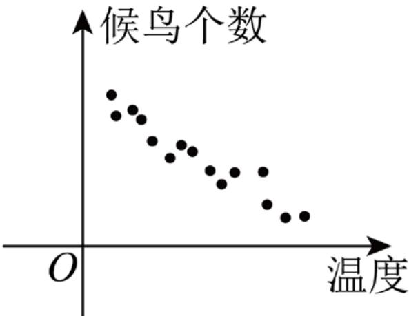
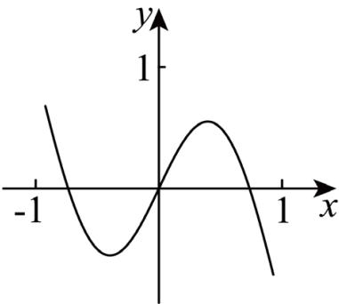
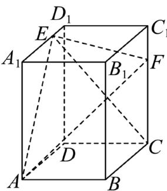

## 题目

已知全集 $U ~ = ~ \{ - 2 , - 1 , 0 , 1 , 2 , 3 \}$ ， 集合 $\begin{array} { r c l } { A } & { = } & { \{ - 1 , 0 , 1 , 3 \} } \end{array}$ ， 集合 $B ~ = ~ \{ - 2 , 0 , 1 \}$ ， 则$( \complement _ { U } A ) \cup B = ( )$

## 选项

A．{−2}
B．{−2, 2}
C．{0, 1, 2}
D．{−2, 0, 1, 2}

---
qid: 2
source: 2026 年天津卷
number: '2'
type: choice
year: 2026
updatedAt: '1789946799'
knowledge: []
---

## 题目

设 $x \in \textbf { R }$ ，则 $^ { 6 6 } x > 0 ^ { 9 }$ 是 $^ {  } x ^ { 2 } + 3 x > 0 ^ { \ ' }$ 的（ ）

## 选项

A．充分而不必要条件
B．必要而不充分条件
C．充分必要条件
D．既不充分也不必要条件

---
qid: 3
source: 2026 年天津卷
number: '3'
type: blank
year: 2026
updatedAt: '1789946799'
knowledge: []
---

## 题目

调查候鸟和温度的关系，在不同温度下统计候鸟的数量，所得数据如图所示，其中相关系数$r = - 0 . 9 1$ ，根据最小二乘法算得： $\hat { y } = - 1 . 1 7 x + 1 3 7 0 . 7$ ，下列说法正确的是（ ）

第 3 题图

A. � 与 � 负相关 B. 当 � = 10 时，� 一定为 1359C. 当 � = 10 时，� 一定小于 1359 D. 两变量无线性关系

---
qid: 4
source: 2026 年天津卷
number: '4'
type: choice
year: 2026
updatedAt: '1789946799'
knowledge: []
---

## 题目

函数�(�) 的部分图象如图所示，则�(�) 的解析式可能为（ ）

第4 题图

## 选项

A．$x + \sin \pi x$
B．$x - \sin \pi x$
C．$- x + \sin { \pi x }$
D．� ⋅ sin π�

---
qid: 5
source: 2026 年天津卷
number: '5'
type: choice
year: 2026
updatedAt: '1789946799'
knowledge: []
---

## 题目

正方体 $A B C D - A _ { 1 } B _ { 1 } C _ { 1 } D _ { 1 }$ 中，错误的是（ ）

## 选项

A．$A C / / A _ { 1 } C _ { 1 }$
B．$C C _ { 1 } \perp$ 面���
C．$A C D _ { 1 } / / \overline { { \mathbb { H } } } A _ { 1 } C _ { 1 } B$
D．$A D D _ { 1 } \perp$ 面 $A C D _ { 1 }$

---
qid: 6
source: 2026 年天津卷
number: '6'
type: choice
year: 2026
updatedAt: '1789946799'
knowledge: []
---

## 题目

已知函数 $f ( x ) = | \ln x |$ ，若 $a = f \left( 2 ^ { 0 . 3 } \right) , b = f \left( 3 ^ { 0 . 3 } \right) , c = f \left( 3 ^ { - 0 . 5 } \right)$ ，则 $a , b , c$ 的大小关系为（ ）

## 选项

A．$a < b < c$
B．$b < a < c$
C．$c < b < a$
D．$c < a < b$

---
qid: 7
source: 2026 年天津卷
number: '7'
type: choice
year: 2026
updatedAt: '1789946799'
knowledge: []
---

## 题目

$\left( x + { \frac { 1 } { x } } \right) \left( x + { \frac { 4 } { x } } \right)$ 的最小值为（ ）

## 选项

A．10
B．9
C．8
D．6

---
qid: 8
source: 2026 年天津卷
number: '8'
type: choice
year: 2026
updatedAt: '1789946799'
knowledge: []
---

## 题目

已知 $S _ { 2 n } - S _ { n } \ = \ n , \ a _ { 3 } \ = \ 6$ ，则 $a _ { 7 } + a _ { 8 } = ( )$

## 选项

A．68
B．56
C．−3
D．−4

---
qid: 9
source: 2026 年天津卷
number: '9'
type: choice
year: 2026
updatedAt: '1789946799'
knowledge: []
---

## 题目

已知双曲线 ${ \frac { x ^ { 2 } } { a ^ { 2 } } } - { \frac { y ^ { 2 } } { b ^ { 2 } } } = 1 ( a > 0 , b > 0 )$ ）的左焦点为 �，� 是右顶点，� 是双曲线上一点，满足 $| F A | = | F P | , \angle F A P = 3 0 ^ { \circ }$ ，则双曲线离心率为（ ）

## 选项

A．4
B．$\frac { 8 } { 3 }$
C．$\frac { 8 } { 5 }$
D．$\frac 4 3$

---
qid: 10
source: 2026 年天津卷
number: '10'
type: blank
year: 2026
updatedAt: '1789946799'
knowledge: []
---

## 题目

化简 $( 3 + \mathrm { i } ) ^ { 2 } =$

---
qid: 11
source: 2026 年天津卷
number: '11'
type: blank
year: 2026
updatedAt: '1789946799'
knowledge: []
---

## 题目

$( x + 2 y ) ^ { 4 }$ 展开式中 $x ^ { 3 } y$ 的系数为

---
qid: 12
source: 2026 年天津卷
number: '12'
type: blank
year: 2026
updatedAt: '1789946799'
knowledge: []
---

## 题目

在 $\triangle A B C$ 中， $B C = 4 , A C = 3 , \cos A = - { \frac { 1 } { 4 } }$ ，则 $\sin B =$

---
qid: 13
source: 2026 年天津卷
number: '13'
type: blank
year: 2026
updatedAt: '1789946799'
knowledge: []
---

## 题目

箱子里有一个红球，两个黄球，三个白球，有放回的取三次，三次都没取到黄球的概率是 ；在三次都没取到黄球的条件下，至少取到一次红球的概率是

---
qid: 14
source: 2026 年天津卷
number: '14'
type: blank
year: 2026
updatedAt: '1789946799'
knowledge: []
---

## 题目

已知 $| \pmb { a } | = \pmb { a } \cdot \pmb { b } = 1 , | \pmb { b } | > 1$ ，记 ${ \pmb { c } } = \lambda { \pmb { a } } + \mu { \pmb { b } }$ . 当 $\pmb { a } + \pmb { b } - \pmb { c } = 0$ 时， $\lambda + \mu =$ 当 $| { \pmb a } + { \pmb b } - { \pmb c } | = 1$ 时， $\lambda + \mu$ 的取值范围为

---
qid: 15
source: 2026 年天津卷
number: '15'
type: blank
year: 2026
updatedAt: '1789946799'
knowledge: []
---

## 题目

在平面内，� 为坐标原点，抛物线 $y ^ { 2 } = 2 x$ 上有 �，�，�，� 四个点，�，�，�，� 的纵坐标分别为 $y _ { A } , y _ { B } , y _ { C } , y _ { D }$ ，直线 �� 与直线 �� 交 � 轴于点 �，直线 �� 交 � 轴于点 �，直线 �� 交 � 轴于点 �，以下说法正确的有

1 若� 与抛物线焦点重合，则 $y _ { A } y _ { B } = - 2$ 2 $y _ { A } y _ { B } = y _ { C } y _ { D } ;$

3 $\vert O M \vert \vert O N \vert = 2 \vert O P \vert ^ { 2 }$ ； 4 $\left| y _ { A } - y _ { C } \right| \left| O P \right| = \left| y _ { B } - y _ { D } \right| \left| O M \right|$

5 ${ \frac { S _ { \triangle A C P } } { S _ { \triangle B D P } } } = \left( { \frac { | O M | } { | O N | } } \right) ^ { 2 }$

---
qid: 16
source: 2026 年天津卷
number: '16'
type: answer
year: 2026
updatedAt: '1789946799'
knowledge: []
---

## 题目

已知 $f ( x ) = \sin \left( 2 x + { \frac { \pi } { 6 } } \right)$

（1）求最小正周期；

（2）若 $x \in \left[ - { \frac { \pi } { 6 } } , { \frac { \pi } { 1 2 } } \right]$ ，求�(�)的最大值和最小值；

（3）若 $\alpha \in \left( 0 , { \frac { \pi } { 2 } } \right) , \sin \alpha = { \frac { \sqrt { 3 } } { 3 } }$ ，求 $f ( \alpha )$

---
qid: 17
source: 2026 年天津卷
number: '17'
type: answer
year: 2026
updatedAt: '1789946799'
knowledge: []
---

## 题目

在长方体 $A B C D - A _ { 1 } B _ { 1 } C _ { 1 } D _ { 1 } \ \forall \mathrm { ~ } \forall \mathrm { ~ } A B = 2 , A A _ { 1 } = 3 , A D = 4 , A _ { 1 } E = 3 E D _ { 1 } , 2 C _ { 1 } F = F C .$

（1）求证：�� ⟂ 面���；

（2）求面��� 与面��� 的夹角的余弦值；

（3）求三棱锥�−��� 的体积.

第 17 题图

---
qid: 18
source: 2026 年天津卷
number: '18'
type: answer
year: 2026
updatedAt: '1789946799'
knowledge: []
---

## 题目

已知椭圆 $C : \frac { x ^ { 2 } } { a ^ { 2 } } + \frac { y ^ { 2 } } { b ^ { 2 } } = 1 ( a > b > 0 )$ ）的离心率为 $\frac { 1 } { 2 }$ ，椭圆被直线� = �截得的线段长为 ${ \sqrt { 3 } } .$ （1）求� 的标准方程；

（2）斜率为 $- \sqrt { 3 }$ 的直线与圆 $x ^ { 2 } + y ^ { 2 } = b ^ { 2 }$ 相切，且该直线交椭圆于 $P ( x _ { 1 } , y _ { 1 } ) , \ Q ( x _ { 2 } , y _ { 2 } )$ $( y _ { 1 } < y _ { 2 } ) , A$ 是椭圆的上顶点. 记直线 $A P , A Q$ 的斜率分别为 $k _ { 1 } , k _ { 2 }$ ，求 $\frac { k _ { 1 } } { k _ { 2 } }$ .

---
qid: 19
source: 2026 年天津卷
number: '19'
type: answer
year: 2026
updatedAt: '1789946799'
knowledge: []
---

## 题目

已知等差数列 $\{ a _ { n } \}$ 与等比数列 $\{ b _ { n } \}$ 满足： $a _ { 1 } = 2 , b _ { 1 } = 1 , a _ { 2 } = b _ { 1 } + b _ { 2 } , a _ { 4 } = b _ { 3 } - b _ { 1 }$

（1）求数列 $\{ a _ { n } \} , \{ b _ { n } \}$ 的通项公式；

（2）记 $E _ { n } = \left\{ x \in \mathbf { R } \mid x \leq n , \ \exists k \in \mathbb { N } ^ { * } , \ x = a _ { k } \right.$ 或 $x = b _ { k } { \big \} }$ ，记 $c _ { n }$ 为 $E _ { n }$ 中的元素个数.

（i） 求 $c _ { 3 ^ { n } }$

（ii）求 $\sum _ { m = 1 } ^ { 3 ^ { n } - 1 } ( - 1 ) ^ { m } \cdot a _ { m } \cdot c _ { m } .$

---
qid: 20
source: 2026 年天津卷
number: '20'
type: answer
year: 2026
updatedAt: '1789946799'
knowledge: []
---

## 题目

已知 $f ( x ) = \mathbf { e } ^ { x } - \frac { 2 } { 3 } \sin x .$

（1）求曲线 $y = f ( x )$ 在点 $\left( 0 , f ( 0 ) \right)$ 处的切线方程；

（2）当 $x \in \left[ - { \frac { 1 } { 3 } } , + \infty \right)$ 时，证明 $f ( x ) \geq 1 + { \frac { x } { 3 } } ,$

（3）求实数�的最大可能值，使得 $f \left( { \frac { 1 } { 1 } } \right) \cdot f \left( { \frac { 1 } { 2 } } \right) \cdot f \left( { \frac { 1 } { 3 } } \right) \cdots f \left( { \frac { 1 } { n } } \right) \geq ( n + 1 ) ^ { a }$ 对任意的 $n \in \mathbb { N } ^ { * }$ 都成立.
