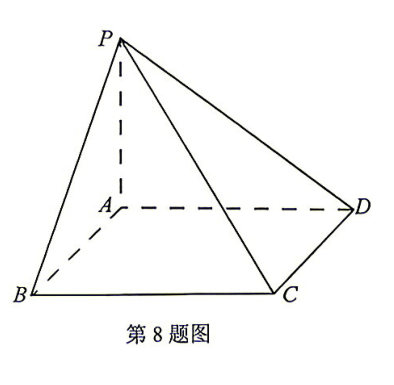
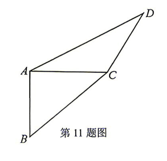
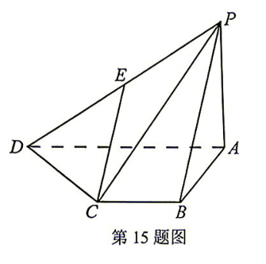

## 题目

已知复数 $z=-2-\mathrm{i}$，则 $|z|$ 为

## 选项

A．$1$
B．$2$
C．$\sqrt{5}$
D．$5$

## 答案

C

---
qid: 2
source: Z20名校联盟2027届高三第一次学情诊断数学试题
number: '2'
type: choice
year: 2027
updatedAt: '1789914442'
knowledge: []
---

## 题目

已知 $A$，$B$，$C$ 是同一平面内的不同的三点，且 $\overrightarrow{AB}=2\overrightarrow{CB}$，若 $\overrightarrow{AC}=\lambda\overrightarrow{BC}$，则 $\lambda=$

## 选项

A．$-1$
B．$-3$
C．$1$
D．$3$

## 答案

A

---
qid: 3
source: Z20名校联盟2027届高三第一次学情诊断数学试题
number: '3'
type: choice
year: 2027
updatedAt: '1789914442'
knowledge: []
---

## 题目

若以点 $(\sin \theta,\ \cos \theta)$，$(\cos \theta,\ \sin \theta)$，$(\tan \theta,\ 1)$ 为元素构成的集合 $M$ 有 4 个子集，则 $\theta$ 可以是

## 选项

A．$\dfrac{\pi}{6}$
B．$\dfrac{\pi}{4}$
C．$\dfrac{\pi}{3}$
D．$\dfrac{5}{12}\pi$

## 答案

B

---
qid: 4
source: Z20名校联盟2027届高三第一次学情诊断数学试题
number: '4'
type: choice
year: 2027
updatedAt: '1789914442'
knowledge: []
---

## 题目

已知数列 $\{a_n\}$ 满足：$a_1=5$，$a_{n+1}=\begin{cases}\dfrac{a_n}{2}, & a_n \text{ 为偶数}, \\[6pt] 3a_n+1, & a_n \text{ 为奇数}.\end{cases}$ 则 $a_{10}=$

## 选项

A．$8$
B．$4$
C．$2$
D．$1$

## 答案

B

---
qid: 5
source: Z20名校联盟2027届高三第一次学情诊断数学试题
number: '5'
type: choice
year: 2027
updatedAt: '1789914442'
knowledge: []
---

## 题目

已知两个线性相关变量 $x$，$y$ 的统计数据如下表所示，其经验回归方程为 $\hat{y}=5x+5$，则下列说法正确的是

| $x$ | $1$ | $2$ | $4$ | $5$ | $8$ |
| :---: | :---: | :---: | :---: | :---: | :---: |
| $y$ | $11$ | $15$ | $25$ | $m$ | $45$ |

## 选项

A．$m=30$
B．样本相关系数 $r<0$
C．经验回归直线必过点 $(4,\ 25)$
D．当 $x=5$ 时，残差为 $1$

## 答案

C

---
qid: 6
source: Z20名校联盟2027届高三第一次学情诊断数学试题
number: '6'
type: choice
year: 2027
updatedAt: '1789914442'
knowledge: []
---

## 题目

已知抛物线 $C:y^2=2px\ (p>0)$ 的焦点为 $F$，准线 $l$ 与 $x$ 轴的交点为 $B$，过抛物线上一点 $A$ 作准线 $l$ 的垂线，垂足为 $H$，若 $HF$ 为线段 $AB$ 的中垂线，且 $|AB|=4\sqrt{2}$，则 $p=$

## 选项

A．$1$
B．$2$
C．$4$
D．$8$

## 答案

C

---
qid: 7
source: Z20名校联盟2027届高三第一次学情诊断数学试题
number: '7'
type: choice
year: 2027
updatedAt: '1789914442'
knowledge: []
---

## 题目

已知函数 $f(x)=x+\dfrac{1}{x}-2$，$g(x)=\mathrm{e}^x+\dfrac{a}{x}\ (a \in \mathbf{R})$，若曲线 $y=f(x)$ 上存在点 $P$，使得点 $P$ 关于 $y$ 轴的对称点在曲线 $y=g(x)$ 上，则 $a$ 的最大值为

## 选项

A．$-\dfrac{1}{\mathrm{e}}$
B．$-1$
C．$\dfrac{1}{\mathrm{e}}$
D．$1$

## 答案

C

---
qid: 8
source: Z20名校联盟2027届高三第一次学情诊断数学试题
number: '8'
type: choice
year: 2027
updatedAt: '1789914442'
knowledge: []
---

## 题目

现有红、黄、蓝、白 4 种颜色的颜料可供使用，给四棱锥 $P-ABCD$（如图）的各侧面及底面涂上颜色，要求相邻（有一条公共边）的两面不同色，则恰有两个面涂了红色的概率为

## 选项

A．$\dfrac{1}{12}$
B．$\dfrac{1}{6}$
C．$\dfrac{1}{4}$
D．$\dfrac{1}{3}$

## 答案

D

---
qid: 9
source: Z20名校联盟2027届高三第一次学情诊断数学试题
number: '9'
type: multi
year: 2027
updatedAt: '1789914442'
knowledge: []
---

## 题目

已知 $\left(2x-\dfrac{1}{\sqrt{x}}\right)^n$ 的展开式共有 6 项，则

## 选项

A．$n=5$
B．展开式的二项式系数之和为 $32$
C．展开式中存在常数项
D．展开式的各项系数之和为 $1$

## 答案

ABD

---
qid: 10
source: Z20名校联盟2027届高三第一次学情诊断数学试题
number: '10'
type: multi
year: 2027
updatedAt: '1789914442'
knowledge: []
---

## 题目

已知点 $P$ 为圆 $C:(x-a)^2+(y-a)^2=1$ 上的一个点，点 $A(1,\ 0)$，$B(4,\ 0)$，则

## 选项

A．过点 $A$ 一定存在两条直线与圆 $C$ 相切
B．存在实数 $a$，使得 $|PB|=2$
C．存在实数 $a$，使得 $\overrightarrow{PA}\cdot\overrightarrow{PB}=0$
D．存在实数 $a$，使得 $|PA|=2|PB|$

## 答案

BC

---
qid: 11
source: Z20名校联盟2027届高三第一次学情诊断数学试题
number: '11'
type: multi
year: 2027
updatedAt: '1789914442'
knowledge: []
---

## 题目

如图，在平面四边形 $ABCD$ 中，$AB=AC=CD=1$，$\angle ADC=30^\circ$，$\angle DAB=120^\circ$，将 $\triangle ACD$ 沿对角线 $AC$ 翻折至 $\triangle ACP$，在翻折过程中，

## 选项

A．存在某个位置，使得 $AP \perp BC$
B．存在某个位置，使得平面 $PBC \perp$ 平面 $ABC$
C．存在某个位置，使得点 $B$ 到直线 $PC$ 的距离为 $1$
D．当三棱锥 $P-ABC$ 体积最大时，该三棱锥的外接球表面积为 $5\pi$

## 答案

BCD

---
qid: 12
source: Z20名校联盟2027届高三第一次学情诊断数学试题
number: '12'
type: blank
year: 2027
updatedAt: '1789914442'
knowledge: []
---

## 题目

双曲线 $x^2-2y^2=1$ 的焦距为 $\underline{\quad\blacktriangle\quad}$．

## 答案

$\sqrt{6}$

---
qid: 13
source: Z20名校联盟2027届高三第一次学情诊断数学试题
number: '13'
type: blank
year: 2027
updatedAt: '1789914442'
knowledge: []
---

## 题目

已知函数 $f(x)=\sin 2x-\sqrt{3}\cos 2x$，实数 $x_1$，$x_2$ 满足 $x_1x_2<0$，$f(x_1)+f(x_2)=0$．若 $|x_1-x_2|>m$ 恒成立，则实数 $m$ 的最大值为 $\underline{\quad\blacktriangle\quad}$．

## 答案

$\dfrac{\pi}{3}$

---
qid: 14
source: Z20名校联盟2027届高三第一次学情诊断数学试题
number: '14'
type: blank
year: 2027
updatedAt: '1789914442'
knowledge: []
---

## 题目

已知数列 $\{a_n\}$，$\{b_n\}$ 的通项公式分别为 $a_n=2n-1$，$b_n=2^{n-1}$，数列 $\{c_n\}$ 满足 $c_{2k-1}=a_k$，$c_{2k}=b_k\ (k \in \mathbf{N}^*)$，记 $S_n$ 为数列 $\{c_n\}$ 前 $n$ 项和，则使得 $\dfrac{S_n}{S_{n+1}}>\dfrac{100}{101}$ 成立的最小正整数 $n$ 为 $\underline{\quad\blacktriangle\quad}$．

## 答案

$24$

---
qid: 15
source: Z20名校联盟2027届高三第一次学情诊断数学试题
number: '15'
type: answer
year: 2027
updatedAt: '1789914442'
knowledge: []
---

## 题目

（本小题满分 13 分）

如图所示，在四棱锥 $P-ABCD$ 中，$PA \perp$ 平面 $ABCD$，$BC \parallel AD$，$AB \perp AD$，$AD=2BC=2AB=2$，$E$ 是 $PD$ 的中点．

（1）证明：$CE \parallel$ 平面 $PAB$；

（2）若直线 $CE$ 与平面 $PAD$ 所成的角为 $45^\circ$，求四棱锥 $P-ABCD$ 的体积．

## 答案

（1）证明见解析；（2）$V_{P-ABCD}=1$

---
qid: 16
source: Z20名校联盟2027届高三第一次学情诊断数学试题
number: '16'
type: answer
year: 2027
updatedAt: '1789914442'
knowledge: []
---

## 题目

（本小题满分 15 分）

在 $\triangle ABC$ 中，角 $A$，$B$，$C$ 的对边分别为 $a$，$b$，$c$，已知 $\cos 2A+\cos 2B-\cos 2C=1-2\sin A\sin B$．

（1）求 $C$；

（2）若 $\dfrac{a+b}{\sin A+\sin B}=4$，求 $\triangle ABC$ 周长的最大值．

## 答案

（1）$C=\dfrac{\pi}{3}$；（2）$6\sqrt{3}$

---
qid: 17
source: Z20名校联盟2027届高三第一次学情诊断数学试题
number: '17'
type: answer
year: 2027
updatedAt: '1789914442'
knowledge: []
---

## 题目

（本小题满分 15 分）

已知甲盒中有 3 个红球，1 个黑球，乙盒中有 2 个红球，2 个白球（各球除颜色外完全相同）．现进行如下操作：先从甲盒中取出两个球放入乙盒中，再从乙盒中取出两个球放入甲盒中．

（1）求甲盒中红球个数不变的概率；

（2）在"甲盒中红球个数不少于乙盒中红球个数"的条件下，求"黑球仍在甲盒中"的概率；

（3）记 $X$ 为操作后甲盒中红球的个数，求 $X$ 的分布列及数学期望．

## 答案

（1）$\dfrac{1}{2}$；（2）$\dfrac{1}{2}$；（3）$X$ 的分布列为 $P(X=1)=\dfrac{1}{30}$，$P(X=2)=\dfrac{11}{30}$，$P(X=3)=\dfrac{1}{2}$，$P(X=4)=\dfrac{1}{10}$，$E(X)=\dfrac{8}{3}$

---
qid: 18
source: Z20名校联盟2027届高三第一次学情诊断数学试题
number: '18'
type: answer
year: 2027
updatedAt: '1789914442'
knowledge: []
---

## 题目

（本小题满分 17 分）

已知椭圆 $C:\dfrac{x^2}{a^2}+\dfrac{y^2}{b^2}=1\ (a>b>0)$ 的左、右顶点分别为 $A$，$B$，且 $|AB|=4$，离心率为 $\dfrac{1}{2}$．

（1）求椭圆 $C$ 的方程；

（2）设直线 $l$ 与椭圆 $C$ 交于 $M$，$N$ 两点．

①若 $l$ 过点 $P(4,\ 1)$，求 $|PM|\cdot|PN|$ 的最大值；

②设直线 $AM$，$BN$ 的斜率分别为 $k_1$，$k_2$，且 $k_1=2k_2$．问直线 $l$ 是否过定点？若是，求出该定点的坐标；若不是，请说明理由．

## 答案

（1）$\dfrac{x^2}{4}+\dfrac{y^2}{3}=1$；（2）①$\dfrac{40}{3}$；②存在，定点 $\left(-\dfrac{2}{3},\ 0\right)$

---
qid: 19
source: Z20名校联盟2027届高三第一次学情诊断数学试题
number: '19'
type: answer
year: 2027
updatedAt: '1789914442'
knowledge: []
---

## 题目

（本小题满分 17 分）

已知函数 $f(x)=\log_a x\ (a>1)$ 与 $g(x)=tx^{-2}\ (t>0)$ 的图象相交于点 $P$，$O$ 为坐标原点．

（1）求函数 $y=f(x)$ 图象在 $M(a,\ 1)$ 处的切线方程；

（2）若直线 $OP$ 与 $y=f(x)$ 图象相切于点 $P$，求 $a^t$ 的值；

（3）若直线 $OP$ 与 $y=f(x)$ 图象交于另一点 $Q$，且 $|OQ| \geqslant 2|OP|$，求 $a^t$ 的取值范围．

## 答案

（1）$y=\dfrac{1}{a\ln a}x-\dfrac{1}{\ln a}+1$；（2）$\mathrm{e}^{\mathrm{e}^2}$；（3）$(1,\ 16]$
