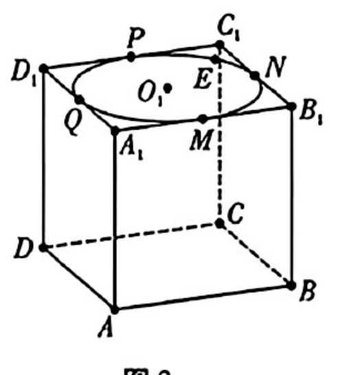
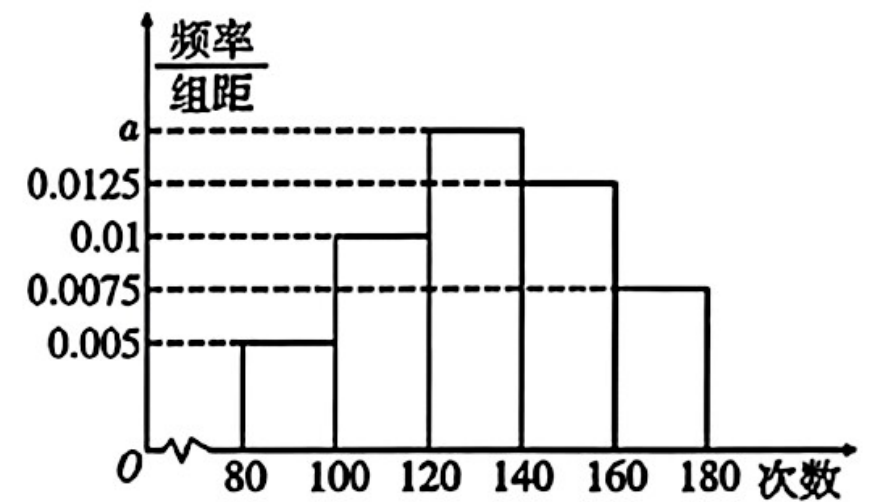
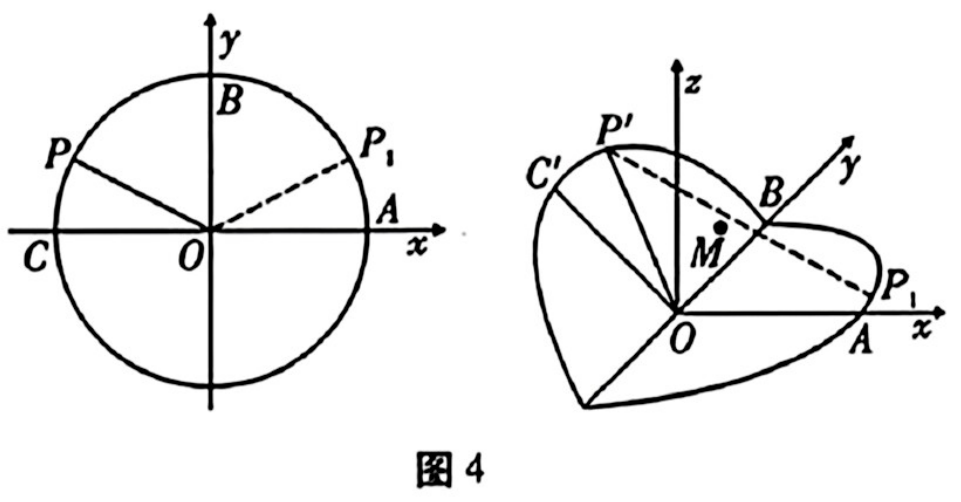

## 题目

已知 $A=(-\infty,\ 3]$，$B=\left(\dfrac{1}{2},\ +\infty\right)$，则 $A \cap B=$

## 选项

A．$\left(0,\ \dfrac{1}{2}\right)$
B．$\left(\dfrac{1}{2},\ 3\right]$
C．$\left(\dfrac{1}{2},\ +\infty\right)$
D．$(3,\ +\infty)$

## 答案

B

---
qid: 2
source: 云南师大附中2027届高三适应性月考卷（一）数学试题
number: '2'
type: choice
year: 2027
updatedAt: '1789914442'
knowledge: []
---

## 题目

已知 $\{a_n\}$ 是等比数列，若 $a_8=6$，则 $a_6a_8a_{10}=$

## 选项

A．$6$
B．$18$
C．$216$
D．无法计算

## 答案

C

---
qid: 3
source: 云南师大附中2027届高三适应性月考卷（一）数学试题
number: '3'
type: choice
year: 2027
updatedAt: '1789914442'
knowledge: []
---

## 题目

已知随机变量 $X \sim B\left(6,\ \dfrac{1}{4}\right)$，则 $E(2X-5)=$

## 选项

A．$10$
B．$3$
C．$-2$
D．$-5$

## 答案

C

---
qid: 4
source: 云南师大附中2027届高三适应性月考卷（一）数学试题
number: '4'
type: choice
year: 2027
updatedAt: '1789914442'
knowledge: []
---

## 题目

已知 $z_1=m+2\mathrm{i}$，$z_2=m^2-4m+2-m\mathrm{i}$，$m \in \mathbf{R}$，若 $z_1+z_2$ 是纯虚数，则 $m$ 的值为

## 选项

A．$1$
B．$0$ 或 $1$
C．$1$ 或 $2$
D．$2$

## 答案

A

---
qid: 5
source: 云南师大附中2027届高三适应性月考卷（一）数学试题
number: '5'
type: choice
year: 2027
updatedAt: '1789914442'
knowledge: []
---

## 题目

已知 $\left(\dfrac{2}{x}+x\right)^n$ 的展开式中的常数项为 $24$，则 $n=$

## 选项

A．$2$
B．$4$
C．$8$
D．$12$

## 答案

B

---
qid: 6
source: 云南师大附中2027届高三适应性月考卷（一）数学试题
number: '6'
type: choice
year: 2027
updatedAt: '1789914442'
knowledge: []
---

## 题目

已知椭圆 $C: \dfrac{x^2}{a^2}+\dfrac{y^2}{3}=1\ (a^2>3)$，点 $F_1$，$F_2$ 分别为椭圆 $C$ 的左、右焦点，若椭圆 $C$ 上存在一点 $P$，使得 $\angle F_1PF_2=\dfrac{\pi}{2}$，则 $a$ 的值不可能是

## 选项

A．$\sqrt{5}$
B．$2\sqrt{2}$
C．$3$
D．$\dfrac{11}{3}$

## 答案

A

---
qid: 7
source: 云南师大附中2027届高三适应性月考卷（一）数学试题
number: '7'
type: choice
year: 2027
updatedAt: '1789914442'
knowledge: []
---

## 题目

某教师准备给班级的同学安排座位，已知某组有 4 排（每排 2 个座位），需要给 8 位同学 $a_1$，$a_2$，$\cdots$，$a_8$ 安排到该组中，若同学 $a_1$，$a_2$、同学 $a_3$，$a_4$ 确定做同桌，则该教师共有（$\quad$）种排座位的方法．（注：不考虑同排中左右的顺序）

## 选项

A．$72$
B．$108$
C．$156$
D．$196$

## 答案

A

---
qid: 8
source: 云南师大附中2027届高三适应性月考卷（一）数学试题
number: '8'
type: choice
year: 2027
updatedAt: '1789914442'
knowledge: []
---

## 题目

已知 $a=2^{\frac{1}{2}}$，$b=\ln\dfrac{6}{5}$，$c=\dfrac{1}{6}$，则

## 选项

A．$c>b>a$
B．$b>a>c$
C．$a>c>b$
D．$a>b>c$

## 答案

D

---
qid: 9
source: 云南师大附中2027届高三适应性月考卷（一）数学试题
number: '9'
type: multi
year: 2027
updatedAt: '1789914442'
knowledge: []
---

## 题目

已知函数 $f(x)=x^3-\dfrac{5}{2}x^2-2x+3$，则下列选项正确的有

## 选项

A．$f(x)$ 的极大值点是 $-\dfrac{1}{3}$
B．$f(x)$ 在 $(2,\ +\infty)$ 上单调递增
C．当 $x \geqslant 1$ 时，$f(x) \geqslant -3$
D．$\left(1,\ \dfrac{1}{2}\right)$ 是 $f(x)$ 的一个对称中心

## 答案

ABC

---
qid: 10
source: 云南师大附中2027届高三适应性月考卷（一）数学试题
number: '10'
type: multi
year: 2027
updatedAt: '1789914442'
knowledge: []
---

## 题目

在南宋数学家杨辉所著的《详解九章算法·商功》中出现过如图 1 所示的形状，后人将其称为三角垛．若三角垛的最上层（第一层）有 1 个球，第二层有 3 个球，第三层有 6 个球，第四层有 10 个球，$\cdots\cdots$，设各层球数构成一个数列 $\{a_n\}$，则下列结论正确的有

## 选项

A．$a_5=15$
B．$a_n-a_{n-1}=n-1\ (n \geqslant 2)$
C．$\left\{\dfrac{a_n}{n}\right\}$ 是等差数列
D．$\sum\limits_{i=1}^{n}\dfrac{1}{a_i}<2$

## 答案

ACD

---
qid: 11
source: 云南师大附中2027届高三适应性月考卷（一）数学试题
number: '11'
type: multi
year: 2027
updatedAt: '1789914442'
knowledge: []
---

## 题目

已知正方体的棱长是 4，点 $O_1$ 是上底面的中心，如图 2 所示，圆 $O_1$ 是正方形 $A_1B_1C_1D_1$ 的内切圆，切点分别为 $M$，$N$，$P$，$Q$．点 $E$ 是圆 $O_1$ 上的动点（异于 $M$，$Q$），点 $F$ 是底面正方形 $ABCD$ 及其内部的动点，且满足 $FA-FB=2$，则下列命题正确的是

## 选项

A．$MQ \perp CO_1$
B．点 $C$ 到平面 $AB_1D_1$ 的距离是 $2\sqrt{3}$
C．三棱锥 $F-EMQ$ 外接球的表面积的最小值是 $\dfrac{113\pi}{4}$
D．三棱锥 $F-EMQ$ 外接球的表面积的最大值是 $\dfrac{135\pi}{4}$

## 答案

AC

---
qid: 12
source: 云南师大附中2027届高三适应性月考卷（一）数学试题
number: '12'
type: blank
year: 2027
updatedAt: '1789914442'
knowledge: []
---

## 题目

函数 $f(x)=2^x$ 在点 $(1,\ 2)$ 处的切线斜率为 $\underline{\qquad}$．

## 答案

$2\ln 2$

---
qid: 13
source: 云南师大附中2027届高三适应性月考卷（一）数学试题
number: '13'
type: blank
year: 2027
updatedAt: '1789914442'
knowledge: []
---

## 题目

已知 $\vec{e_1}$，$\vec{e_2}$ 是平面 $\alpha$ 的基底，$\alpha$ 内的两个向量分别为 $\vec{a}=\dfrac{1}{k+2}\vec{e_1}+\vec{e_2}$，$\vec{b}=3\vec{e_1}-2k\vec{e_2}$，若 $\vec{a} \parallel \vec{b}$，则实数 $k$ 的值为 $\underline{\qquad}$．

## 答案

$-\dfrac{6}{5}$

---
qid: 14
source: 云南师大附中2027届高三适应性月考卷（一）数学试题
number: '14'
type: blank
year: 2027
updatedAt: '1789914442'
knowledge: []
---

## 题目

已知圆 $O: x^2+y^2=1$，直线 $l: 3x+4y-15=0$，圆 $A$ 与圆 $O$ 外切，且圆 $A$ 与直线 $l$ 相切，记圆心 $A$ 的轨迹为 $\Gamma$，若直线 $MN$ 经过点 $O$，且与曲线 $\Gamma$ 交于 $MN$ 两点，则 $|MN|$ 的最小值为 $\underline{\qquad}$．

## 答案

$8$

---
qid: 15
source: 云南师大附中2027届高三适应性月考卷（一）数学试题
number: '15'
type: answer
year: 2027
updatedAt: '1789914442'
knowledge: []
---

## 题目

（本小题满分 13 分）

在 $\triangle ABC$ 中，内角 $A$，$B$，$C$ 所对的边分别是 $a$，$b$，$c$．已知函数 $f(x)=\sin\left(2x-\dfrac{\pi}{6}\right)$，且对于 $\forall x \in \mathbf{R}$ 都有 $f(x) \leqslant f(A)$．

（1）求角 $A$ 的大小；

（2）若 $a=2$，$b=\sqrt{3}$，求边 $c$ 的大小．

## 答案

（1）$A=\dfrac{\pi}{3}$；（2）$c=\dfrac{\sqrt{3}+\sqrt{7}}{2}$

---
qid: 16
source: 云南师大附中2027届高三适应性月考卷（一）数学试题
number: '16'
type: answer
year: 2027
updatedAt: '1789914442'
knowledge: []
---

## 题目

（本小题满分 15 分）

已知双曲线 $C: \dfrac{x^2}{2}-\dfrac{y^2}{2}=1$，斜率为 2 的动直线与双曲线 $C$ 交于 $A$，$B$ 两点，点 $M$ 是 $A$，$B$ 的中点．

（1）证明：点 $M$ 在直线 $y=\dfrac{1}{2}x$ 上；

（2）若点 $M(2,\ 1)$，$O$ 为坐标原点，试求此时三角形 $OAB$ 的面积．

## 答案

（2）$S_{\triangle ABO}=\sqrt{3}$

---
qid: 17
source: 云南师大附中2027届高三适应性月考卷（一）数学试题
number: '17'
type: answer
year: 2027
updatedAt: '1789914442'
knowledge: []
---

## 题目

（本小题满分 15 分）

某校为了解初一学生的体能素质，随机抽取了 100 名学生进行一分钟跳绳测试，将所得数据整理后，绘制成如图 3 所示的频率分布直方图．

（1）①求 $a$ 的值；②估算这 100 名学生跳绳次数的中位数（精确到 0.1）；

（2）规定跳绳次数不低于 140 次为"优秀"．现从样本中利用分层抽样的方法抽取 5 人进行复测．已知优秀组的复测通过率为 $\dfrac{4}{5}$，非优秀组的复测通过率为 $\dfrac{1}{2}$．若有 1 个人通过复测，试求这个人来自优秀组的概率．（每个学生参与复测的成绩互不影响）

## 答案

（1）①$a=0.015$；②中位数约为 133.3；（2）$\dfrac{16}{31}$

---
qid: 18
source: 云南师大附中2027届高三适应性月考卷（一）数学试题
number: '18'
type: answer
year: 2027
updatedAt: '1789914442'
knowledge: []
---

## 题目

（本小题满分 17 分）

已知函数 $f(x)=\ln(x+1)-ax+\dfrac{1}{2}x^2\ (x \geqslant 0)$，$a \in \mathbf{R}$．

（1）若 $a=2$，求 $f(x)$ 的极值点；

（2）若 $\forall x \in [0,\ +\infty)$，都有 $f(x) \geqslant 0$，求 $a$ 的取值范围；

（3）证明：$\forall n \in \mathbf{N}^*$，有 $\ln(n+1)>\dfrac{1}{4}+\dfrac{2}{9}+\cdots+\dfrac{n-1}{n^2}$．

## 答案

（1）极小值点 $x_1=\dfrac{1+\sqrt{5}}{2}$，无极大值点；（2）$a \leqslant 1$；（3）证明见解析

---
qid: 19
source: 云南师大附中2027届高三适应性月考卷（一）数学试题
number: '19'
type: answer
year: 2027
updatedAt: '1789914442'
knowledge: []
---

## 题目

（本小题满分 17 分）

如图 4，圆心在坐标原点 $O$ 的圆 $O$ 经过点 $(\sqrt{3},\ 1)$．记圆 $O$ 与 $y$ 轴正半轴的交点为 $B$，圆 $O$ 与 $x$ 轴的交点从左往右分别是 $C$，$A$．

（1）求圆 $O$ 的方程；

（2）点 $P$ 是圆 $O$ 上在第二象限的动点，点 $P_1$ 是点 $P$ 关于 $y$ 轴的对称点（在平面 $xOy$ 上）．现将圆 $O$ 的左半部分（$x \leqslant 0$）沿着 $y$ 轴翻折，使点 $P$，$C$ 达到点 $P'$，$C'$ 的位置，记二面角 $A-OB-C'$ 的大小为 $\theta\ (0<\theta<\pi)$．以 $O$ 为原点，$OA$ 为 $x$ 轴，$OB$ 为 $y$ 轴，过点 $O$ 与平面 $AOB$ 垂直的直线为 $z$ 轴，建立如图所示空间直角坐标系 $O-xyz$．

①若翻折前 $\angle AOP=\dfrac{3\pi}{4}$，$\theta=\dfrac{2\pi}{3}$，求锐二面角 $A-OP'-B$ 的余弦值；

②记点 $P_1$ 和点 $P'$ 的中点在平面 $yOz$ 的正投影为点 $M$．

（ⅰ）证明：当 $\theta$ 为定值时，点 $M$ 的轨迹为椭圆的一部分；

（ⅱ）若 $\theta \in \left[\dfrac{\pi}{4},\ \dfrac{2\pi}{3}\right]$，求（ⅰ）中椭圆的离心率 $e$ 的取值范围．

## 答案

（1）$x^2+y^2=4$；①$\cos\langle A-OP'-B\rangle=\dfrac{\sqrt{7}}{7}$；（ⅱ）$e \in \left[\dfrac{\sqrt{3}}{2},\ \dfrac{\sqrt{14}}{4}\right]$
