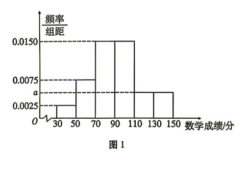
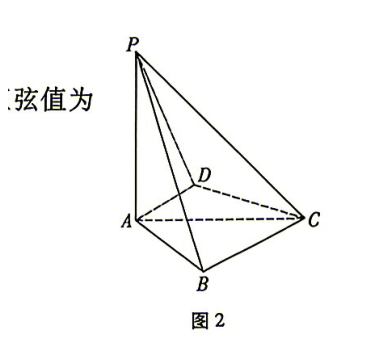

## 题目

已知集合 $A=\{x \mid |x| \leqslant 2\}$，$B=\{x \mid x(x-3) \leqslant 0\}$，则 $A \cap B=$

## 选项

A．$\{x \mid 0 \leqslant x \leqslant 2\}$
B．$\{x \mid -2 \leqslant x \leqslant 0\}$
C．$\{x \mid -2 \leqslant x \leqslant 3\}$
D．$\{x \mid x \leqslant 2 \text{ 或 } x \geqslant 3\}$

## 答案

A

---
qid: 2
source: 云南师大附中2027届高三高考适应性月考（二）数学试题
number: '2'
type: choice
year: 2027
updatedAt: '1789914442'
knowledge: []
---

## 题目

已知 $z=1+\mathrm{i}$，则 $\dfrac{1-\mathrm{i}}{z+1}$ 的虚部为

## 选项

A．$\dfrac{3}{5}$
B．$-\dfrac{3}{5}$
C．$\dfrac{1}{5}$
D．$-\dfrac{2}{5}$

## 答案

B

---
qid: 3
source: 云南师大附中2027届高三高考适应性月考（二）数学试题
number: '3'
type: choice
year: 2027
updatedAt: '1789914442'
knowledge: []
---

## 题目

已知 $x$，$y \in \mathbf{R}$，则下列条件中使 $x>y$ 成立的充要条件是

## 选项

A．$\dfrac{1}{x}<\dfrac{1}{y}$
B．$x^2>y^2$
C．$\ln(x-y)>0$
D．$a^x>a^y\ (a>1)$

## 答案

D

---
qid: 4
source: 云南师大附中2027届高三高考适应性月考（二）数学试题
number: '4'
type: choice
year: 2027
updatedAt: '1789914442'
knowledge: []
---

## 题目

等差数列 $\{a_n\}$ 的前 $n$ 项和为 $S_n$，若 $S_5=S_8$，$a_6=1$，则 $a_1=$

## 选项

A．$-1$
B．$6$
C．$1$
D．$0$

## 答案

B

---
qid: 5
source: 云南师大附中2027届高三高考适应性月考（二）数学试题
number: '5'
type: choice
year: 2027
updatedAt: '1789914442'
knowledge: []
---

## 题目

已知 $\dfrac{\cos \alpha}{\cos \alpha-\sin \alpha}=\sqrt{3}$，则 $\tan\left(\alpha+\dfrac{\pi}{6}\right)=$

## 选项

A．$1-\dfrac{\sqrt{3}}{3}$
B．$1+\dfrac{\sqrt{3}}{3}$
C．$\dfrac{3\sqrt{3}+12}{13}$
D．$\dfrac{\sqrt{3}+4}{13}$

## 答案

C

---
qid: 6
source: 云南师大附中2027届高三高考适应性月考（二）数学试题
number: '6'
type: choice
year: 2027
updatedAt: '1789914442'
knowledge: []
---

## 题目

已知抛物线 $E:y^2=4x$ 的准线为 $l$，$P$ 为 $E$ 上的一点，$F$ 为 $E$ 的焦点，直线 $PB$ 与圆 $C:(x-4)^2+y^2=1$ 相切于点 $B$，若 $|PF|=|PB|$，则点 $P$ 到 $l$ 的距离为

## 选项

A．$\dfrac{7}{2}$
B．$\dfrac{7}{3}$
C．$\dfrac{10}{3}$
D．$3$

## 答案

C

---
qid: 7
source: 云南师大附中2027届高三高考适应性月考（二）数学试题
number: '7'
type: choice
year: 2027
updatedAt: '1789914442'
knowledge: []
---

## 题目

甲、乙、丙、丁、戊 5 名同学站成一排照相，则甲不站在两端，丙和丁也不相邻的排法有

## 选项

A．$12$ 种
B．$24$ 种
C．$40$ 种
D．$48$ 种

## 答案

D

---
qid: 8
source: 云南师大附中2027届高三高考适应性月考（二）数学试题
number: '8'
type: choice
year: 2027
updatedAt: '1789914442'
knowledge: []
---

## 题目

已知函数 $f(x+2)$ 为偶函数，且满足 $f(x)+f(2-x)=0$，当 $x \in [1,\ 2]$ 时，$f(x)=ax^2+b$．若 $f(4)+f(3)=9$，则 $a+2b=$

## 选项

A．$9$
B．$3$
C．$6$
D．$\dfrac{5}{2}$

## 答案

B

---
qid: 9
source: 云南师大附中2027届高三高考适应性月考（二）数学试题
number: '9'
type: multi
year: 2027
updatedAt: '1789914442'
knowledge: []
---

## 题目

已知等比数列 $\{a_n\}$ 的公比为 $q$，$a_3=\dfrac{1}{4}$，$a_6=-\dfrac{1}{32}$．$S_n$ 是 $|a_n|$ 的前 $n$ 项和，则

## 选项

A．$a_2=-\dfrac{1}{2}$
B．$q=\dfrac{1}{2}$
C．$S_{2n}>S_{2n-1}$
D．$S_n$ 的最小值是 $\dfrac{1}{2}$

## 答案

AD

---
qid: 10
source: 云南师大附中2027届高三高考适应性月考（二）数学试题
number: '10'
type: multi
year: 2027
updatedAt: '1789914442'
knowledge: []
---

## 题目

已知函数 $f(x)=2x^3-3x^2+1$，则

## 选项

A．$x=1$ 是 $f(x)$ 的极小值点
B．$f(x)$ 有三个不同零点
C．$y=f(x)$ 的对称中心是 $\left(\dfrac{1}{2},\ \dfrac{1}{2}\right)$
D．若过点 $(1,\ m)$ 存在 3 条直线与曲线 $y=f(x)$ 相切，则实数 $m \in \left(-\dfrac{1}{4},\ 0\right)$

## 答案

ACD

---
qid: 11
source: 云南师大附中2027届高三高考适应性月考（二）数学试题
number: '11'
type: multi
year: 2027
updatedAt: '1789914442'
knowledge: []
---

## 题目

在平面直角坐标系 $xOy$ 中，点 $F$ 为双曲线 $C:\dfrac{x^2}{4}-y^2=1$ 的右焦点，点 $T(-3,\ 0)$，过 $F$ 的直线 $l$ 与 $C$ 的右支交于 $P$，$Q$ 两点，$l_1$，$l_2$ 为双曲线 $C$ 的两条渐近线，过点 $P$ 分别作 $PA \perp l_1$，$PB \perp l_2$，垂足依次为 $A$，$B$，过点 $P$ 作 $PM \parallel l_2$ 交 $l_1$ 于点 $M$，过点 $P$ 作 $PN \parallel l_1$ 交 $l_2$ 于点 $N$，则下列结论正确的是

## 选项

A．$C$ 的渐近线方程为 $x-2y=0$
B．点 $P$ 到 $C$ 的两渐近线的距离之积为 $\dfrac{4}{5}$
C．$25S_{\triangle PAB}=16S_{\triangle PMN}$
D．若 $\triangle PQT$ 的外心在 $y$ 轴上，则 $|PQ|=16$

## 答案

BCD

---
qid: 12
source: 云南师大附中2027届高三高考适应性月考（二）数学试题
number: '12'
type: blank
year: 2027
updatedAt: '1789914442'
knowledge: []
---

## 题目

已知平面向量 $\vec{a}=(x,\ 2)$，$\vec{b}=(x-3,\ 2x)$，若 $\vec{a} \perp (\vec{a}-\vec{b})$，则 $|\vec{b}|=$ $\underline{\qquad}$．

## 答案

$\sqrt{65}$

---
qid: 13
source: 云南师大附中2027届高三高考适应性月考（二）数学试题
number: '13'
type: blank
year: 2027
updatedAt: '1789914442'
knowledge: []
---

## 题目

若函数 $f(x)=\ln x+\dfrac{2}{x}+\dfrac{c}{x^2}$ 既有极大值也有极小值，则 $c$ 的范围为 $\underline{\qquad}$．

## 答案

$\left(-\dfrac{1}{2},\ 0\right)$

---
qid: 14
source: 云南师大附中2027届高三高考适应性月考（二）数学试题
number: '14'
type: blank
year: 2027
updatedAt: '1789914442'
knowledge: []
---

## 题目

在三棱锥 $P-ABC$ 中，$\triangle ABC$ 是等边三角形，$PA=PB$，$PA \perp PB$，二面角 $P-AB-C$ 的余弦值为 $-\dfrac{\sqrt{3}}{3}$，若三棱锥 $P-ABC$ 的外接球 $O$ 的表面积为 $6\pi$，则 $\triangle ABC$ 的面积为 $\underline{\qquad}$．

## 答案

$\sqrt{3}$

---
qid: 15
source: 云南师大附中2027届高三高考适应性月考（二）数学试题
number: '15'
type: answer
year: 2027
updatedAt: '1789914442'
knowledge: []
---

## 题目

（本小题满分 13 分）

在 $\triangle ABC$ 中，内角 $A$，$B$，$C$ 所对的边分别为 $a$，$b$，$c$，且 $2b\cos C=2a-c$．

（1）求角 $B$ 的大小；

（2）若 $b=4$，且 $\triangle ABC$ 的面积为 $\sqrt{3}$，求 $\triangle ABC$ 的周长．

## 答案

（1）$B=\dfrac{\pi}{3}$；（2）$4+2\sqrt{7}$

---
qid: 16
source: 云南师大附中2027届高三高考适应性月考（二）数学试题
number: '16'
type: answer
year: 2027
updatedAt: '1789914442'
knowledge: []
---

## 题目

（本小题满分 15 分）

某校高三年级 1000 名学生某一次的高考适应性演练数学成绩频率分布直方图如图 1 所示，其中成绩分组区间是 $[30,\ 50)$、$[50,\ 70)$、$[70,\ 90)$、$[90,\ 110)$、$[110,\ 130)$、$[130,\ 150]$．

（1）求图中 $a$ 的值；

（2）根据频率分布直方图，估计这 1000 名学生的这次考试数学成绩的上四分位数和平均数（同一组中的数据以该组区间的中点值为代表）；

（3）从这次数学成绩位于 $[50,\ 70)$、$[70,\ 90)$、$[90,\ 110)$ 的学生中采用比例分配的分层随机抽样的方法抽取 10 人，再从这 10 人中随机抽取 3 人，该 3 人中成绩在区间 $[70,\ 90)$ 的人数记为 $X$，求 $X$ 的分布列及数学期望．

## 答案

（1）$a=0.005$；（2）上四分位数 $m=\dfrac{320}{3}$，平均数 $\bar{x}=91$；（3）$P(X=0)=\dfrac{1}{6}$，$P(X=1)=\dfrac{1}{2}$，$P(X=2)=\dfrac{3}{10}$，$P(X=3)=\dfrac{1}{30}$，$E(X)=1.2$

---
qid: 17
source: 云南师大附中2027届高三高考适应性月考（二）数学试题
number: '17'
type: answer
year: 2027
updatedAt: '1789914442'
knowledge: []
---

## 题目

（本小题满分 15 分）

如图 2，在四棱锥 $P-ABCD$ 中，$PA \perp$ 底面 $ABCD$，$PA=AC$，$PC=2\sqrt{2}$，$BC=1$，$AB=\sqrt{3}$．

（1）若 $AD \perp PB$，证明：$BC \parallel$ 平面 $PAD$；

（2）若 $A$，$B$，$C$，$D$ 四点共圆，且二面角 $A-CP-D$ 的正弦值为 $\dfrac{\sqrt{6}}{3}$，求四棱锥 $P-ABCD$ 的体积．

## 答案

（1）证明见解析；（2）$V=\dfrac{\sqrt{3}+2}{3}$

---
qid: 18
source: 云南师大附中2027届高三高考适应性月考（二）数学试题
number: '18'
type: answer
year: 2027
updatedAt: '1789914442'
knowledge: []
---

## 题目

（本小题满分 17 分）

已知椭圆 $C:\dfrac{x^2}{a^2}+\dfrac{y^2}{b^2}=1\ (a>b>0)$ 的离心率为 $\dfrac{\sqrt{5}}{5}$，焦距为 $2c$，以 $a$，$b$，$c$ 为三边的三角形面积为 1．过左焦点 $F$ 的直线 $l$ 交 $C$ 于 $A$，$B$ 两点，过点 $F$ 与 $l$ 垂直的直线交 $C$ 于 $D$，$E$ 两点，其中 $B$，$D$ 在 $x$ 轴上方，$M$、$N$ 分别为 $AB$，$DE$ 的中点．

（1）求椭圆 $C$ 的标准方程；

（2）证明：直线 $MN$ 过定点，并求定点坐标；

（3）设 $G$ 为直线 $AE$ 与直线 $BD$ 的交点，当 $\triangle GMN$ 的面积取到最小值时，求直线 $AB$ 的方程．

## 答案

（1）$\dfrac{x^2}{5}+\dfrac{y^2}{4}=1$；（2）定点 $\left(-\dfrac{5}{9},\ 0\right)$；（3）$x=\pm y-1$

---
qid: 19
source: 云南师大附中2027届高三高考适应性月考（二）数学试题
number: '19'
type: answer
year: 2027
updatedAt: '1789914442'
knowledge: []
---

## 题目

（本小题满分 17 分）

已知函数 $f(x)=ax\mathrm{e}^x-\mathrm{e}^mx^2+b\ (m \in \mathbf{R})$，曲线 $y=f(x)$ 在点 $(0,\ f(0))$ 处的切线方程为 $y=2x+1$．

（1）求实数 $a$，$b$；

（2）当 $m=\ln 2$ 时，证明 $f(x)$ 在 $\mathbf{R}$ 上有唯一零点；

（3）对 $\forall x \in [-1,\ +\infty)$，$f(x)+\mathrm{e}^{2x} \leqslant \mathrm{e}^{2x-m}$ 恒成立，求 $m$ 的取值范围．

## 答案

（1）$a=2$，$b=1$；（2）证明见解析；（3）$(-\infty,\ -\ln 2]$
