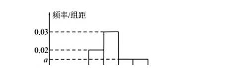
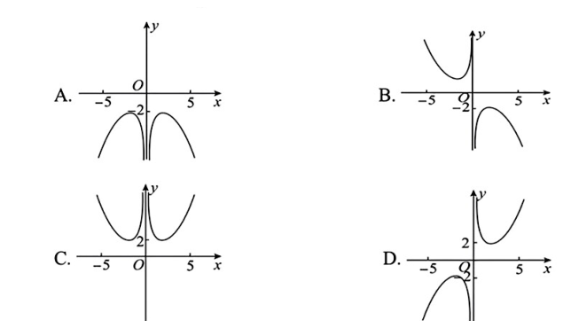
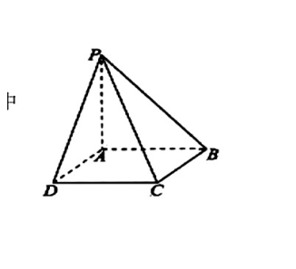
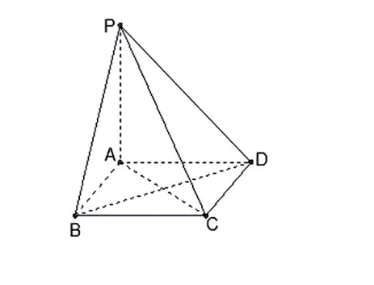

## 题目

（基础题）已知复数 $z=\dfrac{2+\mathrm{i}}{1-\mathrm{i}}$，$\mathrm{i}$ 为虚数单位，则 $|z|=$

## 选项

A．$2$
B．$\dfrac{1}{2}$
C．$\dfrac{\sqrt{10}}{2}$
D．$\dfrac{3}{2}$

## 答案

C

---
qid: 2
source: 云南省大理白族自治州民族中学2027届高三首考数学试题
number: '2'
type: choice
year: 2027
updatedAt: '1789914442'
knowledge: []
---

## 题目

（基础题）设 $a \in \mathbf{R}$，则"$a>1$"是"$a^2>a$"的

## 选项

A．充分不必要条件
B．必要不充分条件
C．充要条件
D．既不充分也不必要条件

## 答案

A

---
qid: 3
source: 云南省大理白族自治州民族中学2027届高三首考数学试题
number: '3'
type: choice
year: 2027
updatedAt: '1789914442'
knowledge: []
---

## 题目

（基础题）在 $\triangle ABC$ 中，$AD$ 为 $BC$ 边上的中线，$E$ 为 $AD$ 的中点，则 $\overrightarrow{EB}=$

## 选项

A．$\dfrac{3}{4}\overrightarrow{AB}-\dfrac{1}{4}\overrightarrow{AC}$
B．$\dfrac{1}{4}\overrightarrow{AB}-\dfrac{3}{4}\overrightarrow{AC}$
C．$\dfrac{3}{4}\overrightarrow{AB}+\dfrac{1}{4}\overrightarrow{AC}$
D．$\dfrac{1}{4}\overrightarrow{AB}+\dfrac{3}{4}\overrightarrow{AC}$

## 答案

A

---
qid: 4
source: 云南省大理白族自治州民族中学2027届高三首考数学试题
number: '4'
type: choice
year: 2027
updatedAt: '1789914442'
knowledge: []
---

## 题目

（基础题）为了解"双减"政策实施后学生每天的体育活动时间，研究人员随机调查了该地区 1000 名学生每天进行体育运动的时间，按照时长（单位：分钟）分成 6 组：第一组 $[30,40)$，第二组 $[40,50)$，第三组 $[50,60)$，第四组 $[60,70)$，第五组 $[70,80)$，第六组 $[80,90]$，经整理得到如图的频率分布直方图，则可以估计该地区学生每天体育活动时间的第 25 百分位数约为

## 选项

A．$42.5$ 分钟
B．$45.5$ 分钟
C．$47.5$ 分钟
D．$50$ 分钟

## 答案

C

---
qid: 5
source: 云南省大理白族自治州民族中学2027届高三首考数学试题
number: '5'
type: choice
year: 2027
updatedAt: '1789914442'
knowledge: []
---

## 题目

函数 $f(x)=\dfrac{2^x+2^{-x}}{x}$ 的图象大致为

## 选项

A．图 A
B．图 B
C．图 C
D．图 D

## 答案

D

---
qid: 6
source: 云南省大理白族自治州民族中学2027届高三首考数学试题
number: '6'
type: choice
year: 2027
updatedAt: '1789914442'
knowledge: []
---

## 题目

（错题重考）将 5 名志愿者分配到 3 个不同的奥运场馆参加接待工作，每个场馆至少分配一名志愿者的方案种数为

## 选项

A．$540$
B．$300$
C．$180$
D．$150$

## 答案

D

---
qid: 7
source: 云南省大理白族自治州民族中学2027届高三首考数学试题
number: '7'
type: choice
year: 2027
updatedAt: '1789914442'
knowledge: []
---

## 题目

若函数 $f(x)=ax^3-3x^2+x+8$ 存在极值点，则实数 $a$ 的取值范围是

## 选项

A．$(-\infty,\ 3)$
B．$(-\infty,\ 3]$
C．$(-\infty,\ 0)\cup(0,\ 3)$
D．$(-\infty,\ 0)\cup(0,\ 3]$

## 答案

A

---
qid: 8
source: 云南省大理白族自治州民族中学2027届高三首考数学试题
number: '8'
type: choice
year: 2027
updatedAt: '1789914442'
knowledge: []
---

## 题目

已知函数 $f(x)$ 满足 $f(x)=f(-x)$，且当 $x \in (-\infty,\ 0]$ 时，$f(x)+xf'(x)<0$ 成立，若 $a=(2^{0.6})\cdot f(2^{0.6})$，$b=(\ln 2)\cdot f(\ln 2)$，$c=\left(\log_2\dfrac{1}{8}\right)\cdot f\left(\log_2\dfrac{1}{8}\right)$，则 $a$，$b$，$c$ 的大小关系是

## 选项

A．$a>b>c$
B．$c>b>a$
C．$a>c>b$
D．$c>a>b$

## 答案

B

---
qid: 9
source: 云南省大理白族自治州民族中学2027届高三首考数学试题
number: '9'
type: multi
year: 2027
updatedAt: '1789914442'
knowledge: []
---

## 题目

若 $(1-2x)^5=a_0+a_1x+a_2x^2+a_3x^3+a_4x^4+a_5x^5$，则下列结论中正确的是

## 选项

A．$a_0=1$
B．$a_1+a_2+a_3+a_4+a_5=2$
C．$a_0-a_1+a_2-a_3+a_4-a_5=3^5$
D．$a_0-|a_1|+a_2-|a_3|+a_4-|a_5|=-1$

## 答案

ACD

---
qid: 10
source: 云南省大理白族自治州民族中学2027届高三首考数学试题
number: '10'
type: multi
year: 2027
updatedAt: '1789914442'
knowledge: []
---

## 题目

在 $\triangle ABC$ 中，$\sin\dfrac{C}{2}=\dfrac{1}{2}$，$BC=1$，$AC=5$，则

## 选项

A．$\cos C=\dfrac{1}{2}$
B．$AB=\sqrt{21}$
C．$\triangle ABC$ 的面积为 $\dfrac{5}{2}$
D．$\triangle ABC$ 外接圆的直径是 $2\sqrt{7}$

## 答案

ABD

---
qid: 11
source: 云南省大理白族自治州民族中学2027届高三首考数学试题
number: '11'
type: multi
year: 2027
updatedAt: '1789914442'
knowledge: []
---

## 题目

（教材改编）某高校有甲、乙两家餐厅，王同学第一天去甲、乙两家餐厅就餐的概率分别为 0.4 和 0.6．如果他第一天去甲餐厅，那么第二天去甲餐厅的概率为 0.6；如果第一天去乙餐厅，那么第二天去甲餐厅的概率为 0.5，则王同学

## 选项

A．第二天去甲餐厅的概率为 0.54
B．第二天去乙餐厅的概率为 0.44
C．第二天去了甲餐厅，则第一天去乙餐厅的概率为 $\dfrac{5}{9}$
D．第二天去了乙餐厅，则第一天去甲餐厅的概率为 $\dfrac{4}{9}$

## 答案

AC

---
qid: 12
source: 云南省大理白族自治州民族中学2027届高三首考数学试题
number: '12'
type: blank
year: 2027
updatedAt: '1789914442'
knowledge: []
---

## 题目

（错题重考●教材改编●基础题）已知 $\tan \alpha=5$，则 $\dfrac{\sin \alpha-3\cos \alpha}{2\sin \alpha+\cos \alpha}=$ $\underline{\qquad}$．

## 答案

$\dfrac{2}{11}$

---
qid: 13
source: 云南省大理白族自治州民族中学2027届高三首考数学试题
number: '13'
type: blank
year: 2027
updatedAt: '1789914442'
knowledge: []
---

## 题目

若某射手每次射击击中目标的概率是 $\dfrac{4}{5}$，则这名射手 3 次射击中恰有 1 次击中目标的概率为 $\underline{\qquad}$．

## 答案

$\dfrac{12}{125}$

---
qid: 14
source: 云南省大理白族自治州民族中学2027届高三首考数学试题
number: '14'
type: blank
year: 2027
updatedAt: '1789914442'
knowledge: []
---

## 题目

（错题重考）我国古代数学名著《九章算术》中将底面为矩形且有一侧棱垂直于底面的四棱锥称为"阳马"，现有一"阳马"（如图所示），其中 $PA \perp$ 底面 $ABCD$，$PA=3$，$AB=2$，$AD=1$，则该"阳马"的外接球的体积为 $\underline{\qquad}$．

## 答案

$\dfrac{7\sqrt{14}}{3}\pi$

---
qid: 15
source: 云南省大理白族自治州民族中学2027届高三首考数学试题
number: '15'
type: answer
year: 2027
updatedAt: '1789914442'
knowledge: []
---

## 题目

（本小题 13 分）

端午节吃粽子是我国的传统习俗．设一盘中装有 6 个粽子，其中肉粽 1 个，蛋黄粽 2 个，豆沙粽 3 个，这三种粽子的外观完全相同，从中任意选取 2 个．

（1）用 $X$ 表示取到的豆沙粽的个数，求 $X$ 的分布列；

（2）求选取的 2 个中至少有 1 个豆沙粽的概率．

## 答案

（1）$P(X=0)=\dfrac{1}{5}$，$P(X=1)=\dfrac{3}{5}$，$P(X=2)=\dfrac{1}{5}$；（2）$\dfrac{4}{5}$

---
qid: 16
source: 云南省大理白族自治州民族中学2027届高三首考数学试题
number: '16'
type: answer
year: 2027
updatedAt: '1789914442'
knowledge: []
---

## 题目

（本小题 15 分）（错题重考）

已知等差数列 $\{a_n\}$ 的前 $n$ 项和为 $S_n$，且满足 $a_2=9$，$S_5=65$．

（1）求数列 $\{a_n\}$ 的通项公式；

（2）设 $b_n=\dfrac{1}{a_na_{n+1}}$，数列 $\{b_n\}$ 的前 $n$ 项和为 $T_n$，求证：$T_n<\dfrac{1}{20}$．

## 答案

（1）$a_n=4n+1$；（2）证明见解析

---
qid: 17
source: 云南省大理白族自治州民族中学2027届高三首考数学试题
number: '17'
type: answer
year: 2027
updatedAt: '1789914442'
knowledge: []
---

## 题目

（本小题 15 分）如图，四棱锥 $P-ABCD$ 的底面 $ABCD$ 是矩形，$PA \perp$ 平面 $ABCD$，$PA=AD=2$，$BD=2\sqrt{2}$．

（1）求证：$BD \perp$ 平面 $PAC$；

（2）求二面角 $P-CD-B$ 余弦值的大小；

（3）求点 $C$ 到平面 $PBD$ 的距离．

## 答案

（1）证明见解析；（2）$\dfrac{\sqrt{2}}{2}$；（3）$\dfrac{2\sqrt{3}}{3}$

---
qid: 18
source: 云南省大理白族自治州民族中学2027届高三首考数学试题
number: '18'
type: answer
year: 2027
updatedAt: '1789914442'
knowledge: []
---

## 题目

（本小题 17 分）已知函数 $f(x)=x\ln x$．

（Ⅰ）求曲线 $y=f(x)$ 在点 $(1,\ f(1))$ 处的切线方程；

（Ⅱ）求 $f(x)$ 的单调区间；

（Ⅲ）若对于任意 $x \in \left[\dfrac{1}{\mathrm{e}},\ \mathrm{e}\right]$，都有 $f(x) \leqslant ax-1$，求实数 $a$ 的取值范围．

## 答案

（Ⅰ）$y=x-1$；（Ⅱ）$f(x)$ 的单调递增区间是 $\left(\dfrac{1}{\mathrm{e}},\ +\infty\right)$，单调递减区间是 $\left(0,\ \dfrac{1}{\mathrm{e}}\right)$；（Ⅲ）$[\mathrm{e}-1,\ +\infty)$

---
qid: 19
source: 云南省大理白族自治州民族中学2027届高三首考数学试题
number: '19'
type: answer
year: 2027
updatedAt: '1789914442'
knowledge: []
---

## 题目

（本小题 17 分）

已知双曲线 $C:x^2-\dfrac{y^2}{b^2}=1\ (b>0)$ 的左顶点为 $M$，离心率为 3，$A$，$B$ 是 $C$ 上的两点．

（1）求 $C$ 的标准方程；

（2）若线段 $AB$ 的中点为 $\left(\dfrac{1}{7},\ \dfrac{8}{7}\right)$，求直线 $AB$ 的方程；

（3）若 $\overrightarrow{MA}\cdot\overrightarrow{MB}=0$（$M$ 不在直线 $AB$ 上），证明：直线 $AB$ 过定点．

## 答案

（1）$x^2-\dfrac{y^2}{8}=1$；（2）$y=x+1$；（3）直线 $AB$ 过定点 $\left(\dfrac{9}{7},\ 0\right)$
