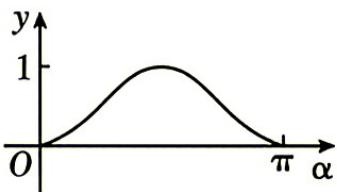
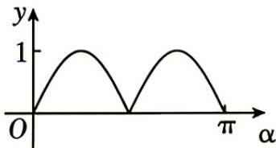
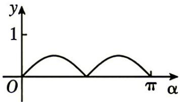
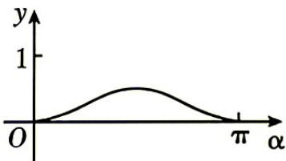
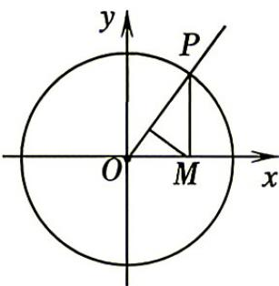
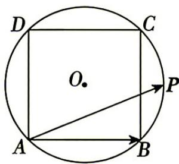
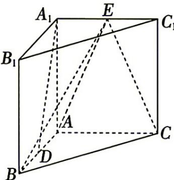
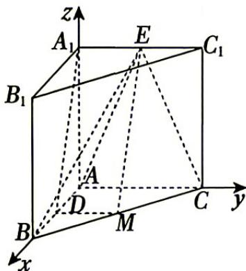

## 题目

已知i是虚数单位,复数z满足 $z = 1 - 2 \mathrm { i }$ ,则复平面内表示z的点在

## 选项

A．第一象限
B．第二象限
C．第三象限
D．第四象限

## 答案

D

---
qid: 2
source: 安徽省蚌埠市2027届高三8月调研性监测数学试题
number: '2'
type: choice
year: 2027
updatedAt: '1789915071'
knowledge: []
---

## 题目

已知集合 $A = \left\{ x | y = \ln x \right\} , B = \left\{ y | y = 2 x ^ { 2 } + 1 \right\}$ ,则 $A \cap B =$

## 选项

A．$\emptyset$
B．$( 0 , + \infty )$
C．$[ 1 , + \infty )$
D．(0,1]

## 答案

C

---
qid: 3
source: 安徽省蚌埠市2027届高三8月调研性监测数学试题
number: '3'
type: choice
year: 2027
updatedAt: '1789915071'
knowledge: []
---

## 题目

已知向量 $\textbf { \em a } = \left( m , 1 \right) , b \ = \left( 2 , 3 \right)$ ,若 $\cdot \boldsymbol { a } \perp \boldsymbol { b }$ ,则 $m =$

## 选项

A．$- \frac { 3 } { 2 }$
B．$\frac { 3 } { 2 }$
C．$- \frac { 2 } { 3 }$
D．$\frac { 2 } { 3 }$

## 答案

A

---
qid: 4
source: 安徽省蚌埠市2027届高三8月调研性监测数学试题
number: '4'
type: choice
year: 2027
updatedAt: '1789915071'
knowledge: []
---

## 题目

将一个斜边为2的等腰直角三角形绕斜边旋转一周，形成的几何体的表面积为

## 选项

A．${ \frac { 2 { \sqrt { 2 } } } { 3 } } \pi$
B．2 $\sqrt { 2 } \pi$
C．${ \frac { 4 { \sqrt { 2 } } } { 3 } } \pi$
D．$4 \sqrt { 2 } \pi$

## 答案

B

---
qid: 5
source: 安徽省蚌埠市2027届高三8月调研性监测数学试题
number: '5'
type: choice
year: 2027
updatedAt: '1789915071'
knowledge: []
---

## 题目

已知数列 $\left\{ a _ { n } \right\}$ 是等差数列,且 $a _ { 1 0 } = 1 , a _ { 4 } + a _ { 5 } + \cdots + a _ { 1 4 } = 7 7$ ,若 $a _ { k } = 1 9$ ,则k的值

## 选项

A．7
B．8
C．9
D．10

## 答案

A

---
qid: 6
source: 安徽省蚌埠市2027届高三8月调研性监测数学试题
number: '6'
type: choice
year: 2027
updatedAt: '1789915071'
knowledge: []
---

## 题目

如图，在平面直角坐标系中，角α的始边为x轴非负半轴，终边交单位圆于点P,过点P作x轴的垂线，垂足为M,将点M到直线OP的距离表示为α的函数 $f ( \alpha )$ ,则f(α)在 $[ 0 , \pi ]$ 上的图象大致为

A.

C.

B.

D.

第6题图

## 答案

C

---
qid: 7
source: 安徽省蚌埠市2027届高三8月调研性监测数学试题
number: '7'
type: choice
year: 2027
updatedAt: '1789915071'
knowledge: []
---

## 题目

已知平面直角坐标系中的三个点 $A \left( 1 , \sqrt { 3 } \right) , B \left( { \mathrm { ~ - 1 ~ } } , { - \sqrt { 3 } } \right) , C \left( 4 , 0 \right)$ ,过A点与线段BC有公共点的直线为l,则直线l的斜率可以是

## 选项

A．0
B．$- \frac { 1 } { 3 }$
C．$\frac 1 3$
D．3

## 答案

D

---
qid: 8
source: 安徽省蚌埠市2027届高三8月调研性监测数学试题
number: '8'
type: choice
year: 2027
updatedAt: '1789915071'
knowledge: []
---

## 题目

若甲盒中有3个红球,2个黄球，1个白球，,乙盒中有x个红球 $( x \in  { \mathbb { N } } \ )$ ,2 个黄球,3 个白球，这些球的大小、材质完全相同．现从甲盒中随机取出一个球放入乙盒，再从乙盒中随机取出一个球，若事件“两次取到的球颜色相同”的概率不超过 $\frac { 5 } { 1 2 }$ ,则x的最大值为

## 选项

A．3
B．4
C．5
D．6

## 答案

B

---
qid: 9
source: 安徽省蚌埠市2027届高三8月调研性监测数学试题
number: '9'
type: multi
year: 2027
updatedAt: '1789915071'
knowledge: []
---

## 题目

某同学记录了我市2026年7月中旬连续8天的最高气温(单位:摄氏度)分别为：31,31，29,32,35,35,34,35,则这8个数据的A. 极差为4 B. 众数为35C. 中位数为 33 D. 平均数为32.5

## 答案

BC

---
qid: 10
source: 安徽省蚌埠市2027届高三8月调研性监测数学试题
number: '10'
type: multi
year: 2027
updatedAt: '1789915071'
knowledge: []
---

## 题目

设正实数x,y 满足 $x + 2 y = x y$ ,则下列结论正确的是A. $x + y$ 的最小值为 $3 + 2 \sqrt { 2 }$ B. xy 的最小值为8C. $\frac { 1 } { x - 2 } + \frac { 1 } { y - 1 } \geq \frac { 3 } { 2 }$ D. $\frac { 4 } { { x } ^ { 2 } } + \frac { 1 } { { y } ^ { 2 } } \geq \frac { 1 } { 2 }$

## 答案

ABD

---
qid: 11
source: 安徽省蚌埠市2027届高三8月调研性监测数学试题
number: '11'
type: multi
year: 2027
updatedAt: '1789915071'
knowledge: []
---

## 题目

王虹因彻底证明了困扰数学界逾百年的“三维挂谷猜想”于2026年7月23日获得菲尔兹奖(国际数学界最高荣誉). 定义方向向量为 $v _ { \mathrm { ~ } } = \big ( \cos \theta , \sin \theta \big )$ 的直线上长度为1的线段为$^ { * } \theta$ -理想线段”，下列结论正确的是

## 选项

A．$\forall \theta \in [ 0 , \pi )$ ,平移“θ-理想线段”可使其两端点均在直径为1的圆上
B．$\forall \theta \in [ 0 , \pi )$ ,平移“θ-理想线段”，可使其两端点均在勒洛三角形的边界上 $( \triangle A B C$ 的边长均为1,分别以A,B,C为圆心,1为半径的三段劣弧 $\widehat { B C } , \widehat { C A } , \widehat { A B }$ 所围成的平面区域称为勒洛三角形)
C．$\forall \theta \in \left[ 0 , \pi \right)$ ，平移“θ-理想线段”，可使其两端点均在双曲线 ${ \frac { x ^ { 2 } } { a ^ { 2 } } } - { \frac { y ^ { 2 } } { b ^ { 2 } } } = 1 ( a > 0$ $b > 0 )$ 上
D．$\forall \theta \in \left[ 0 , \pi \right)$ ,平移“θ-理想线段”，若其两端点均可在椭圆 ${ \frac { x ^ { 2 } } { a ^ { 2 } } } + { \frac { y ^ { 2 } } { b ^ { 2 } } } = 1 \left( a > b > 0 \right)$ 上，则该椭圆的离心率 $e \leqslant \sqrt { 1 - \frac { 1 } { 4 a ^ { 2 } } }$

## 答案

ABD

---
qid: 12
source: 安徽省蚌埠市2027届高三8月调研性监测数学试题
number: '12'
type: blank
year: 2027
updatedAt: '1789915071'
knowledge: []
---

## 题目

在二项式 $\left( x + { \frac { 2 } { x } } \right) ^ { 6 }$ 的展开式中，常数项是 (用数字作答).

## 答案

160

---
qid: 13
source: 安徽省蚌埠市2027届高三8月调研性监测数学试题
number: '13'
type: blank
year: 2027
updatedAt: '1789915071'
knowledge: []
---

## 题目

如图,边长为2 的正方形ABCD内接于圆0,P是劣弧 BC(包括端点)上一点，则 $\overrightarrow { A P } \cdot \overrightarrow { A B }$ 的取值范围为

## 答案

$[ 4 , 2 + 2 { \sqrt { 2 } } ]$

---
qid: 14
source: 安徽省蚌埠市2027届高三8月调研性监测数学试题
number: '14'
type: blank
year: 2027
updatedAt: '1789915071'
knowledge: []
---

## 题目

已知连续函数f(x)是定义在 $\left( - \frac { \pi } { 2 } , \frac { \pi } { 2 } \right)$ 上的奇函数．当 $x \in$ $\left( 0 , { \frac { \pi } { 2 } } \right)$ 时， $3 f ( x ) + f ^ { \prime } ( x ) \tan x > 0$ ,则不等式 $\cos ^ { 3 } x \cdot f \left( x + { \frac { \pi } { 2 } } \right) +$ $\sin ^ { 3 } x \cdot f ( - x ) > 0$ 的解集为

第 13 题图

## 答案

$\left( \ - { \frac { \pi } { 4 } } , 0 \right)$

---
qid: 15
source: 安徽省蚌埠市2027届高三8月调研性监测数学试题
number: '15'
type: answer
year: 2027
updatedAt: '1789915071'
knowledge: []
---

## 题目

(13分)

$\triangle A B C$ 的内角A,B,C的对边分别为 $a , b , c$ ,已知函数 $f ( x ) = \sin { \big ( } \omega x + \varphi { \big ) }$ 的最小正周期为π,其中 $\omega > 0 , 0 < \varphi < { \frac { \pi } { 2 } } , f ( x )$ 的图象关于直线 $x = \frac { \pi } { 6 }$ 对称，且 $f ( A ) = { \frac { 1 } { 2 } }$

(1)求函数f(x)的解析式及A的值；

(2)若 $a = 3 , \triangle A B C$ 的面积为 $\sqrt { 3 }$ ,求 $\triangle A B C$ 的周长.

## 答案

(13

## 解析

(1)因为 $T = \left| { \frac { 2 \pi } { \omega } } \right| = \pi$ ,且 $\omega > 0$ ,所以 $\omega = 2$ …2分因为f(x)的图象关于直线 $x = \frac { \pi } { 6 }$ 对称，所以 $2 \times \frac { \pi } { 6 } + \varphi = \frac { \pi } { 2 } + k \pi ( k \in { \cal Z } )$ 解得， $\varphi = { \frac { \pi } { 6 } } + k \pi ( k \in { \mathsf { Z } } { \mathsf { ) } }$ ……4分又 $0 < \varphi < \frac { \pi } { 2 }$ ,所以 $\varphi = \frac { \pi } { 6 }$ ,即函数f(x)的解析式为 $f ( x ) = \sin \left( 2 x + { \frac { \pi } { 6 } } \right)$ .……5分所以 $f ( A ) = \sin \left( 2 A + { \frac { \pi } { 6 } } \right) = { \frac { 1 } { 2 } }$ ,又 $A \in \left( 0 , \pi \right)$ ,故 $2 A + { \frac { \pi } { 6 } } \in \left( { \frac { \pi } { 6 } } , { \frac { 1 3 \pi } { 6 } } \right)$ 所以 $2 A + { \frac { \pi } { 6 } } = { \frac { 5 \pi } { 6 } }$ ,解得， $A = \frac { \pi } { 3 }$ ……8分(2)由面积 $S = \frac { 1 } { 2 } b c s i n A = \sqrt { 3 }$ ,可得 $b c = 4$ …10分由余弦定理得 $a ^ { 2 } = b ^ { 2 } + c ^ { 2 } - 2 b c \cos A$ ,即 $( b + c ) ^ { 2 } - 3 b c = 9$ 解得， $b + c = { \sqrt { 2 1 } }$ …12分所以 $\triangle A B C$ 的周长为 $3 + { \sqrt { 2 1 } }$ …13分

---
qid: 16
source: 安徽省蚌埠市2027届高三8月调研性监测数学试题
number: '16'
type: answer
year: 2027
updatedAt: '1789915071'
knowledge: []
---

## 题目

(15分)

如图，直三棱柱 $A B C - A _ { 1 } B _ { 1 } C _ { 1 }$ 中， $A B \perp A C , A B = A C = 4 , D , E$ 分别为 $A B , A _ { 1 } C _ { 1 }$ 的中点.

(1)证明： ${ \bf \nabla } \cdot { \cal A } _ { 1 } { \cal D } / /$ 平面 $B C E$

(2)若三棱锥A- EBC 的体积为 $\frac { 4 0 } { 3 }$ ,求直线AC 与平面ABE所成角的正弦值.

第16 题图

## 答案

(15

## 解析

(1)取 BC的中点M,连接DM,EM,因为 DM是 $\triangle A B C$ 的中位线，所以 $D M / / A C$ ,且 $D M = { \frac { 1 } { 2 } } A C .$ 在直三棱柱 $A B C - A _ { 1 } B _ { 1 } C _ { 1 }$ 中 $, A _ { 1 } E / / A C$ ,且 $A _ { 1 } E = \frac { 1 } { 2 } A C$ 所以 $D M / / A _ { 1 } E$ ,且 $D M = A _ { 1 } E$ ,所以四边形 $D M E A _ { 1 }$ 为平行四边形，……4分则 $E M / / A _ { 1 } D$ 又 $E M \subset$ 平面 $E B C , A _ { 1 } D$ ¢平面 EBC,所以 $A _ { 1 } D / /$ 平面 EBC. ……6分(2)设直三棱柱的侧棱长 $A A _ { 1 } = h$ $V _ { _ { A - E B C } } = V _ { _ { E - A B C } } = \frac { 1 } { 3 } S _ { _ { \triangle A B C } } \cdot h = \frac { 1 } { 3 } \times 8 \times h = \frac { 8 } { 3 } h = \frac { 4 0 } { 3 } ,$ 故h=5. …9分如图建立空间直角坐标系，可得 $A \left( 0 , 0 , 0 \right) , B \left( 4 , 0 , 0 \right) , C \left( 0 , 4 , 0 \right) , E \left( 0 , 2 , 5 \right)$ 则 $\overrightarrow { A C } = \left( 0 , 4 , 0 \right) , \overrightarrow { A B } = \left( 4 , 0 , 0 \right) , \overrightarrow { A E } = \left( 0 , 2 , 5 \right)$ …11分设平面ABE的法向量为 $\boldsymbol { n } _ {  } = ( \boldsymbol { x } , \boldsymbol { y } , z )$ 则 $\left\{ { \begin{array} { l } { n \cdot { \overrightarrow { A B } } = 4 x = 0 , } \\ { n \cdot { \overrightarrow { A E } } = 2 y + 5 z = 0 } \end{array} } \right.$ 取x=2,得 $\ y = - 5 , x = 0$ ,得设直线AC 与平面ABE所成角为 θ,则即直线AC 与平面ABE所成角的正弦值为 ${ \frac { 5 \ { \sqrt { 2 9 } } } { 2 9 } } .$

  
第 16 题答案图

$$
n = ( 0 , - 5 , 2 )
$$

$$
\sin \theta = { \frac { \vert { \overrightarrow { A C } } \cdot n \vert } { \vert { \overrightarrow { A C } } \vert \cdot \vert n \vert } } = { \frac { 2 0 } { 4 \times { \sqrt { 2 5 + 4 } } } } = { \frac { 5 ~ { \sqrt { 2 9 } } } { 2 9 } } ,
$$

---
qid: 17
source: 安徽省蚌埠市2027届高三8月调研性监测数学试题
number: '17'
type: answer
year: 2027
updatedAt: '1789915071'
knowledge: []
---

## 题目

（15分）

已知函数 $f ( x ) = x ^ { 3 } + a x ^ { 2 } + 2 ( a \in \mathbf { R } \ )$

(1)若曲线 $\scriptstyle y = f ( x )$ 在点(1,f(1))处的切线与直线 $\scriptstyle y = 2 x + 1$ 平行,求实数a的值；

(2)讨论函数f(x)的单调性.

## 答案

(15

## 解析

$( 1 ) f ^ { \prime } ( x ) = 3 x ^ { 2 } + 2 a x = 3 x { \Big ( } x + { \frac { 2 } { 3 } } a { \Big ) }$ …2分所以 $f ^ { \prime } ( 1 ) = 3 + 2 a = 2$ ,即 $a = - { \frac { 1 } { 2 } } .$ ………4分(2)令 $f ^ { \prime } ( x ) = 0$ ,解得x=0或 $x = - { \frac { 2 a } { 3 } }$ …6分当a=0时， $f ^ { \prime } ( x ) = 3 x ^ { 2 } \geq 0$ 恒成立，所以函数f(x)在R上单调递增；…………8分当 $a > 0$ 时， $- \frac { 2 a } { 3 } < 0$ ，当x变化时， $f ^ { \prime } ( x ) , f ( x )$ 的变化情况如下，

x

 $\big ( - \infty , - \frac { 2 a } { 3 } \big )$ 

 $- { \frac { 2 a } { 3 } }$ 

 $\left( \ - { \frac { 2 a } { 3 } } , 0 \right)$ 

0

 $( 0 , + \infty )$ 

 $f ^ { \prime } ( x )$ 

十

0

一

0

十

 $f ( x )$ 

单调递增

极大值

单调递减

极小值

单调递增

……12分当 $a < 0$ 时， $- \frac { 2 a } { 3 } > 0$ ，当x变化时， $f ^ { \prime } ( x ) , f ( x )$ 的变化情况如下，

x

 $( \mathbf { \partial } - \infty \mathbf { \partial } , 0 )$ 

0

 $\left( 0 , - { \frac { 2 a } { 3 } } \right)$ 

 $- \frac { 2 a } { 3 }$ 

 $\left( \ - \frac { 2 a } { 3 } , + \infty \right)$ 

 $f ^ { \prime } ( x )$ 

十

0

-

0

十

f(x)

单调递增

极大值

单调递减

极小值

单调递增

综上所述：

当a=0时，函数f(x)在R上单调递增；

当a>0时,函数f(x)在 $\big ( - \infty , - \frac { 2 a } { 3 } \big )$ 和 $( 0 , + \infty )$ 上单调递增，在 $\left( \ - { \frac { 2 a } { 3 } } , 0 \right)$ 上单调递减；当 $a < 0$ 时,函数f(x)在 $( \mathbf { \partial } - \infty \mathbf { \partial } \mathbf { , } 0 )$ 和 $\left( - \frac { 2 a } { 3 } , + \infty \right)$ 上单调递增，在 $\left( 0 , - { \frac { 2 a } { 3 } } \right)$ 上单调递减.…15分

---
qid: 18
source: 安徽省蚌埠市2027届高三8月调研性监测数学试题
number: '18'
type: answer
year: 2027
updatedAt: '1789915071'
knowledge: []
---

## 题目

(17 分)

已知抛物线 $C : y ^ { 2 } = 2 p x { \bigl ( } p > 0 { \bigr ) }$ 经过点 P(1,2). 过点 $T ( t , 0 )$ 的直线l与C交于A,B两点，0为坐标原点，直线OA交准线于点M,直线BM与x轴平行.

(1)求抛物线C的焦点坐标和准线方程；

(2)求t的值；

(3)若 $\left| A T \right| = 2 \left| B T \right|$ ,求 $\triangle { O A B }$ 的外接圆的一般方程.

## 解析

(1)将点P(1,2)的坐标代入 $\gamma ^ { 2 } = 2 p x ( p > 0 )$ 得， $4 = 2 p$ ,解得 $p = 2$ ………2分因为 $\scriptstyle { \frac { p } { 2 } } = 1$ 所以抛物线C 的焦点坐标为(1,0)，准线方程为 $x = - 1$ 4分(2)由(1)知抛物线C 的方程为 $\gamma ^ { 2 } = 4 x$ 依题意可设直线AB的方程为 $x = m y + t$ 记A,B 的坐标分别为 $\left( x _ { 1 } , y _ { 1 } \right) , \left( x _ { 2 } , y _ { 2 } \right)$ 由 $\left\{ { \begin{array} { l } { x = m y + t , } \\ { y ^ { 2 } = 4 x , } \end{array} } \right.$ 得 $\ y ^ { 2 } - 4 m y - 4 t = 0$ ,则 $\Delta = 1 6 m ^ { 2 } + 1 6 t > 0$ ,且 $\gamma _ { 1 } \gamma _ { 2 } = - 4 t$ ，……6分直线 OA 的方程为 $y = \frac { y _ { 1 } } { x _ { 1 } } x = \frac { y _ { 1 } } { \frac { 2 } { 4 } } x = \frac { 4 } { y _ { 1 } } x$ 令x=-1,得 $y = - \frac { 4 } { y _ { 1 } }$ ,即点M的纵坐标为 $- { \frac { 4 } { y _ { 1 } } }$ 依题意直线BM与x轴平行,所以 $- \frac { 4 } { y _ { 1 } } = y _ { 2 }$ ,即 $y _ { 1 } y _ { 2 } = - 4$ ,从而 $- 4 t = - 4$ 解得t =1,经检验符合题意故t =1. 9分(3)若 $\left| A T \right| = 2 \left| B T \right|$ ,则 $\mid y _ { 1 } \mid = 2 \mid y _ { 2 } \mid$ ,从而 $\left| y _ { 1 } y _ { 2 } \right| = 2 { y _ { 2 } } ^ { 2 }$ 由(2) ${ _ { 2 y _ { 2 } } } ^ { 2 } = 4 , y _ { 2 } = \pm { \sqrt { 2 } }$ 当 $y _ { 2 } = { \sqrt { 2 } }$ 时 $\mathcal { I } _ { 1 } = - 2 \sqrt { 2 }$ 从而A、B两点坐标分别 $\left( 2 , - 2 { \sqrt { 2 } } \right) , \left( { \frac { 1 } { 2 } } , { \sqrt { 2 } } \right)$ 12分设 $\triangle O A B$ 外接圆的一般方程为 $x ^ { 2 } + y ^ { 2 } + D x + E y + F = 0$ 将点O,A,B的坐标代入得， $\left\{ \begin{array} { l } { { F = 0 , } } \\ { { \displaystyle 4 + 8 + 2 D - 2 \sqrt { 2 } E + F = 0 , } } \\ { { \displaystyle \frac { 1 } { 4 } + 2 + \frac { 1 } { 2 } D + \sqrt { 2 } E + F = 0 } } \end{array} \right.$ 解得， $D = - { \frac { 1 1 } { 2 } } , E = { \frac { \sqrt { 2 } } { 4 } } , F = 0$ 故此时 $\triangle { O A B }$ 外接圆的一般方程为 $x ^ { 2 } + y ^ { 2 } - \frac { 1 1 } { 2 } x + \frac { \sqrt { 2 } } { 4 } y = 0$ …15分同理，当 $y _ { 2 } = - \sqrt { 2 }$ 时，A,B两点坐标分别为 $\left( 2 , 2 { \sqrt { 2 } } \right) , \left( { \frac { 1 } { 2 } } , - { \sqrt { 2 } } \right)$ 且 $\triangle { O A B }$ 外接圆的一般方程为 $x ^ { 2 } + y ^ { 2 } - { \frac { 1 1 } { 2 } } x - { \frac { \sqrt { 2 } } { 4 } } y = 0$ 故所求方程为 $x ^ { 2 } + y ^ { 2 } - \frac { 1 1 } { 2 } x + \frac { \sqrt { 2 } } { 4 } y = 0$ 或 $x ^ { 2 } + y ^ { 2 } - { \frac { 1 1 } { 2 } } x - { \frac { \sqrt { 2 } } { 4 } } y = 0$ ………………17分高三数学参考答案第3页(共4 页)

---
qid: 19
source: 安徽省蚌埠市2027届高三8月调研性监测数学试题
number: '19'
type: answer
year: 2027
updatedAt: '1789915071'
knowledge: []
---

## 题目

(17分)

自动驾驶技术是汽车研发的重要方向．某实验室对一款智驾汽车模型进行障碍识别探测试验，已知该汽车模型在单次测试中，有效识别障碍物的概率为 $\frac { 4 } { 5 }$ ,无效识别的概率为 $\frac { 1 } { 5 }$ 每次测试相互独立.

(1)若对该汽车模型连续进行3次障碍识别测试，记有效识别的次数为X,求X的分布列与期望；

(2)若规定累计出现2次无效识别时停止测试，并对汽车模型进行检修．记恰好在第k$( k \geqslant 2 , k \in \mathrm { N } \ )$ 次测试后停止的概率为P(k).

(i)求 $P ( 2 ) , P ( 3 )$ ；

(ii)求 $\sum _ { k = 2 } ^ { n } P ( k )$

# 2027届高三调研性监测

## 解析

(1)由题意得 $X \sim B \left( 3 , \frac { 4 } { 5 } \right)$ ,X的可能取值为0,1,2,3.可得 $P ( X = 0 ) = \mathrm { C } _ { 3 } ^ { 0 } \times \left( \frac { 1 } { 5 } \right) ^ { 3 } = \frac { 1 } { 1 2 5 } , P ( X = 1 ) = \mathrm { C } _ { 3 } ^ { 1 } \times \frac { 4 } { 5 } \times \left( \frac { 1 } { 5 } \right) ^ { 2 } = \frac { 1 2 } { 1 2 5 } ,$ $P ( X = 2 ) = \mathrm { C } _ { 3 } ^ { 2 } \times \left( \frac { 4 } { 5 } \right) ^ { 2 } \times \frac { 1 } { 5 } = \frac { 4 8 } { 1 2 5 } , P ( X = 3 ) = \mathrm { C } _ { 3 } ^ { 3 } \times \left( \frac { 4 } { 5 } \right) ^ { 3 } = \frac { 6 4 } { 1 2 5 } ,$ 则 X的分布列为X 0 1 2 3P $\frac { 1 } { 1 2 5 }$ $\frac { 1 2 } { 1 2 5 }$ $\frac { 4 8 } { 1 2 5 }$ $\frac { 6 4 } { 1 2 5 }$ 5分X的数学期望为 $E ( X ) = 3 \times { \frac { 4 } { 5 } } = { \frac { 1 2 } { 5 } } .$ …6分(2)(i) $P ( 2 ) = \left( { \frac { 1 } { 5 } } \right) ^ { 2 } = { \frac { 1 } { 2 5 } } ;$ 进行3次测试后停止，即前2次测试结果中有1次是无效识别，且最后1次测试结果为无效识别，所以 $P ( 3 ) = C _ { 2 } ^ { 1 } \times \frac { 1 } { 5 } \times \frac { 4 } { 5 } \times \frac { 1 } { 5 } = \frac { 8 } { 1 2 5 } .$ …10分(ii)恰好到第 $k ( k { \geqslant } 2 , k \in \mathbb { N } )$ 次测试后停止，即前k-1次中测试结果中恰有1次无效识别，且最后一次测试结果为无效识别,所以 $P ( k ) = \mathrm { C } _ { k - 1 } ^ { 1 } \times \frac { 1 } { 5 } \times \left( \frac { 4 } { 5 } \right) ^ { k - 2 } \times \frac { 1 } { 5 } = \left( k - 1 \right) \times \left( \frac { 1 } { 5 } \right) ^ { 2 } \times \left( \frac { 4 } { 5 } \right) ^ { k - 2 }$ …12分$\sum _ { k = 2 } ^ { n } P ( k ) = \left( { \frac { 1 } { 5 } } \right) ^ { 2 } + 2 \times \left( { \frac { 1 } { 5 } } \right) ^ { 2 } \times { \frac { 4 } { 5 } } + 3 \times \left( { \frac { 1 } { 5 } } \right) ^ { 2 } \times \left( { \frac { 4 } { 5 } } \right) ^ { 2 } + \cdots + ( n - 1 ) \times \left( { \frac { 1 } { 5 } } \right) ^ { 2 } \times \left( { \frac { 4 } { 5 } } \right) ^ { n - 2 }$ $= \frac { 1 } { 2 5 } \times \Big [ 1 + 2 \times \frac { 4 } { 5 } + 3 \times \Big ( \frac { 4 } { 5 } \Big ) ^ { 2 } + \cdots + \big ( n - 1 \big ) \times \Big ( \frac { 4 } { 5 } \Big ) ^ { n - 2 } \Big ]$ ，……13 分记 $S = 1 + 2 \times \frac { 4 } { 5 } + 3 \times \left( \frac { 4 } { 5 } \right) ^ { 2 } + \cdots + ( n - 1 ) \times \left( \frac { 4 } { 5 } \right) ^ { n - 2 } , \textcircled { 1 }$ 则 ${ \frac { 4 } { 5 } } S = { \frac { 4 } { 5 } } + 2 \times \left( { \frac { 4 } { 5 } } \right) ^ { 2 } + 3 \times \left( { \frac { 4 } { 5 } } \right) ^ { 3 } + \cdots + ( n - 1 ) \times \left( { \frac { 4 } { 5 } } \right) ^ { n - 1 }$ ,②两式相减得：${ \frac { 1 } { 5 } } S = 1 + { \frac { 4 } { 5 } } + \left( { \frac { 4 } { 5 } } \right) ^ { 2 } + \cdots + \left( { \frac { 4 } { 5 } } \right) ^ { n - 2 } - ( n - 1 ) \times \left( { \frac { 4 } { 5 } } \right) ^ { n - 1 }$ $= { \frac { 1 \times \left[ 1 - \left( { \frac { 4 } { 5 } } \right) ^ { n - 1 } \right] } { 1 - { \frac { 4 } { 5 } } } } - ( n - 1 ) \times \left( { \frac { 4 } { 5 } } \right) ^ { n - 1 } = 5 - ( n + 4 ) \times \left( { \frac { 4 } { 5 } } \right) ^ { n - 1 }$ 所以 $S = 5 \Big [ 5 - \big ( n + 4 \big ) \times \Big ( \frac { 4 } { 5 } \Big ) ^ { n - 1 } \Big ]$ 16分故 $\sum _ { k = 2 } ^ { n } P ( k ) = { \frac { 1 } { 2 5 } } S = { \frac { 1 } { 5 } } { \bigg [ } 5 - ( n + 4 ) \times { \bigg ( } { \frac { 4 } { 5 } } { \bigg ) } ^ { n - 1 } { \bigg ] } = 1 - { \frac { ( n + 4 ) } { 5 } } \times { \bigg ( } { \frac { 4 } { 5 } } { \bigg ) } ^ { n - 1 }$ 17分(其它解法请根据以上评分标准酌情赋分)
