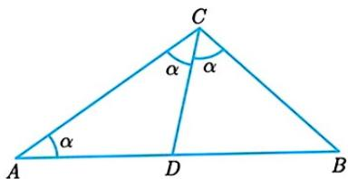
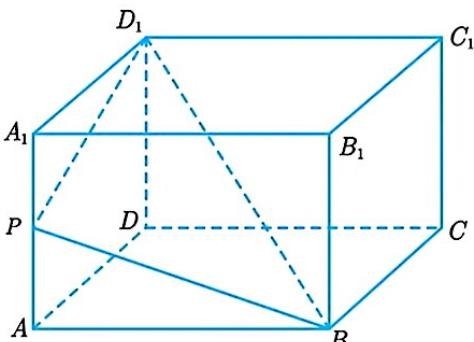
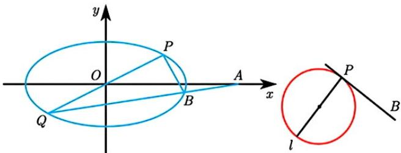
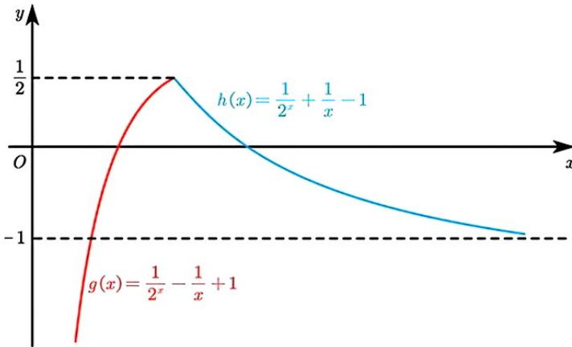
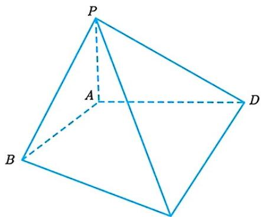
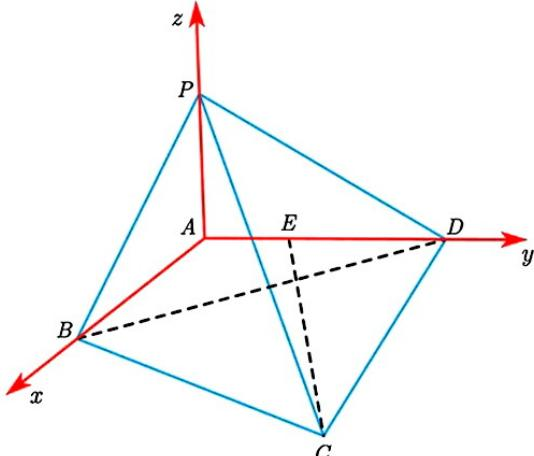
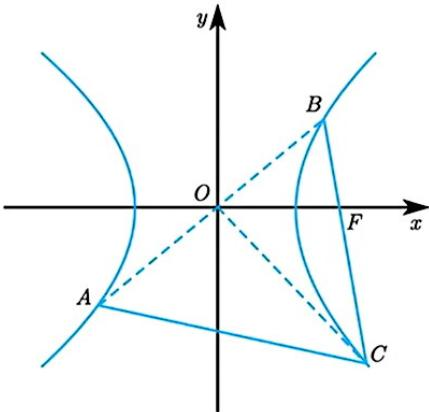
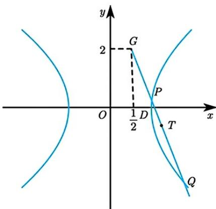
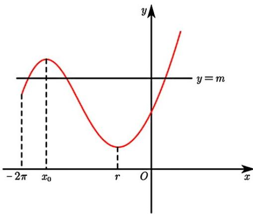

## 题目

已知复数 $z$ 满足 $\overline{z} = 1 - \mathbf{i}$ ，则 $|z^2| =$

## 选项

A．1
B．$\sqrt{2}$
C．2
D．3

## 答案

C

## 解析

$\left|\overline{z}\right|=\sqrt{2}$ ， $\left|\overline{z}^{-2}\right|=\left|z\right|\left|z\right|=2$ ，选 C.

---
qid: 2
source: 江苏省苏北六校2026届高三二模考试（附锤子解析）
number: '2'
type: choice
year: 2026
updatedAt: '1789946799'
knowledge: []
---

## 题目

设集合 $A = \{x \mid x < a\}$ , $B = \{x \mid 1 < x < 2\}$ , 若 $B \subseteq A$ , 则 $a$ 的取值范围是

## 选项

A．$a \leq 1$
B．$a \leq 2$
C．$a \geq 1$
D．$a \geq 2$

## 答案

D

## 解析

$A=\left\{x\mid x<a\right\}$ ， $B=\left\{x\mid1<x<2\right\}$ ， $B\subseteq A,\therefore a\geq2$ ，选D.

---
qid: 3
source: 江苏省苏北六校2026届高三二模考试（附锤子解析）
number: '3'
type: choice
year: 2026
updatedAt: '1789946799'
knowledge: []
---

## 题目

已知平面向量 $\vec{a} = (-1, \sqrt{3})$ ， $\vec{b} = \left(\frac{\sqrt{3}}{2}, \frac{1}{2}\right)$ . 若 $(k\vec{a} + \vec{b}) \perp (\vec{a} - 2\vec{b})$ ，则 $k = A$ . $\frac{1}{2}$ B. $-\frac{1}{2}$ C. $-2$ D. 2

## 答案

A

## 解析

$\vec{a}\cdot\vec{b}=0,\quad(k\vec{a}+\vec{b})(\vec{a}-2\vec{b})=0,\quad\therefore4k-2=0,\quad k=\frac{1}{2}$ ，选A.

---
qid: 4
source: 江苏省苏北六校2026届高三二模考试（附锤子解析）
number: '4'
type: choice
year: 2026
updatedAt: '1789946799'
knowledge: []
---

## 题目

若 $\tan \theta = -2$ ，则 $\frac{\sin \theta(1 + \sin 2\theta)}{\sin \theta + \cos \theta} =

## 选项

A．$ $\frac{2}{5}$
B．$\frac{5}{2}$
C．$-\frac{2}{5}$
D．$-\frac{5}{2}$

## 答案

A

## 解析

$\frac{\sin\theta(\sin\theta+\cos\theta)^{2}}{\sin\theta+\cos\theta}=\frac{\sin\theta(\sin\theta+\cos\theta)}{\sin^{2}\theta+\cos^{2}\theta}=\frac{\tan^{2}\theta+\tan\theta}{\tan^{2}\theta+1}=\frac{2}{5}$ ，选A.

---
qid: 5
source: 江苏省苏北六校2026届高三二模考试（附锤子解析）
number: '5'
type: choice
year: 2026
updatedAt: '1789946799'
knowledge: []
---

## 题目

圆 $x^{2} + y^{2} = 20$ 与圆 $x^{2} + y^{2} - 6x - 8y + 20 = 0$ 的公共弦长为

## 选项

A．2
B．4
C．$2\sqrt{5}$
D．$4\sqrt{5}$

## 答案

B

## 解析

公共弦 $6x + 8y - 20 = 20$ ，即 $l:3x + 4y - 20 = 0$

圆 $O$ 到 $l$ 距离 $d = \frac{20}{5} = 4$ ，弦长 $2\sqrt{20 - 16} = 4$ ，选B.

---
qid: 6
source: 江苏省苏北六校2026届高三二模考试（附锤子解析）
number: '6'
type: choice
year: 2026
updatedAt: '1789946799'
knowledge: []
---

## 题目

对于事件 $A$ 、 $B$ , $P(A) = \frac{2}{5}$ , $P(B|A) = \frac{1}{4}$ , $P(A + B) = 1$ , 则 $P(B) = A$ . 0.7 B. 0.75 C. 0.85 D. 0.9

## 答案

A

## 解析

$P(B \mid A) = \frac{P(AB)}{P(A)} = \frac{1}{4}$ ，∴ $P(AB) = \frac{1}{4} \times \frac{2}{5} = \frac{1}{10}$

$P(A+B)=P(A)+P(B)-P(AB)=\frac{2}{5}+P(B)-\frac{1}{10}=1,\therefore P(B)=\frac{7}{10},$ 选 A.

---
qid: 7
source: 江苏省苏北六校2026届高三二模考试（附锤子解析）
number: '7'
type: choice
year: 2026
updatedAt: '1789946799'
knowledge: []
---

## 题目

抛物线 $E : y^{2} = 4x$ ， $F$ 是其焦点，点 $A$ 、 $B$ 在曲线 $E$ 上，且 $\angle AFB = 120^{\circ}$ ， $C$ 为线段 $AB$ 的中点，过入

C 作 E 的准线的垂线，垂足为 D，则 $\frac{|AB|}{|CD|}$ 的最小值为

## 选项

A．$\sqrt{3}$
B．$\sqrt{2+\sqrt{3}}$
C．$\sqrt{2}$
D．3

## 答案

A

## 解析

令 AF = a, BF = b，则 $AB^{2} = a^{2} + b^{2} - 2ab\left(-\frac{1}{2}\right) = a^{2} + b^{2} + ab$ $x_{A} = a - 1, x_{B} = b - 1, \quad x_{C} = \frac{a + b - 2}{2} = \frac{a + b}{2} - 1, \quad CD = \frac{a + b}{2}$ $\frac{AB^{2}}{CD^{2}} = \frac{4(a^{2} + b^{2} + ab)}{(a + b)^{2}} = \frac{4\left[(a + b)^{2} - ab\right]}{(a + b)^{2}} = 4 - \frac{4}{\frac{a}{b} + \frac{b}{a} + 2} \geq 4 - \frac{4}{4} = 3, \quad \left(\frac{AB}{CD}\right)_{\min} = \sqrt{3}$ ，选 A.

---
qid: 8
source: 江苏省苏北六校2026届高三二模考试（附锤子解析）
number: '8'
type: choice
year: 2026
updatedAt: '1789946799'
knowledge: []
---

## 题目

已知 $\triangle ABC$ 中, $a, b, c$ 分别是角 $A, B, C$ 的对边, $\triangle ABC$ 的面积 $S = \frac{1}{4} (b^2 - ab) \tan C$ , 角 $C$ 的平分线交 $AB$ 于 $D$ 点, 且 $a = 1$ , $CD = \frac{7}{12}$ , 则 $BD = A$ . $\frac{1}{2}$ B. $\frac{3}{5}$ C. $\frac{2}{3}$ D. $\frac{3}{4}$

## 答案

D

## 解析

方法一： $S=\frac{1}{4}b(b-a)\frac{\sin C}{\cos C}=\frac{1}{2}ab\sin C,\quad\therefore 2ab\cos C=b(b-a)$ $2\sin A\cos C=\sin B-\sin A=\sin A\cos C+\sin C\cos A-\sin A,\quad\therefore \sin(A-C)=-\sin A$ $\therefore \sin(C-A)=\sin A,\quad\therefore C=2A,$ 令 $\angle A=\alpha,$ 则 $\angle ACD=\angle BCD=\alpha,$ $\angle CDB=2\alpha,\quad\therefore\triangle CDB\sim\triangle ACB,\quad\therefore\frac{CB}{BD}=\frac{AB}{BC},\quad\because\angle A=\angle ACD,\quad\therefore AD=CD=\frac{7}{12}$ $\therefore BD\left(\frac{7}{12}+BD\right)=1,\quad\therefore BD=\frac{3}{4},$ 选 D.

方法二： $a=1,CD=\frac{7}{12}$ . $S=\frac{1}{2}ab\sin C$ ，又 $S=\frac{1}{4}(b^{2}-ab)\tan C$ ， $\therefore\frac{1}{2}ab\sin C=\frac{1}{4}b(b-a)\frac{\sin C}{\cos C},\quad\therefore2a\cos C=b-a.$ 又 a=1，∴ $2\cos C = b - 1,\quad c^{2} = a^{2} + b^{2} - 2ab\cos C = 1 + b^{2} - b(b - 1) = b + 1.$ 角平分线长度公式： $CD^{2}=ab\left(1-\frac{c^{2}}{(a+b)^{2}}\right),\quad\therefore\left(\frac{7}{12}\right)^{2}=b\left(1-\frac{b+1}{(b+1)^{2}}\right)=\frac{b^{2}}{b+1},$ ∴ $144b^{2}=49b+49,\quad\therefore144b^{2}-49b-49=0,\quad\therefore b=\frac{7}{9}.\quad\therefore c^{2}=b+1=\frac{16}{9},\quad\therefore c=\frac{4}{3}.$ 由角平分线定理： $\frac{AD}{BD}=\frac{AC}{BC}=\frac{b}{a}=\frac{7}{9}$ $BD=\frac{a}{a+b}\cdot AB=\frac{1}{1+\frac{7}{9}}\cdot\frac{4}{3}=\frac{3}{4}.$ 选 D.

## 锤子拓展与深挖

1、命题背景：面积条件其实在制造一个很漂亮的边角结构一般情形下： $\frac{1}{2}ab\sin C=\frac{1}{4}b(b-a)\tan C\Rightarrow\frac{1}{2}ab\sin C=\frac{1}{4}b(b-a)\frac{\sin C}{\cos C}$ $2a\cos C = b - a$ ，于是： $c^{2} = a^{2} + b^{2} - 2ab\cos C$ ， $c^{2} = a^{2} + b^{2} - b(b - a) = a^{2} + ab = a(a + b)$ 所以本题的面积条件是把余弦定理中的 $c^{2}$ 变成： $c^{2}=a(a+b)$ 这一步是全题的结构核心.

$2a\cos C=b-a$ ，于是： $c^{2}=a^{2}+b^{2}-2ab\cos C$ ， $c^{2}=a^{2}+b^{2}-b(b-a)=a^{2}+ab=a(a+b)$ 所以本题的面积条件是把余弦定理中的 $c^{2}$ 变成： $c^{2}=a(a+b)$ 这一步是全题的结构核心。
2、一般化结论：同类题可以直接用一个公式
在同样面积条件下： $c^{2}=a(a+b)$ 角C的平分线长度为： $CD^{2}=ab\left(1-\frac{c^{2}}{(a+b)^{2}}\right)\Rightarrow CD^{2}=ab\left(1-\frac{a(a+b)}{(a+b)^{2}}\right)$ $CD^{2}=ab\cdot\frac{b}{a+b}=\frac{ab^{2}}{a+b}$ ，同时： $BD=\frac{a}{a+b}\cdot c=\frac{a}{a+b}\cdot\sqrt{a(a+b)}$ ， $BD=a\sqrt{\frac{a}{a+b}}$ 而 $CD=b\sqrt{\frac{a}{a+b}}$ ，所以： $\frac{CD}{BD}=\frac{b}{a}$ ，又 $AD=\frac{b}{a+b}\cdot c=b\sqrt{\frac{a}{a+b}}$ 因此在这个面积条件下，有一个很值得记住的隐藏结论：AD=CD
本题中： $CD=\frac{7}{12}$ ，所以其实也有： $AD=\frac{7}{12}$ 再由角平分线定理： $\frac{AD}{BD}=\frac{b}{a}=\frac{7}{9}$ ， $BD=\frac{9}{7}\cdot\frac{7}{12}=\frac{3}{4}$ 这个处理比常规展开更简单。
3、锤子改编：若把 $CD=\frac{7}{12}$ 改成CD=p，保持面积条件不变，设CD=p,BD=x
由上面的结构： $\frac{CD}{BD}=\frac{b}{a}$ ， $\frac{p}{x}=\frac{b}{a}$ ，又 $BD=a\sqrt{\frac{a}{a+b}}$ 把 $b=\frac{ap}{x}$ 代入： $x^{2}=\frac{a^{3}}{a+b}$ ， $x^{2}=\frac{a^{3}}{a+\frac{ap}{x}}$ ， $x^{2}=\frac{a^{2}x}{x+p}$ ， $x^{2}+px=a^{2}$ $x=\frac{\sqrt{p^{2}+4a^{2}}-p}{2}$ ，所以一般化结论为： $BD=\frac{\sqrt{CD^{2}+4a^{2}}-CD}{2}$ 本题 $a=1,CD=\frac{7}{12}$ ，代入： $BD=\frac{\sqrt{\left(\frac{7}{12}\right)^{2}+4}-\frac{7}{12}}{2}$ $BD=\frac{\sqrt{\frac{49}{144}+\frac{576}{144}}-\frac{7}{12}}{2}=\frac{\frac{25}{12}-\frac{7}{12}}{2}=\frac{3}{4}$ 4、推广与更高级的方法：半角公式处理角平分线
角C的平分线长度还可以用： $CD=\frac{2ab\cos\frac{C}{2}}{a+b}$ ，由面积条件： $2a\cos C=b-a,\cos C=\frac{b-a}{2a}$ 所以： $\cos^{2}\frac{C}{2}=\frac{1+\cos C}{2}$ ， $\cos^{2}\frac{C}{2}=\frac{1+\frac{b-a}{2a}}{2}=\frac{a+b}{4a}$ ， $\cos\frac{C}{2}=\sqrt{\frac{a+b}{4a}}$ 于是： $CD=\frac{2ab}{a+b}\cdot\sqrt{\frac{a+b}{4a}}$ ， $CD=b\sqrt{\frac{a}{a+b}}$ 这和角平分线长度公式得到的结果一致。本题a=1，所以： $CD=\frac{b}{\sqrt{b+1}}$ ， $\frac{7}{12}=\frac{b}{\sqrt{b+1}}$ 平方后仍然得到： $\frac{49}{144}=\frac{b^{2}}{b+1}$ ， $b=\frac{7}{9}$ ， $BD=\frac{1}{\sqrt{b+1}}=\frac{1}{\sqrt{\frac{16}{9}}}=\frac{3}{4}$

锤子点评: 一道解三角形与平面几何完美结合的题目. 大家开始看到面积公式, 肯定会联想到正弦面积公式和余弦定理, 通过代数化简把边长的关系确定下来, 得到 $c^{2} = a^{2} + ab$ 这个关键关系式. 底下对于角平分线问题, 很多同学选择用余弦定理去求 $cosC$ , 然后再求 $\cos \frac{C}{2}$ , 最后用面积法去算角平分线, 运算量超级大! 由角平分线定理结合得到的角平分线长度平方公式 $CD^{2} = ab - AD \cdot BD$ , 它与 $c^{2} = a^{2} + ab$ 简直是天作之合, 很快就把复杂的式子化为 $CD = \frac{b}{c}$ , 直接得到只含 $c$ 的方程! 此外, 如果大家对三角形的恒等式足够了解, 就会注意 $c^{2} = a^{2} + ab$ 这个条件隐藏着 $C = 2A$ 这个更值得关注的几何性质. 知道这个性质后, 配合相似三角形, 这题就转化为熟悉的初中几何题, 连角平分线公式都省了, 计算变得非常容易! 大家平时多总结这些重要结论, 考场上遇到就能直接秒杀!

---
qid: 9
source: 江苏省苏北六校2026届高三二模考试（附锤子解析）
number: '9'
type: multi
year: 2026
updatedAt: '1789946799'
knowledge: []
---

## 题目

已知一组数据由5个正整数组成，且这组数据中至少有1个8，则关于这组数据的描述可能是

## 选项

A．中位数为3且平均数为5
B．平均数为4且众数为4
C．平均数为4且方差为3.2
D．中位数为5且方差不小于7.2

## 答案

ABD

## 解析

3,3,3,8,8中位数为3，平均数为5，A对.

1,3,4,4,8平均数为4，众数为4，B对.

$S^2 = \frac{1}{5}\left[\left(x_1 - 4\right)^2 + \left(x_2 - 4\right)^2 + \left(x_3 - 4\right)^2 + \left(x_4 - 4\right)^2 + \left(8 - 4\right)^2\right] = \frac{16}{15} + \sum_{i=1}^{4}\left(x_i - 4\right)^2 > 3.2$ ，C 错.

1,1,1,5,8平均数3.2，方差 $S^{2}=\frac{1}{5}\left(2.2^{2}\times3+1.8^{2}+4.8^{2}\right)>7.2$ ，D对，选ABD.

---
qid: 10
source: 江苏省苏北六校2026届高三二模考试（附锤子解析）
number: '10'
type: multi
year: 2026
updatedAt: '1789946799'
knowledge: []
---

## 题目

如图, 在长方体 $ABCD - A_{1}B_{1}C_{1}D_{1}$ 中, $AD = AA_{1} = 1$ , $AB = 2$ , 点 $P$ 是棱 $AA_{1}$ 上的动点 (不含端点), 过点 $D_{1}, B, P$ 作长方体的截面, 并将长方体分成上下两部分, 体积分别为 $V_{1}, V_{2}$ , 则

## 选项

A．截面是平行四边形
B．若 $\frac{A_{1}P}{PA} = \frac{2}{3}$ , 则 $\frac{V_{1}}{V_{2}} = \frac{2}{3}$
C．存在点 $P$ , 使得截面为长方形
D．截面的面积存在最小值 $\frac{2\sqrt{30}}{5}$

## 答案

AD

## 解析

以 $A$ 为原点, $AB, AD, AA_{1}$ 分别为 $x, y, z$ 轴, 设 $P(0,0,t), 0 < t < 1$ , $B(2,0,0), D_{1}(0,1,1)$ , 平面 $D_{1}BP$ 的方程为 $tx + 2(t - 1)y + 2z = 2t$ 令 $x = 2, y = 1$ , 得 $z = 1 - t$ , 设 $m(2,1,1 - t)$ , 则截面为 $PBmD_{1}$ , $\overrightarrow{PB} = (2,0,-t), \overrightarrow{D_{1}m} = (2,0,-t), \overrightarrow{PD_{1}} = (0,1,1 - t), \overrightarrow{Bm} = (0,1,1 - t)$ 所以 $PB // D m, PD // B m$ . 截面为平行四边形。A 正确:

所以 $PB \parallel D_1m, PD_1 \parallel Bm$ ，截面为平行四边形，A 正确；

底面 ABCD 沿 BD 分成两个面积均为 1 的三角形，下方体积为 $1 \cdot \frac{t + 0 + 1}{3} + 1 \cdot \frac{0 + (1 - t) + 1}{3} = 1$ 长方体体积为 2，所以上下两部分体积均为 1， $\frac{V_{1}}{V_{2}} = 1 \neq \frac{2}{3}$ ，B 错误； $\overrightarrow{PB} \cdot \overrightarrow{PD_{1}} = (2, 0, -t) \cdot (0, 1, 1 - t) = -t (1 - t) \neq 0$ 故截面不能为长方形，C 错误；

$$
S = \sqrt {t ^ {2} + 4 (1 - t) ^ {2} + 4}, S ^ {2} = 5 t ^ {2} - 8 t + 8 = 5 \left(t - \frac {4}{5}\right) ^ {2} + \frac {2 4}{5}
$$

因 $\frac{4}{5} \in (0,1)$ ，所以 $S_{min} = \sqrt{\frac{24}{5}} = \frac{2\sqrt{30}}{5} D$ 正确；故选AD.

$$
\left\{a _ {n} \right\}
$$

$$
S _ {n}
$$

$$
\lambda \geq \frac {a _ {n + 1}}{S _ {n}}
$$

$$
\{a _ {n} \}
$$

$$
\{a _ {n} \}
$$

$$
\{a _ {n} \}
$$

$$
\left\{a _ {n} \right\}
$$

$$
\left\{a _ {n} \right\}
$$

$$
n (n \geq 2), a _ {n} \leq 2 \cdot 3 ^ {n - 2}
$$

$$
1 <   p <   q, a _ {n} = \frac {p ^ {n - 1} + q ^ {n - 1}}{2}
$$

$$
" 1 + \lambda \geq q"
$$

$$
\left. ^ {\prime \prime} \left\{a _ {n} \right\} \right.
$$

【锤子数学解析】方法一： $d=2,\quad a_{n}=2n-1,\quad a_{n+1}=2n+1,\quad S_{n}=n^{2}$ ， $\frac{2n+1}{n^{2}}=\frac{2}{n}+\frac{1}{n^{2}}\leq2+1=3$ ，即 $3\geq\frac{a_{n+1}}{S_{n}}$ ，∴ $\left\{a_{n}\right\}$ 是3-数列，A对. $a_{n}=1$ 时， $S_{n}=n,\quad\frac{a_{n+1}}{S_{n}}=\frac{1}{n}\leq1<2,\quad\therefore\left\{a_{n}\right\}$ 是2-数列，则 $\left\{a_{n}\right\}$ 可以是常数列，B对. $\left\{a_{n}\right\}$ 是2-数列，则 $a_{n+1}\leq2S_{n}$ 且 $S_{1}=1,\quad S_{n+1}=S_{n}+a_{n+1}\leq S_{n}+2S_{n}=3S_{n}$ $\therefore S_{n}\leq3S_{n-1}\leq3^{2}S_{n-2}\cdots\leq3^{n-1}S_{1},\quad\therefore S_{n}\leq3^{n-1},\quad n\geq2$ 时， $a_{n}\leq2S_{n-1}$ $\therefore S_{n-1}\leq3^{n-2}$ 即 $a_{n}\leq2\cdot3^{n-2}$ 不存在 $n\geq2,\quad a_{n}>2\cdot3^{n-2}$ ，C对，选ABC.

$$
a _ {n} = 1 + 2 (n - 1) = 2 n - 1, S _ {n} = \frac {n (1 + 2 n - 1)}{2} = n ^ {2}
$$

$\frac{a_{n+1}}{S_n} = \frac{2n + 1}{n^2}, 3 - \frac{2n + 1}{n^2} = \frac{3n^2 - 2n - 1}{n^2} = \frac{(3n + 1)(n - 1)}{n^2} \geq 0.$ 所以 $\frac{a_{n+1}}{S_n} \leq 3$ ，A 正确.

对 B，取 $a_{n}=1$ ，则 $S_{n}=n$ ， $\frac{a_{n+1}}{S_{n}}=\frac{1}{n}\leq2$ ，所以常数列可以是 2-数列，B 正确.

$$
\mathrm{C},
$$

$$
a _ {n}
$$

$$
\frac {a _ {n + 1}}{S _ {n}} \leq 2 \Rightarrow a _ {n + 1} \leq 2 S _ {n}, S _ {n + 1} = S _ {n} + a _ {n + 1} \leq 3 S _ {n}
$$

$$
S _ {1} = a _ {1} = 1
$$

$$
S _ {n - 1} \leq 3 ^ {n - 2} (n \geq 2), a _ {n} \leq 2 S _ {n - 1} \leq 2 \cdot 3 ^ {n - 2}. C
$$

对D， $S_{n} = \frac{1}{2}\left(\frac{p^{n} - 1}{p - 1} +\frac{q^{n} - 1}{q - 1}\right),\frac{a_{n + 1}}{S_n} = \frac{p^n + q^n}{\frac{p^n - 1}{p - 1} + \frac{q^n - 1}{q - 1}}.$

且 $n \to \infty \Rightarrow \frac{a_{n+1}}{S_n} \to q - 1$ , 所以 $\lambda \geq q - 1$ 只是必要条件. 取 $p = 2, q = 3, \lambda = 2$ , 则 $1 + \lambda = 3 = q$ , 但 $a_1 = 1, a_2 = \frac{2 + 3}{2} = \frac{5}{2}, S_1 = 1, \frac{a_2}{S_1} = \frac{5}{2} > 2 = \lambda$ . 所以 $a_n$ 不是 2- 数列, D 错误. 故选 ABC.

## 锤子拓展与深挖

1、命题背景：新定义本质是和式递推 $\frac{a_{n+1}}{S_n} \leq \lambda \Leftrightarrow a_{n+1} \leq \lambda S_n$ .

于是 $S_{n + 1} = S_n + a_{n + 1}\leq (1 + \lambda)S_n.$ 令 $c_{n} = \frac{S_{n + 1}}{S_{n}}$ ，则 $c_{n} = 1 + \frac{a_{n + 1}}{S_n}\leq 1 + \lambda .$

所以 $S_{n}=S_{1}c_{1}c_{2}\cdots c_{n-1}\leq(1+\lambda)^{n-1}$ . 又 $a_{n}\leq\lambda S_{n-1}$ ，因此 $a_{n}\leq\lambda(1+\lambda)^{n-2}(n\geq2)$ .
本题 C 就是取 $\lambda=2: a_{n}\leq2\cdot3^{n-2}$ .

## 2、一般化结论：

若 $a_{n}$ 为首项为1的正项 $\lambda-$ 数列, 则 $S_{n} \leq (1 + \lambda)^{n-1}, a_{n} \leq \lambda (1 + \lambda)^{n-2} (n \geq 2)$ . 等号可取, 例如 $a_{n+1} = \lambda S_{n}$ . 此时 $S_{n+1} = (1 + \lambda)S_{n}, S_{n} = (1 + \lambda)^{n-1}, a_{n} = S_{n} - S_{n-1} = \lambda (1 + \lambda)^{n-2} (n \geq 2)$ . 所以 C 选项中的结论不仅正确, 而且是最紧的形式: $a_{n} \leq 2 \cdot 3^{n-2}$ .

3、对 D 选项的完整深挖：设 $a_{n}=\frac{p^{n-1}+q^{n-1}}{2},1<p<q.$ 则 $\frac{a_{n+1}}{S_{n}}=\frac{p^{n}+q^{n}}{\frac{p^{n}-1}{p-1}+\frac{q^{n}-1}{q-1}}.$

因为 $\frac{a_2}{S_1} = \frac{p + q}{2}$ , 所以必须有 $\lambda \geq \frac{p + q}{2}$ . 又 $n \to \infty \Rightarrow \frac{a_{n+1}}{S_n} \to q - 1$ , 所以还必须有 $\lambda \geq q - 1$ .

因此 $\lambda \geq max\left\{\frac{p + q}{2}, q - 1\right\}$ . 事实上，这就是准确范围： $\lambda_{min} = max\left\{\frac{p + q}{2}, q - 1\right\}$ .

进一步化成分段形式： $\lambda_{min} = \left\{ \begin{array}{l} \frac{p + q}{2}, 0 < q - p \leq 2 \\ q - 1, q - p \geq 2 \end{array} \right.$

当 $0 < q - p \leq 2$ 时，令 $d = q - p$ ， $m = \frac{p + q}{2}$

$$
m \left(\frac {p ^ {n} - 1}{p - 1} + \frac {q ^ {n} - 1}{q - 1}\right) - (p ^ {n} + q ^ {n}) = \frac {(d + 2) p ^ {n} - (p + q)}{2 (p - 1)} + \frac {(2 - d) q ^ {n} - (p + q)}{2 (q - 1)}.
$$

因为 $p^n \geq p, q^n \geq q, 2 - d \geq 0$ ，所以 $\frac{(d + 2)p^n - (p + q)}{2(p - 1)} + \frac{(2 - d)q^n - (p + q)}{2(q - 1)} \geq \frac{d}{2} - \frac{d}{2} = 0.$

所以 $\frac{a_{n + 1}}{S_n}\leq \frac{p + q}{2}.$ 当 $q - p\geq 2$ 时， $q - 1\geq p + 1,$

$$
(q - 1) \left(\frac {p ^ {n} - 1}{p - 1} + \frac {q ^ {n} - 1}{q - 1}\right) - (p ^ {n} + q ^ {n}) = (q - 1) \frac {p ^ {n} - 1}{p - 1} - p ^ {n} - 1 \geq (p + 1) \frac {p ^ {n} - 1}{p - 1} - p ^ {n} - 1 = \frac {2 (p ^ {n} - p)}{p - 1} \geq 0.
$$

$$
\frac {a _ {n + 1}}{S _ {n}} \leq q - 1
$$

因此 D 选项若想改成正确命题，应改为： $\lambda \geq \max\left\{\frac{p+q}{2}, q-1\right\}$ 是 $a_{n}$ 为 $\lambda-$ 数列的充要条件.

4、锤子改编：若题目改为： $a_{n}$ 为首项为1的正项数列，且 $\frac{a_{n+1}}{S_{n}} \leq k (k > 0)$ ,

则 $S_{n + 1}\leq (1 + k)S_n,S_n\leq (1 + k)^{n - 1},a_n\leq kS_{n - 1}\leq k(1 + k)^{n - 2}(n\geq 2).$

当 $a_{n + 1} = kS_n$ 时， $a_{n} = k(1 + k)^{n - 2}(n\geq 2)$ ，所以这个结论可以直接用于同类题： $a_{n}\leq k(1 + k)^{n - 2}$

锤子点评: 这题将近期最热门的数列新定义问题放在多选第 11 题进行考查, 难度真心不低, 堪比一道数列大题压轴题的难度! 其中对新定义不等式的分析是关键, 借此容易解决 A 选项与 B 选项. A 选项与 B 选项非常人性化, 直接代入等差数列和常数列的模型, 通过简单的分离常数就可以计算出最大值, 判断起来十分简单. C 选项更是将数列的递推与放缩掺杂在里面, 大家要有构造累乘的意识, 发现 $a_{n+1} \leq 2S_n$ 就是关键, 很快就能确定出前 $n$ 项和与通项的指数型范围! 更值得注意的是 D 选项, 这不仅考查了等比数列求和, 更深挖了无穷极限的本质. 大家在处理这种充分必要条件时, 要学会定性分析与极限思维, 必要性通过求极限 $n \to +\infty$ 很快就能得出, 而充分性通过举一个特例就能轻松否定! 本题属于不折不扣的大杂烩, 涵盖了数列放缩、数列递推, 并和简易逻辑结合在一起考查, 应有尽有, 可想大家计算的有多复杂. 大家只要一步一步细梳慢捋, 就可以解决!

---
qid: 11
source: 江苏省苏北六校2026届高三二模考试（附锤子解析）
number: '11'
type: choice
year: 2026
updatedAt: '1789946799'
knowledge: []
---

## 题目

$\{a_{n}\}$ 为首项为 1 的正项数列, 前 $n$ 项和为 $S_{n}$ , 若存在实数 $\lambda$ 使得 $\lambda \geq \frac{a_{n+1}}{S_{n}}$ , 则称该数列为 “ $\lambda$ -数列”, 则下列说法中正确的有 ( )

## 选项

A．若 $\{a_{n}\}$ 是公差为 2 的等差数列, 则 $\{a_{n}\}$ 是 “3-数列”
B．若 $\{a_{n}\}$ 是 “2-数列”, 则 $\{a_{n}\}$ 可以是常数列
C．若 $\{a_{n}\}$ 是 “2-数列”, 则对任意的正整数 $n (n \geq 2)$ , $a_{n} \leq 2 \cdot 3^{n-2}$
D．对任意的 $1 < p < q$ , $a_{n} = \frac{p^{n-1} + q^{n-1}}{2}$ , 则 “ $1 + \lambda \geq q$ ” 是 “ $\{a_{n}\}$ 是 “ $\lambda$ -数列”” 的充要条件

---
qid: 12
source: 江苏省苏北六校2026届高三二模考试（附锤子解析）
number: '12'
type: blank
year: 2026
updatedAt: '1789946799'
knowledge: []
---

## 题目

$(1 + 2x)^{5}$ 的展开式中 $x^{2}$ 的系数为

## 答案

40

## 解析

$(1+2x)^{5}$ 展开式第 $r+1$ 项 $T_{r+1}=C_{5}^{r}(2x)^{r}=C_{5}^{r}2^{r}x^{r},\quad r=2,\quad C_{5}^{2}2^{2}=10\times4=40$ ，即 $x^{2}$ 系数40.

---
qid: 13
source: 江苏省苏北六校2026届高三二模考试（附锤子解析）
number: '13'
type: blank
year: 2026
updatedAt: '1789946799'
knowledge: []
---

## 题目

已知椭圆 $C: \frac{x^2}{a^2} + \frac{y^2}{b^2} = 1 (a > b > 0)$ , 直线 $l$ 过坐标原点并交椭圆于 $P$ , $Q$ 两点 ( $P$ 在第一象限), 点 $A$ 是 $x$ 轴正半轴上一点, 其横坐标是点 $P$ 横坐标的 2 倍, 直线 $QA$ 交椭圆于点 $B$ , 若直线 $BP$ 恰好是以 $PQ$ 为直径的圆的切线, 则椭圆的离心率为 \_\_\_\_.

## 答案

$\frac{\sqrt{6}}{3}$

## 解析

设 $P(x_{1},y_{1}),Q(-x_{1}, - y_{1}),B(x_{2},y_{2}),A(2x_{1},0),k_{QB}k_{PB} = -\frac{b^{2}}{a^{2}}$ ①

$$
k _ {P Q} k _ {P B} = - 1 \textcircled {2}, k _ {P Q} = \frac {y _ {1}}{x _ {1}}, k _ {B Q} = k _ {A Q} = \frac {- y _ {1}}{- x _ {1} - 2 x _ {1}} = \frac {y _ {1}}{3 x _ {1}} = \frac {1}{3} k _ {P Q}
$$

$$
\frac {k _ {Q B}}{k _ {P O}} = \frac {b ^ {2}}{a ^ {2}}, \therefore \frac {b ^ {2}}{a ^ {2}} = \frac {1}{3}, \frac {c ^ {2}}{a ^ {2}} = \frac {2}{3}, e = \frac {\sqrt {6}}{3}
$$

---
qid: 14
source: 江苏省苏北六校2026届高三二模考试（附锤子解析）
number: '14'
type: blank
year: 2026
updatedAt: '1789946799'
knowledge: []
---

## 题目

若函数 $f(x)=x(2^{-x}-a)-|x-1|$ 有且仅有一个零点 $x_{0}$ ，且 $x_{0}>0$ ，则实数 a 的取值范围 \_\_\_\_

## 答案

$(-∞,-1]∪\left\{\frac{1}{2}\right\}$

## 解析

方法一： $f(x)=0$ 即 $x(2^{-x}-a)=|x-1|$ ，即 $a=2^{-x}-\frac{|x-1|}{x}$ 有且仅有一个正根 0<x<1 时， $2^{-x}-\frac{|x-1|}{x}=2^{-x}-\frac{1-x}{x}=2^{-x}-\frac{1}{x}+1$ ， $g(x)=\frac{1}{2^{x}}-\frac{1}{x}+1(0<x<1)$ $g'(x)=\frac{1}{x^{2}}-\frac{\ln2}{2^{x}}>0$ ， $g(x)$ 在 $(0,1)$ 单调递增， $g(1)=\frac{1}{2}$ $x\to-\infty$ 时， $g(x)\to-\infty$ ，∴ $g(x)\in(-∞,\frac{1}{2})$ $x\geq1$ 时， $2^{-x}-\frac{|x-1|}{x}=2^{-x}+\frac{1}{x}-1$ ， $h(x)=2^{-x}+\frac{1}{x}-1$ 在 $[1,+∞)$ 单调递减，

$h(1)=\frac{1}{2},\quad x\to+\infty$ 时， $h(x)\to-1,\quad\therefore h(x)\in\left(-1,\frac{1}{2}\right],\quad\therefore a\in(-\infty,-1]\cup\left\{\frac{1}{2}\right\}.$

方法二：因为 $f(0) = -1 \neq 0$ ，令 $a = \varphi(x) = 2^{-x} - \frac{|x-1|}{x}, x \neq 0$ .

当 $x > 0$ 时， $\varphi (x) = \left\{ \begin{array}{ll}2^{-x} + 1 - \frac{1}{x}, & 0 < x < 1\\ 2^{-x} - 1 + \frac{1}{x}, & x\geq 1 \end{array} \right.$ ，当 $0 <   x <   1$ 时， $\varphi^{\prime}(x) = -(\ln 2)2^{-x} + \frac{1}{x^{2}} >0,$

且 $x \to 0^{+} \Rightarrow \varphi(x) \to -\infty, x \to 1^{-} \Rightarrow \varphi(x) \to \frac{1}{2}$ , 所以 $\varphi(x) \in \left(-\infty, \frac{1}{2}\right)$ .

当 $x \geq 1$ 时， $\varphi'(x) = -(\ln 2)2^{-x} - \frac{1}{x^2} < 0$ ，且 $\varphi(1) = \frac{1}{2}, x \to +\infty \Rightarrow \varphi(x) \to -1,$

所以 $\varphi (x)\in \left(-1,\frac{1}{2}\right]$ .因此正零点个数为 $N_{+}(a) = \left\{ \begin{array}{l}1,a\leq -1\\ 2, - 1 <   a <   \frac{1}{2}\\ 1,a = \frac{1}{2}\\ 0,a > \frac{1}{2} \end{array} \right.$

当 $x < 0$ 时， $\varphi(x) = 2^{-x} + 1 - \frac{1}{x} > 1 + 1 = 2.$ 所以当 $a \leq -1$ 或 $a = \frac{1}{2}$ 时， $x < 0$ 无零点.

综上， $a\in (-\infty , - 1]\cup \left\{\frac{1}{2}\right\} .$

## 锤子拓展与深挖

## 1、命题背景：绝对值分段与参数分离

本题关键是把零点问题转化为 $f(x) = 0 \Leftrightarrow a = 2^{-x} - \frac{|x - 1|}{x}$ . 绝对值的分界点是 $x = 1$ , 零点不能取 $x = 0$ , 所以自然分成三段: $x < 0, 0 < x < 1, x \geq 1$ .

正半轴两段为 $\varphi(x) = 2^{-x} + 1 - \frac{1}{x}, 0 < x < 1, \varphi(x) = 2^{-x} - 1 + \frac{1}{x}, x \geq 1$ .

两段的值域分别为 $\left(-\infty, \frac{1}{2}\right), \left(-1, \frac{1}{2}\right]$ ,

所以水平直线 y = a 与正半轴图像交点个数直接确定.

## 2、完整零点个数深挖：

负半轴不是可有可无，题目说函数 $f(x)$ 有且仅有一个零点，所以负半轴必须排除.

令 $x = -u, u > 0$ ，则 $\varphi(-u) = 2^u + 1 + \frac{1}{u}$ .

设 $\varphi(u) = 2^u + 1 + \frac{1}{u}, u > 0$ . 则 $\varphi'(u) = (ln2)2^u - \frac{1}{u^2}, \varphi''(u) = (ln2)^22^u + \frac{2}{u^3} > 0$ .

所以 $\varphi(u)$ 只有一个导函数零点. 设该导函数零点为 $u_{1}$ , 则 $u_{1}^{2} 2^{u_{1}} \ln 2 = 1$ .

负半轴对应的最小值为 $a_1 = 2^{u_1} + 1 + \frac{1}{u_1}$ .

于是负半轴零点个数为 $N(a) = \begin{cases} 0, & a < a_{1} \\ 1, & a = a_{1} \end{cases}$ 又因为 $x < 0 \Rightarrow \varphi(x) > 2,$ $2, a > a_{1}$

所以本题最终留下的 $a \leq -1$ 和 $a = \frac{1}{2}$ ，都不会在负半轴产生零点.

3、推广：把底数2改成任意 $p > 1$ 若 $F_{p}(x) = x(p^{-x} - a) - |x - 1|, p > 1$ , 且 $F_{p}(x)$ 有且仅有一个零点 $x_{0}$ , 并且 $x_{0} > 0$ . 同样令 $a = \varphi_{p}(x) = p^{-x} - \frac{|x - 1|}{x}$ . 当 $0 < x < 1$ 时, $\varphi_{p}(x) = p^{-x} + 1 - \frac{1}{x}, \varphi_{p}^{'}(x) = -(lnp)p^{-x} + \frac{1}{x^{2}}$ . 令 $s = xlnp > 0$ , 则 $(lnp)x^{2}p^{-x} = x \cdot se^{-s} < 1$ , 所以 $\varphi_{p}^{'}(x) > 0$ . 又 $x \to 0^{+} \Rightarrow \varphi_{p}(x) \to -\infty, x \to 1^{-} \Rightarrow \varphi_{p}(x) \to \frac{1}{p}$ , 所以 $\varphi_{p}(x) \in (-\infty, \frac{1}{p})$ . 当 $x \geq 1$ 时, $\varphi_{p}(x) = p^{-x} - 1 + \frac{1}{x}, \varphi_{p}^{'}(x) = -(lnp)p^{-x} - \frac{1}{x^{2}} < 0$ , 且 $\varphi_{p}(1) = \frac{1}{p}, x \to +\infty \Rightarrow \varphi_{p}(x) \to -1$ , 所以 $\varphi_{p}(x) \in (-1, \frac{1}{p})$ . 当 $x < 0$ 时, $\varphi_{p}(x) = p^{-x} + 1 - \frac{1}{x} > 2$ . 因此推广结论为 $a \in (-\infty, -1] \cup \left\{\frac{1}{p}\right\}$ . 原题取 $p = 2$ , 即 $a \in (-\infty, -1] \cup \left\{\frac{1}{2}\right\}$ .

锤子点评: 条件读起来人畜无害, 实际上隐藏了杀机, 这是典型的复合绝对值与指数函数的交点问题. 直接讨论极其容易崩溃, 处理这题的关键就是果断参变分离! 首先注意到 0 显然不是方程的根, 直接两边同除以 $x$ , 转化成直线 $y = a$ 与函数 $g(x)$ 的交点问题. 这题属于动中取静的题目, 这里的动指的是直线平移, 这里的静指的是曲线交点个数, 数形结合是关键! 更值得注意的地方在于 $x < 0$ 时的隐藏保护机制: 因为此时指数部分大于 1 , 反比例部分也是正的, 导致 $g(x)$ 恒大于 2 , 直接排除了负半轴出现交点的可能. 这样大家只需要看 $x > 0$ 的部分. 在 $x > 0$ 时, 以 $x = 1$ 为分界线, 函数先增后减, 最高点在 $\left(1, \frac{1}{2}\right)$ 处. 要使直线与函数图像只有一个交点, 要么刚好经过最高点, 这对应 $a = \frac{1}{2}$ ; 要么直接降到右侧渐近线 $y = -1$ 及其下方, 这对应 $a \leq -1$ . 特别是 $a \leq -1$ 这一段, 平时如果不习惯看 $x \to +\infty$ 时的极限趋势, 极容易漏掉这一整段范围! 平时遇到含绝对值的函数零点问题, 只要去绝对值分段、求导看单调性、看极限找趋势这三点做到了, 答案很快就出来了!

---
qid: 15
source: 江苏省苏北六校2026届高三二模考试（附锤子解析）
number: '15'
type: answer
year: 2026
updatedAt: '1789946799'
knowledge: []
---

## 题目

（13分）已知 $f(x) = \sqrt{3}\cos 2x + 2\sin \left(\frac{3\pi}{2} + x\right)\sin (\pi - x), \quad x \in \mathbb{R}$ .

(1) 求 $y = f(x)$ 的最小正周期和单调增区间；

(2) 已知锐角 $\triangle ABC$ 的内角 $A$ 、 $B$ 、 $C$ 的对边分别为 $a, b, c$ ，且 $f(A) = -\sqrt{3}$ ， $a = 2$ ，求 $BC$ 边上的高的最大值.

## 解析

（1） $f(x) = \sqrt{3} \cos 2x - 2 \cos x \sin x = \sqrt{3} \cos 2x - \sin 2x = 2 \cos \left(2x + \frac{\pi}{6}\right)$ $\therefore f(x)$ 的最小正周期 $T = \frac{2\pi}{2} = \pi$ ，令 $-\pi + 2k\pi \leq 2x + \frac{\pi}{6} \leq 2k\pi \Rightarrow -\frac{7\pi}{12} + k\pi \leq x \leq -\frac{\pi}{12} + k\pi$ $\therefore f(x)$ 的单调区间为 $\left[-\frac{7\pi}{12} + k, -\frac{\pi}{12} + k\pi\right], k \in \mathbf{Z}$ .

（2）由 $f(A) = 2 \cos \left(2A + \frac{\pi}{6}\right) = -\sqrt{3} \Rightarrow \cos \left(2A + \frac{\pi}{6}\right) = -\frac{\sqrt{3}}{2}$

$\because \triangle ABC$ 为锐角三角形， $\therefore 0 < A < \frac{\pi}{2} \Rightarrow \frac{\pi}{6} < 2A + \frac{\pi}{6} < \frac{7\pi}{6}$

$\therefore 2A + \frac{\pi}{6} = \frac{5\pi}{6}\Rightarrow A = \frac{\pi}{3}, BC$ 边上的高 $h = \frac{bc\sin A}{a} = \frac{\sqrt{3}}{4} bc$

$$
b ^ {2} + c ^ {2} - 2 b c \cdot \frac {1}{2} = 4, \quad 4 = b ^ {2} + c ^ {2} - b c \geq 2 b c - b c = b c
$$

∴ $bc \leq 4$ ，当且仅当 b = c = 2 时取 “=”，∴ $h \leq \sqrt{3}$ ， $h_{\max} = \sqrt{3}$ .

---
qid: 16
source: 江苏省苏北六校2026届高三二模考试（附锤子解析）
number: '16'
type: answer
year: 2026
updatedAt: '1789946799'
knowledge: []
---

## 题目

（15 分）某投篮比赛分为两个阶段，每个参赛队由两名队员组成，比赛具体规则如下：第一阶段由参赛队中一名队员投篮 3 次，若 3 次都未投中，则该队被淘汰，比赛成绩为 0 分；若至少投中一次，则该队进入第二阶段，由该队的另一名队员投篮 3 次，每次投中得 5 分，未投中得 0 分，该队的比赛成绩为第二阶段的得分总和。某参赛队由甲乙两名队员组成，设甲每次投中的概率为 $p$ ，乙每次投中的概率为 $q$ ，各次投中与否相互独立。

(1) 若 $p = 0.5, q = 0.6$ , 甲参加第一阶段比赛, 在该队成绩为 0 分的情况下, 求甲第一阶段被淘汰的概率;

（2）若 $0 < p < q$ ，试分析：应该由谁参加第一阶段的比赛，比赛成绩更好？

## 解析

（1）记事件 $A$ 为该队比赛成绩为0，事件 $B$ 为甲第一阶段被淘汰

$$
\therefore P (B \mid A) = \frac {P (A B)}{P (A)} = \frac {\left(1 - \frac {1}{2}\right) ^ {3}}{\left(1 - \frac {1}{2}\right) ^ {3} + \left[ 1 - \left(1 - \frac {1}{2}\right) ^ {3} \right] \left(1 - \frac {3}{5}\right) ^ {3}} = \frac {1 2 5}{1 8 1}
$$

（2）由甲、乙先参加第一阶段的比赛，得分 $XY$ 的所有可能取值为：0,5,10,15

$$
P (X = 0) = (1 - p) ^ {3} + [ 1 - (1 - p) ^ {3} ] (1 - q) ^ {3}, \quad P (X = 5) = [ 1 - (1 - p) ^ {3} ] C _ {3} ^ {1} q (1 - q) ^ {2}
$$

$$
P (X = 1 0) = \left[ 1 - (1 - p) ^ {3} \right] C _ {3} ^ {2} q ^ {2} (1 - q), \quad P (X = 1 5) = \left[ 1 - (1 - p) ^ {3} \right] \cdot q ^ {3}
$$

$$
\therefore E (X) = 5 \left[ 1 - (1 - p) ^ {3} \right] \left[ 0 \cdot (1 - q) ^ {3} + C _ {3} ^ {1} q (1 - q) ^ {2} + 2 C _ {3} ^ {2} q ^ {2} (1 - q) + 3 C _ {3} ^ {3} \cdot q ^ {3} \right]
$$

$$
\therefore E (X) = 5 \left[ 1 - (1 - p) ^ {3} \right] \cdot 3 q = 1 5 \left(p ^ {3} - 3 p ^ {2} + 3 p\right) q,
$$

同理 $E(Y) = 15(q^3 - 3q^2 + 3q)p$

$$
E (X) - E (Y) = 1 5 \left(p ^ {3} q - p q ^ {3} - 3 p ^ {2} q + 3 p q ^ {2}\right) = 1 5 \left[ p q (p + q) (p - q) - 3 p q (p - q) \right]
$$

$$
= 1 5 (p - q) p q (p + q - 3) > 0
$$

$\therefore E(X) > E(Y)$ ， $\therefore$ 应该由甲参加第一阶段比赛.

---
qid: 17
source: 江苏省苏北六校2026届高三二模考试（附锤子解析）
number: '17'
type: answer
year: 2026
updatedAt: '1789946799'
knowledge: []
---

## 题目

(15分)如图,在四棱锥 $P - ABCD$ 中, $PA \perp$ 平面 $ABCD$ , $AB \perp AD$ , $AB + AD = 3$ , $AB = AP$ , $CD = 2$ , $\angle CDA = 45^{\circ}$ .

(1) 证明: 平面 $PAB \perp$ 平面 $PAD$ ;

(2) 若直线 $PB$ 与平面 $PCD$ 所成的角为 $30^{\circ}$ , 求线段 $AB$ 的长;

（3）是否存在线段 $AD$ 上一点 $\pmb{E}$ ，使得 $\pmb{E}$ 到点 $P, B, C, D$ 的距离都相等？说明理由.

## 解析

(1) 证明: $\because PA \perp$ 平面 $ABCD$ , $\therefore PA \perp AB$ , 又 $\because AB \perp AD$ , $PA \cap AD = A$

∴ AB ⊥ 平面 PAD，又∵ AB ⊂ 平面 PAB，∴ 平面 PAB ⊥ 平面 PAD

(2) 如图建系, 设 ${AB} = m$ , $\therefore {AD} = 3 - m,{PA} = m$ ,

$$
P (0, 0, m), B (m, 0, 0), D (0, 3 - m, 0), C (\sqrt {2}, 3 - m - \sqrt {2}, 0)
$$

$$
\therefore \overrightarrow {P B} = (m, 0, - m), \overrightarrow {P D} = (0, 3 - m, - m), \overrightarrow {C D} = (- \sqrt {2}, \sqrt {2}, 0)
$$

设平面 $PCD$ 的一个法向量 $\vec{n} = (x, y, z)$ , $\therefore \begin{cases} (3 - m)y - mz = 0 \\ -\sqrt{2}x + \sqrt{2}y = 0 \end{cases} \Rightarrow \vec{n} = (m, m, 3 - m)$

$$
\therefore \sin 3 0 ^ {\circ} = \frac {| \overrightarrow {P B} \cdot \vec {n} |}{| \overrightarrow {P B} | | \vec {n} |} = \frac {| m ^ {2} - m (3 - m) |}{\sqrt {2} m \cdot \sqrt {2 m ^ {2} + (3 - m) ^ {2}}} = \frac {1}{2} \Rightarrow \frac {| 2 m - 3 |}{\sqrt {2} \sqrt {3 m ^ {2} - 6 m + 9}} = \frac {1}{2}
$$

$\Rightarrow 5m^{2} - 18m + 9 = 0 \Rightarrow (5m - 3)(m - 3) = 0, \because 0 < m < 3, \therefore m = \frac{3}{5}$ , 即 $AB = \frac{3}{5}$

（3）设 $AB = m$ ，假设存在这样的 $E(0,t,0)$ 符合题意， $0\leq t\leq 3 - m$

$$
E C = E D, \therefore \angle E C D = \angle C D A = 4 5 ^ {\circ}, \therefore C E \perp D E
$$

此时 $AE = 3 - m - \sqrt{2}$ ， $ED = \sqrt{2}$

$$
E P = E B = \sqrt {A B ^ {2} + A E ^ {2}} = \sqrt {m ^ {2} + (3 - m - \sqrt {2}) ^ {2}} = E D = \sqrt {2}
$$

$$
\Rightarrow 2 m ^ {2} + (2 \sqrt {2} - 6) m + 9 - 6 \sqrt {2} = 0 \Rightarrow m = \frac {6 - 2 \sqrt {2} \pm 2 \sqrt {6 \sqrt {2} - 7}}{4} = \frac {3 - \sqrt {2} \pm \sqrt {6 \sqrt {2} - 7}}{2}
$$

当 $m = \frac{3 - \sqrt{2} \pm \sqrt{6\sqrt{2} - 7}}{2}$ 时， $\exists E(0, 3 - m - \sqrt{2}, 0)$ 符合题意

当 $m \neq \frac{3 - \sqrt{2} \pm \sqrt{6\sqrt{2} - 7}}{2}$ 时，则不存在这样的 $E$ 。

---
qid: 18
source: 江苏省苏北六校2026届高三二模考试（附锤子解析）
number: '18'
type: answer
year: 2026
updatedAt: '1789946799'
knowledge: []
---

## 题目

（17分）已知双曲线 $E: \frac{x^2}{a^2} - \frac{y^2}{b^2} = 1 (a > 0, b > 0)$ 的右焦点为 $F$ ，离心率为 2，过 $F$ 且与 $x$ 轴垂直的直线被该双曲线截得的弦长为 6.

(1) 求曲线 E 的方程;

(2) $A$ 、 $B$ 、 $C$ 为曲线 $E$ 上的三个点, 且 $A$ 、 $B$ 关于原点对称, 直线 $BC$ 过点 $F$ , 若 $\triangle ABC$ 的面积为 12 , 求直线 $BC$ 的方程;

(3) 已知 $D(1,0)$ , 过点 $G\left(\frac{1}{2},2\right)$ 的直线 $l$ 与 $E$ 在 $y$ 轴右侧交于不同的两点 $P$ 、 $Q$ , 则直线 $l$ 上是否存在点 $\top$ 使得 $\overrightarrow{GP} \cdot \overrightarrow{TQ} = \overrightarrow{PT} \cdot \overrightarrow{GQ}$ , $\left|TD\right|^2 + \left|TF\right|^2 = 13$ ? 若存在, 求出 $T$ 的坐标, 若不存在, 说明理由.

## 解析

方法一：（1）由题意知 $\left\{\begin{aligned}\frac{c}{a}&=2\\\frac{2b^{2}}{a}&=6\\a^{2}+b^{2}&=c^{2}\end{aligned}\right.\Rightarrow\left\{\begin{aligned}a&=1\\b&=\sqrt{3}\end{aligned}\right.$ ∴双曲线E的方程为： $x^{2}-\frac{y^{2}}{3}=1$ .
(2) 由A, B关于原点对称，∴ $S_{\triangle ABC}=2S_{\triangle BOC}=12\Rightarrow S_{\triangle BOC}=6$ 设直线BC方程为 $x=my+2,\quad B(x_{1},y_{1}),C(x_{2},y_{2})$ $\left\{\begin{aligned}x=my+2\\3x^{2}-y^{2}&=3\end{aligned}\right.\Rightarrow\left(3m^{2}-1\right)y^{2}+12my+9=0,\quad3m^{2}-1\neq0,\quad\Delta=144m^{2}-36\left(3m^{2}-1\right)=36\left(m^{2}+1\right)>0$ $\therefore S_{\triangle BOC}=\frac{1}{2}\cdot2\cdot|y_{1}-y_{2}|=\frac{6\sqrt{m^{2}+1}}{|3m^{2}-1|=6\Rightarrow m=\pm\frac{\sqrt{7}}{3}或m=0}$ 综上：直线BC的方程为： $3x\pm\sqrt{7}y-6=0$ 或x=2.

(3) 显然直线 l 斜率存在，设直线 l 方程为： $y - 2 = k \left( x - \frac{1}{2} \right)$ ， $P(x_1, y_1), Q(x_2, y_2), T(x_0, y_0)$ 联立 $\begin{cases} y = k \left( x - \frac{1}{2} \right) + 2 \\ 3x^2 - y^2 = 3 \end{cases} \Rightarrow (3 - k^2)x^2 + (k^2 - 4k)x - \left( \frac{1}{4}k^2 - 2k + 7 \right) = 0$ $\therefore \begin{cases} 3 - k^2 \neq 0 \\ \Delta = -9k^2 - 24k + 84 > 0 \\ x_1 + x_2 = \frac{k^2 - 4k}{k^2 - 3} > 0 \\ x_1x_2 = \frac{\frac{1}{4}k^2 - 2k + 7}{k^2 - 3} > 0 \end{cases} \Rightarrow -\frac{14}{3} < k < -\sqrt{3}$ 由 $\overrightarrow{GP} \cdot \overrightarrow{TQ} = \overrightarrow{PT} \cdot \overrightarrow{GQ} \Rightarrow |GP| \cdot |TQ| = |PT| \cdot |GQ| \Rightarrow \frac{|GP|}{|GQ|} = \frac{|PT|}{|TQ|}$ $\Rightarrow \frac{x_1 - \frac{1}{2}}{x_2 - \frac{1}{2}} = \frac{x_0 - x_1}{x_2 - x_0} \Rightarrow 4x_1x_2 - (2x_0 + 1)(x_1 + x_2) + 2x_0 = 0$ 代入韦达 $\Rightarrow 4 \cdot \frac{\frac{1}{4}k^2 - 2k + 7}{k^2 - 3} - (2x_0 + 1) \cdot \frac{k^2 - 4k}{k^2 - 3} + 2x_0 = 0$ ，解得 $x_0 = \frac{2k - 14}{4k - 3}$ ， $\therefore y_0 = \frac{9k + 12}{6 - 8k}$ 由 $\left|TD\right|^{2}+\left|TF\right|^{2}=13\Rightarrow\left(x_{0}-1\right)^{2}+y_{0}^{2}+\left(x_{0}-2\right)^{2}+y_{0}^{2}=13$ $\therefore 2x_{0}^{2}+2y_{0}^{2}-6x_{0}-8=0\Rightarrow x_{0}^{2}+y_{0}^{2}-3x_{0}-4=0$ $\therefore\left(\frac{2k-14}{4k-3}\right)^{2}+\left(\frac{9k+12}{6-8k}\right)^{2}-\frac{6k-42}{4k-3}-4=0$ $\Rightarrow 4(2k-14)^{2}+(9k+12)^{2}-2(6k-42)(8k-6)-4(8k-6)^{2}=0$ $\therefore 255k^{2}-1120k-280=0\Rightarrow 51k^{2}-224k-56=0$ 令 $f(k)=51k^{2}-224k-56,\quad k\in\left(-\frac{14}{3},-\sqrt{3}\right),\quad f(k)$ 在 $\left(-\frac{14}{3},-\sqrt{3}\right)$ 上单调递减 $\therefore f(k)>f(-\sqrt{3})=51\times3+224\sqrt{3}-56>0$ 恒成立 $\therefore f(k)$ 在 $\left(-\frac{14}{3},-\sqrt{3}\right)$ 上无零点，∴不存在这样的k，也不存在这样的T满足条件.

方法二：（1） $x^{2}-\frac{y^{2}}{3}=1$ ；（2）直线BC方程为x=2或 $3x\pm\sqrt{7}y-6=0$ 。

（3）假设存在符合条件的点 $T(x_{T},y_{T})$ 。设直线l方程为 $y=k\left(x-\frac{1}{2}\right)+2,\quad P(x_{1},y_{1}),Q(x_{2},y_{2})$ ，由于P,Q,T,G四点均在直线l上，共线点间向量的数量积转化为横坐标差值之积的 $(1+k^{2})$ 倍， $\therefore\overrightarrow{GP}\cdot\overrightarrow{TQ}=\overrightarrow{PT}\cdot\overrightarrow{GQ}$ 可转化为： $\left(x_{1}-\frac{1}{2}\right)\left(x_{2}-x_{T}\right)=\left(x_{T}-x_{1}\right)\left(x_{2}-\frac{1}{2}\right)$ ，

展开并化简得 $2x_{1}x_{2}-\left(x_{T}+\frac{1}{2}\right)\left(x_{1}+x_{2}\right)+x_{T}=0$ ①.

联立方程 $\begin{cases}y=k\left(x-\frac{1}{2}\right)+2\\3x^{2}-y^{2}=3\end{cases}\Rightarrow\left(3-k^{2}\right)x^{2}-k(4-k)x-\frac{k^{2}}{4}+2k-7=0,$ 直线l与双曲线右支交于不同的两点，需满足： $\begin{cases}\Delta=3(-3k^{2}-8k+28)>0\\3-k^{2}\neq0\\x_{1}+x_{2}=\frac{k(4-k)}{3-k^{2}}>0\\x_{1}x_{2}=\frac{-\frac{k^{2}}{4}+2k-7}{3-k^{2}}>0\end{cases}\Rightarrow k\in\left(-\frac{14}{3},-\sqrt{3}\right)②,$ 将 $x_{1}+x_{2}$ 与 $x_{1}x_{2}$ 代入①式： $2\cdot\frac{-\frac{k^{2}}{4}+2k-7}{3-k^{2}}-\left(x_{T}+\frac{1}{2}\right)\cdot\frac{k(4-k)}{3-k^{2}}+x_{T}=0,$ 化简得 $x_{T}(3-4k)=14-2k$ ，由于T在直线l上， $\therefore k=\frac{y_{T}-2}{x_{T}-\frac{1}{2}}=\frac{2y_{T}-4}{2x_{T}-1},$ 代入上式得 $x_{T}\left(3-4\cdot\frac{2y_{T}-4}{2x_{T}-1}\right)=14-2\cdot\frac{2y_{T}-4}{2x_{T}-1},$ 化简得 $(2x_{T}-1)(3x_{T}-4y_{T}-6)=0,$ 若 $2x_{T}-1=0\Rightarrow x_{T}=\frac{1}{2},$ 代入 $x_{T}(3-4k)=14-2k$ 得 $\frac{3}{2}=14,$ 不成立， $\therefore 3x_{T}-4y_{T}-6=0.$ 又∵ $|TD|^{2}+|TF|^{2}=13,\quad D(1,0),F(2,0),$ $\therefore(x_{T}-1)^{2}+y_{T}^{2}+(x_{T}-2)^{2}+y_{T}^{2}=13\Rightarrow x_{T}^{2}-3x_{T}+y_{T}^{2}-4=0,$

联立方程 $\left\{ \begin{array}{l} 3x_{T} - 4y_{T} - 6 = 0 \\ x_{T}^{2} - 3x_{T} + y_{T}^{2} - 4 = 0 \end{array} \right. \Rightarrow x_{T}^{2} - 3x_{T} + \left(\frac{3x_{T} - 6}{4}\right)^{2} - 4 = 0,$ 化简得 $25x_{T}^{2} - 84x_{T} - 28 = 0$ ，解得 $x_{T} = \frac{42 \pm 4\sqrt{154}}{25}$ . 当 $x_{T} = \frac{42 + 4\sqrt{154}}{25}$ 时， $k = \frac{3x_{T} - 14}{4x_{T} - 2} = \frac{-224 + 12\sqrt{154}}{118 + 16\sqrt{154}} \notin \left(-\frac{14}{3}, -\sqrt{3}\right)$ ，当 $x_{T} = \frac{42 - 4\sqrt{154}}{25}$ 时， $k = \frac{3x_{T} - 14}{4x_{T} - 2} = \frac{-224 - 12\sqrt{154}}{118 - 16\sqrt{154}} \notin \left(-\frac{14}{3}, -\sqrt{3}\right)$ ，

∴这两种情况对应的直线 l 均不能与双曲线右支交于不同的两点，

∴ 满足条件的点 T 不存在.

## 锤子拓展与深挖

## 1、一般化结论：第2问的面积可以整体公式化

对双曲线 $\frac{x^2}{a^2} -\frac{y^2}{b^2} = 1$ 取右焦点 $F(c,0)$ ，直线 $y = k(x - c)$ 与双曲线交于 $B(x_{1},y_{1}),C(x_{2},y_{2})$ 再取 $A = -B$ .因为 $y_{1} = k(x_{1} - c),y_{2} = k(x_{2} - c)$ ，所以 $S_{\triangle ABC} = |x_1y_2 - y_1x_2| = |ck(x_2 - x_1)|$ 联立 $\left\{ \begin{array}{l}y = k(x - c)\\ \frac{x^2}{a^2} -\frac{y^2}{b^2} = 1 \end{array} \right.$ ，可得 $\left|x_{2} - x_{1}\right| = \frac{2ab^{2}\sqrt{1 + k^{2}}}{\left|b^{2} - a^{2}k^{2}\right|}$ ，于是 $S_{\triangle ABC} = \frac{2ab^2c|k|\sqrt{1 + k^2}}{\left|b^2 - a^2k^2\right|}$ 若令这个面积等于竖直焦点弦对应的面积 $\frac{2cb^2}{a}$ ，则 $\frac{2ab^2c|k|\sqrt{1 + k^2}}{\left|b^2 - a^2k^2\right|} = \frac{2cb^2}{a},a^2|k|\sqrt{1 + k^2} = |b^2 - a^2k^2|$ 设 $r = \frac{b^2}{a^2}$ ，则 $\left|k\right|\sqrt{1 + k^2} = \left|r - k^2\right|.k^2(1 + k^2) = (r - k^2)^2,k^2 = \frac{r^2}{1 + 2r}$ 本题 $r = 3$ ，所以 $k^2 = \frac{9}{7},k = \pm \frac{3\sqrt{7}}{7}$ ，竖直直线 $x = c$ 也要单独保留，本题就是 $x = 2$

## 2、锤子改编：

已知双曲线 $E_{r}: \frac{x^{2}}{a^{2}} - \frac{y^{2}}{ra^{2}} = 1 (r > 0)$ 右焦点为 $F(a\sqrt{1 + r}, 0)$ ，取直线 $BC: y = k(x - a\sqrt{1 + r})$ 与 $E_{r}$ 交于 $B, C$ ，且 $A = -B$ 。若 $S_{\triangle ABC} = \frac{2cb^{2}}{a} = 2ra^{2}\sqrt{1 + r}$ ，则非竖直直线斜率满足 $k^{2} = \frac{r^{2}}{1 + 2r}$ ，因此 $BC: y = \pm \frac{r}{\sqrt{1 + 2r}}(x - a\sqrt{1 + r})$ ，另有竖直直线 $x = a\sqrt{1 + r}$

锤子点评: 这道圆锥曲线综合题非常考验大家的代数基本功和逻辑严密性. 第一问属于常规题目, 通过离心率和通径长很快可以确定双曲线方程. 第二问面积问题, 大家一定要注意 A 和 B 关于原点对称这个性质, 直接转化为三角形 OBC 面积的两倍, 这样就可以避免复杂的向量计算, 结合韦达定理, 细心计算就能很快解出. 在计算的时候注意不要忘记对斜率是否存在进行验证. 第三问是这道题真正的灵魂所在! 大家看题目里的向量数量积等式, 其实这就是射影几何里的调和点列关系. 如果大家了解极点极线定理, 很快就能看穿点 T 的轨迹就是定点 G 的极线, 直接写出直线方程! 运用直线的代数推导法, 将向量等式转化为横坐标运算. 最精彩的地方在于最后一步: 求出点 T 所在极线与已知距离条件确定的圆的方程后, 大家千万不要去盲目求解坐标而不去检验! 带根号的坐标往往是出题人设下的陷阱. 这种先求候选, 再去验证, 最后得出不存在结论的设计, 十分巧妙. 不仅考察了大家的计算毅力, 更考察了对隐含条件的敏感度和大局观, 真是一道含金量很高的高考风向标好题!

---
qid: 19
source: 江苏省苏北六校2026届高三二模考试（附锤子解析）
number: '19'
type: answer
year: 2026
updatedAt: '1789946799'
knowledge: []
---

## 题目

(17 分) 已知函数 $f(x) = \mathrm{e}^{x} + \sin x - ax, a \in \mathbb{R}$ .

(1) 若 a=2，求 $f(x)$ 的单调区间；

(2) $\forall x\in[0,+\infty)$ ， $f(x)\geq\cos x$ 成立，求实数 a 的取值范围；

(3) 若 $a = 1$ , 当 $x \in [-2\pi, +\infty)$ 时, 直线 $y = m$ 与 $y = f(x)$ 的图象有三个交点, 横坐标分别为 $x_1, x_2, x_3 (x_1 < x_2 < x_3)$ , 求证: $2x_2 < x_1 + x_3$ .

## 解析

方法一: (1) $f(x) = e^x + \sin x - 2x$ , $f'(x) = e^x + \cos x - 2$ 当 $x \leq 0$ 时, $f'(x) \leq 1 + 1 - 2 = 0$ , $f(x)$ 单调递减; 当 $x > 0$ 时, $f''(x) = e^x - \sin x > 1 - \sin x \geq 0$ , $f'(x)$ 在 $(0, +\infty)$ 上单调递增 $\therefore f'(x) > f'(0) = 0$ , $\therefore f(x)$ 单调递增综上: $f(x)$ 的单调递减区间为 $(- \infty, 0)$ , 单调增区间为 $(0, +\infty)$ .

(2) $e^x + \sin x - \cos x - ax \geq 0$ 对 $\forall x \in [0, +\infty)$ 恒成立令 $F(x) = e^x + \sin x - \cos x - ax$ , $F(x) \geq F(0)$ 对 $\forall x > 0$ 恒成立 $\therefore F'(0) \geq 0$ , 而 $F'(x) = e^x + \cos x + \sin x - a$ , $F'(0) = 2 - a \geq 0 \Rightarrow a \leq 2$ (必要性)下证充分性, 当 $a \leq 2, x \geq 0$ 时, $F(x) \geq e^x + \sin x - \cos x - 2x$ , 令 $\varphi(x) = e^x + \sin x - \cos x - 2x, x \geq 0$ , $\varphi'(x) = e^x + \cos x + \sin x - 2$ $\varphi''(x) = e^x - \sin x + \cos x \geq 1 + x - \sin x + \cos x = (x - \sin x) + (1 + \cos x) > 0$ $\therefore \varphi'(x)$ 在 $[0, +\infty)$ 上单调递增, $\varphi'(x) \geq \varphi'(0) = 0$ , $\therefore \varphi(x)$ 在 $[0, +\infty)$ 上单调递增 $\therefore \varphi(x) \geq \varphi(0) = 0$ , $\therefore F(x) \geq 0$ 恒成立, 符合, 综上: $a \leq 2$ .

(3) $f(x) = e^x + \sin x - x$ , $f'(x) = e^x + \cos x - 1$ , $f''(x) = e^x - \sin x$ , $f'''(x) = e^x - \cos x$ , $f''''(x) = e^x + \sin x$ ①当 $x \in [-2\pi, -\pi]$ 时, $f'''(x) > 0$ , $f'''(x)$ 单调递增, 注意到 $f'''(-2\pi) = e^{-2\pi} - 1 < 0$ $f'''(-\pi) = e^{-\pi} + 1 > 0$ , $\therefore \exists$ 唯一的 $x_0''' \in (-2\pi, -\pi)$ 使 $f'''(x_0^m) = 0$ 且当 $-2\pi < x < x_0''$ 时, $f'''(x) < 0$ , $f''(x)$ 单调递减; $x_0''' < x < -\pi$ 时, $f'''(x) > 0$ , $f''(x)$ 单调递增注意到 $f''(-2\pi) = e^{-2\pi} > 0$ , $f''(-\frac{3\pi}{2}) = e^{-\frac{3\pi}{2}} - 1 < 0$ , $f''(-\pi) = e^{-\pi} > 0$ $\therefore f''(x)$ 在 $(-2\pi, -\frac{3\pi}{2})$ 和 $(-3\pi/2, \pi)$ 上各有一个零点 $x_0'', x_0'$ 且当 $-2\pi < x < x_0''$ 时, $f''(x) > 0$ , $f'(x)$ 单调递增; 当 $x_0'' < x < x_0'$ 时, $f''(x) < 0$ , $f'(x)$ 单调递减; 当 $x_0' < x < -\pi$ 时, $f''(x) > 0$ , $f'(x)$ 单调递增而 $f'(-2\pi) = e^{-2\pi} > 0$ , $f'(-\frac{3\pi}{2}) = e^{-\frac{3\pi}{2}} - 1 < 0$ , $f'(-\pi) = e^{-\pi} - 2 < 0$ $\therefore f'(x)$ 在 $(-2\pi, -\frac{3\pi}{2})$ 上有唯一的零点 $x_0$ 且当 $-2\pi < x < x_0'$ 时, $f'(x) > 0$ , $f(x)$ 单调递增; 当 $x_0 < x < -\pi$ 时, $f'(x) < 0$ , $f(x)$ 单调递减

②当 $x \in (-\pi, 0)$ 时, $f''(x) > 0$ , $f'(x)$ 单调递增, 注意到 $f'(-\pi) = e^{-\pi} - 2 < 0$ $f'(0) = 1 > 0$ , $\therefore \exists$ 唯一的 $r \in (-\pi, 0)$ 使 $f'(r) = 0$ 且当 $-\pi < x < r$ 时, $f'(x) < 0$ , $f(x)$ 单调递增, $\therefore f'(x) ≥ f'(0) = 1 > 0$ , $\therefore f(x)$ 单调递增综上: $f(x)$ 在 $(-2\pi, x_0)$ 上单调递增; ( $x_0, r$ ) 上单调递减; ( $r, +\infty$ ) 上单调递增作出 $f(x)$ 大致草图如下:

由图知 $-2\pi < x_{1} < -\frac{3\pi}{2}$ ，而 $f(-2\pi) = \mathrm{e}^{-2\pi} + 2\pi$ ， $f(-\pi) = \mathrm{e}^{-\pi} + \pi$ ， $f(0) = 1$ $\because f(-\pi) < f(-2\pi)$ ， $f(0) < f(-2\pi)$ ， $\therefore x_{0} < x_{2} < -\pi, x_{3} > 0$ $\therefore x_{1} + x_{3} > -2\pi > 2x_{2}$

方法二: (1) $f(x)$ 的单调递减区间为 $(- \infty, 0)$ , 单调增区间为 $(0, +\infty)$ .

(2) 由题意 $e^x + \sin x - ax \geq \cos x$ 令 $F(x) = e^x + \sin x - \cos x - 2x$ , $F'(x) = e^x + \sin x + \cos x - 2$

当 $0 \leq x \leq \frac{\pi}{2}$ 时， $\sin x + \cos x \geq 1$ ， $F'(x) \geq e^x - 1 \geq 0$ ，当 $x > \frac{\pi}{2}$ 时， $F'(x) \geq e^x - \sqrt{2} - 2 > e^{\frac{\pi}{2}} - \sqrt{2} - 2 > 0$ 又 $F(0) = 0$ ， $\therefore F(x) \geq 0$ 即 $e^x + \sin x - \cos x - 2x \geq 0$

若 $a \leq 2$ ，则 $e^x + \sin x - ax - \cos x = F(x) + (2 - a)x \geq 0$

若 $a > 2$ ，令 $\psi (x) = e^{x} + \sin x - \cos x - ax$ ， $\psi (0) = 0,\psi '(0) = 2 - a <   0$

∴ x > 0 充分小时， $\psi(x) < 0$ ，不合题意.

$$
\therefore a \in (- \infty , 2 ]
$$

(3) a=1 时， $f(x)=e^{x}+\sin x-x$ ， $f'(x)=e^{x}+\cos x-1$

令 $\varphi(x) = e^x + \cos x - 1$ 在 $\left[-2\pi, -\frac{3\pi}{2}\right]$ 上，令 $t = x + 2\pi$ ，则 $t \in \left[0, \frac{\pi}{2}\right]$ ，

$$
\varphi (x) = e ^ {t - 2 \pi} + \cos t - 1
$$

$$
\varphi^ {\prime} (x) = e ^ {t - 2 \pi} - \sin t
$$

$$
\varphi^ {\prime} (x) = 0 \Leftrightarrow e ^ {- t} \sin t = e ^ {- 2 \pi}
$$

$$
\left(e ^ {- t} \sin t\right) ^ {\prime} = e ^ {- t} (\cos t - \sin t)
$$

$\therefore e^{-t}\sin t$ 在 $\left[0,\frac{\pi}{4}\right]$ 上单调递增，在 $\left[\frac{\pi}{4},\frac{\pi}{2}\right]$ 上单调递减，且 $e^{-\frac{\pi}{2}} > e^{-2\pi}$

$\therefore \varphi^{\prime}(x)$ 在 $\left[-2\pi, -\frac{3\pi}{2}\right]$ 上只有一个零点， $\varphi(x)$ 先增后减.

$$
\varphi (- 2 \pi) = e ^ {- 2 \pi} > 0, \varphi \left(- \frac {3 \pi}{2}\right) = e ^ {- \frac {3 \pi}{2}} - 1 <   0
$$

$\therefore \varphi (x)$ 在 $\left[-2\pi , - \frac{3\pi}{2}\right]$ 上只有一个零点，记为 $u$ ，且 $u\in \left(-2\pi , - \frac{3\pi}{2}\right)$

当 $x \in \left(-\frac{3\pi}{2}, -\frac{\pi}{2}\right)$ 时， $\cos x < 0, e^x < 1$ ， $\therefore \varphi(x) < 0$

当 $x \in \left[-\frac{\pi}{2}, 0\right]$ 时， $\varphi'(x) = e^x - \sin x > 0$ ， $\varphi\left(-\frac{\pi}{2}\right) < 0, \varphi(0) = 1 > 0$

$\therefore \varphi (x)$ 在 $\left[-\frac{\pi}{2},0\right]$ 上只有一个零点，记为 $\nu$ ，且 $\nu \in \left(-\frac{\pi}{2},0\right)$

当 $x \geq 0$ 时, $\varphi(x) > 0$ , $\therefore f(x)$ 在 $[-2\pi, u)$ 上单调递增, 在 $(u, v)$ 上单调递减, 在 $(v, +\infty)$ 上单调递增. 直线 $y = m$ 与 $y = f(x)$ 有三个交点, 且 $x_1 < x_2 < x_3$ ,

$$
x _ {1} \in [ - 2 \pi , u), x _ {2} \in (u, v), x _ {3} \in (v, + \infty), m = f (x _ {1}) \geq f (- 2 \pi)
$$

又 $f(-2\pi) = 2\pi + e^{-2\pi}$ , $f\left(-\frac{3\pi}{2}\right) = \frac{3\pi}{2} + 1 + e^{-\frac{3\pi}{2}}$ $f(-2\pi) - f\left(-\frac{3\pi}{2}\right) = \frac{\pi}{2} - 1 - \left(e^{-\frac{3\pi}{2}} - e^{-2\pi}\right) > 0, \therefore f(-2\pi) > f\left(-\frac{3\pi}{2}\right), m \geq f(-2\pi) > f\left(-\frac{3\pi}{2}\right)$ 又 $f(x)$ 在 $(u, v)$ 上单调递减，且 $-\frac{3\pi}{2} \in (u, v), \therefore x_2 < -\frac{3\pi}{2}$ 同时 $m \geq f(-2\pi) > f(0) = 1$ ，又 $f(x)$ 在 $(v, +\infty)$ 上单调递增， $\therefore x_3 > 0$ 于是 $2x_2 < -3\pi, x_1 + x_3 > -2\pi$ $\therefore 2x_2 < x_1 + x_3$ 证毕！

## 锤子拓展与深挖

## 1、这里第（3）问其实有一个更强结论： $x_{1}+x_{3}-2x_{2}>\pi$

$$
x _ {1} \geq - 2 \pi , x _ {2} <   - \frac {3 \pi}{2}, x _ {3} > 0
$$

$$
x _ {1} + x _ {3} - 2 x _ {2} > - 2 \pi + 0 - 2 \left(- \frac {3 \pi}{2}\right) = \pi
$$

$$
2 x _ {2} <   x _ {1} + x _ {3}
$$

设 $g(x)$ 在 $[l, u]$ 上单调递增，在 $[u, v]$ 上单调递减，在 $[v, +\infty)$ 上单调递增。若 $c \in (u, v), d \in (v, +\infty)$ ，并且 $g(l) > g(c), g(l) > g(d)$ 直线 $y = m$ 与 $y = g(x)$ 有三个交点 $r_1 < r_2 < r_3$ ，则 $m = g(r_1) \geq g(l)$ $m > g(c) \Rightarrow r_2 < c$ ， $m > g(d) \Rightarrow r_3 > d$ ，于是 $r_1 + r_3 - 2r_2 > l + d - 2c$ 本题取 $g(x) = e^x + \sin x - x$ ， $l = -2\pi, c = -\frac{3\pi}{2}, d = 0$ 就得到 $x_1 + x_3 - 2x_2 > -2\pi + 0 - 2\left(-\frac{3\pi}{2}\right) = \pi$ 这比直接比较三个根的位置更简洁。

## 3、第（2）问也有一个推广：

令 $H(x) = e^{x} + \sin x - \cos x$ 原不等式等价于 $H(x) \geq ax, x \geq 0$ 这里 $H(0) = 0, H'(0) = 2$ 并且 $H(x) - 2x = e^{x} + \sin x - \cos x - 2x \geq 0$ ，所以 $H(x) \geq 2x$ .

若改编为： $e^{x} + \sin x - ax \geq \cos x + bx, x \geq 0$ 则等价于 $H(x) \geq (a + b)x$ 同理可得 $a + b \leq 2$ ，因为 $H(x) - (a + b)x = [H(x) - 2x] + (2 - a - b)x$ 所以当 $a + b \leq 2$ 时恒成立；若 $a + b > 2$ ，由 $[H(x) - (a + b)x]_{x=0} = 0$ $[H(x) - (a + b)x]_{x=0} = 2 - a - b < 0$ ，可知 $x > 0$ 充分小时不成立.

锤子点评: 第一问属于常规的单调性分析, 求导后通过二次求导判断导函数的符号即可. 第二问是典型的导数恒成立问题, 对于这类含参问题, 采用必要性探路, 先通过端点 $x = 0$ 探出 $a \leq 2$ , 然后证明其充分性. 证明充分性时进行了合理的放缩和分段讨论, 体现了扎实的基本功. 最值得注意的是第三问. 大家看到 $2x_{2} < x_{1} + x_{3}$ 这种形式, 可能很快就去构造对称函数, 试图用极值点偏移的套路处理, 结果肯定会陷入死胡同. 实际上这是一个端点效应加确定范围的问题. 大家是否注意到题目条件为 $x \in [-2\pi, +\infty)$ 这个隐藏条件? 正因为 $x_{1} \geq -2\pi$ , 让 $m$ 的值被确定得很靠上. 接着我们只需要结合单调性, 取几个特殊的点如 $-\pi$ 和 0 估算一下, 就能把 $x_{2}$ 和 $x_{3}$ 的范围确定下来. 这样不需要复杂的代数变形就能很快得到结果. 这道题将导数和三角函数以及估算能力结合在一起, 情境新颖, 对大家敏锐的观察力和转化能力有很高的要求, 是一道绝好的拉开档次的题目.
