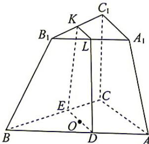
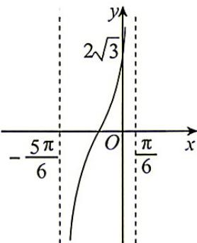
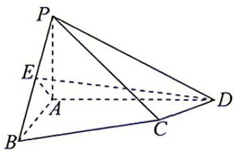

## 题目

已知 i 是虚数单位, 若实数 a, b 满足 $a + 3i = i(b - 2i)$ , 则

## 选项

A．a=2, b=3
B．a=-2, b=3
C．a=2, b=-3
D．a=-2, b=-3

## 答案

A

## 解析

因为 $a+3i=i(b-2i)=2+bi$ ，所以 a=2, b=3，故选 A.

---
qid: 2
source: 河北省沧州市2027届高三9月
number: '2'
type: choice
year: 2027
updatedAt: '1789946799'
knowledge: []
---

## 题目

设 $a > b > 0 > c > d$ ，则下列不等式恒成立的是

## 选项

A．$a - b < c - d$
B．$ac < bd$
C．$a^{c} > b^{d}$
D．$d + \frac{c}{b} < a + \frac{c}{a}$

## 答案

D

## 解析

令 a=2, b=1, c=-1, d=-2，满足 a>b>0>c>d，此时 a-b=1, c-d=1, a-b=c-d，故 A 错误；此时 ac=-2, bd=-2, ac=bd，故 B 错误；此时 $a^{c}=\frac{1}{2}, b^{d}=1, a^{c}<b^{d}$ ，故 C 错误；因为 a>b>0>c>d，所以 $\frac{1}{a}<\frac{1}{b}\Rightarrow\frac{c}{a}>\frac{c}{b}$ ，由不等式的同向相加性质可知 $d+\frac{c}{b}<a+\frac{c}{a}$ ，故 D 正确。故选 D.

---
qid: 3
source: 河北省沧州市2027届高三9月
number: '3'
type: choice
year: 2027
updatedAt: '1789946799'
knowledge: []
---

## 题目

2026年4月23日是第31个世界读书日,为营造爱读书、读好书、善读书的浓厚氛围,某地图书馆计划开展3场主题讲座,现有4名同学报名参加,每个讲座至少有一名同学参加,每人只能参加一个讲座,则不同的安排方案种数为

## 选项

A．12
B．24
C．36
D．60

## 答案

C

## 解析

首先从4个人中选出2个人作为一组，有 $\mathrm{C}_4^2$ 种选法，再将这一组与其余2人排到3场主题讲座中，有 $\mathrm{A}_3^3$ 种排法，故不同安排方案有 $\mathrm{C}_4^2\cdot \mathrm{A}_3^2 = 36$ 种.故选C.

---
qid: 4
source: 河北省沧州市2027届高三9月
number: '4'
type: choice
year: 2027
updatedAt: '1789946799'
knowledge: []
---

## 题目

已知集合 $A = \{x \mid x^2 - 6x + 5 \leqslant 0\}$ , $B = \{x \mid x^2 - mx + 4 \geqslant 0\}$ , 若“ $x \in A$ ”是“ $x \in B$ ”的充分条件, 则实数 $m$ 的取值范围为

## 选项

A．$[5, +\infty)$
B．$(- \infty, 4]$
C．$[4, 5]$
D．$(- \infty, 4] \cup [5, +\infty)$

## 答案

B

## 解析

由 $x^{2}-6x+5=(x-1)(x-5)\leqslant0$ ，解得 $1\leqslant x\leqslant5$ ，则 A=[1,5]，由“ $x\in A$ ”是“ $x\in B$ ”的充分条件，可得 $A\subseteq B$ ，又 $B=\{x\mid x^{2}-mx+4\geqslant0\}$ ，故 $x^{2}-mx+4\geqslant0$ 在 [1,5] 上恒成立，即 $m\leqslant x+\frac{4}{x}$ 在 [1,5] 上恒成立，而 $x+\frac{4}{x}\geqslant2\sqrt{x\cdot\frac{4}{x}}=4$ ，当且仅当 $x=\frac{4}{x}$ ，即 x=2 时等号成立，故 $m\leqslant4$ ，即实数 m 的取值范围为 $(-∞,4]$ 。故选 B.

---
qid: 5
source: 河北省沧州市2027届高三9月
number: '5'
type: choice
year: 2027
updatedAt: '1789946799'
knowledge: []
---

## 题目

已知单位向量 $a, b$ 满足 $|2a + b| = \sqrt{3}$ , 则向量 $a - b$ 与 $a + 2b$ 的夹角为

## 选项

A．$\frac{\pi}{6}$
B．$\frac{\pi}{3}$
C．$\frac{2\pi}{3}$
D．$\frac{5\pi}{6}$

## 答案

C

## 解析

因为 a, b 为单位向量, 所以 $\left|a\right| = \left|b\right| = 1$ .

$|2a+b|=\sqrt{3}$ 两边平方，可得 $|2a+b|^{2}=4|a|^{2}+4a\cdot b+|b|^{2}=3$ ，解得 $a\cdot b=-\frac{1}{2}$ .

$$
\left| \boldsymbol {a} - \boldsymbol {b} \right| = \sqrt {(\boldsymbol {a} - \boldsymbol {b}) ^ {2}} = \sqrt {\left| \boldsymbol {a} \right| ^ {2} - 2 \boldsymbol {a} \cdot \boldsymbol {b} + \left| \boldsymbol {b} \right| ^ {2}} = \sqrt {1 ^ {2} - 2 \times \left(- \frac {1}{2}\right) + 1 ^ {2}} = \sqrt {3},
$$

$$
\vert a + 2 b \vert = \sqrt {(a + 2 b) ^ {2}} = \sqrt {\vert a \vert^ {2} + 4 a \cdot b + 4 \vert b \vert^ {2}} = \sqrt {1 ^ {2} + 4 \times \left(- \frac {1}{2}\right) + 4 \times 1 ^ {2}} = \sqrt {3},
$$

$$
(a - b) \cdot (a + 2 b) = | a | ^ {2} + a \cdot b - 2 | b | ^ {2} = 1 ^ {2} + \left(- \frac {1}{2}\right) - 2 \times 1 ^ {2} = - \frac {3}{2}.
$$

设向量 a-b 与 $a+2b$ 的夹角为 $\theta, \theta \in [0, \pi]$ ，则 $\cos \theta = \frac{(a-b) \cdot (a+2b)}{|a-b| \cdot |a+2b|} = \frac{-\frac{3}{2}}{\sqrt{3} \times \sqrt{3}} = -\frac{1}{2}$ ，所以 $\theta = \frac{2\pi}{3}$ .
即向量 a-b 与 $a+2b$ 的夹角为 $\frac{2\pi}{3}$ . 故选 C.

---
qid: 6
source: 河北省沧州市2027届高三9月
number: '6'
type: choice
year: 2027
updatedAt: '1789946799'
knowledge: []
---

## 题目

已知直线 $l: x \cos \theta + 2y \sin \theta - 1 = 0$ 被圆 $x^{2} + y^{2} = 1$ 截得的弦长为 $\sqrt{2}$ ，则直线 l 的斜率为

## 选项

A．$\pm\frac{1}{2}$
B．$\pm\frac{\sqrt{2}}{2}$
C．$\pm\frac{\sqrt{3}}{2}$
D．$\pm\sqrt{2}$

## 答案

B

## 解析

直线 l 被圆 $x^{2}+y^{2}=1$ 截得的弦长为 $\sqrt{2}$ ，则 $\frac{1}{\sqrt{\cos^{2}\theta+4\sin^{2}\theta}}=\frac{\sqrt{2}}{2}$ ，即 $\cos^{2}\theta+4\sin^{2}\theta=2$ ，
结合 $\cos^{2}\theta+\sin^{2}\theta=1$ ，可得 $\sin^{2}\theta=\frac{1}{3},\cos^{2}\theta=\frac{2}{3}$ ，所以 $\frac{\cos\theta}{\sin\theta}=\pm\sqrt{2}$ ，
设直线 l 的斜率为 k，则 $k=-\frac{\cos\theta}{2\sin\theta}=\pm\frac{\sqrt{2}}{2}$ . 故选 B.

---
qid: 7
source: 河北省沧州市2027届高三9月
number: '7'
type: choice
year: 2027
updatedAt: '1789946799'
knowledge: []
---

## 题目

在正三棱台 $ABC - A_{1}B_{1}C_{1}$ 中, $2AC = 3A_{1}C_{1} = 6$ , $AA_{1} = 2$ , 点 $O$ 为 $\triangle ABC$ 的重心, 点 $M$ 为棱台的底面 $A_{1}B_{1}C_{1}$ 上 (包括边界) 一点, 若直线 $OM \parallel$ 平面 $ACC_{1}A_{1}$ , 则 $OM$ 长的取值范围为

## 选项

A．$\left[\frac{\sqrt{3}}{2}, 2\right]$
B．$\left[\frac{\sqrt{5}}{2}, 2\right]$
C．$[1, 2]$
D．$\left[\frac{\sqrt{15}}{2}, 2\right]$

## 答案

D

## 解析

如图, 在平面 $ABC$ 内, 过点 $O$ 作 $DE \parallel AC$ , 分别交 $AB, BC$ 于点 $D, E$ , 分别取 $B_{1}C_{1}, A_{1}B_{1}$ 的中点 $K, L$ , 则当点 $M \in KL$ 时, 有 $OM \parallel$ 平面 $ACC_{1}A_{1}$ .

证明如下:由 K,L 分别为 $B_{1}C_{1}, A_{1}B_{1}$ 的中点得 $KL \parallel A_{1}C_{1}$ ,
又由于在正三棱台 $ABC-A_{1}B_{1}C_{1}$ 中， $DE \parallel AC, A_{1}C_{1} \parallel AC$ 所以 KL // DE，所以 D, E, K, L 四点共面，
又因为 $2AC = 3A_{1}C_{1}$ ，点 O 为重心，所以 $CE = \frac{1}{3}BC = \frac{1}{3} \times \frac{3}{2}B_{1}C_{1} = \frac{1}{2}B_{1}C_{1} = C_{1}K = 1$ 又由正三棱台 $ABC-A_{1}B_{1}C_{1}$ 的性质知 $CE \parallel C_{1}K$ 故四边形 $CEKC_{1}$ 为平行四边形，故 $EK \parallel CC_{1}$ 因为 $EK \not\subset$ 平面 $ACC_{1}A_{1}, CC_{1} \subset$ 平面 $ACC_{1}A_{1}$ ，所以 $EK \parallel$ 平面 $ACC_{1}A_{1}$ ，
同理得 DE//平面 $ACC_{1}A_{1}$ 因为 $DE \cap EK = E, DE, EK \subset$ 平面 DEKL，所以平面 $DEKL \parallel$ 平面 $ACC_{1}A_{1}$ ，
所以当点 $M \in KL$ 时，OM⊂平面 DEKL，所以 OM//平面 $ACC_{1}A_{1}$ 在梯形 DEKL 中，有 $KL = \frac{1}{2}A_{1}C_{1} = 1, DE = \frac{2}{3}AC = 2, DL = EK = AA_{1} = 2,$ 所以四边形 DEKL 是上、下底长分别为 1 和 2，腰长为 2 的等腰梯形，
由等腰梯形性质得该等腰梯形的高为 $\sqrt{2^{2}-\left(\frac{2-1}{2}\right)^{2}}=\frac{\sqrt{15}}{2}$

所以 $OK = OL = \sqrt{\left(\frac{\sqrt{15}}{2}\right)^2 + \left(\frac{1}{2}\right)^2} = 2$ ，所以 $OM$ 长度的取值范围为 $\left[\frac{\sqrt{15}}{2}, 2\right]$ . 故选D.

---
qid: 8
source: 河北省沧州市2027届高三9月
number: '8'
type: choice
year: 2027
updatedAt: '1789946799'
knowledge: []
---

## 题目

已知函数 $f(x)$ 的定义域为 $(-1, 1)$ , 对任意的 $x, y \in (-1, 1)$ , 都有 $f(x) + f(y) = f\left(\frac{x + y}{1 + xy}\right)$ , 且当 $x \in (0, 1)$ 时, $f(x) < 0$ , 则下列说法错误的是

## 选项

A．$f(0) = 0$
B．$f(x)$ 是奇函数
C．$f(x)$ 在 $(-1, 1)$ 上单调递增
D．不等式 $f(x+1) + f\left(\frac{1}{1-x}\right) > 0$ 的解集为 $(-2, -\sqrt{2})$

## 答案

C

## 解析

对于A,令x=y=0,得 $f(0)=0$ ,故A正确;
对于B,令y=-x,得 $f(x)+f(-x)=f(0)=0$ ,即 $f(-x)=-f(x)$ , $\therefore f(x)$ 在 $(-1,1)$ 上是奇函数,
故B正确;
对于C,任取 $x_{1},x_{2}\in(-1,1)$ ，且 $-1<x_{1}<x_{2}<1$ ，则 $-x_{2}\in(-1,1)$ , $\therefore f(x_1)-f(x_2)=f(x_1)+f(-x_2)=f\left(\frac{x_1-x_2}{1-x_1x_2}\right),$ $\because-1<x_{1}<x_{2}<1,\therefore1-x_{1}x_{2}>0,\therefore\frac{x_{1}-x_{2}}{1-x_{1}x_{2}}<0.$ 又 $\frac{x_{1}-x_{2}}{1-x_{1}x_{2}}-(-1)=\frac{x_{1}-x_{2}+1-x_{1}x_{2}}{1-x_{1}x_{2}}=\frac{(1+x_{1})(1-x_{2})}{1-x_{1}x_{2}}>0,\therefore-1<\frac{x_{1}-x_{2}}{1-x_{1}x_{2}}<0,$ ∵当 $x\in(0,1)$ 时， $f(x)<0,f(x)$ 为定义在 $(-1,1)$ 上的奇函数.

∴当 $x \in (-1,0)$ 时， $f(x) > 0, \therefore f\left(\frac{x_{1} - x_{2}}{1 - x_{1}x_{2}}\right) > 0$ ，即 $f(x_{1}) - f(x_{2}) > 0$ ，即 $f(x_{1}) > f(x_{2}), \therefore f(x)$ 在 $(-1,1)$ 上单调递减，故 C 错误；

对于D, $\because f(x + 1) + f\left(\frac{1}{1 - x}\right) > 0$ ，且 $f(x)$ 为定义在 $(-1,1)$ 上的奇函数， $\therefore f(x + 1) > -f\left(\frac{1}{1 - x}\right) = f\left(\frac{1}{x - 1}\right),$ $\because f(x)$ 的定义域为 $(-1,1)$ 且在 $(-1,1)$ 上单调递减， $\therefore \left\{ \begin{array}{l} - 1 <   x + 1 <   1,\\ -1 <   \frac{1}{x - 1} <  1,\\ x + 1 <   \frac{1}{x - 1}, \end{array} \right.$ 解得 $-2 <   x <   - \sqrt{2},$

$$
(- 2, - \sqrt {2})
$$

9. ABD 【解析】将该组数据按从小到大顺序排列: 8,10,20,30,38,38.
对于 A, 极差为 38-8=30, 故 A 正确;
对于 B, 平均数为 $\frac{8+10+20+30+38+38}{6}=24$ , 故 B 正确;
对于 C, 方差为 $\frac{1}{6}\left[(8-24)^{2}+(10-24)^{2}+(20-24)^{2}+(30-24)^{2}+(38-24)^{2}+(38-24)^{2}\right]=\frac{448}{3}$ ，故 C 错误；
对于 D，上四分位数为 75% 分位数，因为 $6 \times 75\% = 4.5$ ，所以上四分位数为第 5 个数据，即为 38，故 D 正确。
故选 ABD.

10. BCD 【解析】设该函数的最小正周期为 T，则有 $T=\frac{\pi}{\omega}=\frac{\pi}{6}-\left(-\frac{5\pi}{6}\right)\Rightarrow\omega=1$ ，即 $f(x)=A\tan(x+\varphi)$ ，
由函数的图象可知 $\frac{\pi}{6}+\varphi=\frac{\pi}{2}+k\pi(k\in\mathbf{Z})$ ，即 $\varphi=\frac{\pi}{3}+k\pi(k\in\mathbf{Z})$ ，又 $0<\varphi<\pi$ ，所以 $\varphi=\frac{\pi}{3}$ ，所以 $f(x)=A\tan\left(x+\frac{\pi}{3}\right)$ ，
由图象可知 $f(0)=A\tan\frac{\pi}{3}=2\sqrt{3}\Rightarrow A=2$ ，故 A 错误；
对于 B, $f(x)=2\tan\left(x+\frac{\pi}{3}\right)$ ，令 $x+\frac{\pi}{3}=\frac{k\pi}{2}(k\in\mathbf{Z})$ ，解得 $x=-\frac{\pi}{3}+\frac{k\pi}{2}(k\in\mathbf{Z})$ ，
即 $f(x)$ 图象的对称中心为 $\left(-\frac{\pi}{3}+\frac{k\pi}{2},0\right)(k\in\mathbf{Z})$ ，B 正确；
对于 C, $f(\frac{\pi}{12}) = 2\tan\left(\frac{\pi}{12} + \frac{\pi}{3}\right) = 2\tan\left(\frac{\pi}{4} + \frac{\pi}{6}\right) = 2 \times \frac{\tan\frac{\pi}{4} + \tan\frac{\pi}{6}}{1 - \tan\frac{\pi}{4}\tan\frac{\pi}{6}} = 2 \times \frac{1 + \frac{\sqrt{3}}{3}}{1 - \frac{\sqrt{3}}{3}} = 4 + 2\sqrt{3}$ ，故 C 正确；
对于 D，当 $f(x) \leqslant 0$ 时， $f(x) + |f(x)| = f(x) - f(x) = 0$ ，此时 $f(x) + |f(x)| \geqslant 4\sqrt{3}$ 无解，
当 $f(x)=2\tan\left(x+\frac{\pi}{3}\right)>0$ 时，有 $k\pi<x+\frac{\pi}{3}<\frac{\pi}{2}+k\pi(k\in\mathbf{Z})$ 由 $f(x)+|f(x)|=2f(x)=4\tan\left(x+\frac{\pi}{3}\right)\geqslant4\sqrt{3}$ ，可得 $\tan\left(x+\frac{\pi}{3}\right)\geqslant\sqrt{3}$ 则 $\frac{\pi}{3}+k\pi \leqslant x + \frac{\pi}{3} < \frac{\pi}{2} + k\pi (k \in \mathbf{Z})$ ，解得 $k\pi \leqslant x < \frac{\pi}{6} + k\pi (k \in \mathbf{Z})$ 故不等式 $f(x)+|f(x)|\geqslant4\sqrt{3}$ 的解集为 $\left[k\pi,\frac{\pi}{6}+k\pi\right)(k\in\mathbf{Z})$ ，D 正确。故选 BCD.

11. AD 【解析】对于 A, 由 $2f(x) + f'(x) = 2$ 得 $2f(0) + f'(0) = 2$ , 又 $f(0) = 0$ , 所以 $f'(0) = 2$ , 所以曲线 $y = f(x)$ 在点 $(0, f(0))$ 处的切线方程为 $y = 2x$ , A 正确; 由于 $[e^{2x}f(x) - e^{2x}]' = 2e^{2x}f(x) + e^{2x}f'(x) - 2e^{2x} = e^{2x}[2f(x) + f'(x) - 2] = 0$ , 所以 $e^{2x}f(x) - e^{2x} = c, c$ 为常数, 则 $f(x) = \frac{e^{2x} + c}{e^{2x}}$ , 又 $f(0) = \frac{e^0 + c}{e^0} = 0$ , 解得 $c = -1$ , 所以 $f(x) = \frac{e^{2x} - 1}{e^{2x}}$ . 对于 B, $F(x) = e^x f(x) = \frac{e^{2x} - 1}{e^x}$ , $F(-x) = \frac{e^{-2x} - 1}{e^{-x}} = \frac{1 - e^{2x}}{e^x} = -F(x)$ , 且 $F(x)$ 定义域为 R, 故 $F(x) = e^x f(x)$ 为奇函数, B 错误; 对于 C, 由 $e^x f(x) - \frac{3}{e^x} < 0$ 可得 $e^{2x}f(x) - 3 < 0$ , 又 $f(x) = \frac{e^{2x} - 1}{e^{2x}}$ , 故 $e^{2x} - 4 < 0$ , 解得 $x < \ln 2$ , 故 C 错误; 对于 D, 易知函数 $f(x) = \frac{e^{2x} - 1}{e^{2x}} = 1 - \frac{1}{e^{2x}}$ 为单调递增函数, 而函数 $y = (x - a)^2$ 的 …

---
qid: 9
source: 河北省沧州市2027届高三9月
number: '9'
type: multi
year: 2027
updatedAt: '1789946799'
knowledge: []
---

## 题目

已知一组样本数据: 20, 8, 30, 10, 38, 38, 下列对这组数据的分析, 其中正确的是

## 选项

A．极差是 30
B．平均数是 24
C．方差是 11
D．上四分位数是 38

## 答案

ABD

---
qid: 10
source: 河北省沧州市2027届高三9月
number: '10'
type: multi
year: 2027
updatedAt: '1789946799'
knowledge: []
---

## 题目

函数 $f(x) = A \tan (\omega x + \varphi) (\omega > 0, 0 < \varphi < \pi)$ 的部分图象如图所示，则

## 选项

A．$A = 2\sqrt{3}$
B．函数 $f(x)$ 图象的对称中心为 $\left(-\frac{\pi}{3}+\frac{k\pi}{2},0\right)(k\in\mathbf{Z})$
C．$f\left(\frac{\pi}{12}\right)=4+2\sqrt{3}$
D．不等式 $f(x)+|f(x)|\geqslant4\sqrt{3}$ 的解集为 $\left[k\pi,\frac{\pi}{6}+k\pi\right)(k\in\mathbf{Z})$

## 答案

BCD

---
qid: 11
source: 河北省沧州市2027届高三9月
number: '11'
type: multi
year: 2027
updatedAt: '1789946799'
knowledge: []
---

## 题目

定义在 $\mathbf{R}$ 上的函数 $f(x)$ 的导函数为 $f'(x)$ , 若对于任意实数 $x$ , 都有 $2f(x) + f'(x) = 2$ , 且 $f(0) = 0$ , 则

## 选项

A．曲线 $y = f(x)$ 在点 $(0, f(0))$ 处的切线方程为 $y = 2x$
B．函数 $F(x) = \mathrm{e}^{x} f(x)$ 为偶函数
C．不等式 $\mathrm{e}^{x} f(x) - \frac{3}{\mathrm{e}^{x}} < 0$ 的解集为 $(0, \ln 2)$
D．若方程 $f(x) - (x - a)^{2} = 0$ 有两个根 $x_{1}, x_{2} (x_{1} < x_{2})$ , 则 $x_{1} + x_{2} > 2a$

## 答案

AD

---
qid: 12
source: 河北省沧州市2027届高三9月
number: '12'
type: blank
year: 2027
updatedAt: '1789946799'
knowledge: []
---

## 题目

已知椭圆 $C: \frac{x^2}{a^2} + \frac{y^2}{b^2} = 1 (a > b > 0)$ 的右焦点为 $F(c, 0)$ , 若 $b^2 = ac$ , 则椭圆 $C$ 的离心率为 \_\_\_\_.

## 答案

$\frac {\sqrt {5} - 1}{2}$

---
qid: 13
source: 河北省沧州市2027届高三9月
number: '13'
type: blank
year: 2027
updatedAt: '1789946799'
knowledge: []
---

## 题目

若数列 $\{a_{n}\}$ 的前 $n$ 项和为 $S_{n}$ , 数列 $\{S_{n}\}$ 的前 $n$ 项之积为 $T_{n}$ , 满足 $S_{n} + 2T_{n} = 1 (n \in \mathbf{N}_{+})$ , 则 $a_{n} =$ \_\_\_\_.

## 答案

$\left\{\begin{aligned}\frac{1}{3},&n=1\\\frac{4}{4n^{2}-1},&n\geqslant2\end{aligned}\right.$

---
qid: 14
source: 河北省沧州市2027届高三9月
number: '14'
type: blank
year: 2027
updatedAt: '1789946799'
knowledge: []
---

## 题目

在 $\triangle ABC$ 中, 内角 $A, B, C$ 所对的边分别为 $a, b, c$ . 已知 $c=2a\cos A$ , 且 $a>b$ , 则 $\sin B+\sin A$ 的取值范围为\_\_\_\_.

## 答案

$\left(\frac{\sqrt{3}}{2},\sqrt{2}\right)$

---
qid: 15
source: 河北省沧州市2027届高三9月
number: '15'
type: answer
year: 2027
updatedAt: '1789946799'
knowledge: []
---

## 题目

(本小题满分13分)已知等差数列 $\{a_{n}\}$ 的首项为1,等比数列 $\{b_{n}\}$ 的公比为3,且 $a_{2}=b_{2},a_{5}=b_{3}$ .
(1)求 $\{a_{n}\}$ 和 $\{b_{n}\}$ 的通项公式；

(2) 设 $c_{n} = a_{n} + b_{n} (n \in \mathbf{N}^{*})$ ，求数列 $\{c_{n}\}$ 的前 $2n$ 项和.

---
qid: 16
source: 河北省沧州市2027届高三9月
number: '16'
type: answer
year: 2027
updatedAt: '1789946799'
knowledge: []
---

## 题目

(本小题满分15分)已知双曲线 $E:\frac{x^{2}}{a^{2}}-\frac{y^{2}}{b^{2}}=1(a>0,b>0)$ 的右焦点F与抛物线 $y^{2}=4\sqrt{2}x$ 的焦点重合,且双曲线E的渐近线方程为 $x\pm y=0$ .

(1)求双曲线 E 的方程；

(2)已知直线 l 过点 $P(2,0)$ 且与双曲线 E 交于 M, N 两点，若 $\overrightarrow{MP}=3\overrightarrow{PN}$ ，求直线 l 的方程.

---
qid: 17
source: 河北省沧州市2027届高三9月
number: '17'
type: answer
year: 2027
updatedAt: '1789946799'
knowledge: []
---

## 题目

(本小题满分 15 分) 某学校组织游戏活动, 准备了红、黄、绿三个不透明盒子, 其中红色盒子内装有两个红球、一个黄球和一个绿球; 黄色盒子内装有两个红球, 两个绿球; 绿色盒子内装有两个红球, 两个黄球. 要求学生第一次先从红色盒子内随机抽取一个球, 将取出的球放入与球同色的盒子中, 第二次从该放入球的盒子中随机抽取一个球.

(1)求学生甲第二次抽到红球的概率;

(2)若抽到红球获得1积分、抽到黄球获得2积分、抽到绿球获得3积分，记学生甲两次抽球所获得积分的总和为 $X$ ，求随机变量 $X$ 的分布列与期望.

---
qid: 18
source: 河北省沧州市2027届高三9月
number: '18'
type: answer
year: 2027
updatedAt: '1789946799'
knowledge: []
---

## 题目

(本小题满分17分)如图,在四棱锥P-ABCD中,PA⊥底面ABCD,AB=AP,AB⊥AD,E为PB的中点.

(1)求证: $PB \perp$ 平面 $ADE$ ;

(2)四边形ABCD中， $\angle CDA = 45^{\circ},CD = \sqrt{2},AB + AD = 6,AB <   AD$ ，若平面ADE与平面PCD所成的角的余弦值为 $\frac{\sqrt{3}}{6}$

(i) 求线段 $AB$ 的长；

(ii) 设 G 为 $\triangle PAD$ 内(含边界)的一点, 且 GB = 2GA, 求满足条件的所有点 G 组成的轨迹的长度.

---
qid: 19
source: 河北省沧州市2027届高三9月
number: '19'
type: answer
year: 2027
updatedAt: '1789946799'
knowledge: []
---

## 题目

(本小题满分17分)(1)已知函数 $f(x)=\frac{1}{2}x^{2}+\cos x-1$ ，判断函数 $f(x)$ 的单调性；

(2)若对任意 $x \geqslant 1$ , 都有 $(x + 1) \ln x \geqslant a (x - 1)$ 成立, 求实数 $a$ 的取值范围;

(3)当-1<x<1时,证明: $x\ln\frac{1+x}{1-x}+\cos x\geqslant1+\frac{1}{2}x^{2}.$
