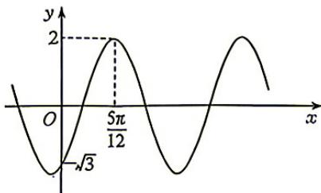
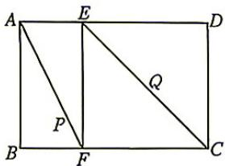
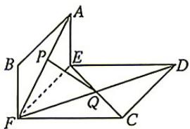
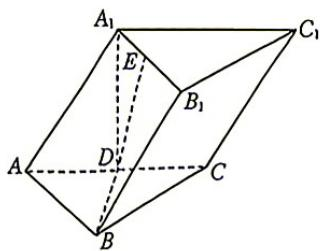

## 题目

数据 2,3,3,5,7,9,11,12 的上四分位数为

## 选项

A．9
B．10
C．11
D．11.5

## 答案

B

---
qid: 2
source: 河南省九师联盟2027届高三9月联考数学试题
number: '2'
type: choice
year: 2027
updatedAt: '1789946799'
knowledge: []
---

## 题目

已知复数 $z = \frac{(1 + \mathrm{i})^2}{1 + \sqrt{3}\mathrm{i}}$ ，则 $z$ 在复平面内对应的点位于

## 选项

A．第一象限
B．第二象限
C．第三象限
D．第四象限

## 答案

A

---
qid: 3
source: 河南省九师联盟2027届高三9月联考数学试题
number: '3'
type: choice
year: 2027
updatedAt: '1789946799'
knowledge: []
---

## 题目

已知集合 $A = \{0,1,2\}$ , $B \subseteq \mathbb{R}$ , 且 $(\complement_{\mathbb{R}} A) \cap B = \emptyset$ , 则集合 $B$ 的个数为

## 选项

A．3
B．6
C．7
D．8

## 答案

D

---
qid: 4
source: 河南省九师联盟2027届高三9月联考数学试题
number: '4'
type: choice
year: 2027
updatedAt: '1789946799'
knowledge: []
---

## 题目

已知总体分为 $A, B$ 两层, 且 $A$ 层与 $B$ 层的个体数之比为 $3:1$ , 用比例分配的分层随机抽样的方法从总体中抽取一个容量为 8 的样本. 若 $B$ 层中的个体甲、乙均被抽到的概率为 $\frac{1}{21}$ , 则总体的个体数为

## 选项

A．7
B．20
C．28
D．32

## 答案

C

---
qid: 5
source: 河南省九师联盟2027届高三9月联考数学试题
number: '5'
type: choice
year: 2027
updatedAt: '1789946799'
knowledge: []
---

## 题目

$(x^{2} + x - 2)^{8}$ 的展开式中， $x^{16}$ 的系数为

## 选项

A．8
B．36
C．16
D．32

## 答案

A

---
qid: 6
source: 河南省九师联盟2027届高三9月联考数学试题
number: '6'
type: choice
year: 2027
updatedAt: '1789946799'
knowledge: []
---

## 题目

已知 $F_{1}, F_{2}$ 分别是椭圆 $C: \frac{x^{2}}{a^{2}} + \frac{y^{2}}{4} = 1 (a > 2)$ 的左、右焦点，P 是 C 上的动点，则 $\left|PF_{1}\right| \cdot \left|PF_{2}\right|$ 的最小值为

## 选项

A．$a^{2}$
B．$a^{2}-4$
C．4
D．$\sqrt{a^{2}-4}$

## 答案

C

---
qid: 7
source: 河南省九师联盟2027届高三9月联考数学试题
number: '7'
type: choice
year: 2027
updatedAt: '1789946799'
knowledge: []
---

## 题目

在 $\triangle ABC$ 中, $AB=7, AC=8$ , $\cos A=\frac{2}{7}, O$ 是 $\triangle ABC$ 的外心, 若 $\overrightarrow{OP}=x\overrightarrow{OB}+y\overrightarrow{OC}(x,y\in[0,1])$ , 则动点 $P$ 的轨迹所覆盖图形的面积为

## 选项

A．$\frac{27\sqrt{5}}{10}$
B．$\frac{27\sqrt{5}}{5}$
C．$\frac{9\sqrt{5}}{10}$
D．$\frac{9\sqrt{5}}{5}$

## 答案

B

---
qid: 8
source: 河南省九师联盟2027届高三9月联考数学试题
number: '8'
type: choice
year: 2027
updatedAt: '1789946799'
knowledge: []
---

## 题目

已知定义在 $\mathbf{R}$ 上的函数 $f(x)$ 满足: $f(x+1)$ 的图象关于点 $(-1,0)$ 对称, 且当 $-2\pi \leqslant x \leqslant 0$ 时, $f'(x) \sin \frac{x}{3} + \frac{1}{3} f(x) \cos \frac{x}{3} < 0$ , 则

## 选项

A．$\sqrt{3} f(\pi) < \sqrt{3} f(2\pi) < -f\left(-\frac{\pi}{2}\right)$
B．$\sqrt{3} f(2\pi) < \sqrt{3} f(\pi) < -f\left(-\frac{\pi}{2}\right)$
C．$-f\left(-\frac{\pi}{2}\right) < \sqrt{3} f(2\pi) < \sqrt{3} f(\pi)$
D．$-f\left(-\frac{\pi}{2}\right) < \sqrt{3} f(\pi) < \sqrt{3} f(2\pi)$

## 答案

D

---
qid: 9
source: 河南省九师联盟2027届高三9月联考数学试题
number: '9'
type: multi
year: 2027
updatedAt: '1789946799'
knowledge: []
---

## 题目

已知函数 $f(x)=A\sin(\omega x+\varphi)$ ( $A>0, \omega>0, |\varphi|<\frac{\pi}{2}$ ) 的部分图象如图所示，将 $f(x)$ 的图象向右平移 $\frac{\pi}{12}$ 个单位长度得到函数 $g(x)$ 的图象，则
A. $f(x)$ 的最小正周期为 $\pi$ B. $g(x)$ 为偶函数
C. $f(x)$ 的图象关于直线 $x = -\frac{2\pi}{3}$ 对称
D. $g(x)$ 在 $\left[\frac{7\pi}{12}, \frac{5\pi}{6}\right]$ 上单调递减

## 答案

ABD

---
qid: 10
source: 河南省九师联盟2027届高三9月联考数学试题
number: '10'
type: multi
year: 2027
updatedAt: '1789946799'
knowledge: []
---

## 题目

如图, 在矩形 $ABCD$ 中, $E, F$ 分别为边 $AD, BC$ 上的点, 且 $AD = 3AE$ , $BC = 3BF$ , $AB = DE$ , $P$ 为线段 $AF$ 上一点, $Q$ 为线段 $CE$ 的中点, 将四边形 $ABFE$ 沿着直线 $EF$ 折起, 使得 $AE \perp$ 平面 $CDEF$ , 则

## 选项

A．存在点 $P$ , 使得 $PQ \perp DF$
B．存在点 $P$ , 使得 $PQ \parallel ED$
C．对任意点 $P$ , 直线 $PQ$ 与直线 $CD$ 异面
D．存在点 $P$ , 使得 $PQ \perp EF$

## 答案

AD

---
qid: 11
source: 河南省九师联盟2027届高三9月联考数学试题
number: '11'
type: multi
year: 2027
updatedAt: '1789946799'
knowledge: []
---

## 题目

已知抛物线 $C: y^{2} = 2px (p > 0), A(1,1)$ 为 $C$ 上一点，过点 $B(-1,0)$ 的直线交 $C$ 于 $M, N$ 两点， $O$ 为坐标原点，则

## 选项

A．$C$ 的焦点坐标为 $\left(\frac{1}{2}, 0\right)$
B．直线 $AB$ 与 $C$ 相切
C．$|OM| \cdot |ON| > 2$
D．$\overrightarrow{AM} \cdot \overrightarrow{AN}$ 的取值范围为 $(-∞,4)$

## 答案

BCD

---
qid: 12
source: 河南省九师联盟2027届高三9月联考数学试题
number: '12'
type: blank
year: 2027
updatedAt: '1789946799'
knowledge: []
---

## 题目

已知向量 $a = (-1, 1), b = (1, -2)$ , 则 $b$ 在 $a$ 上的投影向量为 \_\_\_\_. (用坐标表示)

## 答案

$\left(\frac{3}{2}, -\frac{3}{2}\right)$

---
qid: 13
source: 河南省九师联盟2027届高三9月联考数学试题
number: '13'
type: blank
year: 2027
updatedAt: '1789946799'
knowledge: []
---

## 题目

已知圆 $O: x^{2} + y^{2} = 9, A(x_{1}, y_{1}), B(x_{2}, y_{2})$ 为圆 $O$ 上相异两点，且 $x_{1}y_{2} = x_{2}y_{1}$ ，则 $x_{1} + 3x_{2} + y_{1} + 3y_{2}$ 的最大值为 \_\_\_\_.

## 答案

$6 \sqrt{2}$

---
qid: 14
source: 河南省九师联盟2027届高三9月联考数学试题
number: '14'
type: blank
year: 2027
updatedAt: '1789946799'
knowledge: []
---

## 题目

在正四面体 $ABCD$ 中, $E$ 为棱 $AC$ 上一点, 过点 $E$ 作平面 $\alpha$ , 使得 $AB//\alpha, CD//\alpha$ , 若 $AB, CD$ 到平面 $\alpha$ 的距离分别为 2 和 8 , 则该正四面体的外接球被平面 $\alpha$ 截得的截面的面积为 \_\_\_\_.

## 答案

$66\pi$

---
qid: 15
source: 河南省九师联盟2027届高三9月联考数学试题
number: '15'
type: answer
year: 2027
updatedAt: '1789946799'
knowledge: []
---

## 题目

(本小题满分13分)

某社区准备开展“诵读国学经典,积淀文化底蕴”活动.为调查不同年龄段的人对此项活动的态度,在该社区随机抽取了300人,统计结果如下:

50岁以下

50岁及以上

合计

支持态度的人数

160

60

220

不支持态度的人数

50

30

80

合计

210

90

300

(1)根据小概率值 $\alpha=0.005$ 的独立性检验,判断所持态度与年龄是否在 50 岁以下是否有关联;

(2)以频率估计概率,若在该社区所有年龄在50岁及以上的人中随机抽取4人,记4人中持支持态度的人数为X,求X的分布列和数学期望.

附： $\chi^2 = \frac{n(ad - bc)^2}{(a + b)(c + d)(a + c)(b + d)}$ ，其中 $n = a + b + c + d.$

α

0.01

0.005

0.001

$x_{a}$

6.635

7.879

10.828

---
qid: 16
source: 河南省九师联盟2027届高三9月联考数学试题
number: '16'
type: answer
year: 2027
updatedAt: '1789946799'
knowledge: []
---

## 题目

(本小题满分15分)

在数列 $\{a_{n}\}$ 中， $a_{1} = 1, a_{2} = 4, a_{n + 2} + 2a_{n} = 3a_{n + 1}$ .

(1) 证明： $\{a_{n+1}-a_{n}\}$ 是等比数列；

(2) 求 $\{a_{n}\}$ 的前 $n$ 项和 $S_{n}$ .

## 答案

(1)

---
qid: 17
source: 河南省九师联盟2027届高三9月联考数学试题
number: '17'
type: answer
year: 2027
updatedAt: '1789946799'
knowledge: []
---

## 题目

(本小题满分15分)

如图, 在三棱柱 $ABC - A_{1}B_{1}C_{1}$ 中, $AB \perp BC$ , $AB = BC = \sqrt{2}$ , 侧面 $ACC_{1}A_{1}$ 为菱形, 点 $D$ 为 $AC$ 的中点, $A_{1}D \perp$ 平面 $ABC$ .

(1)证明: $BD \perp$ 平面 $ACC_{1}A_{1}$ ;

(2)在棱 $A_{1}B_{1}$ 上是否存在点 $E$ , 使得直线 $DE$ 与平面 $ABB_{1}A_{1}$ 所成角的正弦值为 $\frac{\sqrt{6}}{7}$ ? 若存在, 求 $A_{1}E$ 的长度; 若不存在, 说明理由.

## 答案

(1)

---
qid: 18
source: 河南省九师联盟2027届高三9月联考数学试题
number: '18'
type: answer
year: 2027
updatedAt: '1789946799'
knowledge: []
---

## 题目

(本小题满分17分)

已知动点 $P(x, y)$ , 点 $F(3, 0)$ , 点 $P$ 到直线 $l: x = \frac{1}{3}$ 的距离为 $d$ , 满足 $|PF| = 3d$ 的点 $P$ 的轨迹为曲线 $C$ , 过 $F$ 的直线 $l_1$ 与曲线 $C$ 交于 $A(x_1, y_1), B(x_2, y_2)$ 两点.

(1)求 $C$ 的方程；

(2) 记 $\frac{|AF| \cdot |BF|}{|AB|^2} = t, F$ 关于 $y$ 轴的对称点为 $F$ .

(i) 若 $x_{1}>0, x_{2}>0$ ，求 t 的最大值及 t 取最大值时 $\angle AF'B$ 的正切值；

(ii) 若 $x_{1}<0$ ，且 A 不是 C 与 x 轴的交点，t=1，证明： $\triangle AF'B$ 为等腰三角形.

## 答案

(1)

---
qid: 19
source: 河南省九师联盟2027届高三9月联考数学试题
number: '19'
type: answer
year: 2027
updatedAt: '1789946799'
knowledge: []
---

## 题目

(本小题满分17分)

已知集合 $D$ 为函数 $f(x), g(x)$ 的定义域的一个子集，若 $\forall x \in D$ ，存在常数 $k, b$ ，使得不等式 $g(x) \leqslant kx + b \leqslant f(x)$ ，则称直线 $y = kx + b$ 为函数 $f(x), g(x)$ 在 $D$ 上的隔离直线。

(1)求函数 $f(x)=x^{2}$ 的图象在点 $(1,f(1))$ 处的切线方程，并判断该切线是否是 $f(x)$ 与 $g(x)=-x^{2}+4x-3$ 在 R 上的隔离直线；

(2)若直线 $y = x + b$ 为函数 $f(x) = \mathrm{e}^x, g(x) = \ln x$ 在 $(0, +\infty)$ 上的隔离直线，求 $b$ 的取值范围；

(3)证明:函数 $f(x)=-x-\frac{1}{x}, g(x)=2+\frac{1}{x}$ 在 $(-∞,0)$ 上过原点的隔离直线仅有一条;

(4)函数 $f(x) = (x + 2)\mathrm{e}^x$ , $g(x) = -x^2 + 3x + 2$ 在 $\mathbf{R}$ 上是否存在隔离直线？若存在，求出隔离直线的方程；若不存在，说明理由.
