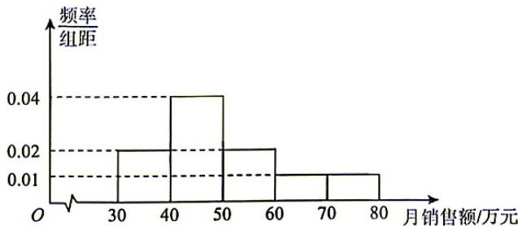
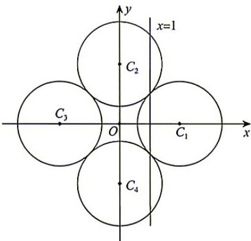
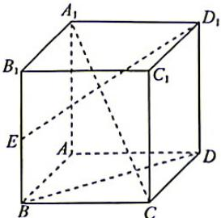
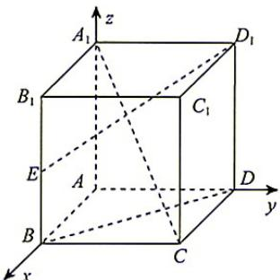

## 题目

设 $a = \log_2 3, b = \log_4 9, c = \log_8 27$ ，则

## 选项

A．$a = b = c$
B．$c < b < a$
C．$a < b < c$
D．$a < c < b$

## 答案

A

## 解析

因为 $b=\log_{4}9=\log_{2^{2}}3^{2}=\log_{2}3=a$ , $c=\log_{8}27=\log_{2^{3}}3^{3}=\log_{2}3=a$ ，所以 a=b=c.
故选 A.

---
qid: 2
source: 河南省青桐鸣2027届高三9月学情调研数学试题
number: '2'
type: choice
year: 2027
updatedAt: '1789946799'
knowledge: []
---

## 题目

底面半径与高均为1的圆锥的侧面积为

## 选项

A．$\pi$
B．$\sqrt{2}\pi$
C．$2\pi$
D．$(1+\sqrt{2})\pi$

## 答案

B

## 解析

圆锥的母线长为 $l=\sqrt{1^{2}+1^{2}}=\sqrt{2}$ ，所以圆锥的侧面积为 $S=\pi rl=\pi\times1\times\sqrt{2}=\sqrt{2}\pi$ 。故选 B.

---
qid: 3
source: 河南省青桐鸣2027届高三9月学情调研数学试题
number: '3'
type: choice
year: 2027
updatedAt: '1789946799'
knowledge: []
---

## 题目

设集合 $A = \{(x, y) | (x - 1)^2 + y^2 = 1\}$ , $B = \left\{\left(\frac{6}{5}, \frac{3}{5}\right), \left(\frac{8}{5}, \frac{4}{5}\right)\right\}$ , 则 $A \cap B =$

## 选项

A．$\varnothing$
B．$\left\{\left(\frac{6}{5}, \frac{3}{5}\right)\right\}$
C．$\left\{\left(\frac{8}{5}, \frac{4}{5}\right)\right\}$
D．$\left\{\left(\frac{6}{5}, \frac{3}{5}\right), \left(\frac{8}{5}, \frac{4}{5}\right)\right\}$

## 答案

C

## 解析

计算得 $\left(\frac{6}{5}-1\right)^{2}+\left(\frac{3}{5}\right)^{2}=\frac{2}{5}\neq1$ ，而 $\left(\frac{8}{5}-1\right)^{2}+\left(\frac{4}{5}\right)^{2}=1$ ，可知点 $\left(\frac{8}{5},\frac{4}{5}\right)$ 在圆 $(x-1)^{2}+y^{2}=1$ 上，
点 $\left(\frac{6}{5},\frac{3}{5}\right)$ 不在圆 $(x-1)^{2}+y^{2}=1$ 上，于是 $A\cap B=\left\{\left(\frac{8}{5},\frac{4}{5}\right)\right\}$ .
故选 C.

---
qid: 4
source: 河南省青桐鸣2027届高三9月学情调研数学试题
number: '4'
type: choice
year: 2027
updatedAt: '1789946799'
knowledge: []
---

## 题目

已知复数 $x_{1}$ 与 $x_{2}$ 满足 $x_{1} + x_{2} = 4, \bar{x}_{1} - \bar{x}_{2} = 4\mathrm{i}$ , 则 $|z_{1}z_{2}| =$

## 选项

A．1
B．2
C．4
D．8

## 答案

D

## 解析

由 $x_{1} + x_{2} = 4①$ , $\overline{z}_{1} - \overline{z}_{2} = 4i$ , 得 $\overline{x_{1} - x_{2}} = 4i$ , 也即 $x_{1} - x_{2} = -4i②$ , ①②联立, 得 $z_{1} = 2 - 2i$ , $x_{2} = 2 + 2i$ , 所以 $x_{1}x_{2} = (2 - 2i)(2 + 2i) = 8$ , 则 $|x_{1}x_{2}| = 8$ .
故选 D.

---
qid: 5
source: 河南省青桐鸣2027届高三9月学情调研数学试题
number: '5'
type: choice
year: 2027
updatedAt: '1789946799'
knowledge: []
---

## 题目

某商场统计了一段时间内的销售情况, 得到如下频率分布直方图.

由图估计该商场月销售额的方差为

## 选项

A．165
B．155
C．150
D．145

## 答案

D

## 解析

估计该商场月销售额的平均数为 $\bar{t}=35\times0.02\times10+45\times0.04\times10+55\times0.02\times10+65\times0.01\times10+75\times0.01\times10=50$ ，所以估计该商场月销售额的方差为 $s^{2}=(35-50)^{2}\times0.2+(45-50)^{2}\times0.4+(55-50)^{2}\times0.2+(65-50)^{2}\times0.1+(75-50)^{2}\times0.1=145$ .
故选 D.

---
qid: 6
source: 河南省青桐鸣2027届高三9月学情调研数学试题
number: '6'
type: choice
year: 2027
updatedAt: '1789946799'
knowledge: []
---

## 题目

若函数 $f(x)=\frac{\ln x+a}{x}$ 的最大值为 c，则实数 a 的值为

## 选项

A．0
B．1
C．2
D．3

## 答案

C

## 解析

求导得 $f'(x)=\frac{\frac{1}{x}\cdot x-(\ln x+a)}{x^{2}}=\frac{1-a-\ln x}{x^{2}}$ ，当 $x\in(0,e^{1-a})$ 时， $f'(x)>0,f(x)$ 单调递增；当 $x\in(e^{1-a},+\infty)$ 时， $f'(x)<0,f(x)$ 单调递减，可得 $f(x)$ 在 $x=e^{1-a}$ 处取得最大值。于是 $e=f(e^{1-a})=\frac{1}{e^{1-a}}=e^{a-1}$ ，故 a=2。
故选 C.

---
qid: 7
source: 河南省青桐鸣2027届高三9月学情调研数学试题
number: '7'
type: choice
year: 2027
updatedAt: '1789946799'
knowledge: []
---

## 题目

已知圆 $C_{1}: (x - 2)^{2} + y^{2} = 2, C_{2}: x^{2} + (y - 2)^{2} = 2, C_{3}: (x + 2)^{2} + y^{2} = 2, C_{4}: x^{2} + (y + 2)^{2} = 2$ ，则直线 $l$ 与这四个圆的公共点个数的最大值为

## 选项

A．5
B．6
C．7
D．8

## 答案

B

## 解析

易知这四个圆两两相切, 记直线 $l$ 与这四个圆的公共点个数为 $n$ , 当 $l$ 的方程为 $x = 1$ 时, $n = 4$ , 当 $l$ 的方程为 $x = t (1 < t < \sqrt{2})$ 时, $n = 6$ , 考虑证明 $n \geqslant 7$ 不合题意. 注意到圆与直线最多有两个公共点, 故当 $n \geqslant 7$ 时, 直线必与其中三个圆有两个公共点, 且与另外一个圆有至少一个不同的公共点, 若存在这样的直线, 显然其斜率存在, 设 $l$ 的方程为 $kx - y + b = 0$ . 不妨设 $l$ 与 $C_1, C_2, C_3$ 均有两个公共点, 则 $\frac{|2k + b|}{\sqrt{k^2 + 1}} < \sqrt{2}$ , $\frac{|-2 + b|}{\sqrt{k^2 + 1}} < \sqrt{2}, \frac{|-2k + b|}{\sqrt{k^2 + 1}} < \sqrt{2}$ , 此时 $b^2 - 4kb + 4k^2 < 2(k^2 + 1), b^2 + 4kb + 4k^2 < 2(k^2 + 1)$ , 两式相加得 $2b^2 + 4k^2 < 4$ , 即 $k^2 < 1 - \frac{b^2}{2}$ , 而 $b^2 - 4b + 4 < 2(k^2 + 1) < 4 - b^2$ , 解得 $b \in (0, 2)$ , 于是 $\frac{|2 + b|}{\sqrt{k^2 + 1}} > \sqrt{\frac{b^2 + 4b + 4}{2 - \frac{b^2}{2}}} > \sqrt{2}$ , 即 $l$ 与 $C_4$ 相离, 矛盾, 故 $n$ 的最大值为 6.

故选B.

---
qid: 8
source: 河南省青桐鸣2027届高三9月学情调研数学试题
number: '8'
type: choice
year: 2027
updatedAt: '1789946799'
knowledge: []
---

## 题目

记集合 $U=\{(m,n)\mid m,n\in\mathbb{N},m<6,n<6\}$ ，点 $P(2,0)$ ， $Q(2,1)$ ，样本空间 $\Omega=\complement_{U}\{P,Q\}$ ，从 $\Omega$ 中随机取一个点，定义随机变量 X 如下：对任意 $\Omega$ 内的点 $A(m,n)$ ， $X(A)=m+2n$ ，则 X 的数学期望为

## 选项

A．$\frac{69}{17}$
B．$\frac{86}{17}$
C．$\frac{112}{17}$
D．$\frac{132}{17}$

## 答案

D

## 解析

对 $\Omega$ 列表可得

m $m + {2n}$  $n$ 

0

1

2

3

4

5

0

0

1

3

4

5

1

2

3

5

6

7

2

4

5

6

7

8

9

3

6

7

8

9

10

11

4

8

9

10

11

12

13

5

10

11

12

13

14

15

逐列累加后相加，由等差数列性质知和 $s = 3 \times (4 + 6 + 5 + 7 + 6 + 8 + 7 + 9 + 8 + 10 + 9 + 11) - 2 - 4 = 264$ ，于是 $E(X) = \frac{s}{6^2 - 2} = \frac{132}{17}$ . 故选D.

9. BD 【解析】函数 $f(x)=x^{3}(\ln x-1)$ 的定义域为 $(0,+\infty)$ . 由 $f(x)=0$ , 得 $x^{2}(\ln x-1)=0$ , 故 $\ln x-1=0$ , 解得 x=e, 所以 $f(x)$ 有且仅有 1 个零点, 故 A 错误; $f'(x)=3x^{2}(\ln x-1)+x^{2}=x^{2}(3\ln x-2)$ , 令 $f'(x)=0$ , 得 $x=e^{\frac{2}{3}}$ , 当 $0<x<e^{\frac{2}{3}}$ 时, $f'(x)<0$ , 当 $x>e^{\frac{2}{3}}$ 时, $f'(x)>0$ , 所以 $f(x)$ 在 $x=e^{\frac{2}{3}}$ 处取得极小值, 故 $f(x)$ 有且仅有 1 个极值点, 故 B 正确; 因为 $f(1)=-1$ , 且 $1<e^{\frac{2}{3}}$ , 而 $f(x)$ 在 $(0,e^{\frac{2}{3}})$ 上单调递减, 所以当 $1<x<e^{\frac{2}{3}}$ 时, $f(x)<f(1)=-1$ , 故不等式 $f(x)\geqslant-1$ 不恒成立, 故 C 错误; 由 B 知, $f(x)$ 在区间 $(0,1)$ 上单调递减, 故 D 正确.
故选 BD.

10. BD 【解析】由 $|a| = |b| = 2$ ，且 $a \cdot b = 0$ ，可得 $a \neq b$ 。因为 $m + a - n - b = 2(1 - t)(a - b), 0 < t < 1$ ，所以 $m + a \neq n + b$ ，故 A 错误；由 $|m|^2 = |(1 - t)a + tb|^2 = 4(1 - t)^2 + 4t^2, |n|^2 = |ta + (1 - t)b|^2 = 4t^2 + 4(1 - t)^2$ ，得 $|m|^2 = |n|^2$ ，所以 $|m| = |n|$ ，故 B 正确；因为 $m \cdot n = 8t(1 - t)$ ，且 $0 < t < 1$ ，所以 $m \cdot n > 0$ ，所以 $m, n$ 的夹角不是钝角，故 C 错误； $m \cdot n = 8t(1 - t) = 2 - 8\left(t - \frac{1}{2}\right)^2 \leqslant 2$ ，当且仅当 $t = \frac{1}{2}$ 时，等号成立，所以 $m \cdot n$ 的最大值为 2，故 D 正确。

故选 BD.

11. ABD 【解析】设第 $n$ 个孔到模块的距离为 $r_n = a + (n - 1)d$ , 其中 $a > 0, d > 0$ . 选取第 $i, j, k$ 个孔, 其中 $i < j < k$ , 令 $p = j - i, q = k - j$ , 若其距离构成递增的等比数列, 则 $(r_i + pd)^2 = r_i[r_i + (p + q)d]$ , 整理得 $p^2d = r_i(q - p)$ . 因为 $r_i > 0, d > 0$ , 所以 $q > p$ , 从而后两个标定孔的中心距 $qd$ 大于前两个标定孔的中心距 $pd$ , A 正确; 同时 $\frac{r_i}{d} = \frac{p^2}{q - p}$ 为有理数. 当第 1 孔到模块的距离为 $2L$ , 孔距为 $L$ 时, 第 1,3,7 孔到模块的距离依次为 $2L, 4L, 8L$ , 构成递增的等比数列, 所以可选第 1,3,7 孔, B 正确; 正方形的对角线长 $D = \sqrt{2}L$ , 当 $a = L + D, d = D$ 时, $\frac{a}{d} = 1 + \frac{1}{\sqrt{2}}$ 为无理数, 而对任意孔均有 $\frac{r_n}{d} = \frac{a}{d} + n - 1$ 为无理数, 不可能满足 $\frac{r_i}{d} = \frac{p^2}{q - p}$ , 因此该孔列不能选出三个孔完成标定, C 错误; 若有两个孔到模块的距离分别为 $L, D$ , 则存在正整数 $m$ , 使得 $D - L = md$ , 若距离为 $L$ 的孔是第 $s$ 个孔, 则 $\frac{a}{d} = \frac{L}{d} - (s - 1) = m(\sqrt{2} + 1) - (s - 1)$ 为无理数, 因此该孔列不能选出三个孔完成标定, D 正确. 故选 ABD.

12. $\left[-\frac{1}{2}, 2\right]$ 【解析】显然 $\sin \beta = \frac{\sin \alpha}{2} \in \left[-\frac{1}{2}, \frac{1}{2}\right]$ ，于是 $\cos 2\alpha + \cos 2\beta = 2 - 2\sin^2 \alpha - 2\sin^2 \beta = 2 - 10\sin^2 \beta \in$ $\left[-\frac{1}{2}, 2\right]$ .

13.2 【解析】因为 $p > 0$ ，所以双曲线的焦点为 $\left(\pm \sqrt{\frac{1}{p} + \frac{1}{2}}, 0\right)$ ，抛物线 $y^2 = 2px$ 的焦点为 $\left(\frac{p}{2}, 0\right)$ . 由题意，得 $\frac{p}{2} = \sqrt{\frac{1}{p} + \frac{1}{2}}$ ，两边平方并整理，得 $p^3 - 2p - 4 = 0$ ，即 $(p - 2)(p^2 + 2p + 2) = 0$ . 因为 $p^2 + 2p + 2 = (p + 1)^2 + 1 > 0$ ，所以 $p = 2$ .

14.5,7 【解析】设 $\angle POA=\theta$ ,则 $0<\theta<\frac{\pi}{2}$ ,且 $a=\sin\theta,\angle POB=\frac{6}{7}\theta$ .正十四边形相邻两顶点所对的圆心角为 $\frac{\pi}{7}$ ,其相邻两条对称轴的夹角为 $\frac{\pi}{14}$ .单位圆上两个不同点的纵坐标相同,当且仅当这两个点关于y轴对称,故题设条件等价于y轴为该正十四边形的一条对称轴.因此 $\angle POB=\frac{n\pi}{14}(n\in\mathbf{Z})$ .又 $0<\frac{6}{7}\theta<\frac{3\pi}{7}=\frac{6\pi}{14}$ ,故 $n=1,2,3,4,5$ ,从而 $\theta=\frac{n\pi}{12}(n=1,2,3,4,5)$ .因为正弦函数在 $\left(0,\frac{\pi}{2}\right)$ 上单调递增,所以对应的 $a=\sin\frac{n\pi}{12}(n=1,2,3,4,5)$ 互不相同,故a的可能取值的个数为5.再考察14个顶点的纵坐标,当n为奇数时,顶点的圆心角可写为 $\frac{(n+2k)\pi}{14},k\in\mathbf{Z}$ ,可取整数k使 $n+2k=7$ ,故y轴经过两个相对顶点,其余12个顶点关于y轴两两对称,纵坐标共有 $2+\frac{12}{2}=8$ 个不同的值.当n为偶数时,不存在整数k使 $n+2k=7$ ,故y轴不经过顶点,14个顶点分成7对,每对关于y轴对称,纵坐标相同.又一条水平直线与单位圆至多有两个交点, …

---
qid: 9
source: 河南省青桐鸣2027届高三9月学情调研数学试题
number: '9'
type: multi
year: 2027
updatedAt: '1789946799'
knowledge: []
---

## 题目

设函数 $f(x) = x^3 (\ln x - 1)$ ，则

## 选项

A．$f(x)$ 有且仅有 2 个零点
B．$f(x)$ 有且仅有 1 个极值点
C．不等式 $f(x) \geqslant -1$ 恒成立
D．$f(x)$ 在区间(0,1)上单调递减

## 答案

BD

---
qid: 10
source: 河南省青桐鸣2027届高三9月学情调研数学试题
number: '10'
type: multi
year: 2027
updatedAt: '1789946799'
knowledge: []
---

## 题目

已知平面向量 $a, b$ 满足 $|a| = |b| = 2$ , 且 $a \cdot b = 0$ . 设实数 $t \in (0,1)$ , $m = (1 - t)a + tb$ , $n = ta + (1 - t)b$ , 则

## 选项

A．$m + a = n + b$
B．$|m| = |n|$
C．$m, n$ 的夹角为钝角
D．$m \cdot n$ 的最大值为 2

## 答案

BD

---
qid: 11
source: 河南省青桐鸣2027届高三9月学情调研数学试题
number: '11'
type: multi
year: 2027
updatedAt: '1789946799'
knowledge: []
---

## 题目

某厂在直线导轨上等距加工一列安装孔, 测距模块与各孔中心共线, 各孔均位于模块同侧, 并按到模块的距离由小到大编号, 且孔数足够多. 三点倍率标定时, 需依次选择三个孔, 使它们到模块的距离构成递增的等比数列. 现场配有边长为 $L$ 、对角线长为 $D$ 的正方形检具 (检具用于检测单个零件, 如冲压件, 塑料件的型面、轮廓、孔位等). 则

## 选项

A．后两个标定孔的中心距大于前两个标定孔的中心距
B．第 1 孔到模块的距离为 $2L$ 、孔距为 $L$ 时, 可选第 1,3,7 孔
C．第 1 孔到模块的距离为 $L + D$ , 孔距为 $D$ 时, 可以完成标定
D．若有两个孔到模块的距离分别为 $L, D$ , 则该孔列无法完成标定

## 答案

ABD

---
qid: 12
source: 河南省青桐鸣2027届高三9月学情调研数学试题
number: '12'
type: blank
year: 2027
updatedAt: '1789946799'
knowledge: []
---

## 题目

若 $\sin \alpha = 2\sin \beta, \alpha \in \mathbb{R}$ , 则 $\cos 2\alpha + \cos 2\beta$ 的取值范围是 \_\_\_\_.

## 答案

$\left[-\frac{1}{2}, 2\right]$

---
qid: 13
source: 河南省青桐鸣2027届高三9月学情调研数学试题
number: '13'
type: blank
year: 2027
updatedAt: '1789946799'
knowledge: []
---

## 题目

抛物线 $y^{2}=2px(p>0)$ 的焦点也是双曲线 $px^{2}-2y^{2}=1$ 的一个焦点，则实数 p 的值为 \_\_\_\_.

## 答案

2

---
qid: 14
source: 河南省青桐鸣2027届高三9月学情调研数学试题
number: '14'
type: blank
year: 2027
updatedAt: '1789946799'
knowledge: []
---

## 题目

设 $A$ 为单位圆上在第一象限内的一点, 其纵坐标为 $a$ . 记单位圆与 $x$ 轴正半轴的交点为 $P$ , 将劣弧 $\widehat{PA}$ 七等分, 以从 $P$ 起 (不包括点 $P$ ) 逆时针第六个分点 $B$ 为一个顶点, 作单位圆的内接正十四边形, 且该正十四边形存在两个纵坐标相同的顶点. 则 $a$ 的可能取值的个数为 \_\_\_\_, 其 14 个顶点纵坐标的不同值的个数最少为 \_\_\_\_.

## 答案

5,7

---
qid: 15
source: 河南省青桐鸣2027届高三9月学情调研数学试题
number: '15'
type: answer
year: 2027
updatedAt: '1789946799'
knowledge: []
---

## 题目

(13分)

如图, 在正方体 $ABCD - A_{1}B_{1}C_{1}D_{1}$ 中, $E$ 为棱 $BB_{1}$ 的中点.

(1)求直线 $A_{1}C$ 与 $D_{1}E$ 所成角的余弦值；

(2)当 ${AB} = 2$ 时,求异面直线 ${A}_{1}C$ 与 ${D}_{1}E$ 间的距离.

## 解析

(1) 以 A 为原点, $\overrightarrow{AB}$ , $\overrightarrow{AD}$ , $\overrightarrow{AA_{1}}$ 的方向分别为 x 轴、y 轴、x 轴的正方向, 建立空间直角坐标系 A - xyz,

不妨设 AB=2，则 $A_{1}(0,0,2)$ , $C(2,2,0)$ , $D_{1}(0,2,2)$ , $E(2,0,1)$ , $\overrightarrow{A_{1}C}=(2,2,-2)$ , $\overrightarrow{D_{1}E}=(2,-2,-1)$ .
(4 分)

记直线 $A_{1}C$ 与 $D_{1}E$ 所成的角为 $\theta$ ，则 $\cos \theta = \frac{|\overrightarrow{A_1C} \cdot \overrightarrow{D_1E}|}{|\overrightarrow{A_1C}| |\overrightarrow{D_1E}|} = \frac{2}{\sqrt{3 \times 4} \times \sqrt{4 + 4 + 1}} = \frac{\sqrt{3}}{9}$ .

(6分)

(2) 记 $n = (x, y, z)$ 为 $A_{1}C$ 与 $D_{1}E$ 公垂线段的方向向量，

则 $\left\{\begin{aligned}n\cdot\overrightarrow{A_{1}C}=0,\\ n\cdot\overrightarrow{D_{1}E}=0,\end{aligned}\right.$ 即 $\left\{\begin{aligned}x+y-x=0,\\ 2x-2y-x=0,\end{aligned}\right.$ 可取 $n=(3,1,4)$ ,

(9分)

而 $\overrightarrow{A_1D_1} = (0,2,0)$

(10 分)

记直线 $A_{1}C$ 与 $D_{1}E$ 间的距离为 $d$ ，则 $d = \frac{|\overrightarrow{A_1D_1}\cdot n|}{|n|} = \frac{2}{\sqrt{9 + 1 + 16}} = \frac{\sqrt{26}}{13}.$

(13 分)

---
qid: 16
source: 河南省青桐鸣2027届高三9月学情调研数学试题
number: '16'
type: answer
year: 2027
updatedAt: '1789946799'
knowledge: []
---

## 题目

(15分)

某云计算平台为任务提供两台候选节点, 其可用算力分别为 $A$ 和 $2A$ , 其中 $A \in \{1, 2, 4, 8\}$ , 且 $A$ 取各值的概率与 $\frac{1}{A}$ 成正比. 平台从两台候选节点中等可能地随机选择其中一台, 并显示其算力 $X$ .

(1) 求 $A$ 取各值的概率；

(2) 求 $X$ 的数学期望.

## 解析

(1) 设比例系数为 k, 则 $P(A=1)=k$ , $P(A=2)=\frac{k}{2}$ , $P(A=4)=\frac{k}{4}$ , $P(A=8)=\frac{k}{8}$ .

由概率之和为1,得 $k+\frac{k}{2}+\frac{k}{4}+\frac{k}{8}=1$ ,

(2 分)

解得 $k=\frac{8}{15}$ ,

(3 分)

故 $P(A = 1) = \frac{8}{15}$

(4 分)

$$
P (A = 2) = \frac {4}{1 5},\tag{5 分}
$$

$$
P (A = 4) = \frac {2}{1 5},\tag{6 分}
$$

$$
P (A = 8) = \frac {1}{1 5}.\tag{7 分}
$$

(2) $X$ 的所有可能取值为 1, 2, 4, 8, 16, 给定 $A$ 后, 两台候选节点被随机分配的概率均为 $\frac{1}{2}$ .

(8分)

$$
P (X = 1) = \frac {8}{1 5} \times \frac {1}{2} = \frac {4}{1 5},\tag{9 分}
$$

$$
P (X = 2) = \frac {8}{1 5} \times \frac {1}{2} + \frac {4}{1 5} \times \frac {1}{2} = \frac {2}{5},\tag{10 分}
$$

$$
P (X = 4) = \frac {4}{1 5} \times \frac {1}{2} + \frac {2}{1 5} \times \frac {1}{2} = \frac {1}{5},\tag{11 分}
$$

$$
P (X = 8) = \frac {2}{1 5} \times \frac {1}{2} + \frac {1}{1 5} \times \frac {1}{2} = \frac {1}{1 0},\tag{12 分}
$$

$$
P (X = 1 6) = \frac {1}{1 5} \times \frac {1}{2} = \frac {1}{3 0}.\tag{13 分}
$$

$$
\text {故} E (X) = 1 \times \frac {4}{1 5} + 2 \times \frac {2}{5} + 4 \times \frac {1}{5} + 8 \times \frac {1}{1 0} + 1 6 \times \frac {1}{3 0} = \frac {1 6}{5}.\tag{15 分}
$$

---
qid: 17
source: 河南省青桐鸣2027届高三9月学情调研数学试题
number: '17'
type: answer
year: 2027
updatedAt: '1789946799'
knowledge: []
---

## 题目

(15分)

已知 $n \in N^{*}$ ，数列 $\{a_{n}\}$ 的首项为 $0, a_{n+1} - (n+1)a_{n} = n.$ （提示： $n! = 1 \times 2 \times 3 \times \cdots \times (n-1) \times n$ ）

(1) 求 $\{a_{n}\}$ 的通项公式.

(2) 记 $b_{n}=\frac{1}{a_{n}+1}$ ，设函数 $f(x)=1+b_{1}x+b_{2}x^{2}+\cdots+b_{n}x^{n}$ 。证明：

(i) 当 x > 0 时， $f'(x) < f(x)$ ;

(ii) $b_{1}+b_{2}+\cdots+b_{n}<e-1.$

## 解析

(1) 由已知, 得 $a_{n+1} + 1 = (n+1)(a_n + 1)$ ,

$$
n \geqslant 2
$$

$$
, a _ {2} + 1 = 2 \left(a _ {1} + 1\right), a _ {3} + 1 = 3 \left(a _ {2} + 1\right), \dots , a _ {n} + 1 = n \left(a _ {n - 1} + 1\right),\tag{1 分}
$$

所以当 $n \geqslant 2$ 时， $a_{n} + 1 = n(n - 1) \times \dots \times 2 \times (a_{1} + 1) = n!$ ，故 $a_{n} = n! - 1$ .

(4 分)

上式对 n=1 也成立，所以 $a_{n}=n!-1(n\in\mathbb{N}^{*})$ .

$$
b _ {n} = \frac {1}{n !}\tag{5 分}
$$

$$
f (x) = 1 + x + \frac {x ^ {2}}{2 !} + \dots + \frac {x ^ {n}}{n !},\tag{6分}
$$

$$
f ^ {\prime} (x) = 1 + x + \frac {x ^ {2}}{2 !} + \dots + \frac {x ^ {n - 1}}{(n - 1) !},\tag{8分}
$$

从而 $f^{\prime}(x) - f(x) = -\frac{x^{n}}{n!} < 0$ ，即 $f^{\prime}(x) < f(x)$

$$
g (x) = \frac {f (x)}{\mathrm{e} ^ {x}}\tag{10 分}
$$

$$
g ^ {\prime} (x) = \frac {f ^ {\prime} (x) - f (x)}{\mathrm{e} ^ {x}} <   0,
$$

所以 $g(x)$ 在 $(0, +\infty)$ 上单调递减.

(13 分)

因此 $g(1) < g(0)$ ，即 $\frac{f(1)}{e} < \frac{f(0)}{1}$ ，故得 $f(1) < e$ ，故得 $b_{1} + b_{2} + \cdots + b_{n} < e - 1$ .

(15 分)

---
qid: 18
source: 河南省青桐鸣2027届高三9月学情调研数学试题
number: '18'
type: answer
year: 2027
updatedAt: '1789946799'
knowledge: []
---

## 题目

(17分)

在 $\triangle ABC$ 中, $AB=5,BC=3,\angle ABC=120^{\circ}$ . 点 $P,Q$ 分别在线段 $AB$ 与 $BC$ 上,且 $BP=\frac{3}{2},BQ=\frac{5}{2}$ . 将 $\triangle PBQ$ 绕点 $B$ 旋转得到 $\triangle MBN$ ,其中点 $P,Q$ 旋转后落到的点分别为 $M,N$ .

(1) 求 $AC$ 的长度；

(2)证明:旋转过程中, $AM^{2}-CN^{2}$ 为定值;

(3)求旋转过程中， $|AM-CN|$ 的最大值与最小值.

## 解析

(1) 由余弦定理, 得 $AC^{2} = AB^{2} + BC^{2} - 2AB \cdot BC\cos \angle ABC = 5^{2} + 3^{2} - 2 \times 5 \times 3\cos 120^{\circ} = 49$ , 所以 $AC = 7$ .

(4 分)

(2) 证明: 设旋转角为 $\theta$ , 令 $x = \cos \theta$ .

由题意,知 $BM = BP = \frac{3}{2}$ , $BN = BQ = \frac{5}{2}$ .

由于点 $P$ 在射线 $BA$ 上，点 $Q$ 在射线 $BC$ 上，旋转时射线 $BP$ 与 $BQ$ 同时转过同一个角，

所以 $\cos\angle ABM=\cos\angle CBN=x.$

(7 分)

$$
\text { 由余弦定理,   得 } A M ^ {2} = A B ^ {2} + B M ^ {2} - 2 A B \cdot B M \cdot x = 5 ^ {2} + \left(\frac {3}{2}\right) ^ {2} - 2 \cdot 5 \cdot \frac {3}{2} x = \frac {1 0 9}{4} - 1 5 x,\tag{8 分}
$$

$$
C N ^ {2} = B C ^ {2} + B N ^ {2} - 2 B C \cdot B N \cdot x = 3 ^ {2} + \left(\frac {5}{2}\right) ^ {2} - 2 \cdot 3 \cdot \frac {5}{2} x = \frac {6 1}{4} - 1 5 x.\tag{9分}
$$

因此 $AM^2 - CN^2 = \left(\frac{109}{4} - 15x\right) - \left(\frac{61}{4} - 15x\right) = 12$ ，所以旋转过程中， $AM^2 - CN^2$ 为定值12. (10分)

(3)由(2)得 $AM^2 - CN^2 = 12$ ，所以 $AM > CN$ ，从而 $|AM - CN| = AM - CN$ .

因为 $AM^2 - CN^2 = (AM - CN)(AM + CN)$ ，所以 $AM - CN = \frac{12}{AM + CN} = \frac{12}{\sqrt{\frac{109}{4} - 15x} + \sqrt{\frac{61}{4} - 15x}}.$

(13 分)

又 $x \in [-1, 1]$ , 则 $AM - CN$ 单调递增, 故 $x = -1$ 时, 其取最小值 $\frac{12}{\frac{13}{2} + \frac{11}{2}} = 1$ ,

当 $x = 1$ 时，其取最大值 $\frac{12}{\frac{7}{2} + \frac{1}{2}} = 3,$

所以 $|AM-CN|$ 的最大值为3,最小值为1.

(17 分)

---
qid: 19
source: 河南省青桐鸣2027届高三9月学情调研数学试题
number: '19'
type: answer
year: 2027
updatedAt: '1789946799'
knowledge: []
---

## 题目

(17分)

在平面直角坐标系中， $O$ 为坐标原点， $A(1,0),B\left(0,\frac{1}{2}\right)$ ，且椭圆 $E:\frac{x^2}{a^2} +\frac{y^2}{b^2} = 1(a>$ $b > 1)$ 的右顶点与上顶点到直线 $AB$ 的距离相等.

(1) 求 E 的离心率.

(2) 若 $P$ 为 $E$ 内一点, 且 $O, A, P$ 三点不共线.

(i) 证明: 过点 A 的椭圆的弦的中点所形成的轨迹与过点 P 的椭圆的弦的中点所形成的轨迹除 O 外有且仅有一个公共点, 且该点在直线 AP 上;

(ii) 若分别过 $A, B, P$ 的椭圆的弦的中点所形成的轨迹两两相交于 $O$ 及另一个点，且除 $O$ 外所得的三个点互不相同且共线，求点 $P$ 的轨迹方程.

## 解析

(1) 由题意得直线 AB 的方程为 $x + 2y - 1 = 0$ ，椭圆的右顶点 $(a, 0)$ 、上顶点 $(0, b)$ 到直线 AB 的距离相等，且 a > b > 1，故 $\frac{a - 1}{\sqrt{5}} = \frac{2b - 1}{\sqrt{5}}$ ，得 a = 2b. (2 分)

设椭圆的半焦距为 $c$ ，则 $c^2 = a^2 - b^2 = 3b^2$ ，故 $e = \frac{c}{a} = \frac{\sqrt{3}}{2}$

(4 分)

(2) 证明: (i) 由 (1) 知 $a = 2b$ , 故椭圆 $E$ 的方程为 $x^{2} + 4y^{2} = 4b^{2}$ .

设 $P(p,q)$ , 由 $O, A, P$ 不共线, 得 $q \neq 0$ . 设两条中点轨迹的一个公共点为 $T(x,y)$ , 过 $A$ 的相应弦的两个端点为 $(x_1, y_1), (x_2, y_2)$ .

因为 $T$ 为弦的中点且两端点均在椭圆上，故 $x = \frac{x_1 + x_2}{2}, y = \frac{y_1 + y_2}{2}, x_1^2 + 4y_1^2 = 4b^2, x_2^2 + 4y_2^2 = 4b^2$ ，联立得 $x(x_{1} - x_{2}) + 4y(y_{1} - y_{2}) = 0.$

又 $A, T$ 及弦的两个端点共线，故存在实数 $s$ ，使 $1 - x = s(x_1 - x_2), -y = s(y_1 - y_2)$ ，从而 $x(1 - x) - 4y^2 = 0$ ，即 $x^2 + 4y^2 - x = 0$ . ①

同理，由 $T$ 为过 $P$ 的弦的中点，得 $x^{2} + 4y^{2} - px - 4qy = 0.$ ②

①②两式相减，得 $(p-1)x+4qy=0$ ，代入 $x^{2}+4y^{2}-x=0$ ，得 $x\left\{\left[(p-1)^{2}+4q^{2}\right]x-4q^{2}\right\}=0.$

(7 分)

当 $x = 0$ 时，由 $(p - 1)x + 4qy = 0$ 得 $y = 0$ ，即该公共点与原点重合，且 $x, y$ 均唯一确定，故两条轨迹除原点外至多有一个公共点，

又 $A, P$ 均在椭圆内部，直线 $AP$ 与椭圆相交所得弦的中点同时属于这两条中点轨迹，且 $O, A, P$ 不共线，所以该中点不与原点重合.

因此，两条中点轨迹除原点外有且仅有一个公共点，且该点在直线 $AP$ 上.

(9 分)

(ii) 记过 $A, B, P$ 的弦的中点轨迹两两除原点外的公共点分别为 $C, H, K$ , 其中 $C$ 为过 $A, B$ 的弦的中点轨迹的交点, $H$ 为过 $A, P$ 的弦的中点轨迹的交点, $K$ 为过 $B, P$ 的弦的中点轨迹的交点, 由题设, 点 $P$ 不在直线 $OA, OB, AB$ 上, 故 $pq(p + 2q - 1) \neq 0$ .

由(2)(i)知, 过 A, B, P 的弦的中点的轨迹方程分别为 $E_{1}: x^{2} + 4y^{2} - x = 0$ , $E_{2}: x^{2} + 4y^{2} - 2y = 0$ , $E_{3}: x^{2} + 4y^{2} - px - 4qy = 0$ .

(11 分)

对点 $C, E_1, E_2$ 两式相减，得 $x = 2y$ ，又由(2)(i)知 $C \in AB$ ，而 $AB$ 的方程为 $x + 2y = 1$ ，故 $C\left(\frac{1}{2}, \frac{1}{4}\right)$ . 由(2)(i)知 $H \in AP$ ，设 $H = (1 + \lambda(p - 1), \lambda q), E_1, E_3$ 两式相减，得 $(p - 1)x + 4qy = 0$ ，代入点 $H$ 的坐标，得 $\lambda = \frac{1 - p}{(p - 1)^2 + 4q^2}$ . （12分）

同理, $K\in BP$ ,设 $K=\left(\mu p,\frac{1}{2}+\mu\left(q-\frac{1}{2}\right)\right),E_{2},E_{3}$ 两式相减,得 $px+(4q-2)y=0$ ,代入点K的坐标,得 $\mu=\frac{1-2q}{p^{2}+(2q-1)^{2}}.$ (13 分)

由于 $C, H, K$ 共线，则有 $\left(x_{H} - \frac{1}{2}\right)\left(y_{K} - \frac{1}{4}\right) = \left(x_{K} - \frac{1}{2}\right)\left(y_{H} - \frac{1}{4}\right)$ ，

$$
(p + 2 q - 1) (\lambda + \mu - 2 \lambda \mu) = 0
$$

由 $p + 2q - 1 \neq 0$ ，得 $\lambda + \mu - 2\lambda \mu = 0$ ，代入 $\lambda, \mu$ 并通分整理，得 $(1 - p - 2q)(p^2 + 4q^2 - p - 2q) = 0$

$$
p + 2 q - 1 \neq 0
$$

$$
p ^ {2} + 4 q ^ {2} - p - 2 q = 0
$$

$$
x ^ {2} + 4 y ^ {2} - x - 2 y = 0.
$$

反之，设点 $P(p,q)$ 满足该方程且不与 $O,A,B$ 重合，则 $p^2 +4q^2 = p + 2q.$ 若 $p = 0$ 或 $q = 0$ ，由轨迹方程可得点 $P$ 与 $O,A,B$ 中的一点重合.

若 $p + 2q = 1$ ，则 $p^2 +4q^2 = 1$ ，从而 $4pq = (p + 2q)^2 -(p^2 +4q^2) = 0$ ，仍得点 $P$ 与 $A$ 或 $B$ 重合，均与所取点矛盾，因此 $pq(p + 2q - 1)\neq 0$

又由轨迹方程得 $\left(p - \frac{1}{2}\right)^2 +\left(2q - \frac{1}{2}\right)^2 = \frac{1}{2}$ ，可令 $p - \frac{1}{2} = \frac{\sqrt{2}}{2}\cos \theta ,2q - \frac{1}{2} = \frac{\sqrt{2}}{2}\sin \theta ,\theta \in [0,2\pi)$ ，则 $p^2 +$ $4q^{2} = \left(\frac{\sqrt{2}}{2}\cos \theta +\frac{1}{2}\right)^{2} + \left(\frac{\sqrt{2}}{2}\sin \theta +\frac{1}{2}\right)^{2} = 1 + \frac{\sqrt{2}}{2} (\sin \theta +\cos \theta) = 1 + \sin \left(\theta +\frac{\pi}{4}\right)\leqslant 2$ ，从而 $p^2 +4q^2$ 不大于2.

由 $b > 1$ ，有 $2 < 4b^{2}$ ，故点 $P$ 在椭圆 $E$ 内.此时上述各步均可逆，故三个非原点公共点共线

若其中两个点重合,则该点同时属于过 $A, B, P$ 的三条弦的中点轨迹,从而点 $C\left(\frac{1}{2}, \frac{1}{4}\right)$ 也满足,则得 $p + 2q = 1$ , 矛盾, 故三个公共点互不相同.

综上，点 $P$ 的轨迹方程为 $x^{2} + 4y^{2} - x - 2y = 0$ ，其中去掉点 $O, A, B$ .
