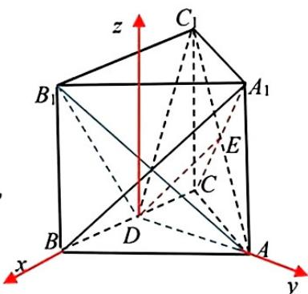
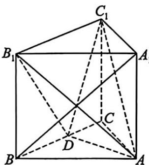

## 题目

已知复数 $z$ 满足 $\frac{z}{z + 1} = 1 + \mathrm{i}$ , 则 $z =$

## 选项

A．$-1 - \mathrm{i}$
B．$-1 + \mathrm{i}$
C．$1 + \mathrm{i}$
D．$1 - \mathrm{i}$

## 答案

B

---
qid: 2
source: 湖北省黄冈市2026届高三4月调研模拟考试（二模）
number: '2'
type: choice
year: 2026
updatedAt: '1789946799'
knowledge: []
---

## 题目

已知集合 $M = \{x \mid |x + \frac{1}{2}| < \frac{5}{2}\}$ , 集合 $N = \{x \mid \frac{x + 4}{1 - x} > 0\}$ , 则 $M \cap N =$

## 选项

A．(-3,1)
B．(-4,1)
C．(-4,2)
D．(-3,2)

## 答案

A

---
qid: 3
source: 湖北省黄冈市2026届高三4月调研模拟考试（二模）
number: '3'
type: choice
year: 2026
updatedAt: '1789946799'
knowledge: []
---

## 题目

记 $S_{n}$ 为等比数列 $\{a_{n}\}$ 的前 $n$ 项和. 若 $S_{2} = 8, S_{4} = 12$ , 则 $S_{6} =$

## 选项

A．10
B．14
C．18
D．24

## 答案

B

---
qid: 4
source: 湖北省黄冈市2026届高三4月调研模拟考试（二模）
number: '4'
type: choice
year: 2026
updatedAt: '1789946799'
knowledge: []
---

## 题目

已知随机变量 $X$ 服从正态分布 $N(\mu, \sigma^2)$ , 下列四个命题:
甲: $P(X > m + 1) > P(X < m - 2)$ ; 乙: $P(X \geqslant m) = 0.5$ ;
丙: $P(X \leqslant m) = 0.5$ ; 丁: $P(m - 1 < X < m) < P(m + 1 < X < m + 2)$ ,

如果有且只有一个是假命题,那么该命题是

## 选项

A．甲
B．乙
C．丙
D．丁

## 答案

D

---
qid: 5
source: 湖北省黄冈市2026届高三4月调研模拟考试（二模）
number: '5'
type: choice
year: 2026
updatedAt: '1789946799'
knowledge: []
---

## 题目

已知圆 O 上有不同的三点 A, B, C, 其中 $\overrightarrow{OA} \cdot \overrightarrow{OB} = 0$ , $\overrightarrow{OC} + \lambda \overrightarrow{OA} + \mu \overrightarrow{OB} = 0$ , 则实数 $\lambda, \mu$ 的关系为

## 选项

A．$\lambda^{2}+\mu^{2}=1$
B．$\frac{1}{\lambda}+\frac{1}{\mu}=1$
C．$\lambda\mu=1$
D．$\lambda+\mu=1$

## 答案

A

---
qid: 6
source: 湖北省黄冈市2026届高三4月调研模拟考试（二模）
number: '6'
type: choice
year: 2026
updatedAt: '1789946799'
knowledge: []
---

## 题目

已知 $(x - 2)^n$ 的展开式中第2项与第6项二项式系数相等, 则 $x^{n-1}$ 的系数为

## 选项

A．12
B．-20
C．-16
D．-12

## 答案

D

---
qid: 7
source: 湖北省黄冈市2026届高三4月调研模拟考试（二模）
number: '7'
type: choice
year: 2026
updatedAt: '1789946799'
knowledge: []
---

## 题目

已知函数 $f(x)=2\cos(\omega x+\frac{\pi}{4})(\omega>0)$ . 若 $\exists x_{1}, x_{2} \in [0, \pi], f(x_{1})f(x_{2})=-4$ , 则 $\omega$ 的最小值为

## 选项

A．$\frac{3}{4}$
B．$\frac{5}{4}$
C．$\frac{7}{4}$
D．$\frac{11}{6}$

## 答案

C

---
qid: 8
source: 湖北省黄冈市2026届高三4月调研模拟考试（二模）
number: '8'
type: choice
year: 2026
updatedAt: '1789946799'
knowledge: []
---

## 题目

设 $x_{1}, x_{2}$ 分别是函数 $f(x) = \frac{a^{2x} - 9}{x} + x$ 与 $g(x) = \log_{a} x - \sqrt{9 - x^{2}} (a > 1)$ 的正零点，则 $\sqrt{3} x_{1} + x_{2}$ 的最大值为

## 选项

A．$\frac{9}{2}$
B．$3\sqrt{3}$
C．6
D．9

## 答案

C

---
qid: 9
source: 湖北省黄冈市2026届高三4月调研模拟考试（二模）
number: '9'
type: multi
year: 2026
updatedAt: '1789946799'
knowledge: []
---

## 题目

在一次歌唱比赛中, 11 位评委给某位选手打分分值从小到大排列依次为 $a_{1}, a_{2}, a_{3}, \cdots, a_{11}$ , 这组分值的中位数和平均数均为 $a$ , 方差为 $S_{1}^{2}$ . 现从中去掉一个最低分 $a_{1}$ , 再去掉一个最高分 $a_{11}$ 后, 将剩下的 9 个分值从小到大排列为 $b_{1}, b_{2}, b_{3}, \cdots, b_{9}$ , 方差为 $S_{2}^{2}$ . 下列说法中一定正确的是

## 选项

A．$a_{1} \cdot a_{11} < a^{2}$
B．$b_{1}, b_{2}, b_{3}, \cdots, b_{9}$ 的中位数为 $a$
C．$b_{1}, b_{2}, b_{3}, \cdots, b_{9}$ 的平均数为 $a$
D．$S_{1}^{2} \geqslant S_{2}^{2}$

## 答案

BD

---
qid: 10
source: 湖北省黄冈市2026届高三4月调研模拟考试（二模）
number: '10'
type: multi
year: 2026
updatedAt: '1789946799'
knowledge: []
---

## 题目

在四面体 $ABCD$ 中, $\triangle ABC$ 是边长为 2 的等边三角形, $\triangle ABD$ , $\triangle ACD$ 均为等腰直角三角形, 则该四面体的体积可能是

## 选项

A．$\frac{4}{3}$
B．$\frac{2\sqrt{3}}{3}$
C．$\frac{2\sqrt{2}}{3}$
D．$\frac{\sqrt{2}}{3}$

## 答案

BCD

---
qid: 11
source: 湖北省黄冈市2026届高三4月调研模拟考试（二模）
number: '11'
type: multi
year: 2026
updatedAt: '1789946799'
knowledge: []
---

## 题目

若直线 y=a 与两条曲线 $f(x)=xe^{2x}$ 和 $g(x)=\frac{x\ln x}{2}$ 共有四个不同的交点，设从左到右四个交点的横坐标分别为 $x_{1}, x_{2}, x_{3}, x_{4}$ ，则

## 选项

A．$-\frac{1}{2e}<a<0$
B．$e^{2x_{1}}=x_{3}$
C．$x_{1}, x_{2}, x_{3}, x_{4}$ 成等比数列
D．$x_{1}x_{3}=x_{2}x_{4}$

## 答案

ABD

## 解析

$f(x)=xe^{2x},f'(x)=(2x+1)e^{2x}$ ，即 $f(x)$ 在 $(-∞,-\frac{1}{2})$ 上单调递减， $f(x)\in(-\frac{1}{2e},0)$ ，在 $(- \frac{1}{2},+\infty)$ 上单调递增， $f(x)\in(-\frac{1}{2e},+\infty),f(x)_{\min}=-\frac{1}{2e};g(x)=\frac{x\ln x}{2},g'(x)=\frac{1+\ln x}{2}$ ，即 $g(x)$ 在 $(0,\frac{1}{e})$ 上单调递减， $g(x)\in(-\frac{1}{e},0)$ ，在 $(\frac{1}{e},+\infty)$ 上单调递增， $g(x)\in(-\frac{1}{2e},+\infty),g(x)_{\min}=-\frac{1}{2e}$ ；从而有 $-\frac{1}{2e}<a<0$ ，故A正确；结合图象可知， $x_{1}<-\frac{1}{2}<x_{2}<0<x_{3}<\frac{1}{e}<x_{4},x_{1}e^{2x_{1}}=\frac{x_{3}\ln x_{3}}{2}=e^{2(\frac{\ln x_{3}}{2})}\frac{\ln x_{3}}{2}$ ，结合单调性可知， $2x_{1}=\ln x_{3}$ ，即 $e^{2x_{1}}=x_{3}$ 故B正确；同理可得 $e^{2x_{2}}=x_{4}$ ，由 $x_{1}<-\frac{1}{2}<x_{2}<0<x_{3}<\frac{1}{e}<x_{4}$ 知 $x_{1},x_{2},x_{3},x_{4}$ 不可能构成等比数列，故C错误；由前面分析可知 $x_{1}x_{3}=x_{2}x_{4}=a$ ，故D正确。故选：ABD。

## 三、填空题：本题共3小题，每小题5分，共15分.

12. $\frac{7}{8}$ 13.1 14. $\frac{x^{2}+y^{2}}{4}-\frac{(3-z)^{2}}{9}=0,\quad\frac{\sqrt{13}}{3}$

---
qid: 12
source: 湖北省黄冈市2026届高三4月调研模拟考试（二模）
number: '12'
type: blank
year: 2026
updatedAt: '1789946799'
knowledge: []
---

## 题目

若 $\sin (\alpha - 20^{\circ}) = \frac{\sin 20^{\circ}}{\tan 20^{\circ} - \sqrt{3}}$ , 则 $\cos (2 \alpha - 40^{\circ}) =$ \_\_\_\_.

## 答案

$\frac{7}{8}$

---
qid: 13
source: 湖北省黄冈市2026届高三4月调研模拟考试（二模）
number: '13'
type: blank
year: 2026
updatedAt: '1789946799'
knowledge: []
---

## 题目

已知抛物线 $x^{2} = 2py (p > 0)$ 的焦点为 $F$ , 第一象限内的两点 $A, B$ 在抛物线上, 且满足 $|BF| - |AF| = 6$ , $|AB| = 2\sqrt{10}$ , 若线段 $AB$ 中点的纵坐标为 5 , 则 $p =$ \_\_\_\_.

## 答案

1

---
qid: 14
source: 湖北省黄冈市2026届高三4月调研模拟考试（二模）
number: '14'
type: blank
year: 2026
updatedAt: '1789946799'
knowledge: []
---

## 题目

类比圆的标准方程,我们很容易知道:在空间直角坐标系中,以坐标原点为球心,R为半径的球面方程为: $x^{2}+y^{2}+z^{2}=R^{2}$ . 现有一个底面半径为2,高为3的圆锥,以底面圆圆心为坐标原点,顶点在z轴上,则圆锥侧面的方程为\_\_\_\_,现用一个与z轴平行的平面截这个圆锥,截面与圆锥表面交线为双曲线的一部分,则该双曲线的离心率为\_\_\_\_.

## 答案

$\frac{x^{2}+y^{2}}{4}-\frac{(3-z)^{2}}{9}=0,\quad\frac{\sqrt{13}}{3}$

## 解析

圆锥方程即为 $\frac{x^2 + y^2}{4} - \frac{(3 - z)^2}{9} = 0$ ，考虑到对称性，不妨设截面与 $y$ 轴垂直，从而双曲线上每点的纵坐标为常数，不妨设为 $r$ ，则双曲线方程即为 $\frac{(3 - z)^2}{9} - \frac{x^2}{4} = \frac{r^2}{4}$ ，易得离心率为 $\frac{\sqrt{13}}{3}$ .

## 四、解答题：共77分. 解答应写出文字说明、证明过程或演算步骤.

15.(1)证：连 $A_{1}C$ ，交 $AC_{1}$ 于点 $E$ ，连 $DE$ .因为正三棱柱各棱长均相等，所以侧面 $AA_{1}C_{1}C$ 为正方形， $E$ 为 $A_{1}C$ 中点,又 $D$ 为 $BC$ 中点，所以 $DE \parallel A_{1}B$ ，而 $DE \subset$ 平面 $ADC_{1}$ ， $A_{1}B \not\subset$ 平面 $ADC_{1}$ ， $\therefore A_{1}B \parallel$ 平面 $ADC_{1}$ ……6分

(2)依题意有 $AD \parallel BC$ ，以 D 为原点以 DB, DA 分别为轴轴建立如图直角坐标系，设正三棱柱各棱长为 2，则 $A(0, \sqrt{3}, 0)$ , $B(1, 0, 0)$ , $B_{1}(1, 0, 2)$ , $C_{1}(-1, 0, 2)$ , $\overrightarrow{DA} = (0, \sqrt{3}, 0)$ , $\overrightarrow{DB_{1}} = (1, 0, 2)$ , $\overrightarrow{DC_{1}} = (-1, 0, 2)$ , ……8 分

设平面 $ADB_{1}$ 的法向量为 $\boldsymbol{m}=(x_{1},y_{1},z_{1})$ ，则 $\left\{\begin{aligned}\sqrt{3}y_{1}&=0,\\ x_{1}+2z_{1}&=0,\end{aligned}\right.$ 取 $z_{1}=1,\boldsymbol{m}=(-2,0,1)$ ，
设平面 $ADC_{1}$ 的法向量为 $\boldsymbol{n}=(x_{2},y_{2},z_{2})$ ，则 $\left\{\begin{aligned}\sqrt{3}y_{2}&=0,\\ -x_{2}+2z_{2}&=0,\end{aligned}\right.$ 取 $z_{2}=1,\boldsymbol{n}=(2,0,1)$ ，
令二面角 $B_{1}-AD-C_{1}$ 为 $\theta$ ， $\cos\theta=\left|\frac{-2\times2+1\times1}{5}\right|=\frac{3}{5}$ .
故平面 $ADB_{1}$ 与平面 $AD-C_{1}$ 的夹角余弦值为 $\frac{3}{5}$ . ……13 分

$$
c = \sqrt {6},
$$

$$
(- \sqrt {6}, 0), (\sqrt {6}, 0)
$$

$$
\therefore 2 a = \sqrt {(2 + \sqrt {6}) ^ {2} + 1} + \sqrt {(2 - \sqrt {6}) ^ {2} + 1} = (2 \sqrt {2} + \sqrt {3}) + (2 \sqrt {2} - \sqrt {3}) = 4 \sqrt {2}.
$$

$$
\therefore a ^ {2} = 8, c ^ {2} = 6, b ^ {2} = 2.
$$

$$
\frac {x ^ {2}}{8} + \frac {y ^ {2}}{2} = 1
$$

$$
A (x _ {1}, y _ {1}), B (x _ {2}, y _ {2})
$$

$$
\left\{ \begin{array}{l} y = - \frac {1}{2} x + t \\ x ^ {2} + 4 y ^ {2} = 8 \end{array} \right.
$$

$$
x ^ {2} - 2 t x + 2 t ^ {2} - 4 = 0.
$$

$$
\Delta = - 4 t ^ {2} + 1 6 > 0
$$

$$
- 2 <   t <   0. x _ {1} + x _ {2} = 2 t, x _ {1} x _ {2} = 2 t ^ {2} - 4,
$$

$$
A B \mid = \sqrt {1 + \frac {1}{4}} \mid x _ {2} - x _ {1} \mid = \sqrt {5} \cdot \sqrt {4 - t ^ {2}}
$$

$$
d = \frac {| t - 2 |}{\sqrt {1 + \frac {1}{4}}} = \frac {2 (2 - t)}{\sqrt {5}}.
$$

$$
S _ {\triangle A P B} = \frac {1}{2} \times \sqrt {5} \times \sqrt {4 - t ^ {2}} \times \frac {2 (2 - t)}{\sqrt {5}} = \sqrt {(2 - t) ^ {3} (2 + t)}.
$$

$$
f (t) = (2 - t) ^ {3} (2 + t), - 2 <   t <   0. f ^ {\prime} (t) = - 4 (2 - t) ^ {2} (t + 1)
$$

$$
f (t) _ {\max} = f (- 1) = 2 7. \triangle P A B
$$

$$
3 \sqrt {3}.
$$

17. 解(1)依题意有 $(b \times \frac{1 - \cos C}{2} + c \times \frac{1 - \cos B}{2})(a + b + c) = \frac{3}{2}bc$ ，即 $(b + c - b\cos C - c\cos B)(a + b + c) = 3bc$ ，
又由余弦定理有 $a = b\cos C + c\cos B, \therefore (b + c - a)(a + b + c) = 3bc, \therefore b^{2} + c^{2} - a^{2} = bc.$ $\therefore \cos A = \frac{b^{2} + c^{2} - a^{2}}{2bc} = \frac{1}{2}$ ，又 A 为 $\triangle ABC$ 中内角 $\therefore A = \frac{\pi}{3}.$ $\cdots\cdots5$ 分

又 $\cos C = \frac{11}{14}, \therefore \sin C = \frac{5\sqrt{3}}{14}, \therefore \sin B = \sin(A + C) = \frac{8\sqrt{3}}{14}$ ，而 $\frac{b}{c} = \frac{\sin B}{\sin C} = \frac{8}{5}$ ，

因为 $\triangle ABC$ 的面积为 $10\sqrt{3}$ ， $\therefore \frac{1}{2}bc\sin A = \frac{\sqrt{3}}{4}bc = 10\sqrt{3}, \therefore bc = 40.$ $\therefore b = 8, c = 5.$

在 $\triangle ABC$ 中， $\frac{1}{2}(c+b)\cdot AD\cdot\sin\frac{A}{2}=10\sqrt{3},\therefore\frac{13}{4}AD=10\sqrt{3},\therefore AD=\frac{40\sqrt{3}}{13}$ ．……10分
(2)由(1)知 $A=\frac{\pi}{3},\therefore a^{2}=b^{2}+c^{2}-bc,b-a=2,c>4,\therefore a=\frac{c^{2}-2c+4}{c-4}$ ．
设 $\triangle ABC$ 周长为 $L$ ,则 $L=2a+c+2=\frac{2(c^{2}-2c+4)}{c-4}+c+2$ ,令 $t=c-4$ ， $\therefore L=3t+\frac{24}{t}+18\geq12\sqrt{2}+18$ ,当且仅当 $t=2\sqrt{2},c=4+2\sqrt{2}$ 时周长取最小值.
故当 $\triangle ABC$ 周长的最小时 $c=4+2\sqrt{2}$ ．……15分
18.(1) $\because x>0,f(1)=0,f'(x)=1+\frac{1}{x^{2}}-\frac{a}{x}=\frac{x+\frac{1}{x}-a}{x}$ ,
当 $a\leqslant2$ 时， $f'(x)\geq0,f(x)$ 在 $[1,+\infty)$ 上单调递增， $f(x)\geq f(1)=0$ 恒成立；
当 $a>2$ 时，令 …

---
qid: 15
source: 湖北省黄冈市2026届高三4月调研模拟考试（二模）
number: '15'
type: answer
year: 2026
updatedAt: '1789946799'
knowledge: []
---

## 题目

(本题满分 13 分)

各棱长均相等的正三棱柱 $ABC-A_{1}B_{1}C_{1}$ 柱中，D 为 BC 中点.

(1) 求证: $A_{1} B \parallel$ 平面 $ADC_{1}$ ;

(2) 求平面 $ADB_{1}$ 与平面 $ADC_{1}$ 夹角的余弦值.

## 答案

(1)

---
qid: 16
source: 湖北省黄冈市2026届高三4月调研模拟考试（二模）
number: '16'
type: answer
year: 2026
updatedAt: '1789946799'
knowledge: []
---

## 题目

(本题满分15分)

已知椭圆 $C: \frac{x^2}{a^2} + \frac{y^2}{b^2} = 1 (a > b > 0)$ 过点 $P(2,1)$ , 其焦距为 $2\sqrt{6}$ , 直线 $l: y = -\frac{1}{2} x + t (t < 0)$ 交椭圆 $C$ 于 $A, B$ 两点.

(1) 求 $C$ 的标准方程;

(2) 求 $\triangle PAB$ 面积的最大值.

---
qid: 17
source: 湖北省黄冈市2026届高三4月调研模拟考试（二模）
number: '17'
type: answer
year: 2026
updatedAt: '1789946799'
knowledge: []
---

## 题目

(本题满分 15 分)

在 $\triangle ABC$ 中内角 $A,B,C$ 的对边分别为 $a,b,c$ ,且 $(b\sin^{2}\frac{C}{2}+c\sin^{2}\frac{B}{2})(a+b+c)=\frac{3}{2}bc.$

(1) 若 $\angle BAC$ 的平分线 $AD$ 交 $BC$ 于点 $D, \cos C = \frac{11}{14}, \triangle ABC$ 的面积为 $10\sqrt{3}$ , 求 $AD$ 长;

(2) 若 $b - a = 2, c > 4$ , 求当 $\triangle ABC$ 周长最小时 $c$ 的值.

---
qid: 18
source: 湖北省黄冈市2026届高三4月调研模拟考试（二模）
number: '18'
type: answer
year: 2026
updatedAt: '1789946799'
knowledge: []
---

## 题目

(本题满分 17 分)

已知函数 $f(x) = x - \frac{1}{x} - a\ln x (a \in \mathbb{R})$

(1) 若 $f(x) \geqslant 0$ 对 $x \in [1, +\infty)$ 恒成立，求 $a$ 的取值范围；

(2) 若函数 $g(x) = f(x) + ax + \frac{1}{x}$ 有 2 个零点 $x_{1}, x_{2} (x_{1} < x_{2})$

(i) 求 $a$ 的取值范围；

(ii) 求证: $x_{1} x_{2} > \mathrm{e}^{2}$ .

---
qid: 19
source: 湖北省黄冈市2026届高三4月调研模拟考试（二模）
number: '19'
type: answer
year: 2026
updatedAt: '1789946799'
knowledge: []
---

## 题目

(本题满分 17 分)

一个不透明的口袋中放有完全相同的 2 个红球、2 个黄球. 现每次从口袋中随机抽取一球, 确定颜色后又放回口袋中.

(1) 若摸球 10 次, 求摸到红球个数的期望;

(2) 若连续摸到 2 个红球时停止, 否则继续摸球. 记恰好第 $n$ 次摸球时结束的概率为 $P_{n}(n \in \mathbf{N}^{*})$ .

(i) 求 $P_{5}$ ;

(ii) 求 $P_{n}$ .

## 答案

(1)
