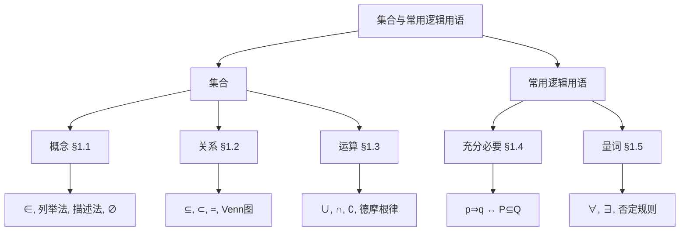

# 第一章 本章小结与复习

> **教材位置**：第一章 集合与常用逻辑用语 · 本章小结  
> **建议时长**：约 120 min（2 h）  
> **前置知识**：§1.1–§1.5 全部内容

---

## 本节目标

1. 梳理集合概念、关系、运算与逻辑用语的知识网络，形成整体框架；
2. 归纳本章典型题型与解题策略；
3. 通过章末复习题巩固基础、查漏补缺。

---

## 一、复习引入（15 min）

**回顾提问：**

- 集合的三特性是什么？$\in$ 与 $\subseteq$ 有何区别？
- $p \Rightarrow q$ 对应怎样的集合关系？
- 如何否定「$\forall x \in M,\, p(x)$」？

**说明：** 本章是高中数学的**语言基础**，后续函数、不等式、概率等都将频繁使用集合与逻辑语言。

---

## 二、知识网络（45 min）

### 2.1 知识结构图

### 2.2 本章核心定义汇编

> 📖 以下逐条摘自教材 **第一章 §1.1–§1.5**，与课本表述一致（符号已转为 LaTeX）。

#### §1.1 集合的概念（P7–P10）

**元素与集合（P7）：** 一般地，我们把研究对象统称为**元素**（element），把一些元素组成的总体叫做**集合**（set）（简称为**集**）。

**列举法（P8–P9）：** 把集合的所有元素一一列举出来，并用花括号 “$\{\ \}$” 括起来表示集合的方法叫做**列举法**。

**描述法（P9–P10）：** 一般地，设 $A$ 是一个集合，我们把集合 $A$ 中所有具有共同特征 $p(x)$ 的元素 $x$ 所组成的集合表示为 $\{x \in A \mid p(x)\}$，这种表示集合的方法称为**描述法**。

#### §1.2 集合间的基本关系（P7–P8）

**子集（P7）：** 一般地，对于两个集合 $A$，$B$，如果集合 $A$ 中任意一个元素都是集合 $B$ 中的元素，就称集合 $A$ 为集合 $B$ 的**子集**（subset）。

**集合相等（P7）：** 一般地，如果集合 $A$ 的任何一个元素都是集合 $B$ 的元素，同时集合 $B$ 的任何一个元素都是集合 $A$ 的元素，那么集合 $A$ 与集合 $B$ 相等。

**真子集（P8）：** 如果集合 $A \subseteq B$，但存在元素 $x \in B$，且 $x \notin A$，就称集合 $A$ 是集合 $B$ 的**真子集**（proper subset）。

**空集（P8）：** 一般地，我们把不含任何元素的集合叫做**空集**（empty set），记为 $\varnothing$，并规定：空集是任何集合的子集。

#### §1.3 集合的基本运算（P10–P13）

**并集（P10）：** 一般地，由所有属于集合 $A$ 或属于集合 $B$ 的元素组成的集合，称为集合 $A$ 与 $B$ 的**并集**（union set）。

**交集（P11）：** 一般地，由所有属于集合 $A$ 且属于集合 $B$ 的元素组成的集合，称为集合 $A$ 与 $B$ 的**交集**（intersection set）。

**全集（P12）：** 一般地，如果一个集合含有所研究问题中涉及的所有元素，那么就称这个集合为**全集**（universal set），通常记作 $U$。

**补集（P13）：** 对于一个集合 $A$，由全集 $U$ 中不属于集合 $A$ 的所有元素组成的集合称为集合 $A$ 相对于全集 $U$ 的**补集**（complementary set），简称为集合 $A$ 的补集。

#### §1.4 充分条件与必要条件（P17、P20）

**命题（P17）：** 一般地，我们把用语言、符号或式子表达的，可以判断真假的陈述句叫做**命题**。

**充分条件与必要条件（P17）：** “若 $p$，则 $q$”为真命题时，$p$ 是 $q$ 的**充分条件**（sufficient condition），$q$ 是 $p$ 的**必要条件**（necessary condition）。

**充要条件（P20）：** 若 $p \Rightarrow q$ 且 $q \Rightarrow p$，则 $p$ 是 $q$ 的**充分必要条件**，简称为**充要条件**（sufficient and necessary condition）。

#### §1.5 全称量词与存在量词（P24–P28）

**全称量词命题（P24）：** 含有全称量词“$\forall$”的命题，叫做**全称量词命题**（universal proposition）；$\forall x \in M,\, p(x)$。

**存在量词命题（P25）：** 含有存在量词“$\exists$”的命题，叫做**存在量词命题**（existential proposition）；$\exists x \in M,\, p(x)$。

**否定（P27–P28）：** 全称量词命题 $\forall x \in M,\, p(x)$ 的否定是 $\exists x \in M,\, \neg p(x)$；存在量词命题 $\exists x \in M,\, p(x)$ 的否定是 $\forall x \in M,\, \neg p(x)$。

### 2.3 符号速查

| 符号 | 含义 |
|------|------|
| $\in$, $\notin$ | 元素与集合 |
| $\subseteq$, $\subset$, $=$ | 集合之间 |
| $\cup$, $\cap$, $\complement_U$ | 并、交、补 |
| $\Rightarrow$, $\Leftrightarrow$ | 充分、充要 |
| $\forall$, $\exists$ | 全称、存在量词 |

---

## 三、典型题型（40 min）

### 题型 1：集合的表示与化简

**策略：** 先化简为列举法或区间，再讨论关系或运算。

**例：** 若 $A = \{x \mid x^2 - 3x + 2 = 0\}$，则 $A = \{1, 2\}$。

---

### 题型 2：子集与含参问题

**策略：** 注意 $\varnothing$；利用 $A \subseteq B$ 列条件；有限集用元素归属或个数。

**例：** $A \subseteq \{1, 2\}$，则 $A$ 有 $2^2 = 4$ 种可能。

---

### 题型 3：集合运算（含区间、补集）

**策略：** 画数轴或 Venn 图；明确全集 $U$；注意端点开闭。

**例：** $U = \mathbb{R}$，$A = (-1, 3)$，则 $\complement_U A = (-\infty, -1] \cup [3, +\infty)$。

---

### 题型 4：充分必要条件的判断

**策略：** 化为 $P$、$Q$ 两个集合，比较 $\subseteq$ 关系；或举反例。

**例：** $x > 2$ 是 $x > 1$ 的充分不必要条件（$(2,+\infty) \subsetneq (1,+\infty)$）。

---

### 题型 5：含量词命题的否定与真假

**策略：** 量词互换 + 性质否定；$\forall$ 假找一反例，$\exists$ 真找一例证。

**例：** $\neg(\forall x \in \mathbb{R},\, x^2 > 0) = \exists x \in \mathbb{R},\, x^2 \le 0$。

---

## 四、章末复习题精选（25 min）

### 题 1（基础）

用列举法表示 $\{x \in \mathbb{Z} \mid |x| < 3\}$。

**答案：** $\{-2, -1, 0, 1, 2\}$

---

### 题 2（基础）

若 $A = \{1, 2\}$，$B = \{2, 3, 4\}$，求 $A \cup B$，$A \cap B$。

**答案：** $A \cup B = \{1, 2, 3, 4\}$；$A \cap B = \{2\}$

---

### 题 3（基础）

判断：$\varnothing \subset \{1\}$ 是否成立？$\varnothing \in \{1\}$ 呢？

**答案：** 前者成立（空集是任何非空集合的真子集）；后者不成立（$\in$ 用于元素，$\varnothing$ 不是 $\{1\}$ 的元素）。

---

### 题 4（综合）

设 $U = \{1, 2, 3, 4, 5\}$，$A = \{1, 3, 5\}$，$B = \{2, 3, 4\}$，求 $\complement_U (A \cup B)$。

**答案：** $A \cup B = \{1, 2, 3, 4, 5\} = U$，故 $\complement_U (A \cup B) = \varnothing$。

---

### 题 5（综合）

$p$：$x^2 = 4$；$q$：$x = 2$。判断 $p$ 是 $q$ 的什么条件。

**答案：** $P = \{-2, 2\}$，$Q = \{2\}$，$Q \subsetneq P$，故 $q \Rightarrow p$ 且 $p \nRightarrow q$，$p$ 是 $q$ 的**必要不充分**条件。

---

### 题 6（综合）

写出命题「$\forall x \in \mathbb{R},\, x^2 + x + 1 > 0$」的否定，并判断原命题真假。

**答案：** 否定：$\exists x \in \mathbb{R},\, x^2 + x + 1 \le 0$。原命题**真**（判别式 $\Delta = 1 - 4 < 0$，二次函数恒正）。

---

### 题 7（拓展）

已知 $A = \{x \mid x^2 - 5x + 6 = 0\}$，$B = \{x \mid mx - 1 = 0\}$，若 $B \subseteq A$，求实数 $m$ 的取值。

**答案：** $A = \{2, 3\}$。

- $m = 0$：$B = \varnothing \subseteq A$，成立。
- $m \ne 0$：$B = \left\{\dfrac{1}{m}\right\}$，需 $\dfrac{1}{m} \in \{2, 3\}$，得 $m = \dfrac{1}{2}$ 或 $m = \dfrac{1}{3}$。

综上 $m \in \left\{0,\, \dfrac{1}{2},\, \dfrac{1}{3}\right\}$。

---

### 题 8（拓展）

设 $U = \mathbb{R}$，$A = \{x \mid x \le 1 \text{ 或 } x \ge 4\}$，$B = \{x \mid a \le x \le a + 2\}$。若 $B \subseteq \complement_U A$，求实数 $a$ 的取值范围。

**答案：** $\complement_U A = (1, 4)$。$B \subseteq (1, 4)$ 要求 $B \ne \varnothing$ 且区间落在 $(1, 4)$ 内。

- $B = \varnothing$ 不可能（$a + 2 \ge a$ 恒成立，$B$ 非空）。
- 需 $a > 1$ 且 $a + 2 < 4$，即 $1 < a < 2$。

**答案：** $a \in (1, 2)$。

---

## 五、易错点与小结（15 min）

### 易错点汇总

| 错因 | 正解 |
|------|------|
| $\{0\}$ 与 $\varnothing$ 混淆 | 前者有元素，后者无元素 |
| $\in$ 与 $\subseteq$ 混用 | 元素用 $\in$，集合用 $\subseteq$ |
| 补集忘记全集 | 先明确 $U$ 再求 $\complement$ |
| 充分必要颠倒 | $p \Rightarrow q$：$p$ 充分、$q$ 必要 |
| 否定不换量词 | $\forall$ 与 $\exists$ 必须互换 |

### 小结

- 集合：**表示 → 关系 → 运算**，Venn 图贯穿始终
- 逻辑：**条件 ↔ 包含**，**量词 ↔ 否定规则**
- 解题习惯：先化简集合，画数轴/Venn 图，讨论空集与端点

**下一章：** 第二章 一元二次函数、方程和不等式

---

## 课后作业

| 题号 | 来源 | 说明 |
|------|------|------|
| 1–10 | 教材第一章复习参考题 | 必做 |
| 11–12 | 本章精选题 7–8 | 选做强化 |

---

## 教师备注

- **节奏**：知识网络 30 min，典型题型讲 2–3 类，复习题可课堂练 4 道、其余作业。
- **测评建议**：小测覆盖符号填空、子集个数、一个充分必要判断、一个命题否定。
- **衔接**：强调区间与 $\complement$ 为第二章一元二次不等式铺垫。
