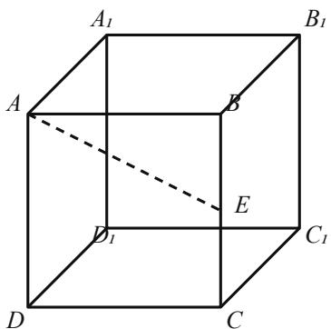

# 2026 届高三数学第五次模拟考试

满分 150 分 考试时间 120 分钟

## 一、选择题（每小题5分，共40分）

1. 已知集合 $A = \{x \mid x^2 - 3x + 2 \leqslant 0\}$ , $B = \{x \mid x > 1\}$ , 则 $A \cap B = A$ (1, 2) B. [1, 2] C. (1, 2] D. [1, 2)

2. 如图，在正方体 ABCD-A1B1C1D1 中，E 为棱 BB1 的中点，则异面直线 AE 与 CD 所成角的正切值为
A. $\sqrt{2}/2$ B. $\sqrt{3}/3$ C. $\sqrt{5}/5$ D. $2\sqrt{5}/5$

3. 函数 $f(x) = \sin (2x + \pi / 3)$ 的最小正周期为
A. $\pi / 2$ B. $\pi$ C. $2\pi$ D. $4\pi$

## 二、填空题（每小题 5 分，共 20 分）

4. 函数 $f(x) = \sqrt{(x - 1)} / (x - 3)$ 的定义域为 \_\_\_\_.

5. 已知 $\sin \theta + \cos \theta = 1/2$ ，则 $\sin 2\theta =$ \_\_\_\_.

## 三、解答题（共60分）

6. 已知数列 $\{a_{n}\}$ 满足 $a_{1} = 1, a_{n+1} = 2a_{n} + 1 (n \in N*)$ .

（1）证明：数列 $\{a_{n} + 1\}$ 是等比数列；

(2) 求数列 $\{a_{n}\}$ 的通项公式.

7. 已知函数 $f(x) = x^3 - 3ax^2 + 3x + 1$ .

（1）当 a = 1 时，求曲线 $y = f(x)$ 在点 $(1, f(1))$ 处的切线方程；

（2）若 $f(x)$ 在区间 $(0, +\infty)$ 上单调递增，求实数 $a$ 的取值范围.

## 答题卡

<table><tr><td>题号</td><td>1</td><td>2</td><td>3</td><td>4</td><td>5</td></tr><tr><td>答案</td><td></td><td></td><td></td><td></td><td></td></tr></table>